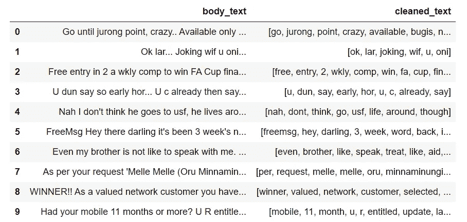

# NLP 入门——构建垃圾邮件分类器

> 原文：<https://towardsdatascience.com/a-beginners-introduction-to-nlp-building-a-spam-classifier-cf0973c7f42c?source=collection_archive---------26----------------------->

## 如果您不熟悉自然语言处理这个激动人心的世界，请从这里开始


内森·迪菲斯塔在 [Unsplash](https://unsplash.com?utm_source=medium&utm_medium=referral) 上拍摄的照片

单词、句子、段落和短文。我们成年后几乎每天都在使用它们。无论你是在发推文，给你的同事写电子邮件，还是像我现在这样写文章，作为人类，我们都用文字来交流我们的思想和想法。

现在，想象一个世界，在那里我们可以教计算机与文字互动，就像我们与另一个人互动一样。想象一下这样一个世界，计算机不仅能够检测人类的语言，更重要的是，能够学习语言的细微差别，从而得出给定信息的潜在含义或意图。

这正是自然语言处理(NLP)的全部内容。

# 介绍

NLP 指的是人工智能领域，通过自然语言处理计算机和人类之间的交互。这包括使计算机能够操纵、分析、解释以及生成人类语言。

我最近花了一些时间涉猎了一些 NLP 的基础知识，我想用这篇文章不仅分享我所学到的东西，而且进一步加强我对这个主题的理解。具体来说，这篇文章的灵感来源于[**NLP with Python for Machine Learning Essential Training**](https://www.linkedin.com/learning/nlp-with-python-for-machine-learning-essential-training)，一个由 [**Derek Jedamski**](https://www.linkedin.com/in/derek-jedamski-8a887045/?trk=lil_course) 给出的 LinkedIn 课程。

我想在此对 Derek 的工作给予充分的肯定和参考，并强烈推荐查看他在 Python 中关于机器学习的其他课程。

我写这篇文章的目的是重新创建在课程中介绍的主要项目，即使用垃圾短信收集数据集[构建的垃圾短信(二进制)分类器，该数据集包含一组 5，572 条英文短信。一旦准备就绪，分类器将能够读取给定的文本字符串，并随后将文本分类为*火腿*或*垃圾邮件*。](https://www.kaggle.com/uciml/sms-spam-collection-dataset)

在本文中，我将介绍构建垃圾邮件分类器的步骤，并重点介绍自然语言处理中的一些关键概念。如果你想继续下去，这个项目的代码可以在我的 GitHub [这里](https://github.com/chongjason914/spam-classification)找到。

事不宜迟，我们开始吧！

GIF by GIPHY

# 1.探索性数据分析

像任何专业的数据科学家一样，让我们从探索数据集开始。

探索性数据分析是对数据进行初步调查的过程，以发现模式、发现异常、测试假设并借助汇总统计和图形表示检查假设(定义归功于 Prasad Patil 的“[什么是探索性数据分析](/exploratory-data-analysis-8fc1cb20fd15)”)。

```
data = pd.read_csv("spam.csv", encoding = "latin-1")
data = data.dropna(how = "any", axis = 1)
data.columns = ['label', 'body_text']
data.head()
```


输入数据有 5572 行(每行代表一个唯一的文本消息)和 2 列:*标签*和 *body_text。在 5572 行中，有 747 行是垃圾邮件，剩下的 4825 行是火腿。我们也没有丢失数据，耶！*

让我们使用 seaborn 来更直观地表示我们的输入数据。

```
total = len(data)
plt.figure(figsize = (5, 5))
plt.title("Number of spam vs ham messages")
ax = sns.countplot(x = 'label', data = data)
for p in ax.patches:
    percentage = '{0:.0f}%'.format(p.get_height() / total * 100)
    x = p.get_x() + p.get_width() / 2
    y = p.get_height() + 20
    ax.annotate(percentage, (x, y), ha = 'center')
plt.show()
```


如我们所见，垃圾邮件(87%)明显多于垃圾邮件(13%)。

从技术上讲，在这个阶段，我们应该关注与不平衡数据集相关的问题。然而，为了简单起见，我们暂时忽略这一点。

# 2.特征工程

特征工程是创建新特征和/或改造现有特征以充分利用数据的过程。

在本节中，我们将创建两个新功能:

*   **body_len:** 正文的长度，不包括空格
*   **点%**正文中标点符号的百分比

```
# body_len
data['body_len'] = data.body_text.apply(lambda x: len(x) - x.count(" "))# punct%
def count_punct(text):
    count = sum([1 for char in text if char in string.punctuation])
    return round(count/(len(text) - text.count(" ")), 3) * 100 data[‘punct%’] = data.body_text.apply(lambda x: count_punct(x))
```


现在，我们可以继续使用新创建的要素来探索输入数据的分布。

```
bins = np.linspace(0, 200, 40)
data.loc[data.label == 'spam', 'body_len'].plot(kind = 'hist', bins = bins, alpha = 0.5, density = True, label = 'spam')
data.loc[data.label == 'ham', 'body_len'].plot(kind = 'hist', bins = bins, alpha = 0.5, density = True, label = 'ham')
plt.legend(loc = 'best')
plt.xlabel("body_len")
plt.title("Body length ham vs spam")
plt.show()
```


正如我们所见，与垃圾邮件相比，垃圾邮件的正文长度更长，即包含更多的单词。

那么，标点符号的百分比呢？

```
bins = np.linspace(0, 50, 40)
data.loc[data.label == 'spam', 'punct%'].plot(kind = 'hist', bins = bins, alpha = 0.5, density = True, label = 'spam')
data.loc[data.label == 'ham', 'punct%'].plot(kind = 'hist', bins = bins, alpha = 0.5, density = True, label = 'ham')
plt.legend(loc = 'best')
plt.xlabel("punct%")
plt.title("Punctuation percentage ham vs spam")
plt.show()
```


在这里，这两种分布看起来非常相似，尽管业余爱好者的消息似乎有一个更长的尾巴，即业余爱好者的消息往往有更高的标点符号百分比。

# 3.清理文本

如果您有任何处理真实世界数据的经验，您会知道真实世界的数据通常非常混乱，并且不容易处理。这个也不例外。

在我们能够实际建模和预测数据之前，还有很多工作要做。更具体地说，为了让我们更好地管理杂乱的文本消息，我们将需要执行以下预处理步骤(这些步骤非常特定于 NLP 管道):

*   将单词转换成小写字母
*   删除标点符号和停用词
*   符号化
*   词干与词汇匹配(文本规范化)

让我们逐一调查每个步骤。

## 3.1 将单词转换成小写字母

Python 并不认为所有字符都是平等的。为了保持一致，我们需要将所有单词转换成小写字母。例如，Python 将向下面的第一条语句返回 False，但向第二条语句返回 True。

```
# False statement 
"NLP" == "nlp"# True statement 
"NLP".lower() == "nlp"
```

## 3.2 删除标点符号

与上面的论点相似，去掉标点符号的理由是因为标点符号在文本中没有任何意义。因此，我们希望 Python 只关注给定文本中的单词，而不用担心涉及的标点符号。

下面举个例子。

```
# False statement
"I love NLP" == "I love NLP."
```

作为人类，我们可以立即看出上面的两段文字几乎完全相同，除了第二段在句尾有一个句号。

但是，Python 将无法区分这两种文本。出于这个原因，为了让 Python 更清楚地解释文本，我们删除句子中的所有标点符号是很重要的。

您可以通过键入以下内容找到存储在 Python 中的**字符串**库中的标点符号列表:

```
string.punctuation
```

为了去掉句子中的标点符号，我们可以如下使用列表理解:

```
# Original text 
text = 'OMG! Did you see what happened to her? I was so shocked when I heard the news. :('# List comprehension to remove punctuation 
text = "".join([word for word in text if word not in string.punctuation])
```

## 3.3 令牌化

在 NLP 的上下文中，标记化意味着将一个字符串或一个句子转换成一个字符列表，我们可以通过利用 Python 中的**正则表达式(re)** 库来实现这一点。

库中两个最简单的命令包括:

*   重新拆分
*   重新发现

如果你有兴趣知道它们是如何工作的，我鼓励你查看我的[笔记本](https://github.com/chongjason914/spam-classification)以了解更多细节。

## 3.4 删除停用词

停用词是英语中常用的词，如*但是*、 *if* 和 *the* 对句子的整体意思没有太大贡献。因此，为了减少 Python 在构建我们的机器学习模型时需要存储和处理的令牌数量，通常会删除停用词。

停用词存储在 **nltk.corpus.stopwords** 中，可通过以下方式访问:

```
stopwords = nltk.corpus.stopwords.words('english')
stopwords
```

要删除给定字符串中的停用词，我们可以再次应用列表理解。

```
# Original text 
text = 'OMG Did you see what happened to her I was so shocked when I heard the news'
print(text)# Convert text into list of words in lowercase letters
print(text.lower().split())# List comprehension to remove stopwords 
print([word for word in text.lower().split() if word not in stopwords]
```

运行上面的代码片段后，以下停用词将被删除。

*   做
*   你们
*   什么
*   到
*   她
*   我
*   是
*   因此
*   当...的时候
*   这

请注意，在运行列表理解之前，我们首先将原始文本转换为小写单词列表。这是因为单词在 nltk 库中是以小写字母存储的。

## 3.5 词干化与词汇化(单词规范化)

**词干化:**通过粗略地砍掉词尾，只留下词根，把词干或词根的词形变化或派生词减少到词干或词根的过程。
**词汇匹配:**把一个词的屈折形式组合在一起，使它们可以作为一个词来分析的过程。

从广义上讲，词干分析和词目分析都是为了将同一个单词的变体浓缩到它们的词根形式。这是为了防止计算机存储它在单词语料库中看到的每一个独特的单词，而是只记录一个单词的最基本形式，并将其他具有类似含义的单词关联起来。

比如*成长*、*成长*、*成长*、*成长*都是*成长*一词的简单变体。在这种情况下，计算机只需要记住单词 *grow* 而不需要记住其他的。

要访问词干分析器和 lemmatiser:

```
ps = nltk.PorterStemmer()
wn = nltk.WordNetLemmatizer()
```

斯特梅尔采用了一种比 lemmatiser 更为粗糙的方法，即在不知道单词使用的上下文的情况下，使用启发式方法简单地切断单词的结尾。因此，词干分析器有时不能返回词典中的实际单词。

另一方面，Lemmatiser 将总是返回一个字典单词。Lemmatiser 在简化一个给定的单词之前考虑了多个因素，通常更准确。然而，这是以比词干分析器更慢和计算量更大为代价的。

## 3.6 将所有内容放在一个 clean_text 函数中

太棒了，现在我们已经理解了文本清理的所有预处理步骤，我们想把所有东西总结成一个名为 *clean_text* 的函数，然后我们可以将它应用到我们的输入数据中。

```
# Create function for text cleaning 
def clean_text(text):
    text = "".join([word.lower() for word in text if word not in string.punctuation])
    tokens = re.findall('\S+', text)
    text = [wn.lemmatize(word) for word in tokens if word not in stopwords]
    return text# Apply function to body_text 
data['cleaned_text'] = data['body_text'].apply(lambda x: clean_text(x))
data[['body_text', 'cleaned_text']].head(10)
```



从那里，我们可以计算出在垃圾邮件中最常见的单词。


# 4.矢量化

矢量化是将文本编码为整数以创建特征向量的过程。

在本节中，我们将在 **scikit-learn** 中查看三个不同的文本矢量化函数:

*   计数矢量器
*   tfidfttransformer
*   tfidf 矢量器

## 4.1(计数矢量器+ TfidfTransformer)的工作原理

[CountVectorizer](http://scikit-learn.org/stable/modules/generated/sklearn.feature_extraction.text.CountVectorizer.html) 创建一个文档术语矩阵，其中每个单元的条目将是该单词在该文档中出现的次数的计数。

[TfidfTransformer](http://scikit-learn.org/stable/modules/generated/sklearn.feature_extraction.text.TfidfTransformer.html) 类似于 CountVectorizer，但单元格不是代表计数，而是代表一个权重，用于确定一个单词对单个文本消息的重要性。计算每个像元权重的公式如下:


TF-IDF 下的加权计算公式

为了证明这一点，让我们看一个例子。

```
# CountVectorizer
corpus = ['I love bananas', 'Bananas are so amazing!', 'Bananas go so well with pancakes']
count_vect = CountVectorizer()
corpus = count_vect.fit_transform(corpus)
pd.DataFrame(corpus.toarray(), columns = count_vect.get_feature_names())
```


数据帧中的每一行代表一个句子(文档),每一列代表整个语料库中唯一的词，不包括停用词。例如，在*惊人的*、*是*、*香蕉*和*所以*列中，“香蕉如此神奇”的值为 1(其他的为 0)，因为这些单词中的每一个在特定的句子中都出现过一次。

另一方面，TfidfTransformer 的工作方式如下:

```
# TfidfTransformer
tfidf_transformer = TfidfTransformer()
corpus = tfidf_transformer.fit_transform(corpus)
pd.DataFrame(corpus.toarray(), columns = count_vect.get_feature_names())
```


回想一下，TF-IDF 中的单元格表示一个单词对一条单独的文本消息的重要性的权重。

我们以*香蕉*栏目为例。虽然单词 *bananas* 在三个句子的每一个中只出现一次，但是与第二个和第三个相比，第一个句子被赋予更高的权重，因为第一个句子具有最短的长度。换句话说，单词*香蕉*在第一句中比在第二句和第三句中更重要。

一个单词在文档或语料库中出现得越少(越不频繁)，在 TF-IDF 下的权重就越高。

## 4.2 tfidf 矢量器的工作原理

[TfidfVectorizer](https://scikit-learn.org/stable/modules/generated/sklearn.feature_extraction.text.TfidfVectorizer.html) 相当于 CountVectorizer 后跟 TfidfTransformer。

```
# TfidfVectorizer
corpus = ['I love bananas', 'Bananas are so amazing!', 'Bananas go so well with pancakes']
tfidf_vect = TfidfVectorizer()
corpus = tfidf_vect.fit_transform(corpus)
pd.DataFrame(corpus.toarray(), columns = tfidf_vect.get_feature_names())
```


我们可以看到，结果是完全一样的。因此，为了方便起见，我们将在项目中使用 TfidfVectorizer。

# 5.系统模型化

最后，是时候找点乐子了！

现在我们的数据已经准备好了，我们终于可以继续建模了，这实际上是建立我们的垃圾邮件过滤器，将一个给定的文本分类为垃圾邮件。

这里，我们将考虑两种建模方法:**训练-测试-分割**和**流水线**以及两种机器学习模型，或者更具体地说，集成方法:**随机森林**和**梯度推进**。

如果你是机器学习的新手，集成方法本质上是一种技术，通过它可以创建多个模型并进行组合，目标是产生比单个模型更好的预测精度。

## 5.1 列车-测试-分离

```
# Train test split
X_train, X_test, Y_train, Y_test = train_test_split(data[['body_text', 'body_len', 'punct%']], data.label, random_state = 42, test_size = 0.2)# Instantiate and fit TfidfVectorizer
tfidf_vect = TfidfVectorizer(analyzer = clean_text)
tfidf_vect_fit = tfidf_vect.fit(X_train['body_text'])# Use fitted TfidfVectorizer to transform body text in X_train and X_test
tfidf_train = tfidf_vect.transform(X_train['body_text'])
tfidf_test = tfidf_vect.transform(X_test['body_text'])# Recombine transformed body text with body_len and punct% features
X_train = pd.concat([X_train[['body_len', 'punct%']].reset_index(drop = True), pd.DataFrame(tfidf_train.toarray())], axis = 1)
X_test = pd.concat([X_test[['body_len', 'punct%']].reset_index(drop = True), pd.DataFrame(tfidf_test.toarray())], axis = 1)
```

## 5.1.1 随机森林

[RandomForestClassifier](https://scikit-learn.org/stable/modules/generated/sklearn.ensemble.RandomForestClassifier.html) 是一种集成学习方法，它利用 bagging 来构建决策树集合，然后聚合每棵树的预测来确定最终预测。

RandomForestClassifier 的关键超参数包括:

*   **max_depth:** 每个决策树的最大深度
*   n_estimators: 要构建多少个并行决策树
*   **随机状态:**用于再现性目的
*   **n_jobs:** 并行运行的作业数量

在我们开始在数据上训练我们的随机森林模型之前，让我们首先使用嵌套的 for 循环构建一个手动网格搜索，以找到最佳的超参数集。

```
def explore_rf_params(n_est, depth):
    rf = RandomForestClassifier(n_estimators = n_est, max_depth = depth, n_jobs = -1, random_state = 42)
    rf_model = rf.fit(X_train, Y_train)
    Y_pred = rf_model.predict(X_test)
    precision, recall, fscore, support = score(Y_test, Y_pred, pos_label = 'spam', average = 'binary')
    print(f"Est: {n_est} / Depth: {depth} ---- Precision: {round(precision, 3)} / Recall: {round(recall, 3)} / Accuracy: {round((Y_pred==Y_test).sum() / len(Y_pred), 3)}")

for n_est in [50, 100, 150]:
    for depth in [10, 20, 30, None]:
        explore_rf_params(n_est, depth)
```


从上面的输出，我们可以得出结论:

*   在所有情况下，精度都恒定为 1
*   随着 max_depth 的增加，查全率和查准率都有所提高，但没有一个给出最好的结果
*   在第 100 棵树之后添加更多的树几乎没有改善，所以我们将设置 n_estimators = 100。

现在我们已经有了超参数，我们可以继续使我们的模型符合数据。

```
# Instantiate RandomForestClassifier with optimal set of hyperparameters 
rf = RandomForestClassifier(n_estimators = 100, max_depth = None, random_state = 42, n_jobs = -1)# Fit model
start = time.time()
rf_model = rf.fit(X_train, Y_train)
end = time.time()
fit_time = end - start# Predict 
start = time.time()
Y_pred = rf_model.predict(X_test)
end = time.time()
pred_time = end - start# Time and prediction results
precision, recall, fscore, support = score(Y_test, Y_pred, pos_label = 'spam', average = 'binary')
print(f"Fit time: {round(fit_time, 3)} / Predict time: {round(pred_time, 3)}")
print(f"Precision: {round(precision, 3)} / Recall: {round(recall, 3)} / Accuracy: {round((Y_pred==Y_test).sum() / len(Y_pred), 3)}")
```

*   **适合时间:** 15.684
*   **预测时间:** 0.312
*   **精度:** 1.0
*   **召回:** 0.833
*   **精度:** 0.978

或者，我们也可以使用混淆矩阵来可视化二元分类的结果。

```
# Confusion matrix for RandomForestClassifier
matrix = confusion_matrix(Y_test, Y_pred)
sns.heatmap(matrix, annot = True, fmt = 'd')
```


随机森林模型的混淆矩阵

## 梯度增强

[另一方面，GradientBoostingClassifier](https://scikit-learn.org/stable/modules/generated/sklearn.ensemble.GradientBoostingClassifier.html) 也是一种集成学习方法，它采用一种称为 bagging 的迭代方法，通过关注先前迭代的错误来组合弱学习器以创建强学习器。

GradientBoostingClassifier 的关键超参数包括:

*   **learning_rate:** 每个顺序树在最终预测上的权重
*   **max_depth:** 每个决策树的最大深度
*   **n_estimators:** 顺序树的数量
*   **随机 _ 状态:**出于再现性目的

不幸的是，梯度推进的网格搜索需要很长时间，所以我决定现在坚持使用默认的超参数。

```
# Instantiate GradientBoostingClassifier
gb = GradientBoostingClassifier(random_state = 42)# Fit model
start = time.time()
gb_model = gb.fit(X_train, Y_train)
end = time.time()
fit_time = end - start# Predict 
start = time.time()
Y_pred = gb_model.predict(X_test)
end = time.time()
pred_time = end - start# Time and prediction results
precision, recall, fscore, support = score(Y_test, Y_pred, pos_label = 'spam', average = 'binary')
print(f"Fit time: {round(fit_time, 3)} / Predict time: {round(pred_time, 3)}")
print(f"Precision: {round(precision, 3)} / Recall: {round(recall, 3)} / Accuracy: {round((Y_pred==Y_test).sum() / len(Y_pred), 3)}")
```

*   **拟合时间:** 262.863
*   预测时间: 0.622
*   **精度:** 0.953
*   **召回:** 0.813
*   **精度:** 0.97


梯度推进模型的混淆矩阵

## 5.2 管道

管道将机器学习工作流中的多个步骤链接在一起，其中每个步骤的输出被用作下一个步骤的输入。

```
# Instantiate TfidfVectorizer, RandomForestClassifier and GradientBoostingClassifier 
tfidf_vect = TfidfVectorizer(analyzer = clean_text)
rf = RandomForestClassifier(random_state = 42, n_jobs = -1)
gb = GradientBoostingClassifier(random_state = 42)# Make columns transformer
transformer = make_column_transformer((tfidf_vect, 'body_text'), remainder = 'passthrough')# Build two separate pipelines for RandomForestClassifier and GradientBoostingClassifier 
rf_pipeline = make_pipeline(transformer, rf)
gb_pipeline = make_pipeline(transformer, gb)# Perform 5-fold cross validation and compute mean score 
rf_score = cross_val_score(rf_pipeline, data[['body_text', 'body_len', 'punct%']], data.label, cv = 5, scoring = 'accuracy', n_jobs = -1)
gb_score = cross_val_score(gb_pipeline, data[['body_text', 'body_len', 'punct%']], data.label, cv = 5, scoring = 'accuracy', n_jobs = -1)
print(f"Random forest score: {round(mean(rf_score), 3)}")
print(f"Gradient boosting score: {round(mean(gb_score), 3)}")
```

*   **随机森林得分:** 0.973
*   **梯度推进得分:** 0.962

## 5.3 关于建模的总结想法

虽然在这个特定示例中，两个模型都返回了非常相似的预测结果，但重要的是要记住在其他情况下可能会出现的权衡。更具体地说，值得考虑业务环境和构建模型的总体目的。

例如，在垃圾邮件分类中，最好优化精确度，因为我们可能会处理收件箱中的一些垃圾邮件，但我们绝对不希望我们的模型将重要的邮件分类为垃圾邮件。相比之下，在欺诈检测中，更好的做法是优化召回，因为如果我们的模型未能识别出真正的威胁(假阴性)，其成本将高于识别出假威胁(假阳性)的成本。

# 结论

总之，在本文中，我们研究了一个端到端的自然语言处理(NLP)项目，该项目涉及构建一个能够将给定文本消息分类为垃圾邮件或垃圾邮件的二元分类器。

我们从探索数据集开始，接着是特征工程，我们创建了两个新特征: *body_len* 和 *punct%* 。然后，我们继续进行特定于 NLP 工作流的几个预处理步骤，例如:

*   将单词转换成小写字母
*   删除标点符号和停用词
*   符号化
*   词干与词汇匹配(文本规范化)

之后，我们使用执行矢量化，以便对文本进行编码，并将其转换为机器学习的特征向量。最后，我们构建了两个独立的预测模型，随机森林和梯度推进，并比较了它们各自的准确性和整体模型性能。

也就是说，非常感谢您的阅读，我期待在我的下一篇文章中见到您！

# 跟我来

*   [推特](http://www.twitter.com/chongjason914)
*   [领英](http://www.linkedin.com/in/chongjason914)
*   [中等](http://www.medium.com/@chongjason)
*   [YouTube](http://www.youtube.com/jasonchong914)

</i-finally-got-a-data-science-job-465ef457cab6>  <https://medium.com/geekculture/70-data-science-interview-questions-you-need-to-know-before-your-next-technical-interview-ccfbd37a37b3> 