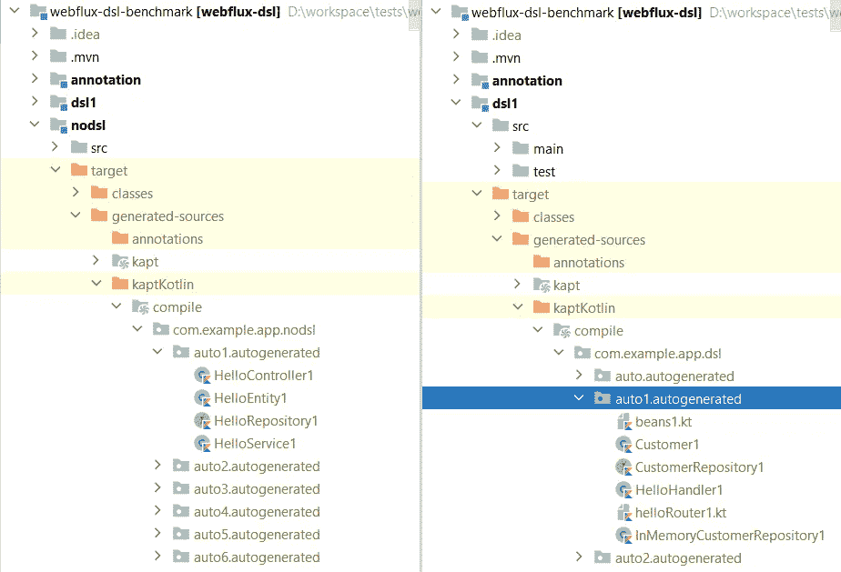
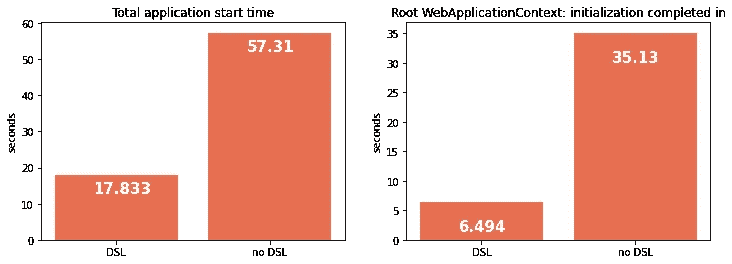
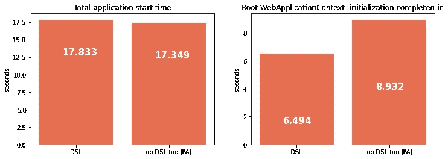

# Spring 注释与 Kotlin DSL 的对比基准

> 原文：<https://towardsdatascience.com/a-benchmark-of-spring-annotations-vs-kotlin-dsl-209f54294325?source=collection_archive---------6----------------------->

## 为什么您应该考虑迁移到 Springboot 的新 Kotlin DSL


照片由[布拉登·科拉姆](https://unsplash.com/@bradencollum?utm_source=medium&utm_medium=referral)在 [Unsplash](https://unsplash.com?utm_source=medium&utm_medium=referral) 上拍摄

Spring 的 5.0 版本引入了 Kotlin DSL(领域特定语言)来定义[路由](https://docs.spring.io/spring-framework/docs/current/reference/html/languages.html#kotlin-web)和[bean](https://docs.spring.io/spring-framework/docs/current/reference/html/languages.html#kotlin-bean-definition-dsl)。

使用 DSL，**你不需要支付不确定性**来知道你是否正确地连接了东西。

您是否曾经花费数小时进行调试，只是为了发现您将 bean 放在了一个没有被扫描的包中？或者您没有通过某些注释属性？或者你的 pom 中缺少了一些`spring-boot-starter-*something*`？

别提了。如果 DSL 可以编译，那么可以肯定 spring 正在解析您的 beans！

使用 DSL 还有第二大优势。[来自 spring 文档](https://docs.spring.io/spring-framework/docs/current/reference/html/languages.html#kotlin-bean-definition-dsl)

> 他的机制非常有效，因为它不需要任何反射或 CGLIB 代理

太棒了。但是**有多高效**？我做了一些基准测试，我将展示结果。

# 评估方法

基准的源代码在这里是。

我创建了两个 maven 模块进行测试:

*   **nodsl** :带有经典注释的 spring 应用程序。
*   dsl1 :带 dsl 初始化的 spring 应用。

注释模块具有以下类层次结构:

```
Controller
|__ Service
    |__ Repository (using JPA)
```

DSL 模块代之以另一个层次结构:

```
Router
|__ Handler
    |__ Repository (without JPA)
```

我用 [Kapt](https://kotlinlang.org/docs/kapt.html) 创建了一个注释处理器来复制这些结构。我用每种结构的 1000 个复制品做了测试。每个副本都有自己的包。



自动生成的包装结构

控制器的层次结构在 Spring 上下文中注册，带有典型的注释`@RestController, @Service, @Repository, @Entity, @Component`。路由器的层次结构注册如下:

```
@HowManyRoutes(1000)
@SpringBootApplication(scanBasePackages = [])
class DslApplication

fun main(args: Array<String>) {
    *runApplication*<DslApplication>(*args)**{
        addInitializers(*allBeans*())**
    **}** }fun allBeans(): BeanDefinitionDsl {
   return beans {
      beans1(this) 
      beans2(this)
      ...
      beans1000(this)
   }
}public fun beans1(dsl: BeanDefinitionDsl): Unit {
  dsl.bean<HelloHandler1>()
  dsl.bean<InMemoryCustomerRepository1>()
  dsl.bean(::helloRouter1)
}public fun helloRouter1(handler: HelloHandler1) = *router* **{** "hello1".*nest* **{** GET("", handler::hello)
    **}
}**
```

# 结果

您可以在存储库的根目录中找到应用程序启动的日志:

*   [结果-dsl.txt](https://github.com/lucapiccinelli/springboot-dsl-benchmark/blob/master/result-dsl.txt)
*   [result-no-dsl.txt](https://github.com/lucapiccinelli/springboot-dsl-benchmark/blob/master/result-no-dsl.txt)

这是第一次运行的结果:



第一轮测试的结果

乍一看，它很有希望。这种差异在上下文的初始化和总的开始时间方面都很显著。

我必须指出，对于 DSL，我没有使用 JPA。在“无 DSL”的情况下，存储库扫描需要 22.185 秒。在启动(`spring.jpa.hibernate.ddl-auto=none`)期间，我没有在数据库中创建表

如果我**删除 JPA** 同时保留依赖结构，会发生什么？我用普通的`@Component`替换了`@Repository`，去掉了`spring-boot-starter-data-jpa`。你可以在 Github 上的资源库的[分支](https://github.com/lucapiccinelli/springboot-dsl-benchmark/tree/no-jpa) `no-jpa`中找到代码。



这些结果让我大吃一惊。**如果 JPA 没有到位，使用 DSL 与否几乎没有区别**。初始化上下文所需的时间略有不同，但总的启动时间几乎相同。

# 讨论


由 [Icons8 团队](https://unsplash.com/@icons8?utm_source=medium&utm_medium=referral)在 [Unsplash](https://unsplash.com?utm_source=medium&utm_medium=referral) 上拍摄的照片

我通过询问 DSL **会在多大程度上改善 Springboot 应用程序的启动时间来开始这个基准测试。基准测试之后，我可以说 DSL 本身**没有直接的好处**。**

JPA 使用 CGLIB 代码生成，这个基准测试证明它对引导性能有巨大的影响。另外，使用`@Transanctional`注释会导致将 bean 包装在一个 CGLIB 代理中。

如果你想使用 Springboot 并保持可接受的引导时间，那么你应该**避免 Spring 用 CGLIB** 代理你的 beans。这意味着避免 JPA、`@Transactional`注释，以及在 `[@Configuration](https://docs.spring.io/spring-framework/docs/current/reference/html/core.html#beans-factorybeans-annotations)`中声明的`[@Bean](https://docs.spring.io/spring-framework/docs/current/reference/html/core.html#beans-factorybeans-annotations)` [工厂方法。](https://docs.spring.io/spring-framework/docs/current/reference/html/core.html#beans-factorybeans-annotations)

即使在这个基准测试之前，我也不喜欢 JPA。现在我又多了一个避免它的理由。

我已经在我的个人积压给一个尝试[科特林暴露](https://github.com/JetBrains/Exposed)。这是替代 JPA 和 Hibernate 的一个很好的选择。暴露，与避免“[约定优于配置](https://docs.spring.io/spring-framework/docs/3.0.0.M3/reference/html/ch16s10.html)”的 Spring DSL 方向相同。

# 结论

在扫描和注入 beans 的时间方面，DSL 并没有真正的好处。无论如何，前提是它提高了性能，因为**它不使用 CGLIB 和反射**。

有了这个基准，我证明了 CGLIB 的影响有多大。然后，使用一种强制您避免它的编码风格，具有改善引导启动时间的间接好处。

“[约定胜于配置](https://docs.spring.io/spring-framework/docs/3.0.0.M3/reference/html/ch16s10.html)”第一次尝试的时候，听起来很迷人，很神奇。不幸的是，当你不得不调试复杂的情况时，它会变得像魔咒一样快。

采用声明式方法可以节省你调试的时间。有编译器作为编码伴侣，让你对你写的东西更有信心。这也是一个优势，因为以错误的方式使用工具的机会要少得多。

我很确定在我的下一个项目中，我会尝试 DSL，并且避免 JPA 和 Hibernate。

让我知道你对放弃 JPA、Hibernate 和“约定胜于配置”的感觉。它让你害怕，还是让你兴奋？

感谢您的阅读。