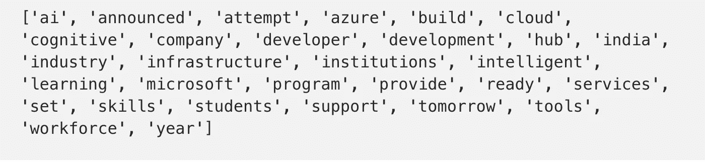
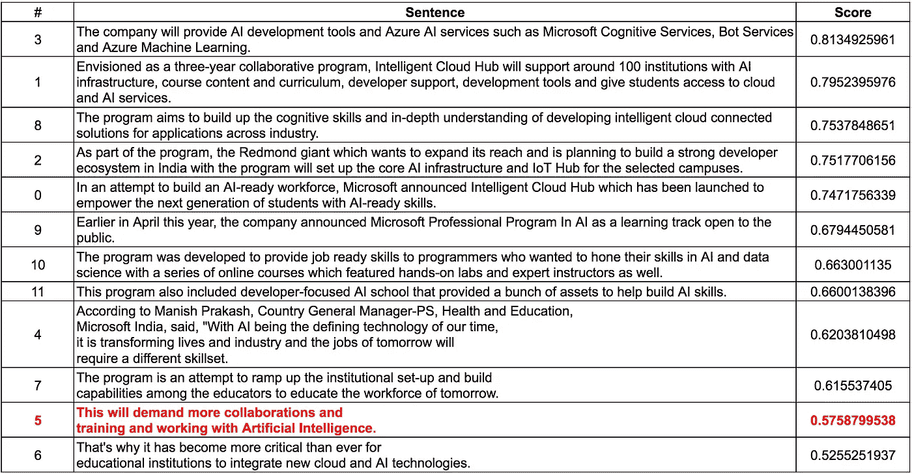

# 一种更好的文本摘要方法

> 原文：<https://towardsdatascience.com/a-better-approach-to-text-summarization-d7139b571439?source=collection_archive---------8----------------------->

## 用 Python 完整实现的分步指南


图片由 [Dianne Hope](https://pixabay.com/users/diannehope14-266432/?utm_source=link-attribution&utm_medium=referral&utm_campaign=image&utm_content=1106196) 发自 [Pixabay](https://pixabay.com/?utm_source=link-attribution&utm_medium=referral&utm_campaign=image&utm_content=1106196)

有几种方法来执行自动文本摘要。它可以通过[监督或无监督学习](https://medium.com/programming-for-beginners/unsupervised-versus-supervised-machine-learning-1e55aeb3d2df)来完成，通过深度或只有机器学习。在这些类别中，有各种各样的方法。

就摘要的类型而言，有两种——提取的和抽象的。这里介绍的程序使用无监督学习，并生成一个提取摘要。

摘要是指摘要是原始文本的子集，因为摘要中的所有单词都包含在原始文本中。对于自动文本摘要领域的概述，我推荐这个[调查](http://arxiv.org/abs/1707.02268v3)。

# 不同的词，但是相同的意思

一般来说，在简单的解释中，摘要者的目标是找到最相关的单词，然后选择包含这些单词的句子作为摘要的一部分。

*不同但意思相同的单词怎么办？*

举个例子，

*   哈里搬到了美国。
*   王子移居北美。

他们没有共同语言，但这两个句子有很强的关联性**。**“该”和“到”不算。这些单词在预处理步骤中已经被删除了。下面将详细介绍。

# 问题

在一种简单的方法中，“Harry”或“US”可以被选择为相关的单词，但是句子“The prince relocated to North America*”*将没有机会成为摘要的一部分。

这篇[研究论文](http://www.aclweb.org/anthology/W17-1003)中提出的技术解决了这个问题。

***本帖显示的代码只是稍加修改的版本(结构、方法名等。)的出处*** ***可用上***[***Github***](https://github.com/gaetangate/text-summarizer)*。*

# 算法步骤

我在本教程中使用的文本与由 [Praveen Dubey](https://medium.com/u/ec3b4cbc2b59?source=post_page-----d7139b571439--------------------------------) 撰写的这篇优秀的[文章](/understand-text-summarization-and-create-your-own-summarizer-in-python-b26a9f09fc70)中使用的文本相同。确保也阅读它(为了证明概念，我改变了其中一个句子)。

## 1.生成嵌入模型

摘要器依赖于单词嵌入，因此它还选择包含与最相关单词(质心)具有相同含义的单词的句子，即使这些单词是不同的。

对于**更多关于单词嵌入**的细节，请看这篇[文章](/a-beginners-guide-to-word-embedding-with-gensim-word2vec-model-5970fa56cc92)作者[李智](https://medium.com/u/19bb3e3825ba?source=post_page-----d7139b571439--------------------------------)

因此，在预处理文本之前，程序必须定义嵌入模型。我使用被总结的文本作为数据来获得嵌入模型。

但它可能是维基百科的转储或其他文本。也已经有可用的模型可以使用。为了获得单词嵌入，我将文本分割成单词，并将其传递给 Word2vec。

```
for sent in clean_sentences:
    words.append(nlkt_word_tokenize(sent))
**model =** Word2Vec(words, min_count=1, sg = 1)
```

## 2.预处理

您必须对文本进行预处理。它包括将文本拆分成句子，降低所有单词的大小写，删除停用词(是，安，等。)和标点符号等任务。

[我在另一篇文章](https://betterprogramming.pub/how-to-prepare-text-data-for-natural-language-processing-nlp-97dadce77661)中单独介绍了这一步。目标是不要浪费资源(计算能力、时间)来处理那些对提取语义和理解文本没有太大价值的事情。

特别是识别和分割文本成句子，这是至关重要的，因为稍后算法将评分并选择它们作为摘要的一部分。

```
**def sent_tokenize(text):**
    sents = nlkt_sent_tokenize(text)
    sents_filtered = []
    for s in sents:
        sents_filtered.append(s)
    return sents_filtered**def cleanup_sentences(text):**
    stop_words = set(stopwords.words('english'))
    sentences = sent_tokenize(text)
    sentences_cleaned = []
    for sent in sentences:
        words = nlkt_word_tokenize(sent)
        words = [w for w in words if w not in string.punctuation]
        words = [w for w in words if not w.lower() in stop_words]
        words = [w.lower() for w in words]
        sentences_cleaned.append(" ".join(words))
    return sentences_cleaned
```

## 3.查找最相关的单词嵌入表示

该算法使用 [TF-IDF](https://levelup.gitconnected.com/what-the-heck-is-tf-idf-69ead52c908b) 来查找文本中最相关的单词。这些词是文章的重心。

找到单词质心后，程序对作为质心一部分的单词的向量求和，这个和就是质心的嵌入表示。

假设最相关的词是:微软，程序，AI

质心的嵌入表示(最相关项)=微软向量+程序向量+ AI 向量。

提醒一下，嵌入模型将每个单词表示为一个向量。这就是为什么每个单词都有一个向量。

```
**def build_embedding_representation(words, word_vectors, embedding_model):**
    embedding_representation = np.zeros(embedding_model.vector_size, dtype="float32")
    word_vectors_keys = set(word_vectors.keys())
    count = 0
    for w in words:
        if w in word_vectors_keys:
            embedding_representation = embedding_representation + word_vectors[w]
            count += 1
    if count != 0:
       embedding_representation = np.divide(embedding_representation, count)
    return embedding_representation**def get_tf_idf(sentences):**
    vectorizer = CountVectorizer()
    sent_word_matrix = vectorizer.fit_transform(sentences)transformer = TfidfTransformer(norm=None, sublinear_tf=False, smooth_idf=False)
    tfidf = transformer.fit_transform(sent_word_matrix)
    tfidf = tfidf.toarray()centroid_vector = tfidf.sum(0)
    centroid_vector = np.divide(centroid_vector, centroid_vector.max())feature_names = vectorizer.get_feature_names()relevant_vector_indices = np.where(centroid_vector > 0.3)[0]word_list = list(np.array(feature_names)[relevant_vector_indices])
    return word_list**centroid_words** = get_tf_idf(clean_sentences)**centroid_vector** = build_embedding_representation(centroid_words, word_vectors, emdedding_model)
```



最相关的单词(质心)。图片作者。

## 4.给句子打分

基于句子与质心嵌入的相似程度对句子进行评分。

为了与质心嵌入进行比较，该算法计算每个句子的嵌入表示。

句子嵌入=作为句子一部分的单词向量的总和。

举个例子，

```
**Sentence1** = word1, word2, word3
**Sentence1 embedding** = word1 vector + word2 vector + word3 vector
```

最后，在定义了句子嵌入之后，该算法使用 [**余弦相似度**](/cosine-similarity-intuition-with-implementation-in-python-51eade2674f6) 来计算质心和句子嵌入之间的相似度。

每个句子根据它们与质心的相似程度得到一个分数。

```
**def build_embedding_representation(words, word_vectors, embedding_model):**
    embedding_representation = np.zeros(embedding_model.vector_size, dtype="float32")
    word_vectors_keys = set(word_vectors.keys())
    count = 0
    for w in words:
        if w in word_vectors_keys:
            embedding_representation = embedding_representation + word_vectors[w]
            count += 1
    if count != 0:
       embedding_representation = np.divide(embedding_representation, count)
    **return embedding_representation** sentences_scores = []
for i in range(len(clean_sentences)):
        scores = []
        words = clean_sentences[i].split() #Sentence embedding representation
        sentence_vector = build_embedding_representation(words,    word_vectors, emdedding_model) #Cosine similarity between sentence embedding and centroid embedding
        score = similarity(sentence_vector, centroid_vector)
        sentences_scores.append((i, raw_sentences[i], score, sentence_vector))sentence_scores_sort = sorted(sentences_scores, key=lambda el: el[2], reverse=True)sentence_scores_sort = sorted(sentences_scores, key=lambda el: el[2], reverse=True)
```

**句子得分**

红色句子的形心部分没有单词。尽管如此，它还是取得了不错的成绩。高于另一个包含质心词的词。



按分数排序的句子。图片作者。

## 5.选择句子并解决冗余

这些句子是根据它们的分数选择的。选择的句子数量受到摘要应包含多少单词的限制(50 个单词，100 个单词，还是？).

处理自动摘要的一个常见问题是处理冗余——摘要中包含太相似的句子。

为了克服这一点，在选择句子时，你要将它们与已经在摘要中的句子进行比较。如果选择的句子与摘要中的句子太相似，你就不会把它添加到最终文本中。

该算法在进行比较时使用余弦相似度和一些预定义的阈值。

```
count = 0
sentences_summary = []#Handle redundancy
for s in sentence_scores_sort:
        if count > 100:
            break
        include_flag = True
        for ps in sentences_summary:
            sim = similarity(s[3], ps[3])
            if sim > 0.95:
                include_flag = False
        if include_flag:
            sentences_summary.append(s)
            count += len(s[1].split())sentences_summary = sorted(sentences_summary, key=lambda el: el[0], reverse=False)**summary =** "\n".join([s[1] for s in sentences_summary])
```

# 原始文本和生成的摘要

**原文**


原文。图片作者。

**生成汇总**


生成的摘要。图片作者。

# Python 中的完整代码

为了让我更好地理解并在本文中解释，代码被稍微修改/简化了。但是您可以查看研究论文作者的 Github 以获得完整和更准确的实现。

原文在这里:[https://github.com/gaetangate/text-summarizer](https://github.com/gaetangate/text-summarizer)。我玩它只是为了更好地理解和稍微改变一下。

# 最后的想法

我发现这个项目真的很有趣。它比其他只依赖单词包(BOW)或 TF-IDF 的算法更有效。我用作主要参考的研究论文要详细得多。它针对其他算法评估生成的摘要，并涵盖多语言文档摘要。

接下来是评估。我计划再写一篇关于 ROUGE 的文章，ROUGE 是一个常用于评估摘要好坏的工具。我还将深入研究基于监督机器学习的摘要器。以及深度学习。

感谢阅读。

# 参考

[1] [文本摘要技术:简要综述](https://arxiv.org/abs/1707.02268v3)。作者:Mehdi Allahyari，Seyedamin Pouriyeh，Mehdi Assefi，Saeid Safaei，Elizabeth D. Trippe，Juan B. Gutierrez，Krys Kochut

【2】[通过单词嵌入的复合性进行基于质心的文本摘要](http://www.aclweb.org/anthology/W17-1003)。作者:盖塔诺·罗西耶洛，皮耶保罗·巴西勒和乔瓦尼·塞梅罗|**Github page:**[https://github.com/gaetangate/text-summarizer](https://github.com/gaetangate/text-summarizer)