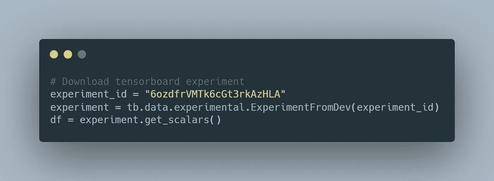
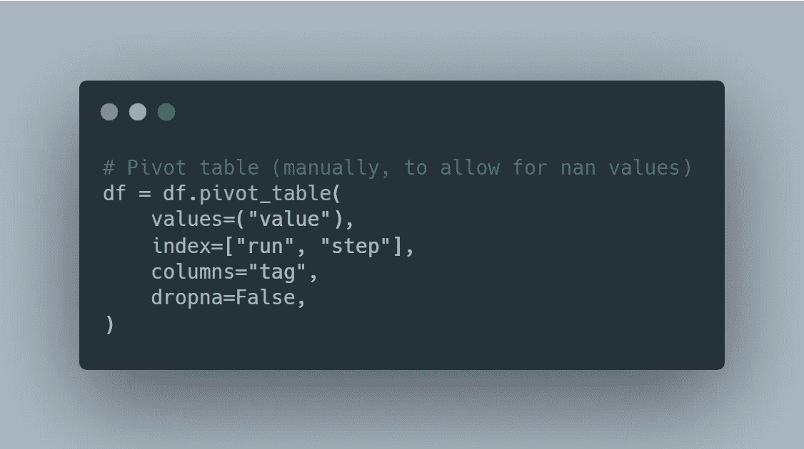
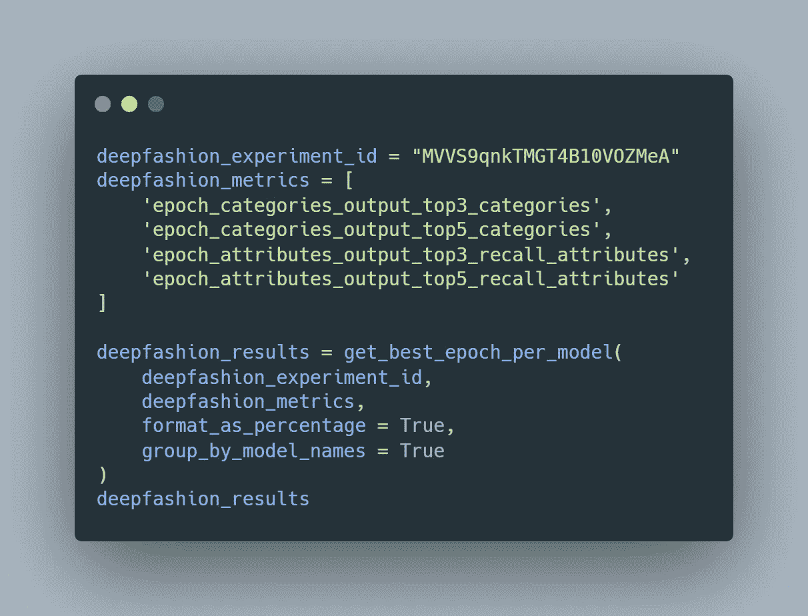
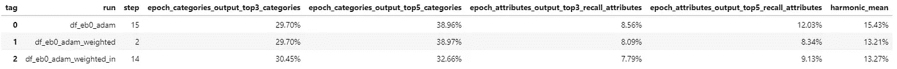

# 张量板实验的更好比较

> 原文：<https://towardsdatascience.com/a-better-comparison-of-tensorboard-experiments-b6d6b42e5d9e?source=collection_archive---------34----------------------->

## TensorBoard 在对实验进行排名时只考虑最后一个历元。以下是如何更好地评估您的指标。

图片来自 [Pixabay](https://pixabay.com/illustrations/trading-forex-system-laptop-4453011/)

如果你使用 [TensorFlow](http://tensorflow.org/) 进行机器学习算法的开发和实验，你很可能会遇到 [TensorBoard](https://www.tensorflow.org/tensorboard/) 并使用它来记录每次运行的结果，并有更好的方式来直观地比较它们。您甚至可以通过记录各种指标来比较您的结果，从而进行一些超参数调整。

然而，在我写这篇文章的那天， **TensorBoard 只能根据上一个时期获得的指标来比较结果。**尽管每次运行都有所有历史值，但当按特定指标对结果进行排序时，它将只考虑最后一个时期进行比较。根据不同的用例，这可能导致在不同的超参数上运行的模型的**不正确的排序**。

本文的目的是**介绍一种比较 Tensorboard** 中记录的结果的更好方法，不仅包括超参数调整，还包括正常标量运行的比较。具体来说，我们将通过 ***Python TensorBoard 库*** 访问这些指标，将它们转换成 [Pandas](https://pandas.pydata.org/) DataFrame，并从那里根据指标的子选择对运行进行分组和比较。

## 上传实验到 TensorBoard。偏差

首先，我们将把我们的实验目录上传到 [TensorBoard.dev](https://tensorboard.dev/) 。对于那些不熟悉这个工具的人来说，它允许我们上传并与任何人分享我们的 ML 实验，最棒的是:零设置。

如果您尚未安装，可以通过以下方式安装:

> pip 安装-U 型张量板

然后，您需要运行下面的命令，指定您的 logdir，并可选地指定您想要上传的实验的名称:

> tensorboard dev 上传—logdir REPLACE _ LOG _ DIR \
> —name“(可选)我的最新实验”

该命令第一次执行将提示一些身份验证阶段。完成后，你将能够有一个看起来像"https://tensorboard.dev/experiment/EXPERIMENT_ID"的链接。

## 将实验加载到熊猫数据框架中

下一步是将上传的实验加载到本地 Pandas DataFrame 中，这可以通过将实验 id 传递给 TensorBoard API 调用[*tensor board . data . experimental . experimental from dev()*](https://www.tensorflow.org/tensorboard/dataframe_api)来完成，然后获取实验标量。

装载冲浪板。开发一个熊猫数据框架的实验。图片作者。

为了将数据帧转换成更有用的格式(宽格式)，我们可以用*get _ scalar 调用 get _ scalar(pivot = True)。*但是，如果我们没有对所有实验使用相同的指标，并且我们想比较它们，即使有些实验没有可用的指标，这也是行不通的。为此，我们必须通过运行以下命令来手动旋转表格:

将数据帧转换为*宽格式*格式。图片作者。

## 排名结果

一旦我们准备好数据帧并正确格式化，剩下唯一要做的事情就是对结果进行排序，不仅要考虑最后一次，还要考虑每次运行的所有时期。此外，如果使用多个指标来比较运行，并希望找到与这些指标相结合的最佳模型，我们将使用[调和平均值](https://en.wikipedia.org/wiki/Harmonic_mean)，因为它比简单平均值更适合比率。

为此，我在下面创建了一个要点，所有这些功能都包含在一个方法中。要调用它，只需要两个参数，我们上传到 TensorBoard 的实验的 id。Dev 和用于比较结果的指标。还有一些可选参数，用于仅考虑验证运行，根据整体性能对值进行排序，或者格式化返回数据帧的指标百分比。

作为一个例子，下面是我在 [DeepFashion](http://mmlab.ie.cuhk.edu.hk/projects/DeepFashion.html) 数据集上进行的一些实验。

深度时尚实验示例。图片作者。

执行先前代码的输出。图片作者。

## 最后的话

在本文中，我向您介绍了一种更准确的方法来评估您的 TensorFlow 实验，即使在查看多个指标时，也可以通过手动访问 TensorBoard 数据来实现。我希望你喜欢这篇文章，它对你有帮助！😄你也可以在以下网址查看我的最新作品:

*   [GitHub](https://github.com/angeligareta)
*   [领英](https://www.linkedin.com/in/angeligareta/)
*   [个人网站](https://angeligareta.com/)