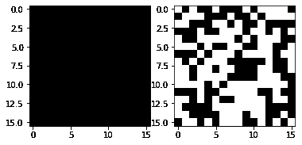
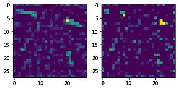
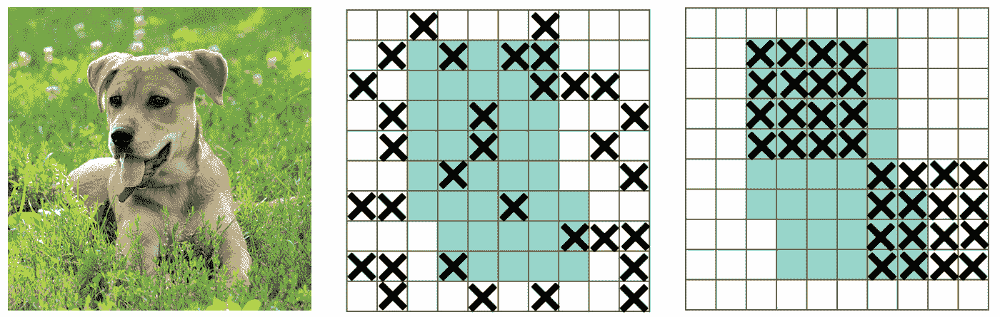
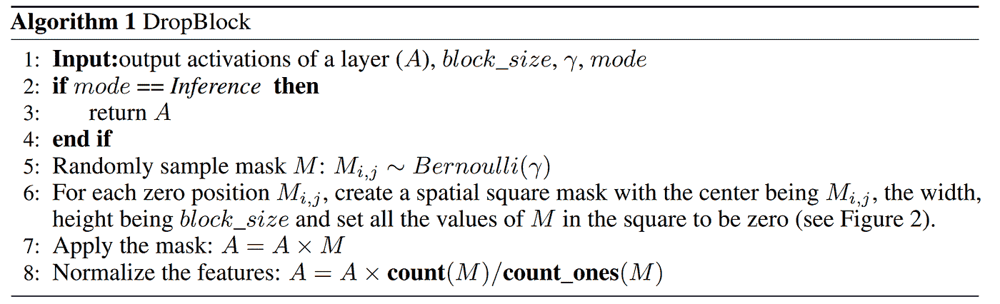
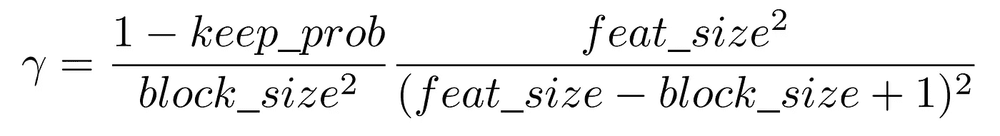
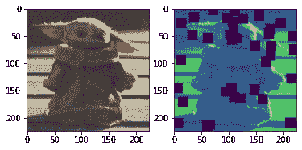
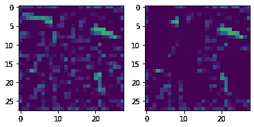
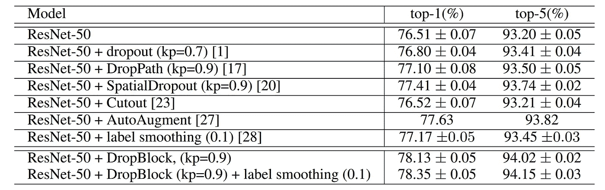

# 更好的辍学生！在 PyTorch 中实现 DropBlock

> 原文：<https://towardsdatascience.com/a-better-dropout-implementing-dropblock-in-pytorch-50d19d1bc59a?source=collection_archive---------13----------------------->


作者图片

这篇文章的互动版本可以在[这里](https://github.com/FrancescoSaverioZuppichini/DropBlock)找到

我的计算机视觉库中的[眼镜](https://github.com/FrancescoSaverioZuppichini/glasses)上有 DropBlock！

# 介绍

今天我们要在 PyTorch 中实现 [DropBlock](https://arxiv.org/abs/1810.12890) ！Ghiasi 等人介绍的 DropBlock 是一种正则化技术，专门用于图像，从经验上看比 drop 更有效。为什么辍学是不够的？

## 图像丢失的问题

[Dropout](https://jmlr.org/papers/v15/srivastava14a.html) 是一种正则化技术，在将输入传递到下一层之前，随机丢弃(设置为零)部分输入。如果你不熟悉，我推荐[斯坦福的这些](https://cs231n.github.io/neural-networks-2/)讲义(跳转到退学部分)。如果要在 PyTorch 中使用，可以直接从库中导入。我们来看一个例子！



作者图片

如您所见，输入的随机像素被丢弃了！

这种技术在 1D 数据上工作得很好，但是在 2D 数据上，我们可以做得更好。

**主要问题**是我们正在丢弃独立的像素，并且这个*在移除语义信息方面是无效的，因为附近的激活包含密切相关的信息*。我认为这是相当直观的，即使我们去掉一个元素，邻居仍然可以携带重要信息。

让我们探索一下特征地图会发生什么。在下面的代码中，我们首先获得一个婴儿尤达图像，然后我们使用[眼镜](https://github.com/FrancescoSaverioZuppichini/glasses)创建一个预训练结果。然后我们馈入图像，从第二层得到特征图。最后，我们展示了有和没有`Dropout`的第一个通道的激活



作者图片

在左边，我们有特征映射的激活，在右边是同一特征映射在退出后的激活。它们看起来非常相似，注意在每个区域，即使一些单位为零，邻居的激活仍然在进行。这意味着，信息将传播到下一层，这是不理想的。

# 下落滑车

DropBlock 通过从特征地图中删除连续区域来解决这个问题，下图显示了主要思想。



图片由 Ghiasi 等人提供。

Dropblock 的工作方式如下



图片由 Ghiasi 等人提供。

## 履行

我们可以从用正确的参数定义一个`DropBlock`层开始

`block_size`是我们要从输入中删除的每个区域的大小，`p`是`keep_prob`，就像`Dropout`中的那样。

到目前为止一切顺利。现在棘手的部分，我们需要计算伽玛来控制特征的下降。如果我们想用`p` prob 保持每次激活，我们可以从一个具有均值`1 - p`的伯努利分布中采样，就像在 Dropout 中一样。问题是我们将`block_size ** 2`单位设置为零。

Gamma 的计算公式如下



Ghiasi 等人的图片(论文中的公式 1)

乘法运算的左侧是将被设置为零的单位数。而右侧是有效区域，即 dropblock 未触及的像素数

```
# Output
0.14222222222222222 
```

下一步是对掩码$M$进行采样，其大小与中心为γ的伯努利分布的输入大小相同，在 PyTorch 中很简单

接下来，我们需要清空大小为`block_size`的区域。我们可以使用**最大池**，其中`kernel_size`等于`block_size`并且一个像素步距来创建。请记住，掩码是一个二进制掩码(只有 0 和 1)，因此当 maxpool 在其 kernel_size 半径中看到 1 时，它将输出 1，通过使用 1 步长，我们确保如果输入中至少有一个单元设置为 1，则在输出中创建大小为`block_size x block_size`的区域。因为我们想把它们归零，我们需要把它反过来。在 PyTorch

饭桶

然后我们将它标准化

```
x = mask_block * x * (mask_block.numel() / mask_block.sum())
```

让我们用宝贝尤达来测试一下，为了简单起见，我们将在第一个通道中显示被丢弃的单元



作者图片

看起来不错，让我们看看一个预训练模型的特征图(像以前一样)



作者图片

我们成功地将连续区域清零，而不仅仅是单个单元。

顺便说一句，`DropBlock`在`block_size = 1`时等于`Dropout`，在`block_size`为全特征图时等于`Dropout2d`(又名空间差)。

# 结论

现在我们知道如何在 PyTorch 中实现 DropBlock，这是一种很酷的正则化技术。本文给出了不同的实证结果。他们使用一个普通的 resnet50 并迭代地添加不同的正则化，如下表所示



如你所见，与 SpatialDropout 相比，` ResNet-50 + DropBlock '存档+1%(py torch 中的经典` Dropout2d ')。

在[论文](https://arxiv.org/pdf/1810.12890.pdf))中有更多关于不同 DropBlock 超参数的研究，如果你有兴趣可以看看:)

感谢您的阅读！

弗朗西斯科