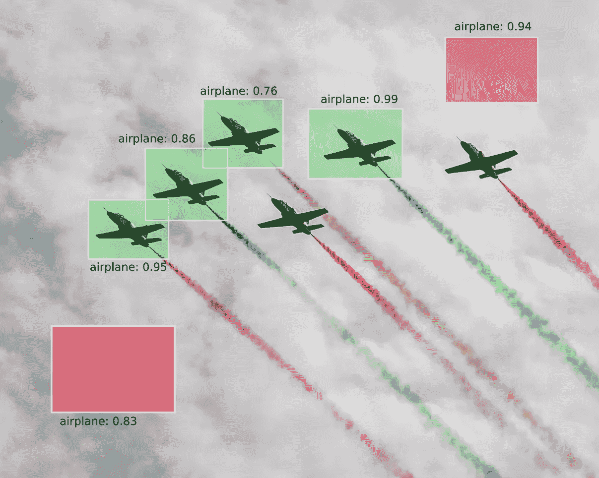
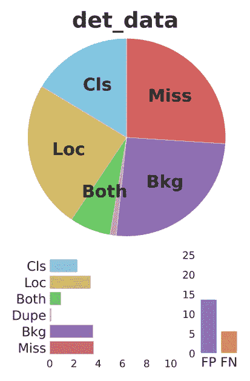

# 用于对象检测的更好的地图

> 原文：<https://towardsdatascience.com/a-better-map-for-object-detection-32662767d424?source=collection_archive---------7----------------------->

## ML 提示和技巧/潮流

## 为什么你的物体检测模型很烂？让我们改进它！

> TL；DR:你的对象检测模型很糟糕，你想通过利用更好的评估指标来改进它……跳过介绍，找出方法或者直接去 [Google Colab 笔记本](https://medium.com/r?url=https%3A%2F%2Fcolab.research.google.com%2Fdrive%2F1kji2JjD_N2Yq0gF4ddbuFcOa45yq0o8G%3Fusp%3Dsharing)看代码或者[这里](https://t.clear.ml/tide_task)看 ClearML 实验日志！



误报和漏报是物体检测中的主要问题(来源:图片 6 喷气飞机向云行进，作者是[赛义德·阿里](https://www.pexels.com/@sajid-ali-35945?utm_content=attributionCopyText&utm_medium=referral&utm_source=pexels)和[像素](https://www.pexels.com/photo/6-jets-parading-toward-clouds-129627/?utm_content=attributionCopyText&utm_medium=referral&utm_source=pexels)

# 介绍

O **物体检测容易**。你需要做的只是获得一个训练数据集，从开源库中下载一个预训练的模型，如 [Tensorflow 对象检测 API](https://github.com/tensorflow/models/tree/master/research/object_detection) 、 [Detectron2](https://github.com/facebookresearch/detectron2) 和 [mmdetection](https://github.com/open-mmlab/mmdetection) ，并(重新)训练它。

实际上，在训练你的模型几个小时后，你[评估](/new-tf2-object-detection-api-5c6ea8362a8c)它，检查度量标准…你最终对性能完全失望，因为它与你的预期相差甚远！

现在你有麻烦了…关于如何调试模型的性能，以及如何优化模型以获得更好的性能，没有好的教程、菜谱或 StackOverflow 主题。在 [Forsight](http://forsight.ai) ，我们使用潮汐来实现精确的物体检测。这个博客是关于分享小技巧的，这些小技巧对于提高你的物体探测模型的准确性是非常宝贵的。

# 模型性能评估—基础

构成物体检测模型性能的关键有两个方面:**速度**和**精度**。从下表中可以看出，这两者之间总是有一个权衡。在这篇博客中，我们将专注于分析模型的准确性。


EfficientDet 模型中速度与准确性的权衡(来源:图片由作者提供)

简而言之，**物体检测器以一定的置信度得分**预测给定类别的物体在图像中的位置。通过在对象周围放置边界框来识别它们的位置，来定义对象的位置。

因此，检测由一组三个属性表示:

1.  **对象类**(即人)
2.  **对应的包围盒**(即【63，52，150，50】)
3.  **置信度得分**(即 0.583 或 58.3%)

类似地，对象检测模型的性能评估是基于:

*   一组**基本事实边界框**，表示包含待检测类别的对象的图像的矩形区域，
*   由模型预测的一组**检测，每个检测由一个边界框、一个类别和一个置信度值组成。**

## 借据和信心得分

考虑下图中由真实边界框(绿色)表示的感兴趣对象(人)和由预测边界框(红色)表示的检测区域。在不考虑置信度得分的情况下，**当预测框和真实框的面积和位置相同时**，即完美地包围了人，则出现完美匹配。


预测与现实(来源:照片中的男子站在灰色金属设备附近，作者是 [Pexels](https://www.pexels.com/photo/man-standing-near-gray-metal-equipment-2760243/?utm_content=attributionCopyText&utm_medium=referral&utm_source=pexels) 的 [Kateryna Babaieva](https://www.pexels.com/@kateryna-babaieva-1423213?utm_content=attributionCopyText&utm_medium=referral&utm_source=pexels) )

这两个条件通过**交集除以并集(IoU)** 进行评估，这是一种基于 [Jaccard 指数](https://en.wikipedia.org/wiki/Jaccard_index)的测量，Jaccard 指数是两组数据的相似系数。在对象检测范围中，IoU 等于预测边界框(红色)和地面真实边界框(绿色)之间的重叠(相交)面积除以它们的并集面积。


IoU 等于重叠面积除以边界框的并集面积。(来源:图片由作者提供)

下图中可以看到一些不同 IoU 分数的例子。**通过设置 IoU 阈值，一个指标可以或多或少地限制检测是正确还是不正确。**更接近 1 的 IoU 阈值更具限制性，因为它需要几乎完美的检测，而更接近但不同于 0 的 IoU 阈值更灵活，即使很小的重叠也被视为有效检测。


边框的不同借据(来源:作者图片)

**置信度得分**反映了盒子包含感兴趣对象的可能性以及分类器对它的置信度。如果该框中不存在任何对象，则置信度得分理想情况下应该为零。一般来说，越紧密的边界框(严格的 IoU)的置信度得分往往越高。

## 精确度和召回率

**精度(Pr)** 是模型仅识别相关对象的能力，计算为正确正面预测的百分比。

**Recall (Rc)** 是一个模型找到所有相关案例(所有真实边界框)的能力。它是所有已知事实中正确的正面预测的百分比。


精确与召回(来源:[https://en.wikipedia.org/wiki/File:Precisionrecall.svg](https://en.wikipedia.org/wiki/File:Precisionrecall.svg)有 CC 许可)

为了计算精度和召回值，每个检测到的边界框必须首先被分类为:

*   **真阳性(TP)** —地面真实边界框的正确检测；
*   **假阳性(FP)** —不存在物体的错误检测或存在物体的误检测；
*   **假阴性(FN)** —未被检测到的真实边界框；
*   **真否定(TN)** — 不适用于对象检测，因为有无限多的实例不应被检测为对象。

概括地说，对象检测器的输出由一个**边界框、一个类和一个置信度得分**来表征。通过仅将置信度大于置信度阈值τ的那些检测视为阳性检测，可以在精确度和召回率计算中考虑置信度得分。置信水平小于τ的检测被认为是否定的。

TP(τ)和 FP(τ)都是τ的减函数，因为较大的τ会减少阳性检测的数量。相反，FN(τ)是τ的增函数，因为较少的阳性检测意味着较多的阴性检测。


## 平均精度

精确度-召回率(PR)曲线是精确度作为召回率的函数的图。它显示了模型检测的不同置信度值的两个度量之间的权衡。 **AP@α是精确召回曲线下的面积(AUC-PR)。**数学上，AP 定义为:


**符号:** AP@α表示 IoU 阈值为α时的平均精度(AP)。因此，AP@0.50 和 AP@0.75 分别表示 IoU 阈值为 50%和 75%时的 AP。

**高 AUC-PR 意味着高精度和高召回率**。自然地，PR 曲线具有之字形行为(不是单调递减的)。在计算 AP 之前，我们使用以下插值公式使 PR 曲线单调递减:


在我们为每个单独的类计算 AP 之后，我们计算平均 AP 作为所有类的所有 AP 的平均值:


关于精确召回曲线计算的例子，请查看 Harshit Kumar 的博客文章。

在下图中，我们可以看到三条不同的 PR 曲线，它们的不同之处在于精度/召回计算中使用的 IoU 阈值。由于 AP 对应于曲线下的面积，显然**宽松的 IoU 阈值会导致比严格的 IoU 阈值更高的 AP 分数。**


(图片来源:Harshit Kumar[https://kharshit . github . io/blog/2019/09/20/evaluation-metrics-for-object-detection-and-segmentation](https://kharshit.github.io/blog/2019/09/20/evaluation-metrics-for-object-detection-and-segmentation))

更多关于可可地图的具体细节，请访问:[https://cocodataset.org/#detection-eval](https://cocodataset.org/#detection-eval)！

# 潮汐——更好的地图

如前几节所示，对象检测和实例分割任务通常只使用一个指标来衡量模型性能:平均精度(mAP)。虽然 mAP 用一个数字简洁地总结了模型的性能，但是**从 mAP 中理清对象检测和实例分割中的错误是困难的**:假阳性可能是重复检测、错误分类、错误定位、与背景混淆，或者甚至是错误分类和错误定位。

[TIDE(用于识别检测和分割错误的工具包)](https://dbolya.github.io/tide/paper.pdf)被引入来解决上述挑战。它将目标检测误差分为六种类型，并引入一种技术来测量每种误差的贡献，以隔离其对整体性能的影响。**潮基本上是田蜜地图上的类固醇！**

如果您的对象检测模型在自定义数据集上训练后有一个低 mAP，您肯定会想知道我们可以在哪里进一步改进它。这是潮汐闪耀光芒的地方。**为了让你的模型运行得更好，TIDE 将帮助你精确定位你应该重点改进的错误类型。**


(作者提供 gif 图片——丹尼尔·博尔亚等人提供图片来源——[https://www.youtube.com/watch?v=McYFYU3PXcU](https://www.youtube.com/watch?v=McYFYU3PXcU))

## 潮汐误差类型

在本文中，有对错误类型以及如何定义它们的详细解释。

> 为了创建一个有意义的误差分布来捕捉 mAP 的组成部分，我们将模型中的所有假阳性和假阴性分为 6 种类型，如下图所示。注意，对于某些错误类型(分类和定位)，假阳性可能与假阴性成对出现。我们将使用 IoUᵐᵃˣ来表示假阳性的最大 IoU 重叠与给定类别的真实情况。


(来源:图片来自[1])

> 前台 IoU 阈值表示为 tᶠ，后台阈值表示为 tᵇ，除非另有说明，否则均设为 0.5 和 0.1。
> 
> **1。分类错误** : IoUᵐᵃˣ ≥ tᶠ的燃气轮机分类不正确(即正确定位但分类不正确)。
> 
> **2。本地化错误** : tᵇ ≤ IoUᵐᵃˣ ≤ tᶠ为正确级别的 GT(即分类正确但本地化不正确)。
> 
> **3。Cls 和 Loc 错误** : tᵇ ≤ IoUᵐᵃˣ ≤ tᶠ的 GT 分类不正确(即分类不正确和本地化不正确)。
> 
> **4。重复检测错误**:正确类别的燃气轮机的 IoUᵐᵃˣ ≥ tᶠ，但另一个更高得分的检测已经匹配该燃气轮机(即，如果不是更高得分的检测，将是正确的)。
> 
> **5。背景错误**:所有 GT 的 IoUᵐᵃˣ ≤ tᵇ(即检测到的背景为前景)。
> 
> **6。遗漏的 GT 错误**:所有未检测到的地面真相(假阴性)尚未被分类或定位错误覆盖。

TIDE 旨在替代 [COCO 评估工具包](https://github.com/cocodataset/cocoapi)，入门非常简单:

```
from tidecv import TIDE, datasets

tide = TIDE()
tide.evaluate(datasets.COCO(), datasets.COCOResult('path/to/your/results/file'), mode=TIDE.BOX)
tide.summarize()  # Summarize the results as tables in the console
tide.plot()       # Show a summary figure
```

## 潮汐实例

我们已经准备了一个 [Google Colab 笔记本](https://colab.research.google.com/drive/1kji2JjD_N2Yq0gF4ddbuFcOa45yq0o8G?usp=sharing)，里面有一个代码样本，展示了**如何使用带有 Tensorflow 对象检测 API** 的 TIDE。

如果您不想运行笔记本并等待评估完成，您可以**在我们用于实验管理的** [**Allegro ClearML 仪表盘**](https://t.clear.ml/tide_task) 上查看结果。通过使用 [ClearML](https://clear.ml/) ，我们可以**以有组织的方式持久存储所有实验数据**，这使我们能够轻松地执行比较并上传[自定义工件](https://clear.ml/docs/latest/docs/fundamentals/artifacts/)，如 COCO 格式的[地面实况和检测元数据](https://demoapp.demo.clear.ml/projects/1f4d0d46cb4443fdbfda6511fbea1cc5/experiments/84b743d1a38a454e9f9dda0fb47fa5a0/artifacts/other/cocoDt/output?columns=selected&columns=type&columns=name&columns=tags&columns=status&columns=project.name&columns=users&columns=started&columns=last_update&columns=last_iteration&columns=parent.name&order=-last_update)，以及[自定义图](https://demoapp.demo.clear.ml/projects/1f4d0d46cb4443fdbfda6511fbea1cc5/experiments/84b743d1a38a454e9f9dda0fb47fa5a0/info-output/metrics/plots?columns=selected&columns=type&columns=name&columns=tags&columns=status&columns=project.name&columns=users&columns=started&columns=last_update&columns=last_iteration&columns=parent.name&order=-last_update)到实验。


潮汐评估— ClearML 实验日志(来源:作者提供的 gif)


EfficientDet-D0 与 EfficientDet-D7 的 TIDE 和 COCO 评估结果(来源:作者提供的图片)

通过比较 EfficientDet-D0 和 EfficientDet-D7 型号的 COCO 评估结果，我们看到 EfficientDet-D7 的 mAP 比 T22 高出约 15%。这是因为该型号的容量更大——与 EfficentDet-D0 相比，efficent det-D7 中的参数多了**到 13 倍。**

> 注意:TIDE 和 pycocotools 中的地图计算有一些已知的[差异](https://github.com/dbolya/tide/issues/28)。这就是可可地图和潮汐地图在某些情况下不相等的原因。

当比较 TIDE 评估结果时，我们可以看到两个模型的**分类和重复检测误差类似于**，而 D7 模型的**定位误差低 2%。**

**与 D0 相比，D7 车型检测背景作为前景的误差高出 2%，而 D7 车型遗漏的 GT 误差则小 3.5%。这可以通过以下事实来解释，即 D7 模型具有较高的召回率，这降低了遗漏的 GT 误差，但同时增加了背景分类误差。**

比较的有趣部分是假阳性和假阴性的映射。我们可以看到两个模型的**误报率非常相似。这可能是数据集**中有一些未标记数据的标志，并且模型正在以高置信度检测它。另一方面，D7 型号的**假阴性率明显较低。很明显，较大的模型可以检测到较小容量模型难以处理的对象实例。**

在这次比较中，我们比较了相同的模型架构(EfficientDet)和不同数量的参数(D0 和 D7)。**当我们想要比较不同的模型架构的时候，TIDE 模型评估就更加有用了**，大家可以随意自己尝试一下。TIDE 论文[1]包含对不同对象检测和分割模型的附加分析。

前面分析的潮汐图如下所示。



EfficientDet-D0 与 EfficientDet-D7 的潮汐图(来源:作者提供的图片)

# 结论

最近，人工智能先驱吴恩达为以数据为中心的人工智能发起了一场[活动](https://www.forbes.com/sites/gilpress/2021/06/16/andrew-ng-launches-a-campaign-for-data-centric-ai/)，他的主要目标是将人工智能从业者的关注点从模型/算法开发转移到他们用来训练模型的数据质量上。虽然高质量的数据确实是实现模型高性能的关键，但是模型也起着关键作用:**模型和数据不能完全解耦。**在开发过程中，根据**深入分析**确定的瓶颈，只能将重点从一个切换到另一个。

在 [Forsight](http://forsight.ai) 上，我们发现理解物体检测模型的性能必须超越普通的每秒帧数(FPS)和基于地图的精度指标。非常重要的是，不仅要天真地对模型进行基准测试，而且要明白你应该做些什么来进一步提高它们的性能。

使用像 TIDE 提供的更有洞察力的度量标准可以更容易地识别数据集中的具体问题，如未标记的图像、松散的边界框等。它还可以帮助您识别模型容量对于手头的特定任务来说不够大的情况。逐一解决这些问题最终会让您获得更好的机器算法，并帮助您为现实世界的应用程序创建生产就绪的模型！

> 我们希望这篇博文对你有用，请看看我们团队在 Forsight 上写的其他一些博客，如果你有任何问题，请随时通过 **info@forsight.ai** 联系我们！

</new-tf2-object-detection-api-5c6ea8362a8c>  <https://medium.com/swlh/construction-feat-tf2-object-detection-api-4465a3937c87>  </understand-your-algorithm-with-grad-cam-d3b62fce353>  

# 参考

1.  丹尼尔·博尔亚、西恩·佛利、詹姆斯·海斯和朱迪·霍夫曼； **TIDE:识别物体检测错误的通用工具箱**， *ECCV 2020。*
2.  帕迪拉、拉斐尔、帕索斯、韦斯利、迪亚斯、塔迪乌、内托、塞尔吉奥和达席尔瓦、爱德华多。**与配套开源工具包**、*电子 2021 的对象检测指标对比分析。，*[**https://doi.org/10.3390/electronics10030279**](https://doi.org/10.3390/electronics10030279)
3.  图沙尔·科尔赫；**如何通过理解数据提升物体检测精度**，[https://blog . gofynd . com/boost-object-detection-model-accuracy-552586 d698 c](https://blog.gofynd.com/boost-object-detection-model-accuracy-552586d698c)
4.  亚当·凯利；**从头开始创建 COCO 注解**，[https://www . immersivelmit . com/tutorials/Create-COCO-Annotations-从头开始](https://www.immersivelimit.com/tutorials/create-coco-annotations-from-scratch)
5.  基普洛诺·伊利亚·克希；**对象检测度量与工作示例**[https://towards data science . com/on-Object-Detection-Metrics-With-Worked-Example-216 f 173 ed 31 e](/on-object-detection-metrics-with-worked-example-216f173ed31e)
6.  哈什特·库马尔；**目标检测和分割的评估度量-图，**[https://kharshit . github . io/blog/2019/09/20/Evaluation-metrics-for-object-detection-and-segmentation](https://kharshit.github.io/blog/2019/09/20/evaluation-metrics-for-object-detection-and-segmentation)