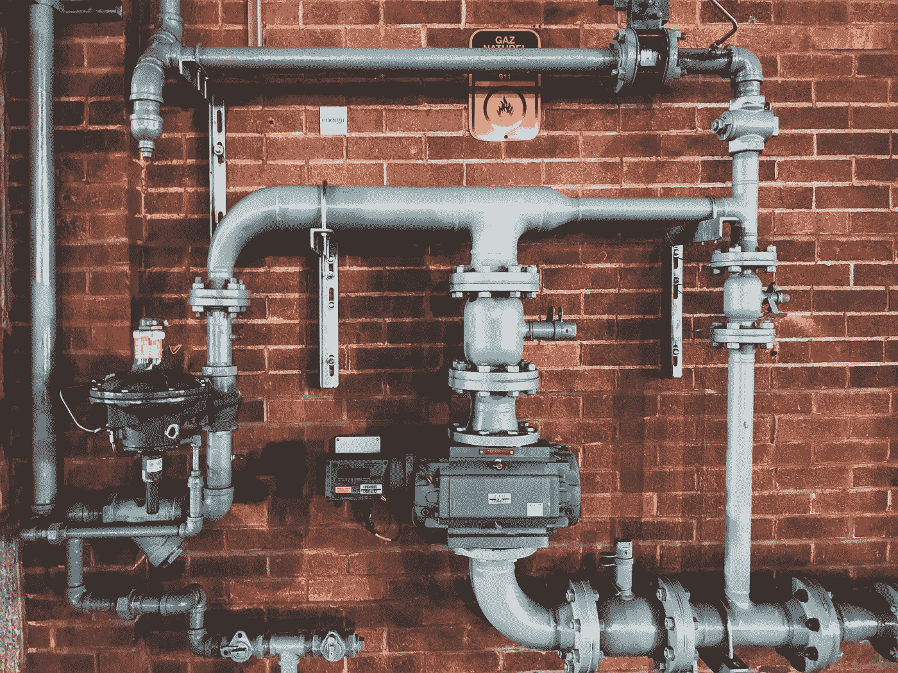
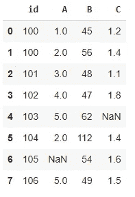
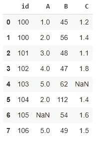
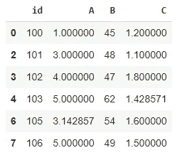

# 一种更好的数据预处理方式:熊猫管道

> 原文：<https://towardsdatascience.com/a-better-way-for-data-preprocessing-pandas-pipe-a08336a012bc?source=collection_archive---------3----------------------->

## 高效、有条理、优雅。



照片由[西格蒙德](https://unsplash.com/@sigmund?utm_source=unsplash&utm_medium=referral&utm_content=creditCopyText)在 [Unsplash](https://unsplash.com/s/photos/pipe?utm_source=unsplash&utm_medium=referral&utm_content=creditCopyText) 上拍摄

现实生活中的数据通常是混乱的。它需要大量的预处理才能使用。Pandas 是使用最广泛的数据分析和操作库之一，它提供了几个函数来预处理原始数据。

在本文中，我们将关注一个特殊的函数，它将多个预处理操作组织成一个单独的操作:管道函数。

当谈到软件工具和软件包时，我通过例子学习得最好。我在创作内容时会牢记这一点。在这篇文章中，我也将这样做。

让我们从用模拟数据创建一个数据框架开始。

```
import numpy as np
import pandas as pddf = pd.DataFrame({
   "id": [100, 100, 101, 102, 103, 104, 105, 106],
   "A": [1, 2, 3, 4, 5, 2, np.nan, 5],
   "B": [45, 56, 48, 47, 62, 112, 54, 49],
   "C": [1.2, 1.4, 1.1, 1.8, np.nan, 1.4, 1.6, 1.5]
})df
```



(图片由作者提供)

我们的数据框包含一些由标准缺失值表示法(即 NaN)表示的缺失值。id 列包含重复值。最后但同样重要的是，B 列中的 112 似乎是一个异常值。

这些是现实生活数据中的一些典型问题。我们将创建一个管道来处理我们刚刚描述的问题。

对于每个任务，我们都需要一个函数。因此，第一步是创建将放置在管道中的函数。

需要注意的是，管道中使用的函数需要将数据帧作为参数并返回数据帧。

第一个函数处理丢失的值。

```
def fill_missing_values(df):
   for col in df.select_dtypes(include= ["int","float"]).columns:
      val = df[col].mean()
      df[col].fillna(val, inplace=True)
   return df
```

我更喜欢用列的平均值替换数字列中缺失的值。可以随意定制这个功能。只要它以一个数据帧作为参数并返回一个数据帧，它就会在管道中工作。

第二个函数将帮助我们删除重复的值。

```
def drop_duplicates(df, column_name):
   df = df.drop_duplicates(subset=column_name)
   return df
```

我从熊猫内置的 drop duplicates 功能中得到了一些帮助。它消除给定的一列或多列中的重复值。除了数据框之外，该函数还将列名作为参数。我们也可以将额外的参数传递给管道。

管道中的最后一个函数将用于消除异常值。

```
def remove_outliers(df, column_list):
   for col in column_list:
      avg = df[col].mean()
      std = df[col].std()
      low = avg - 2 * std
      high = avg + 2 * std
      df = df[df[col].between(low, high, inclusive=True)]
   return df
```

该函数的作用如下:

1.  它需要一个数据框和一列列表
2.  对于列表中的每一列，它计算平均值和标准偏差
3.  它使用平均值和标准偏差计算下限和上限
4.  它删除由下限和上限定义的范围之外的值

就像前面的函数一样，您可以选择自己的方式来检测异常值。

我们现在有 3 个函数来处理数据预处理任务。下一步是用这些函数创建一个管道。

```
df_processed = (df.
                pipe(fill_missing_values).
                pipe(drop_duplicates, "id").
                pipe(remove_outliers, ["A","B"]))
```

这个管道按照给定的顺序执行函数。我们可以将参数和函数名一起传递给管道。

这里要提到一点，管道中的一些函数修改了原始数据帧。因此，如上所述使用管道也将更新 df。

克服这个问题的一个选择是在管道中使用原始数据帧的副本。如果您不关心保持原始数据框不变，您可以在管道中使用它。

我将更新管道如下:

```
my_df = df.copy()df_processed = (my_df.
                pipe(fill_missing_values).
                pipe(drop_duplicates, "id").
                pipe(remove_outliers, ["A","B"]))
```

让我们来看看原始数据帧和经过处理的数据帧:



df(作者图片)



df_processed(图片由作者提供)

## 结论

当然，您可以通过分别应用这些函数来完成相同的任务。但是，管道功能提供了一种结构化和有组织的方式，可以将多个功能合并到一个操作中。

根据原始数据和任务，预处理可能包括更多步骤。您可以根据需要在管道函数中添加任意数量的步骤。随着步骤数量的增加，与单独执行函数相比，管道函数的语法变得更加清晰。

感谢您的阅读。如果您有任何反馈，请告诉我。