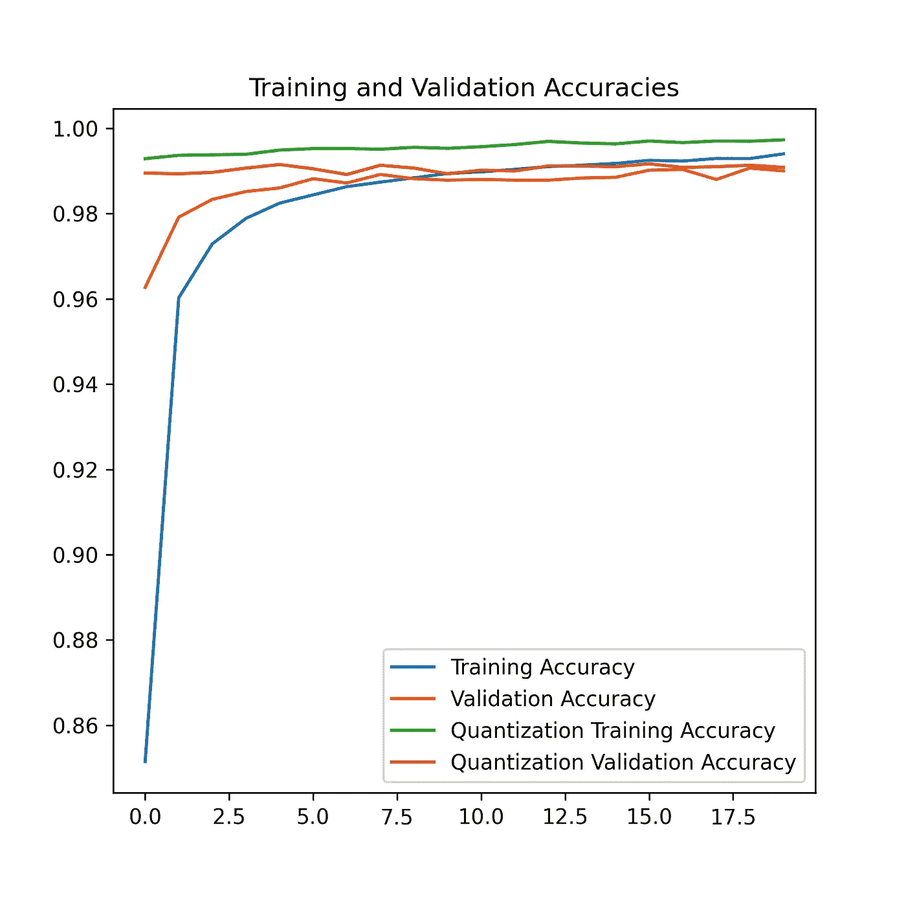

# 创建 TfLite 模型的更好方法？

> 原文：<https://towardsdatascience.com/a-better-way-of-creating-tflite-models-fc193eb5d58a?source=collection_archive---------20----------------------->

## 使用 TensorFlow 的模型优化工具包的量化感知训练来创建四倍小的模型，而不会影响结果。


久尼尔·费雷拉在 [Unsplash](https://unsplash.com?utm_source=medium&utm_medium=referral) 拍摄的照片

我最近有一篇关于不同 TensorFlow 库的文章，其中一个是 TensorFlow 的模型优化工具包。

[](/unexplored-tensorflow-libraries-for-computer-vision-db515b1868e5) [## 用于计算机视觉的未开发的张量流库

### 探索诸如 TensorFlow 模型优化器、图形、联合学习、隐私等工具包，以提高您的…

towardsdatascience.com](/unexplored-tensorflow-libraries-for-computer-vision-db515b1868e5) 

模型优化工具包提供了修剪、量化和权重聚类技术，以减少模型的大小和延迟。量化可以在训练期间和之后执行，并将模型转换为使用 8 位整数而不是 32 位浮点整数。然而，量化是一个有损耗的过程。TfLite 模型也是量化的，因此它们不如原始模型精确。为了解决这个问题，可以使用量化感知训练。它在训练时将权重转换为 int-8，然后再转换回 32 位浮点，因此它就像模型的噪声一样，迫使它们相应地学习。

所以在本文的其余部分，这就是我们将要做的。我们将在量化和不量化后生成 TfLite 模型，然后根据它们的大小和精度进行比较。

# 目录

*   要求
*   创建量化感知模型
*   将它们转换成 TfLite
*   结果

# 要求

TensorFlow 模型优化工具包需要与正常的 TensorFlow 分布一起安装。可以使用以下语句进行 pip 安装:

```
pip install tensorflow
pip install -q tensorflow-model-optimization
```

# 创建量化感知模型

为了使用量化感知训练，模型需要被包装在`tfmot.quantization`类中。可以包裹整个模型，也可以根据需要包裹某些层。建议首先训练模型，然后使用包装模型进行微调；否则，模型的性能不会很好。我将在本文中讨论必要的最低要求部分，但是[这篇](https://www.tensorflow.org/model_optimization/guide/quantization/training_comprehensive_guide)文章可以作为详细通读的参考。

使用 Keras TensorFlow 和任何顺序或模型方法创建简单模型。下面，我给出了一个使用模型方法为 MNIST 数据集创建的简单模型的示例，并对其进行了 20 个时期的训练。

```
inp = tf.keras.layers.Input(shape=(28, 28, 1))
x = tf.keras.layers.Conv2D(64, kernel_size = (3, 3), padding = 'same', activation='relu')(inp)
x = tf.keras.layers.Conv2D(32, kernel_size = (3, 3), padding = 'same', activation='relu')(x)
x = tf.keras.layers.Dropout(0.5)(x)
x = tf.keras.layers.Conv2D(16, kernel_size = (3, 3), padding = 'same', activation='relu')(x)
x = tf.keras.layers.Dropout(0.25)(x)
x = tf.keras.layers.Flatten()(x)
x = tf.keras.layers.Dense(10)(x)model = tf.keras.models.Model(inputs=inp, outputs=x)model.compile(optimizer='adam', loss=tf.keras.losses.SparseCategoricalCrossentropy(from_logits=True, metrics=['accuracy'])model.fit(train_images, train_labels, epochs=20, validation_split=0.1, batch_size=500)
```

要将此模型转换为使用量化感知训练:

```
import tensorflow_model_optimization as tfmot
quantize_model = tfmot.quantization.keras.quantize_model
q_aware_model = quantize_model(model)q_aware_model.compile(optimizer='adam', loss=tf.keras.losses.SparseCategoricalCrossentropy(from_logits=True, metrics=['accuracy'])q_aware_model.fit(train_images_subset, train_labels_subset, batch_size=500, epochs=20, validation_split=0.1)
```

以下是他们的历史:



此外，在测试集上比较它们的准确性，这是结果看起来像什么。

```
Without Quantization: 98.930%
With Quantization: 99.000%
```

量化后我们得到了性能的提高！尽管情况并不总是如此，但需要注意的重要一点是，我们并没有受到性能下降的影响。然而，这种技术有一个问题。许多层不被支持，包括一些甚至一些基本的，如批量规范化，添加，连接，全局平均池等。不是转换整个模型，只有一些层可以量化，这也意味着您可以跳过量化那些降低精度最多的层。

在 TensorFlow 的文章中还建议，最好尝试量化后面的层而不是第一层，并避免量化像注意力机制这样的关键层。让我们看看，如果我们只想做密集层，我们会如何处理代码。(下面的代码部分直接从这篇 TensorFlow [文章](https://blog.tensorflow.org/2020/04/quantization-aware-training-with-tensorflow-model-optimization-toolkit.html)中复制而来)

```
import tensorflow_model_optimization as tfmot
quantize_annotate_layer = tfmot.quantization.keras.quantize_annotate_layer

model = tf.keras.Sequential([
   ...
   # Only annotated layers will be quantized.
   quantize_annotate_layer(Conv2D()),
   quantize_annotate_layer(ReLU()),
   Dense(),
   ...
])

# Quantize the model.
quantized_model = tfmot.quantization.keras.quantize_apply(model)
```

对于本文，将使用完全量化的模型。

# 转换为 TFLite

要将模型转换为 TFLite，需要创建一个 TFLite 转换器来传递模型。需要为量化模型设置优化，以告知 TFLite 转换器使用 int8 而不是浮点值。

```
converter = tf.lite.TFLiteConverter.from_keras_model(q_aware_model)
converter.optimizations = [tf.lite.Optimize.DEFAULT]
quantized_tflite_model = converter.convert()converter = tf.lite.TFLiteConverter.from_keras_model(model)
baseline_tflite_model = converter.convert()
```

通过保存这些模型，比较它们的大小，量化的模型比它的浮动对应物小四倍。如果优化也应用于浮点模型，其大小与量化感知训练模型相当。尽管如此，它还是会在浮存模型的结果上遭受进一步的损失。

```
Quant TFLite test_accuracy: 0.9901 
Baseline TFLite test_accuracy: 0.9886 
Quant TF test accuracy: 0.9900000095367432
```

# 结论

TfLite 模型对于边缘应用非常有用，如果您打算从头开始训练一个模型，并希望将其转换为 TfLite 模型，那么量化感知训练是一个不错的选择。它不仅解决了精度比基本模型低得多的问题，而且模型也更小。