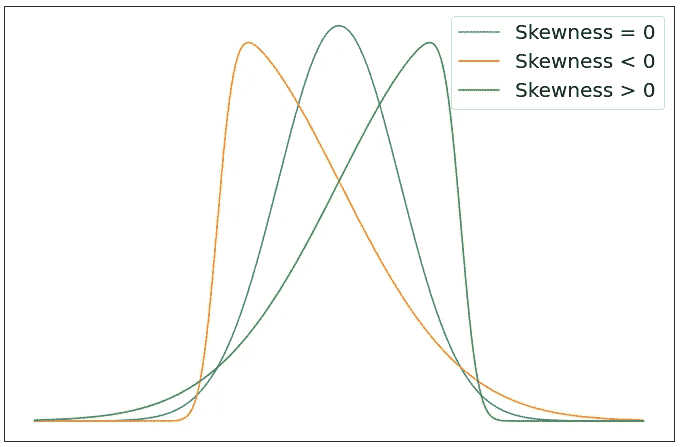
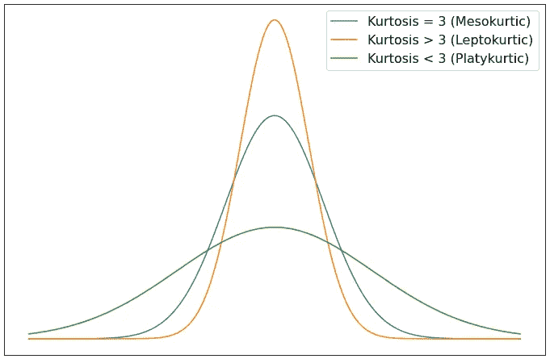
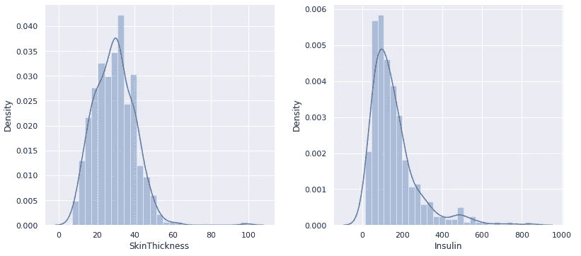
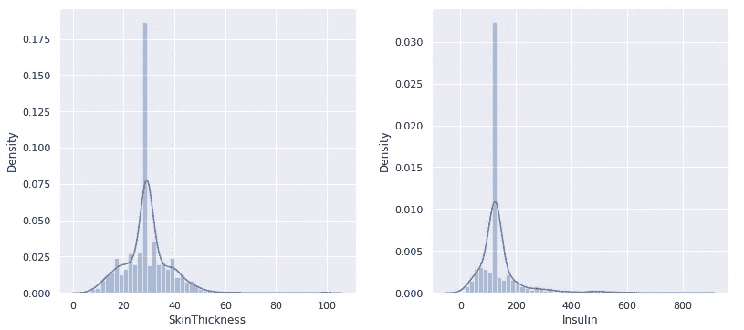
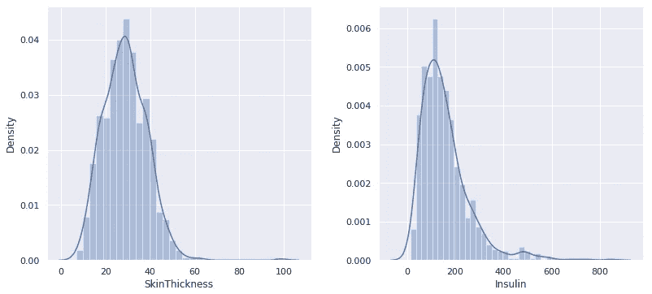

# 处理数据集中缺失值的更好方法:使用迭代估算器(第一部分)

> 原文：<https://towardsdatascience.com/a-better-way-to-handle-missing-values-in-your-dataset-using-iterativeimputer-9e6e84857d98?source=collection_archive---------8----------------------->

## [动手教程](https://towardsdatascience.com/tagged/hands-on-tutorials) / [数据清理](https://towardsdatascience.com/tagged/data-cleaning)

## 如何使用多元估算器处理缺失数据


照片由 [R.D. Smith](https://unsplash.com/@rd421) 在 [Unsplash](https://unsplash.com/photos/gqzeSQu056g) 上拍摄

# 目录

1.  [**简介**](#4b7a)
2.  [**推理有遗漏**](#e606)
3.  [**它是如何工作的？**](#fa9b)
    - [单变量插补](#34be)
    - [多变量插补](#8303)
4.  [**迭代插补**](#f326)
    - [如何成为“天选之人”](#05b9)
    - [迭代背后的过程](#1baf)
5.  [**入门**](#77d6)- [单一插补方法的问题](#5d0d)
6.  [**单一插补与迭代插补如何影响数据集的分布**](#3be8)
7.  [**结论**](#1211)
    - [参考文献](#a775)-
    -[结束语](#5ec9)

# 介绍

在制定有利可图的商业决策、解决健康问题、更好地了解人群等方面，缺失数据是一个主要问题。丢失数据不仅对人类来说是个问题，对我们接收数据集的机器来说也是个大问题。

这里有一个假设的情况:想象你的老板递给你一本书，每隔几页就少了几页。现在想象一下，你必须阅读这本书，对每一章进行分析，并对整本书进行最终分析，否则你会被解雇。现在，这可能对你们中的一些人来说并不奇怪，因为你们中的一些人可能有老板实际上让你做类似的事情，但是你会如何处理这种情况呢？没有问任何问题，你接受了任务并继续。我知道，现在你在想，“我会在网上搜索这本书，”你做到了。你到处寻找，却发现这本书除了在你身旁的书桌上，其他地方都不存在。

你只剩下一个选择，所以，你开始阅读。当你在书的中间看到一页破损的时候，你看到了第一页丢失的内容。这本书从第 14 页跳到第 17 页。你耸耸肩，继续看这本书，同时对第 15-16 页可能发生的事情做出*假设*。你继续读这本书，你会遇到更多的缺页，除了现在，这本书从 38 页跳到 45 页。当你开始阅读第 45 页时，你简直不敢相信自己的眼睛。这个故事不再有意义了…

你最终到达了这本书的结尾，你发现结尾并不是*实际上是*结尾。没错，最后还少了几页。“读完”这本书后，你回头看看你对每一章所做的分析，试图为这本书做出你自己的结论。

你的数据集就像你给你的机器学习模型读的一个故事，每一行就像一个章节。如果数据集有缺失值，您的模型将无法完全理解正在发生的情况，并可能做出错误的预测。

# 有遗漏的推理

有几种处理缺失数据的方法，包括但不限于:忽略缺失数据，根据行/列中*缺失*的质量移除行/列**，用单个数字(0、1、任何其他数字、平均值、中值)替换，分组替换等。**

更好地理解数据缺失的原因有助于您确定可以使用哪种插补方法。一般来说，有三种类型的缺失数据 <#a775> :

*   **完全随机缺失(MCAR):** 数据集中的值完全随机缺失。这是因为没有明确的理由来解释为什么数据集中的某个值会丢失。例如，如果被调查者忘记回答自愿调查中的问题。处理这种情况相对简单，我们可以用均值/中值替换来替换丢失的数据——丢失的数据是可恢复的。
*   **随机缺失(MAR):** 数据集中的值随机缺失。此时，我们可以确定数据值丢失的原因。这种情况的一个例子是，对于相同性别的多个被调查者，调查中的某个问题是空白的。我们可以处理这种情况的一种方法是通过使用其他特征进行分组均值/中值替换的*——丢失的数据仍然是可恢复的。*
*   **非随机缺失(MNAR):** 数据集中的值不是随机缺失的。这时我们可以清楚地看到缺失值的模式。一个例子是，如果调查中的某个问题类别由于问题本身而被调查者留空，因为它可能是被调查者的敏感问题(缺失取决于缺失的数据)——缺失的数据将很难恢复，除非进行进一步的研究。与其他两类缺失数据不同，MNAR 是 [*不可忽略的*](https://stefvanbuuren.name/fimd/sec-nonignorable.html) 。

# 它是如何工作的？

在我开始有趣的事情之前，我必须做更多的解释，所以喝杯咖啡或做一勺运动前饮料(或两杯😏)或者任何你感兴趣的事情，因为是时候集中注意力了。

从[Giphy.com](https://giphy.com/gifs/colbertlateshow-l3vRnDqWdyY2wFJ7y)获得的[史蒂芬·科拜尔晚间秀](https://www.cbs.com/shows/the-late-show-with-stephen-colbert/)的 GIF，由 [DJ 哈立德](https://en.wikipedia.org/wiki/DJ_Khaled)强有力地说服你保持专注。

让我们从基础开始。

缺失的数据会导致研究或实验出现偏差，会使数据分析更加可怕，会降低假设检验和结果的质量。做更多的研究来减少你的数据偏差总比只是说“随便”然后继续你的分析要好。在我看来，这违背了你最初开始实验的目的。最终，不仅你的结果质量不好，你甚至可能会误导他人。这就是为什么我们今天看到很多“神话”的原因。创建一个“点击诱饵”标题是一回事，但创建一个点击诱饵标题和散布神话是完全不同的水平。

现在让我们说你不能再做任何研究了，因为这超出了你的能力范围。对于数据集中丢失的数据，您能做些什么？您可以删除一些可能导致偏见的数据，但是如果您没有太多的数据可以处理，因此您没有能力删除数据，该怎么办呢？这时，您可以找到其他方法并研究输入值来替换丢失的数据。

什么是*插补*？根据[维基百科](https://en.wikipedia.org/wiki/Imputation_(statistics)#:~:text=In%20statistics%2C%20imputation%20is%20the%20process%20of%20replacing%20missing%20data%20with%20substituted%20values.)的定义，

> 在统计学中，插补是用替代值替换缺失数据的过程。

如前所述，我们可以使用几种不同的方法替换(估算)缺失值。这些方法归结为两种不同的插补算法:单变量插补和多变量插补 <#a775> 。

## 单变量插补

单一插补方法被称为单变量插补。如 scikit-learn 的[文档](https://scikit-learn.org/stable/modules/impute.html#:~:text=entry%20on%20imputation.-,6.4.1.%20Univariate%20vs.%20Multivariate%20Imputation,-%C2%B6)所述:

> 一种类型的插补算法是单变量算法，其仅使用第 I 个特征维度中的非缺失值来插补该特征维度中的值。

这意味着单变量插补方法仅使用所选特征(由您选择)中的非缺失值，并使用您提供的常数或所选特征的统计测量值(平均值/中值/众数)来插补同一特征中的缺失值。

例如，在 Python 中，一个简单的一行程序就能解决问题:

```
>>> data['chosenFeature'].fillna(data['chosenFeature'].mean(), inplace = True)"""
Where `data` is your dataset and `chosenFeature` is the column that you choose to replace the missing NaN values for by using the current mean of the non-missing values in the column.
"""
```

还可以使用 scikit-learn 的 SimpleImputer 类来估算缺失值。要了解有关该课程的更多信息，[请点击此处](https://scikit-learn.org/stable/modules/generated/sklearn.impute.SimpleImputer.html)。

## 多元插补

在数据为 MCAR、马尔和[的情况下，即使数据为 MNAR](https://en.wikipedia.org/wiki/Imputation_(statistics)#:~:text=Multiple%20imputation%20can%20be%20used%20in%20cases%20where%20the%20data%20are%20missing%20completely%20at%20random%2C%20missing%20at%20random%2C%20and%20even%20when%20the%20data%20are%20missing%20not%20at%20random.) ，也可以使用多重插补。多重插补方法被称为多元插补。

> 多元插补算法使用整套可用的特征维度来估计缺失值。

基本上，多变量插补的目的是使用数据集中的其他特征(列)来预测当前特征中缺失的值。

您可能会想“Gifari，您告诉我多重插补算法使用其他列，但是如果我们有多个缺失值的特征(列)，算法如何知道首先选择哪个特征来插补值？”别急，比利(无意冒犯所有在场的比利)，这是一个非常好的问题，我会在下一章讨论这个问题，我会谈到你如何成为被选中的那个人。

正如你可能已经猜到的，单一插补方法没有考虑*不确定性*。单一的插补方法不关心“如果怎样”；它只有一个目标:消除缺失的价值观。当我们使用多重插补方法时，我们不仅要剔除缺失值，还要考虑“如果”。

虽然多重插补的方法听起来很难实现，但这是 21ˢᵗ世纪，我们的生活是有史以来技术最先进的时代。如果你是从 22ⁿᵈ读到这篇文章的，希望 Medium 那时已经开始支持字母上标和下标，感谢你花时间阅读这篇文章，但是我不认为你应该在这里。我很确定在你那个世纪有更先进的估算方法。

有几个统计软件包可以让你轻松地进行多重插补。例如，如果你用 R 语言编程，那么你有[鼠标](https://cran.r-project.org/web/packages/mice/mice.pdf)(链式方程多元插补)或 [missForest](https://cran.r-project.org/web/packages/missForest/missForest.pdf) 软件包可供你使用。如果你用 Python 编程，你有 scikit-learn 的[iterative imputr](https://scikit-learn.org/stable/modules/generated/sklearn.impute.IterativeImputer.html)包，它最初是受 r 中的 MICE 包的启发。

# 迭代估算器

迭代插补是一种多变量插补策略，它以[循环方式](https://scikit-learn.org/stable/modules/impute.html#:~:text=It%20does%20so%20in%20an%20iterated%20round-robin%20fashion)将缺失值(目标变量)的列作为其他特征(预测变量)的函数进行建模，并使用该估计值进行插补。源代码可以通过[点击这里](https://github.com/scikit-learn/scikit-learn/blob/844b4be24/sklearn/impute/_iterative.py)在 GitHub 上找到。

> [**注意**](https://scikit-learn.org/stable/modules/generated/sklearn.impute.IterativeImputer.html#:~:text=in%20version%200.21.-,Note,-This%20estimator%20is) **:** 这个估计器现在仍然是**实验性的**:预测和 API 可能会在没有任何折旧周期的情况下改变。要使用它，您需要显式导入`enable_iterative_imputer`:

```
**>>>** *# explicitly require this experimental feature*
**>>> from** **sklearn.experimental** **import** enable_iterative_imputer *# noqa*
**>>>** *# now you can import normally from sklearn.impute*
**>>> from** **sklearn.impute** **import** IterativeImputer
```

你可以在[迭代输入器的文档](https://scikit-learn.org/stable/modules/generated/sklearn.impute.IterativeImputer.html#:~:text=impute%20import%20IterativeImputer-,Parameters,-estimatorestimator%20object%2C%20default)中看到许多参数。它不需要参数输入，因为默认参数已经为您设置好了，这意味着，在您完成导入必要的包之后，您可以通过运行以下命令简单地引入一个迭代估算器:

```
imp = IterativeImputer()
```

## 如何成为“天选之人”

“当前特征”是根据给定的`imputation_order`选择的，默认顺序是“升序”这意味着首先选择的特征*将是包含最少缺失值的特征。在输入所选特征中的所有缺失值后，该特征不再包含缺失值，因此它不再是具有最少*缺失值的特征，因此估算器将移动到下一个具有最少缺失值的特征。**

其他订单包括:

*   “降序”:缺失值最多到最少的特征
*   “罗马”:左特征到右特征
*   “阿拉伯语”:右特征到左特征
*   “随机”:每轮随机下单

## 迭代背后的过程

既然你知道了如何成为“被选中的人”，那么让我们来理解迭代背后的过程。

迭代估算器最初用传递给`initial_strategy`的值初始化缺失值，其中初始策略是每个特征的“平均值”。然后，估算者在循环插补的每一步使用一个估算器(其中使用的默认估算器是[贝叶斯岭](https://scikit-learn.org/stable/modules/generated/sklearn.linear_model.BayesianRidge.html))。在每一步，选择一个特征列作为目标变量`y`，其他特征列作为预测变量`X`。然后为每个要素预测缺失值。这个过程最多重复“`max_iter`次，默认为 10 次(轮)。我说“最多”而不是“正好”的原因是因为`sample_posterior=False`的默认参数化启用了提前停止。

> [停止准则](https://scikit-learn.org/stable/modules/generated/sklearn.impute.IterativeImputer.html#:~:text=for%20multiple%20imputations.-,max_iter,-int%2C%20default%3D10)满足一次`max(abs(X_t-X_{t-1}))/max(abs(X[known_vals])) < tol`，其中`X_t`为迭代`t`时的`X`。

这实质上意味着对于单个缺失值，最多有`max_iter`个预测，并且一旦某个值的前一次迭代预测和当前迭代预测之间的差值小于给定的`tol`值(默认值= 1e-3)，迭代就会停止。

您可以使用其他几个参数，所以一定要在您自己的数据集上尝试它们！现在这些无聊的东西已经够多了，让我们来看看一些行动。

# 入门指南

现在您对 IterativeImputer 有了一些了解，让我向您介绍两个不同的数据集，我将用它们作为例子:

*   **皮马印第安人糖尿病数据库**:第一个例子，我将使用糖尿病数据集，点击[此处](https://www.kaggle.com/uciml/pima-indians-diabetes-database)可在 Kaggle 上找到该数据集。你也可以在 Kaggle 上查看我的笔记本，它可以和这个例子一起使用。您可以通过[点击此处](https://www.kaggle.com/gifarihoque/pidd-missing-data-ml-iterimputer-tut-86)查看/编辑笔记本。

> 笔记本更关注不同的估算方法，以及我所说的估算缺失值的“混合方法”。最后，比较了不同插补方法得到的不同数据集上多模型训练的准确率。这是一个冗长的笔记本，但我对这个项目非常感兴趣。它是作为机器学习和迭代输入教程而创建的。

*   **股票市场数据**:对于第二个例子，我将对股票市场数据使用迭代估算。不幸的是，由于信息量太大，这个例子必须有自己的文章。我还不想破坏这个，因为我发现这个*非常有趣。写完这篇文章后，我还在 Kaggle 上为这个例子做了一个笔记本，它使用函数来简化这个过程，我将在第二篇文章中介绍这个过程。你可以通过[点击这里](https://www.kaggle.com/gifarihoque/predict-missing-stock-prices-with-iterativeimputer)来玩笔记本。*

[点击这里](https://gifari.medium.com/a-better-way-to-handle-missing-values-in-your-dataset-using-iterativeimputer-on-the-stock-market-dbbb5d4ef458)阅读第二篇文章。我真的很希望你看完这篇文章后能看看！

## 单一插补方法的问题

当我说我不再做那些无聊的事情时，我撒谎了。我有时候控制不住。在开始我的第一个例子之前，先玩一会儿怎么样？

当您将单个数字归入某个要素中的缺失值时，根据您的数据在特定要素中缺失的数量，您会增加导致您的数据具有更多*峰度*的可能性。峰度是对分布“尾部”的度量。像偏度一样，峰度是另一种用于描述数据分布形状的度量。为了简单起见，当一个人想到分布有多“对称”时，他们通常会想到数据的偏斜度。当人们想到分布有多“弯曲”或“尖锐”时，他们通常会想到数据的峰度。这是一个我编码的分布的偏斜度/峰度差异的可视化例子(奇怪的伸缩，但还可以):



**(左)**“偏度例子”(图片作者)| **(右)**“峰度例子”(图片作者)

任何一元正态分布的峰度都是三(不使用[费雪](https://docs.scipy.org/doc/scipy/reference/generated/scipy.stats.kurtosis.html#:~:text=If%20Fisher%E2%80%99s%20definition%20is%20used,%20then%203.0%20is%20subtracted%20from%20the%20result%20to%20give%200.0%20for%20a%20normal%20distribution.)定义) <#a775> 时)。
要了解更多关于偏度和峰度的知识，[点击这里](https://www.itl.nist.gov/div898/handbook/eda/section3/eda35b.htm)。

现在你已经准备好去参加派对了。

# 单一插补与迭代插补如何影响数据集的分布

对于我的第一个例子，我将使用皮马印第安人糖尿病数据库，它可以在 [Kaggle](https://www.kaggle.com/uciml/pima-indians-diabetes-database) 上免费找到。该数据集在整个数据集中包含几个缺失值(被零屏蔽)。我更新的数据集用 nan 替换了零。特别是，我将只处理最缺少值的两个特征:“皮肤厚度”和“胰岛素”。更具体地说，在该数据集中的 768 行中，“皮肤厚度”有 227 个缺失值，“胰岛素”有 374 个缺失值。是不是很疯狂？

> **注意** :
> 对于这个例子，你不需要知道这两个特性的重要性。
> 
> 我在 Kaggle 上创建了一个笔记本，可以和这篇文章一起使用。这本笔记本深入探讨了不同的估算方法，包括我喜欢称之为“混合方法”的方法。笔记本是作为机器学习和迭代输入教程创建的，您可以通过[点击此处](https://www.kaggle.com/gifarihoque/pidd-missing-data-ml-iterimputer-tut-86)查看/编辑笔记本。

现在让我们来看看这两个特性的分布情况:



图片由作者提供|该分布图使用了 541 个“皮肤厚度”值和 394 个“胰岛素”值。这个图是通过使用 Seaborn 的 distplot()函数获得的。

这两种分布的偏斜度和峰度如下:

*   “皮肤厚度”的偏斜度:0.690619
*   “胰岛素”的偏斜度:2.166464
*   “皮肤厚度”的峰度:2.935491
*   “胰岛素”的峰度:6.370522

现在让我们看看在对缺失值进行均值插补后，我们的分布图、偏度和峰度是如何变化的。甚至不用思考，我们就可以想象我们的两个特征的分布图有更多的峰度，因为我们为“皮肤厚度”输入了一个单一的值 227 次，为“胰岛素”输入了一个不同的值 374 次(当我们只有 768 行要处理时)。

> 注:“皮肤厚度”的平均值为 29.153420，“胰岛素”的平均值为 155.548223。
> 这是我们用 NaNs 做的数据集。



图片由作者提供|这是均值插补后的分布图，对“皮肤厚度”和“胰岛素”使用了 768 个值。

这两种分布的偏斜度和峰度如下:

*   “皮肤厚度”的偏斜度:0.837608
*   “胰岛素”的偏斜度:3.380019
*   “皮肤厚度”的峰度:5.430987
*   “胰岛素”的峰度:16.232455

毫不奇怪，我们看到 S̶O̶M̶E̶的峰度急剧上升，尤其是对“胰岛素”而言。

现在让我们使用 IterativeImputer 来估算包含 nan 的数据集中这两个要素的缺失值。我将使用`RandomForestRegressor()`作为迭代输入的估算器。

```
# Introduce IterativeImputer with an estimator
>>> imp = IterativeImputer(estimator=RandomForestRegressor())# Fit to the dataset containing missing values
>>> imp.fit(ndf)# Transform the dataset containing missing values
>>> df = pd.DataFrame(imp.transform(ndf), columns = ndf.columns)"""
Where `ndf` is the dataset containing missing values
"""
```

现在让我们看看插补后两个特征的分布。



图片由作者提供|这是使用 RandomForestRegressor()作为估计量迭代输入缺失值后两个特征的 768 个值的分布图。

这两种分布的偏斜度和峰度如下:

*   “皮肤厚度”的偏斜度:0.679155
*   “胰岛素”的偏斜度:2.052863
*   “皮肤厚度”的峰度:3.039844
*   “胰岛素”的峰度:6.778861

我们可以看到，这两个特征的峰度并不像我们将这两个特征的平均值估算到它们相应的缺失值时那样疯狂。不仅如此，我们可以看到两个特征的偏度和峰度水平与包含 nan 的数据集的水平相对相似。

# 结论

一般来说，多变量方法比单变量方法更受欢迎，但我个人认为这取决于您自己的需求和您项目的目标。在这篇文章中，我们使用 PIMA 印第安人糖尿病数据库看到了均值插补和迭代插补之间的差异。在第二篇文章中，您将能够看到如何通过使用股票市场数据来使用 IterativeImputer 的另一种方法。

我真的希望阅读这篇文章是值得的。这是我在 Medium 上写的第一篇文章，但就我看来，这不会是我的最后一篇。我**高度**鼓励你点击下面的[链接来看看这篇文章的第二部分。我希望你能使用 IterativeImputer，并且我希望你能发现我的两个例子中至少有一个是有用的。](https://gifari.medium.com/a-better-way-to-handle-missing-values-in-your-dataset-using-iterativeimputer-on-the-stock-market-dbbb5d4ef458)

<https://gifari.medium.com/a-better-way-to-handle-missing-values-in-your-dataset-using-iterativeimputer-on-the-stock-market-dbbb5d4ef458>  

请随意查看我写在 Kaggle 上的笔记本，在那里我可以更深入地了解 PIMA Indians 糖尿病数据库上的 IterativeImputer。

<https://www.kaggle.com/gifarihoque/pidd-missing-data-ml-iterimputer-tut-86/comments>  

## 参考

[1]:维基百科。[缺失数据](https://en.wikipedia.org/wiki/Missing_data#:~:text=Software-,Types,-%5Bedit%5D) ( [点击返回](#26ab))

[2]: Scikit-learn。[缺失值插补](https://scikit-learn.org/stable/modules/impute.html) ( [点击返回](#af59))

[3]:维基百科。[峰度](https://en.wikipedia.org/wiki/Kurtosis#:~:text=The%20kurtosis%20of%20any%20univariate%20normal%20distribution%20is%C2%A03) ( [点击返回](#490d))

## 最后的话

如果你注意到我的文章中有任何错误，请留下评论并联系我，这样我可以尽快修复它！我不想误导任何人，也不想教任何人错误的东西。对我来说，任何批评都是积极的批评，这是我学习的最好方法之一。我也总是乐于接受提示和建议。

*如果你喜欢阅读这篇文章，请关注我的* [***中型***](https://gifari.medium.com/) *和*[***Kaggle***](https://www.kaggle.com/gifarihoque)*我会不时在这里发布更多内容。还有，随时和我联系*[***LinkedIn***](https://www.linkedin.com/in/gifari/)*。如果你认为我的工作应该得到一杯咖啡，请给我买一杯* *！任何支持都帮助我坚持下去。*

一如既往，再次感谢你的来访。