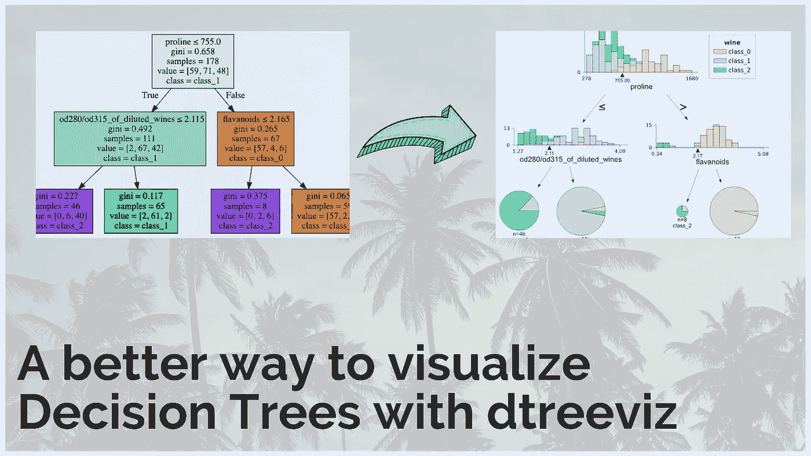
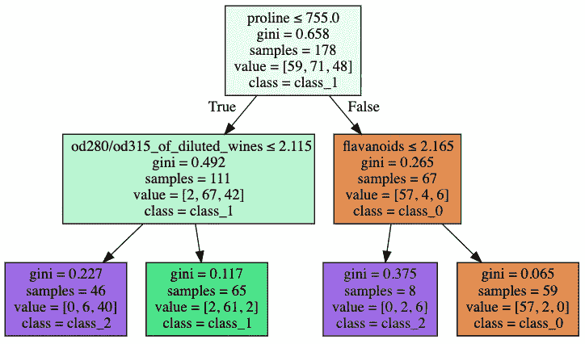
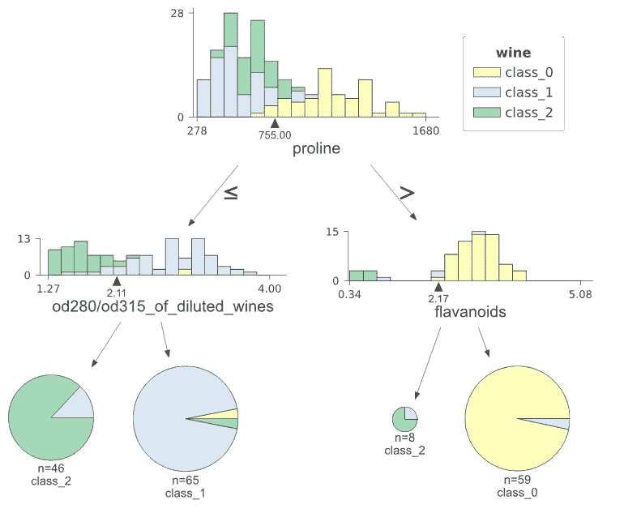
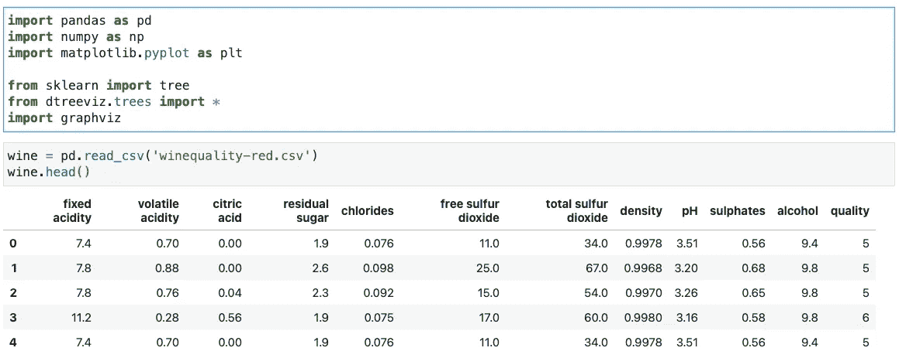
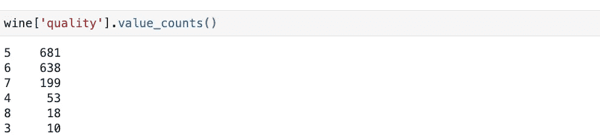
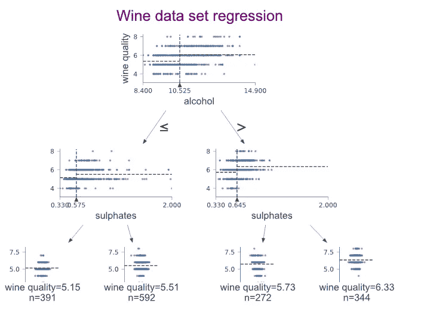
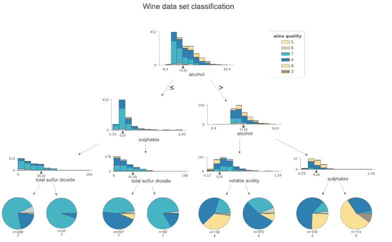
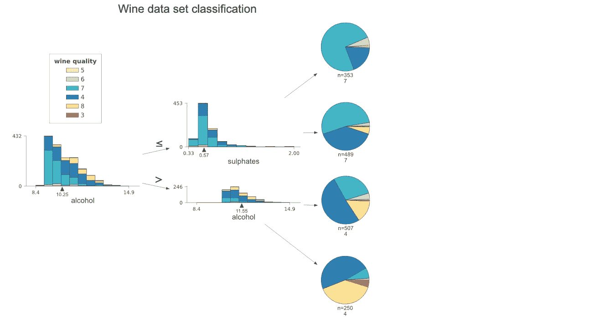
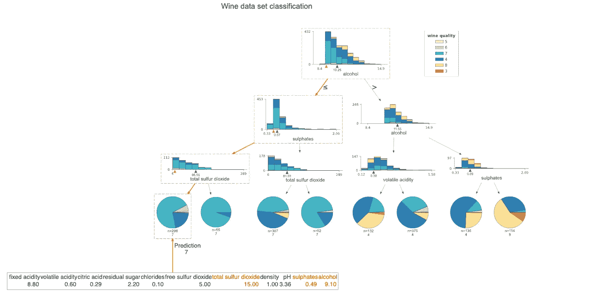

# 用 dtreeviz 库可视化决策树的更好方法

> 原文：<https://towardsdatascience.com/a-better-way-to-visualize-decision-trees-with-the-dtreeviz-library-758994cdf05e?source=collection_archive---------6----------------------->

## [实践教程](https://towardsdatascience.com/tagged/hands-on-tutorials)

## 一个用于决策树可视化和模型解释的开源包



作者图片

一幅画胜过千言万语，这是正确的说法。这个公理同样适用于机器学习模型。如果一个人能够可视化和解释结果，它会给模型的预测注入更多的信心。可视化机器学习模型如何工作也使得向具有较少或没有机器学习技能的人解释结果成为可能。Scikit-learn 库天生具有绘制决策树的能力。但是，与默认选项有一些不一致。本文将着眼于一种叫做 [dtreeviz](https://github.com/parrt/dtreeviz) 的替代方案，它可以呈现更好看、更直观的可视化效果，同时提供更好的可解释性选项。

# 用于可视化基于树的模型的 dtreeviz 库

**dtreeviz** 是一个用于决策树可视化和模型解释的 python 库。根据其 [Github repo](https://github.com/parrt/dtreeviz) 上的可用信息，该库目前支持 [scikit-learn](https://scikit-learn.org/stable) 、 [XGBoost](https://xgboost.readthedocs.io/en/latest) 、 [Spark MLlib](https://spark.apache.org/mllib/) 和 [LightGBM](https://lightgbm.readthedocs.io/en/latest/) 树。

下面是在著名的[葡萄酒质量数据集](https://www.kaggle.com/uciml/red-wine-quality-cortez-et-al-2009)上，从默认 scikit-learn 和从 dtreeviz 生成的可视化的视觉比较。该数据集包括 178 个实例和 13 个数字预测属性。每个数据点可以属于名为 class_0、class_1 和 class_2 的三个类之一。



在著名的[葡萄酒质量数据集](https://www.kaggle.com/uciml/red-wine-quality-cortez-et-al-2009) |作者提供的图片上，对默认 scikit-learn(左)和 dtreeviz(右)生成的可视化效果进行视觉比较

从上面的图片可以明显看出，右边的图比左边的图提供了更多的信息。默认的 scikit 学习可视化存在一些明显的问题，例如:

*   目前还不清楚不同的颜色代表什么。
*   目标类没有图例。
*   可视化返回样本的计数，并且不容易可视化分布。
*   无论样本数量多少，每个决策节点的大小都是相同的。

dtreeviz 库填补了这些漏洞，提供了一个更清晰、更容易理解的画面。以下是作者要说的话:

> 可视化效果的灵感来自 [R2D3](http://www.r2d3.us/) 的教育动画；[机器学习的可视化介绍](http://www.r2d3.us/visual-intro-to-machine-learning-part-1/)。使用`dtreeviz`，您可以可视化特征空间如何在决策节点上分割，训练样本如何在叶节点上分布，树如何对特定观察进行预测等等。这些操作对于理解分类或回归决策树的工作方式至关重要。

在接下来的几节中，我们将通过一些常见的例子来看看 dtreeviz 如何优于其他可视化库。关于**安装说明，**请参考官方 [Github 页面](https://github.com/parrt/dtreeviz#install)。可以安装`pip install dtreeviz but`需要预装`graphviz`。

# dtreeviz 的卓越可视化

在可视化决策树之前，理解它是如何工作的也是很重要的。决策树是一种监督学习预测模型，它使用一组二元规则来计算目标值。它可用于回归和分类任务。决策树有三个主要部分:

*   **根节点:**执行第一次拆分的节点。
*   **终端节点/叶节点:**预测结果的节点。
*   **分支:**箭头连接节点，显示从问题到答案的流程。

决策树模型的算法通过重复地将数据划分到多个子空间中来工作，使得每个最终子空间中的结果尽可能地相似。这种方法在技术上被称为*递归分区*。该算法试图将数据分成子集，以使每个子组尽可能纯净或同质。

以上摘录摘自我写的一篇关于理解决策树的文章。本文深入解释了算法通常如何做出决策。

<https://medium.com/analytics-vidhya/a-guide-to-machine-learning-in-r-for-beginners-decision-trees-c24dfd490abb> [## 理解决策树

### 我在“分析优势”课程中关于决策树的笔记](https://medium.com/analytics-vidhya/a-guide-to-machine-learning-in-r-for-beginners-decision-trees-c24dfd490abb) 

现在让我们回到 dtreeviz 库，使用上面提到的葡萄酒数据绘制其中的几个。

## 资料组

我们将使用来自 [**葡萄酒质量数据集**](https://archive.ics.uci.edu/ml/datasets/wine+quality) **的著名红酒数据集。**数据集由与葡萄牙“Vinho Verde”葡萄酒红色变种相关的几项理化测试组成。目标是在这些测试的基础上建立葡萄酒质量模型。由于该数据集可以被视为分类和回归任务，因此它适合我们的用例。我们将不必使用单独的数据集来演示分类和回归示例。

> **这里是** [**nbviewer 链接**](https://nbviewer.jupyter.org/github/parulnith/Data-Science-Articles/blob/main/A%20better%20way%20to%20visualize%20Decision%20Trees%20with%20the%20dtreeviz%20library/A%20better%20way%20to%20visualize%20Decision%20Trees%20with%20the%20dtreeviz%20library.ipynb) **到笔记本 incase 你想跟着走。**

让我们看看数据集的前几行:



数据集一瞥|作者图片

`quality`参数是指葡萄酒的质量，是一个介于 0 和 10 之间的分数



# 形象化

轻松创建特性和目标变量。

```
features = wine.drop('quality',axis=1)
target = wine['quality']
```

## **回归决策树**

对于回归示例，我们将预测葡萄酒的`quality`。

```
# Regression tree on Wine datafig = plt.figure(figsize=(25,20))
regr= tree.DecisionTreeRegressor(max_depth=3) regr.fit(features, target)viz = dtreeviz(regr,
               features,
               target,
               target_name='wine quality',
               feature_names=features.columns,
               title="Wine data set regression",
               fontname="Arial",
               colors = {"title":"purple"},
               scale=1.5)
viz
```



回归决策树|作者图片

*   水平虚线表示决策节点中左右桶的目标平均值；
*   垂直虚线表示特征空间中的分割点。
*   黑色楔形突出显示分割点，并确定精确的分割值。
*   叶节点用虚线表示目标预测值(平均值)。

**分类决策树**

对于分类示例，我们将从给定的六个类别中预测葡萄酒的`class`。这里的目标也是质量变量。

```
# Classification tree on Wine datafig = plt.figure(figsize=(25,20))
clf = tree.DecisionTreeClassifier(max_depth=3)clf.fit(features, target)# pick random X observation for demo
#X = wine.data[np.random.randint(0, len(wine.data)),:]viz = dtreeviz(clf,
               features,
               target,
               target_name='wine quality',
               feature_names=features.columns,
               title="Wine data set classification",
               class_names=['5', '6', '7', '4', '8', '3'],
               histtype='barstacked', # default 
               scale=1.2)
viz
```



葡萄酒数据分类树|按作者分类的图片

与回归变量不同，目标是分类器的类别。因此，直方图用于说明特征-目标空间。当类别数量增加时，堆叠直方图可能难以读取。在这种情况下，`histogram type`参数可以从默认的`barstacked,`更改为`bar`。

# 自定义

dtreeviz 库还提供了一系列定制。我将在这里展示其中的一些:

## 缩放图像

缩放参数可用于缩放整个图像。

## 从左到右对齐的树

可以将`orientation`参数设置为`LR`来从左到右显示树，而不是从上到下

```
fig = plt.figure(figsize=(25,20))
clf = tree.DecisionTreeClassifier(max_depth=2)clf.fit(features, target)# pick random X observation for demoviz = dtreeviz(clf,
               features,
               target,
               target_name='wine quality',
               feature_names=features.columns,
               title="Wine data set classification",
               class_names=['5', '6', '7', '4', '8', '3'],
               **orientation='LR',** 
               scale=1.2)
viz
```



从左到右对齐的树|作者图片

## 单次观测的预测路径

该库还有助于隔离和理解特定测试观察遵循的决策路径。这对于向他人解释预测或结果非常有用。例如，让我们从数据集中挑选一个随机样本，并遍历它的决策路径。

```
fig = plt.figure(figsize=(25,20))
clf = tree.DecisionTreeClassifier(max_depth=3)clf.fit(features, target)**# pick random X observation for demo
X = features.iloc[np.random.randint(0, len(features)),:].values**viz = dtreeviz(clf,
               features,
               target,
               target_name='wine quality',
               feature_names=features.columns,
               title="Wine data set classification",
               class_names=['5', '6', '7', '4', '8', '3'],
               scale=1.3,
               X=X)
viz
```



单次观察的预测路径|作者提供的图像

## 保存图像

输出图形可以保存为 SVG 格式，如下所示:

```
viz.save_svg()
```

# 结论

在绘制决策树时，dtreeviz 库比其他库得分更高。使结果可解释的额外能力是一个极好的附加功能；您可以隔离单个数据点，并在微观层面上理解预测。这有助于更好地理解模型的预测，也便于将发现传达给其他人。我在这里所触及的只是冰山一角。Github 库和作者的附带文章更详细，我强烈推荐浏览它们。链接在下面的参考资料部分。

# 参考资料和进一步阅读:

*   [dtre eviz 的官方 Github 库。](https://github.com/parrt/dtreeviz/)
*   [如何可视化决策树](https://explained.ai/decision-tree-viz/index.html#sec:1.4)——dtre eviz 的创建者们对决策树可视化的一个很好的阅读。
*   [了解决策树](https://medium.com/analytics-vidhya/a-guide-to-machine-learning-in-r-for-beginners-decision-trees-c24dfd490abb)

*👉有兴趣看我写的其他文章。这个* [*回购*](https://github.com/parulnith/Data-Science-Articles/blob/main/README.md) *包含了我分类写的所有文章。*