# 更好的投票方式

> 原文：<https://towardsdatascience.com/a-better-way-to-vote-4e04afd3a826?source=collection_archive---------13----------------------->

## [实践教程](https://towardsdatascience.com/tagged/hands-on-tutorials)

## 从个体排序选择量化集体偏好的马尔可夫方法

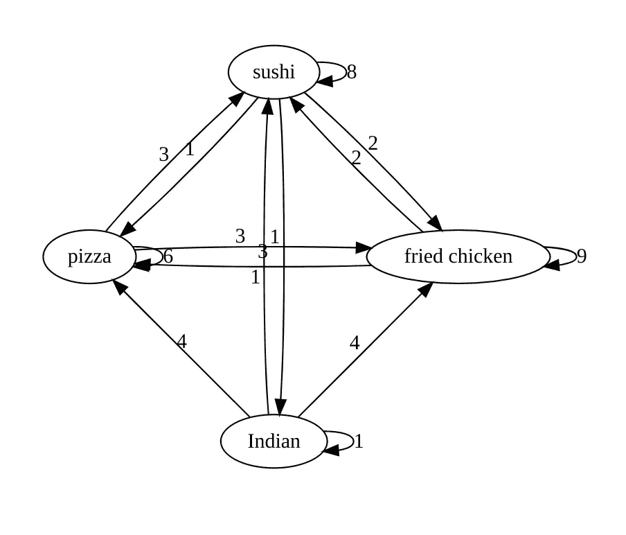

作者图片

# 晚餐吃什么？

前几天，我们一家四口不得不做出一个关键的决定:晚餐吃什么。桌上的选择有寿司、炸鸡、印度菜或比萨饼。我们本可以像以前一样:每个人都为他们的首选投票，得票最高的选项获胜。但是，我一直在思考如何更准确地模拟集体偏好，我们决定尝试一下。所以我们每个人从最喜欢到最不喜欢排列 4 个选项。以下是我们的投票方式(保持匿名以保护无辜):

```
Vote 1: sushi, fried chicken, pizza, Indian
Vote 2: sushi, fried chicken, pizza, Indian
Vote 3: friedchicken, sushi, pizza, Indian
Vote 4: pizza, fried chicken, Indian, sushi
```

典型的首选投票法会有一个明确的赢家:*寿司*。但是 4 号选民对寿司的反感难道不应该算点什么吗？我通过一个模型分析了投票结果，这个模型考虑了投票中表达的所有偏好，而不仅仅是首选。这个模式产生了一个不同的赢家:*炸鸡*。这很有意义。如果每个人的前两个选择都有所收获(就像炸鸡一样),而不是四分之一的人不得不忍受最后一个选择(寿司)的痛苦，那么这个群体整体上不是更快乐吗？

这个模型不仅仅是选出一个赢家:它还对选项进行了排序。结果是，我的家人(当时)更喜欢炸鸡，然后是寿司，接着是披萨，最后是印度菜。

该模型不仅对选项进行了排序，而且*还揭示了选项之间的相对偏好比率*:

```
fried-chicken:sushi:pizza:Indian as 44:37:16:3
```

这是炸鸡和寿司之间的一场势均力敌的比赛，前者击败了后者。披萨远远排在第三位。那天晚上，这家人没有心情吃印度菜。

我们是如何得到这些结果的？继续读下去，我会详细解释。但在此之前，先澄清一下。我希望晚餐吃什么这个不严肃的问题没有让你误以为这只是一种娱乐和游戏。事实上，这是非常严肃的事情。各级集体(家庭、公司、社区、国家)都重视成员的意见(或者至少应该重视)。通常，群体决策归结为如何在一组相互竞争的优先级之间分配有限的资源(例如权力或金钱)。这就是这个方法的闪光点。它定量地确定了一系列选择中的相对偏好，然后可以用来按照人民的意愿分配预算。

# 该方法

我将使用上面的晚餐是什么的例子来说明从个人的排序选择中确定一组选项的集体相对偏好的方法。将一个人在两种美食之间的排序选择表示为*有向图*<https://en.wikipedia.org/wiki/Graph_(discrete_mathematics>)**，其中每种美食都是一个节点(顶点)，一条边(链接/箭头)从不太喜欢的美食指向更喜欢的美食*。*

*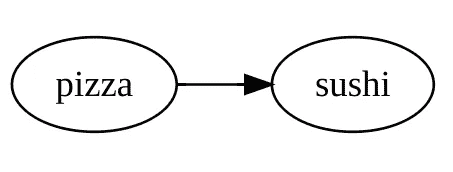*

*代表一个人对寿司比对披萨的偏好的图表(图片由作者提供)*

*对于个人来说，一种方便、简洁且一致的表达他们对不同菜系的相对偏好的方式是将这些菜系从最喜欢的到最不喜欢的排列出来。例如，投票 2(寿司、炸鸡、比萨饼、印度菜)表明寿司是那个人的首选，然后是炸鸡，接下来是比萨饼，最后是印度菜。这概括了 6 个成对比较:*

1.  *寿司比炸鸡更受欢迎*
2.  *寿司比披萨更受欢迎*
3.  *寿司比印度寿司更受欢迎*
4.  *炸鸡比比萨饼更受欢迎*
5.  *炸鸡比印度炸鸡更受欢迎*
6.  *披萨比印度披萨更受欢迎*

*用一个有 6 条有向边的图来表示投票，每条边代表一个比较。*

*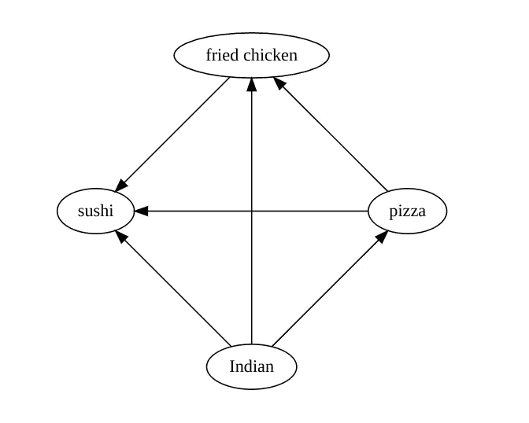*

*一张图表显示了排名递减的投票“寿司、炸鸡、比萨饼、印度菜”(图片由作者提供)*

*通过将投票图表相加来合计投票数。把图形加在一起是什么意思？这意味着求和图中的每条边都被分配了一个权重，该权重是被求和的图中有多少条边的计数。以下是示例中 4 张投票的 4 个图表的总和:*

*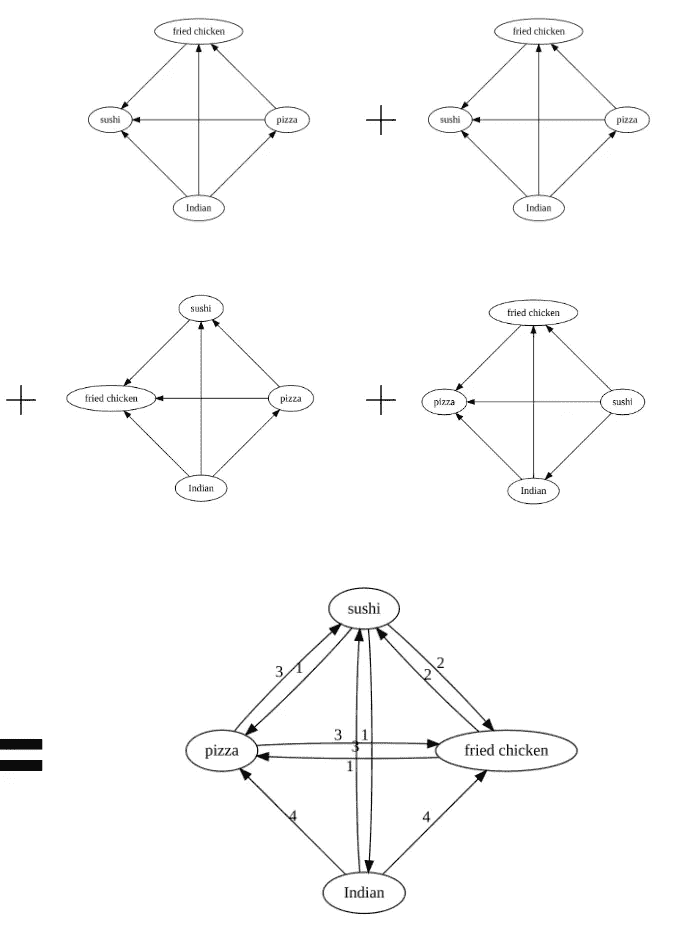*

*4 张投票汇总图(图片由作者提供)*

*在聚合投票图中，权重为 3 的从披萨到寿司的边表示在 3 次投票中寿司比披萨更受欢迎。在每次投票中，一种特定的菜肴会与其他菜肴进行比较。因此，在一次投票中，针对一种美食的成对比较的数量比美食的数量少 1，或者在本例中为 4 种美食的 3。对于总共 4 次投票，对一种菜肴进行成对比较的次数是 4 x 3 或 12。给定针对每种美食表达的成对偏好的总数，*通过向每个节点添加自边来转换聚合图，该自边的权重等于该美食比其他美食更受欢迎的偏好的数量*。该权重是该节点的传入边的权重之和。或者，等价地，它是节点的偏好总数(本例中为 12)与该节点的输出边的权重之和之间的差。这是带有自边的转换聚合图:*

**

*带有自边缘的聚合投票(图片由作者提供)*

*最后，将图转换为*归一化所有权重，使得来自一个节点的所有外出边的权重之和为 1* 。然后，从比萨饼到寿司的边的归一化权重表示相对于比萨饼更喜欢寿司的成对偏好的分数(以投票表示)。权重现在可以被认为是在不同的集体偏好的美食之间转换的*经验概率*。下面是该示例的标准化图表，通过将每个权重除以 12(这是在 4 次投票中一种菜肴与其他菜肴的比较总数)获得:*

*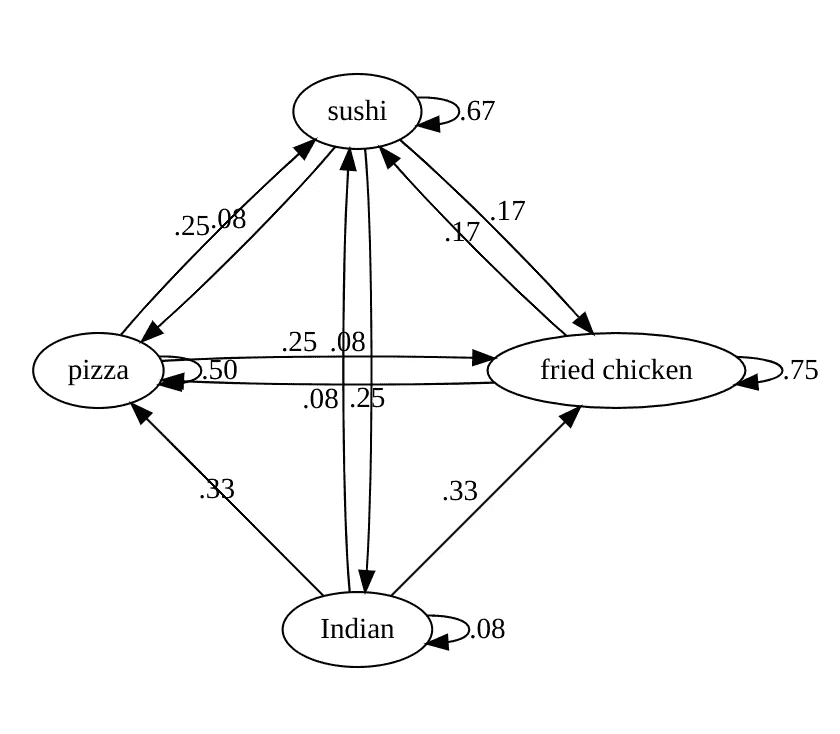*

*具有自边缘和归一化权重的聚合投票(图片由作者提供)*

*现在你已经准备好决定投票结果了。从一个特定的初始假设开始，假设这个群体对这些菜系的相对偏好。例如，所有菜系都同样受欢迎:*

```
*fried-chicken:sushi:pizza:Indian as 1:1:1:1*
```

*在一次迭代后，将概率转移(编码在转换的聚合投票图中)应用于初始偏好，以获得修正的集体偏好。怎么会？从图中，你知道印度菜有 8%的机会保持首选，33%的机会输给披萨，另外 33%的机会输给炸鸡，25%的机会输给寿司。因此，最初偏好中的印度部分转变为 8%的印度菜、33%的比萨饼、33%的炸鸡和 25%的寿司。将同样的过程应用到其他菜系，你会得到新的比率:*

```
*fried-chicken:sushi:pizza:Indian as 38:33:25:4*
```

*如果应用转换看起来很乏味，不用担心，线性代数会有所帮助。构建一个 4x 4 矩阵，其中第一列包含炸鸡转变为炸鸡、寿司、披萨和印度菜的概率，第二列包含寿司以外的转变概率，依此类推。*

*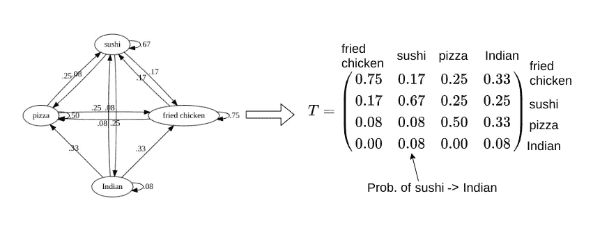*

*转移概率矩阵 T(图片由作者提供)*

*然后，将相对偏好表示为相对概率的向量。因此，最初的无偏偏好，v₀，对于 4 种美食之间相等的相对概率，具有分量 0.25，025，0.25，0.25。将偏好向量乘以转移矩阵，以在一次迭代后获得修正的偏好向量。*不断迭代，直到偏好稳定到投票者的实际偏好。**

*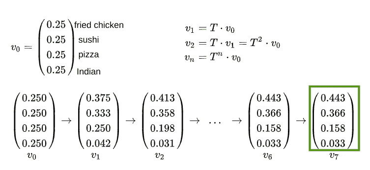*

*相对偏好转变直至稳定(图片由作者提供)*

*在这个例子中，稳定的相对偏好结果是:*

```
*fried-chicken:sushi:pizza:Indian as 44:37:16:3*
```

*正如你在本文开头看到的，炸鸡是赢家，以微弱优势击败了寿司。*

# *基本理论*

*如果这种从个人的排序选择中计算相对加权偏好的方法看起来有点像从帽子里变出一只兔子，请放心，它有坚实的数学基础。如果你喜欢数学，我会在这里简述这个理论。否则，请随意跳过这一部分。*

*该问题映射到一个 [**马尔可夫链**](https://en.wikipedia.org/wiki/Markov_chain) ，使其完整的数学机器可用。马尔可夫链是一个事件序列，其中每个事件的概率只取决于当前状态(不考虑任何过去的状态或历史)。个体排序选择的标准化聚集图描述了一个 4 态马尔可夫链。一个*州*是图中的一个节点(或者节点的混合)，在我们的例子中，它代表了投票者对美食的偏好权重。一个*事件*是状态的变化，即不同菜系之间相对权重的变化。从投票中确定的经验转移概率定义了一个 [**随机矩阵**](https://en.wikipedia.org/wiki/Stochastic_matrix) (或者更准确地说，一个每列总和为 1 的左随机矩阵)。这样的矩阵保证有一个特征值为 1 的特征向量。该特征向量是马尔可夫链的稳态，因为它在概率转移下保持稳定。并且，如果矩阵是正的(即，没有条目是 0)，那么任何初始状态都保证收敛到稳态。事实证明，我们的偏好转移矩阵确实是正的。这就是为什么你可以从任何初始相对偏好出发，达到稳定的集体偏好。*

*有了这个理论基础，让我们把这个方法命名为*马尔可夫方法*。*

# *怎么能尝试呢？*

*在我家，我们每个人对每件事都有强烈的看法，从我们晚餐应该吃什么到我们应该做什么活动来充分利用西雅图的阳光假期。手动遍历马尔可夫方法的所有步骤是非常繁琐和容易出错的。但是让计算机为我们做这件事是一件简单的事情。我在[https://vishesh-khemani.github.io/collective-preference](https://vishesh-khemani.github.io/collective-preference/index.html)有一个原型网络实现，你可以玩玩。只需输入选项和对这些选项的投票，它就会给出投票者偏好的相对权重，以及转移概率图。这里可以看到代码:[https://github . com/vis hesh-khe mani/vis hesh-khe mani . github . io/tree/main/collective-preference](https://github.com/vishesh-khemani/vishesh-khemani.github.io/tree/main/collective-preference)。*

*以下是晚餐吃什么示例的运行截图:*

*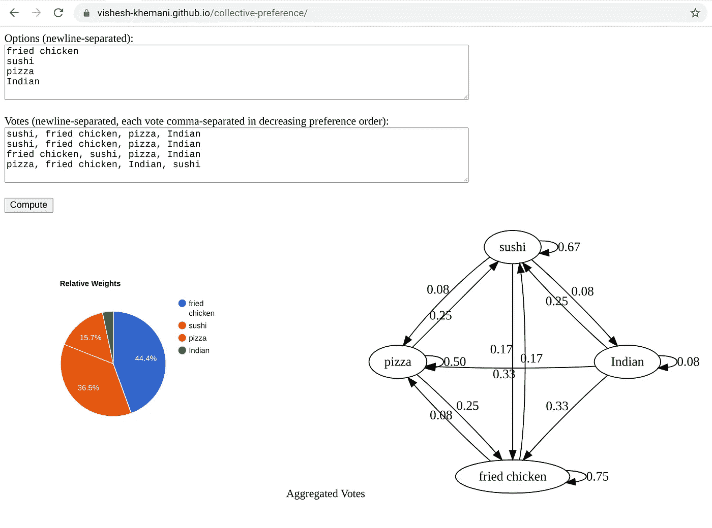*

*[https://vishesh-khemani.github.io/collective-preference](https://vishesh-khemani.github.io/collective-preference/index.html)/(图片作者)*

# *怎么有用？*

## *优先选择投票*

*在美国政治选举中，第三方候选人经常扮演搅局者。例如，在 2000 年的总统选举中，阿尔·戈尔在佛罗里达州以大约 500 票之差输给了乔治·w·布什，如果拉尔夫·纳德没有获得大约 97，000 票的话，这个赤字本可以轻松克服。这导致选民进退两难:是投票给他们最喜欢的候选人，还是他们更喜欢的更有胜算的候选人。如果选民可以排列他们的选择，而不是只投票给一个候选人，会怎么样？澳大利亚等国家和美国缅因州等州已经这样做了。然而，他们的计票方法是有缺陷的(因为它只考虑那些较高排名的选择在前几轮计票中被淘汰的较低排名的选择)。*

*考虑一个有三个候选人的选举:X，MX 和 m。X 是一个极端的候选人，一个要么被喜爱要么被厌恶的两极分化的人物。m X 是 X 的温和版本，M 是与 X 和 MX 站在政治光谱另一边的温和候选人。X 的支持者可能会把 M 排在最后。MX 或 M 的支持者很可能会把 X 排在最后(因为 X 要么受人喜爱，要么令人厌恶)。考虑以下投票:*

```
*Vote 1: X, MX, M
Vote 2: X, MX, M
Vote 3: MX, M, X
Vote 4: M, MX, X
Vote 5: M, MX, X*
```

*在传统的多数选举中，结果将是 *M 和 X* 打成平手。x 会破坏 MX 的机会。*

*在传统的排名选择选举中(正如缅因州实施的那样)，MX 将在第一轮计票中被淘汰。然后，vote 3 将为其第二选择 M 贡献一票，推动 *M* 战胜 X。X 将再次成为 MX 的搅局者。*

*在马尔可夫方法中会发生什么？下面是截图:*

*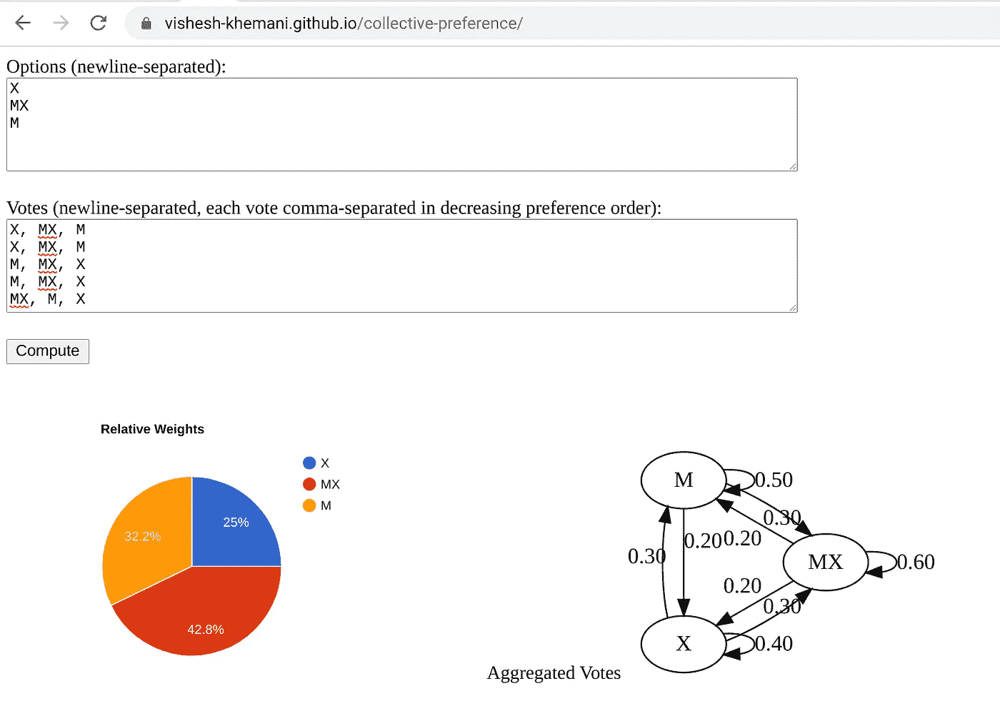*

*作者图片*

*完全不同的结果: **MX 赢了！X 的支持者仍然能够把 MX 作为他们的第二选择。x 不是剧透。这难道不是最公平的结果吗？MX 是所有投票者的第一或第二选择。大部分投票者最不喜欢 X 和 M。选民可以根据自己的真实喜好投票，而不用担心会从更受欢迎的候选人那里抢走选票。此外，候选人受到激励减少两极分化，以免对手支持者的反感破坏他们的机会。***

## *锦标赛排名和预测*

*这里有一个场景，不涉及投票，而是预测。为什么我要说预测？成对偏好的建模同样适用于一组实体之间的任何成对比较。例如，在锦标赛中，我们可以将过去比赛的结果输入到模型中，它将预测每个竞争者获胜的相对可能性。*

*我在最近完成的一场锦标赛中尝试了这种方法:一场有 8 支队伍参加的[板球联赛](https://www.iplt20.com/)，每支队伍与其他队伍比赛两次。56 场比赛下来，前 4 名球队晋级季后赛。我输入了前 28 场比赛的数据(联赛阶段进行到一半时，在每支球队与其他球队比赛一次之后)，看看这个模型会预测接下来的 28 场比赛。结果如下:*

*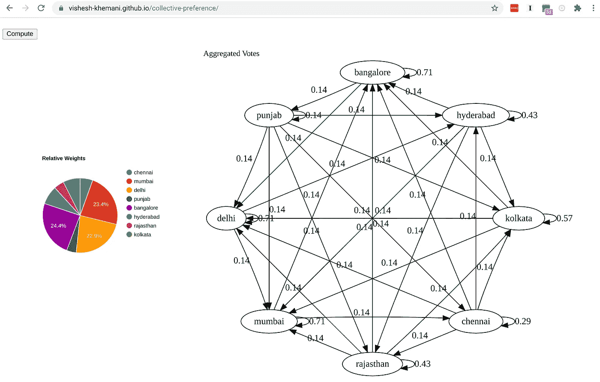*

*作者图片*

*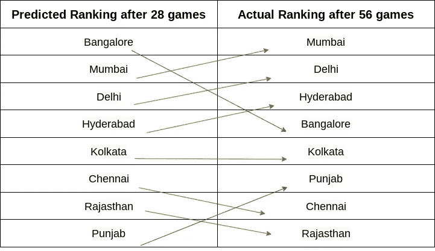*

*作者图片*

*模型的预测有多好？*

1.  *该模型完全准确地预测了前 4 名球队(有资格进入季后赛的球队)。*
2.  *该模型的排名需要 5 次成对交换(在上图中用红线和绿线之间的交叉线表示)才能与实际排名完全匹配。如果该模型通过预测与实际排名相反的排名尽可能地错误，它将需要 28 次成对交换。因此，这里有一个预测排名准确程度的衡量标准:(1-5/28)或 **0.82** (其中 1 表示完全准确，0 表示最不准确)。这是一个相当高的准确度分数。*
3.  *也许你认为这太夸张了，你可以简单地跟踪 28 场比赛后每支球队的输赢记录，然后得出一个类似的准确预测。但事实并非如此。28 场比赛后的输赢记录将充斥着不准确和其他问题。例如，班加罗尔、孟买和德里的战绩都是 5:2，班加罗尔击败孟买，孟买击败德里，德里击败班加罗尔。所以还不清楚这三支队伍之间的相对排名。加尔各答赢的比赛比海得拉巴多，也赢了海得拉巴，所以你会认为它的排名应该比海得拉巴高。然而，马尔科夫模型将海德拉巴排名靠前，主要是因为他们击败了其他一些顶级球队，这一预测在现实中得到证实。*

## *摘要*

1.  *如果一组实体(例如，选举中的候选人或锦标赛中的团队)被成对比较(例如，投票人更喜欢候选人 A 而不是候选人 B，或者在最近的比赛中 A 队击败了 B 队)，并且每个成对比较发生任意次(例如，两个候选人之间不同的投票人偏好，或者两个团队之间不同的比赛结果)，则您可以确定完全概括成对比较的实体之间的相对权重(例如，投票人更喜欢候选人 A 而不是候选人 B，比例为 3:2，或者 A 队的赔率为 5:3)*
2.  *计算方法基于将实体之间的成对比较映射到实体之间的经验转移概率。怎么会？将成对比较表示为一个图，其中每个被比较的实体是一个节点，该节点具有从“输家”到“赢家”实体的有向边。将所有比较图组合成聚合图，其中每条边的权重等于该边在成对比较中的出现次数。对权重进行归一化，使得从实体 A 到实体 B 的边的权重是 A 和 B 之间以 B 为获胜者的比较的分数。这个分数是 B 对 a 获胜的经验转移概率。现在，该图表示用于在比较的实体之间获胜转移的马尔可夫链。从实体之间的任何初始胜率开始，并重复应用转移概率，马尔可夫链稳定到胜率的稳态。*
3.  *该方法可广泛应用，从决定哪种烹饪最能满足朋友/家人的不同口味，到比赛中竞争者的相对获胜几率，到哪个候选人是投票者真正最喜欢的选择，到如何在竞争项目中分配固定预算，等等。*
4.  *您可以在 https://vishesh-khemani.github.io/collective-preference 使用原型 web 实现，用这种马尔可夫方法来处理您自己的一组实体和比较。如果你想出了一个有趣的结果，我希望你能留下评论。*