# 时间序列预测的蓝图

> 原文：<https://towardsdatascience.com/a-blueprint-for-time-series-9f865609bfa2?source=collection_archive---------9----------------------->

## ***指数平滑和 ARIMA 模型的探索***


照片由[丹·迪莫克](https://unsplash.com/@dandimmock?utm_source=medium&utm_medium=referral)在 [Unsplash](https://unsplash.com?utm_source=medium&utm_medium=referral) 上拍摄

正如我在[之前的故事](/tableau-your-time-series-forecast-with-tabpy-5c09c151477f)中提到的，我讨论了如何“展示”你的预测，让我们开始时间序列预测吧。

让我们从基础开始。什么是时间序列？

时间序列表示的是一段时间内*有序的数据，也就是说，我们在 ***等时间间隔*** 观察到的数据。为什么 ***顺序*** 很重要？这是因为我们假设今天发生的事情取决于昨天发生的事情等等。因为时序在这里很重要，所以把一个时间序列事件看作一个随机过程是不正确的。这意味着我们不能从时间序列数据中随机抽样分布。*

*为什么要使用时间序列而不是回归技术之类的预测模型呢？嗯。*

*有时，我们可能没有足够的信息(预测因子)来预测未来(目标)。此外，我们可能无法在可用的预测因子和我们的目标变量之间建立显著的相关性。*

*因此，与预测建模不同，在预测建模中，您有预测器来解释您的目标变量，时间序列预测依赖于来自以前时间段的目标变量本身(也称为滞后)来进行预测。*

> *插图:*
> 
> ***预测建模:收入= 1.78 *利润+ 2.5** *(* 这是一个简单的线性回归方程，根据利润提供的信息预测收入)。假设我们没有利润信息。我们转向时间序列。*
> 
> ***时间序列模型:收入(t+1)= a *收入(t)+a(a-1)*收入(t-1) +..**(在此模型中，收入取决于之前时间段的收入，当我们通过使用平滑参数**‘a’**回到过去时，收入的权重逐渐衰减。)*

**

*由[马库斯·温克勒](https://unsplash.com/@markuswinkler?utm_source=medium&utm_medium=referral)在 [Unsplash](https://unsplash.com?utm_source=medium&utm_medium=referral) 上拍摄的照片*

*让我们开始查看我们的数据。我们将点燃我们的 Jupyter 笔记本。*

*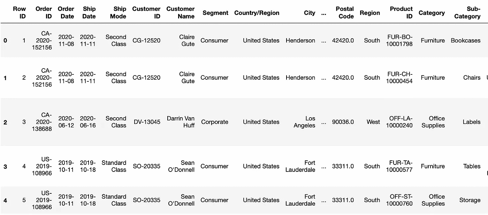*

*我们超市数据集的前 5 条记录*

*让我们快速浏览一下我们的元数据。*

```
*superstore.info()*
```

*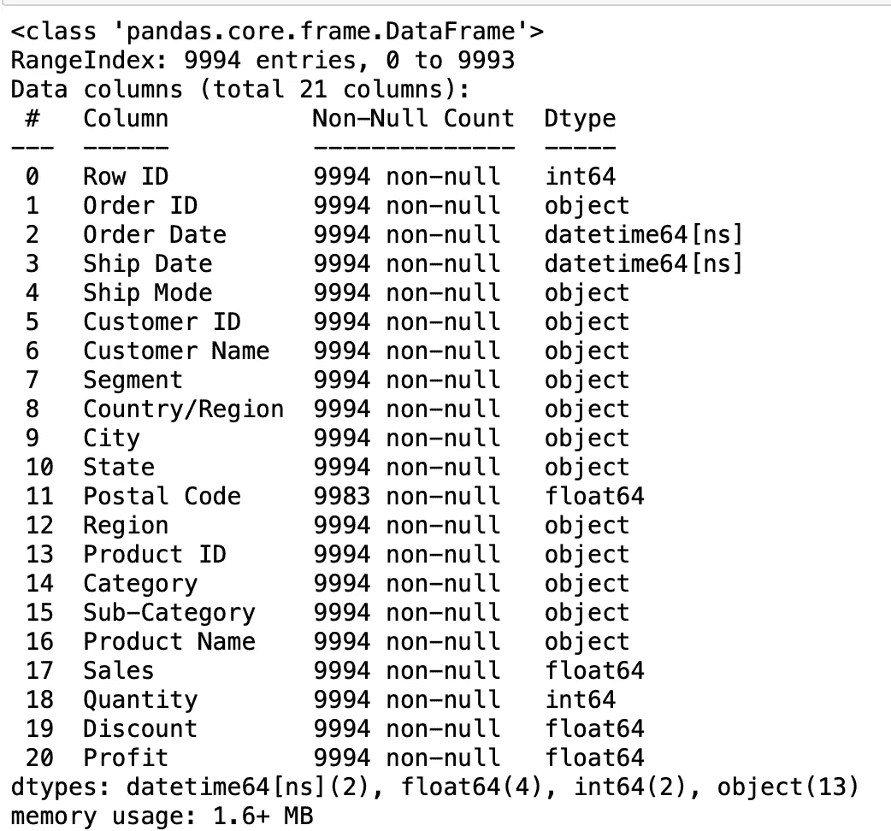*

*我们将处理时间序列的销售和订单日期*

*我们可以安全地使用订单日期和销售额，而不必进行任何缺失值处理。让我们建立我们的时间序列。*

*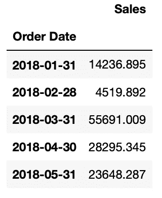*

*我们正在合计每个月的销售额*

*想象的时间到了。*

*python 中有许多可视化数据的库，最广泛使用的是 matplotlib 和 seaborn。在这里，我使用了 plotly 来呈现一个交互式的视觉效果。如果你有兴趣了解更多关于 plotly 的信息，请点击这里。您可以使用下面的代码:*

*好吧。让我们更深入地研究时间序列的组成部分。我们将探索样本地块以更好地理解概念。*

*一个时间序列的主要成分有:****季节性，周期性*** 和 ***白噪声(误差)*** 成分。趋势、季节性和周期性是可以建模的系统成分，误差是随机成分。**

**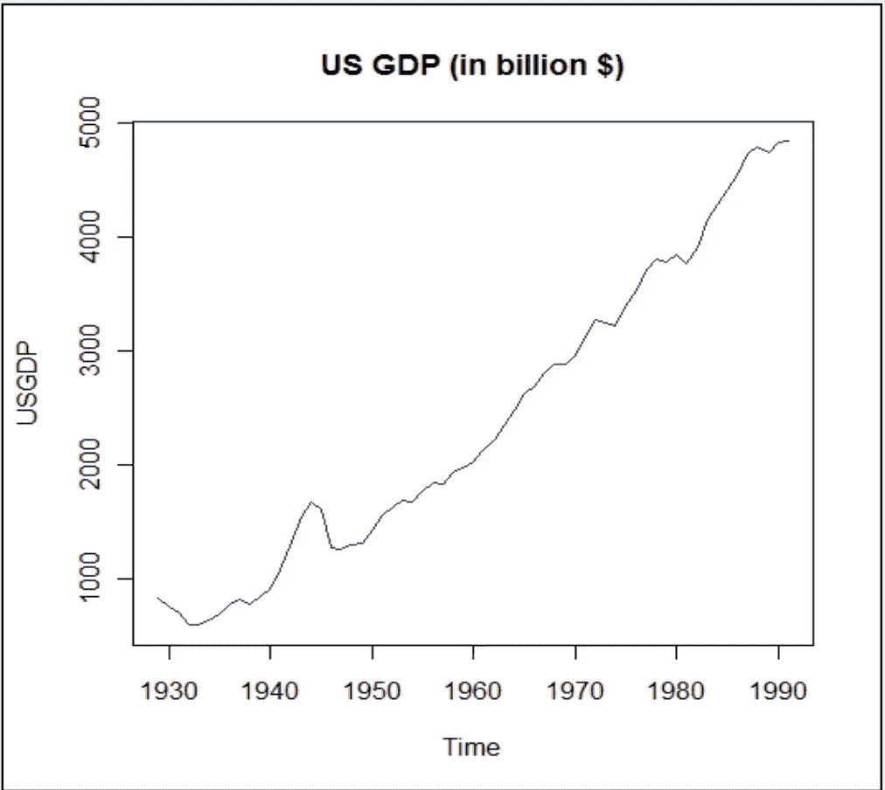**

**有明显的上升趋势**

*****趋势*** 量化序列的整体向上或向下移动。**

*****季节性*** 量化每年重复的数据中的 ***年内*** 波动。例如，雨伞的销量在一年中的每个雨季都会上升，冰淇淋的销量在夏季会上升，配送公司在一年中的每个季度都会开出更多的账单；这些很可能每年都会发生。 ***问题*** :每年的时间序列会有季节性吗？号码**

**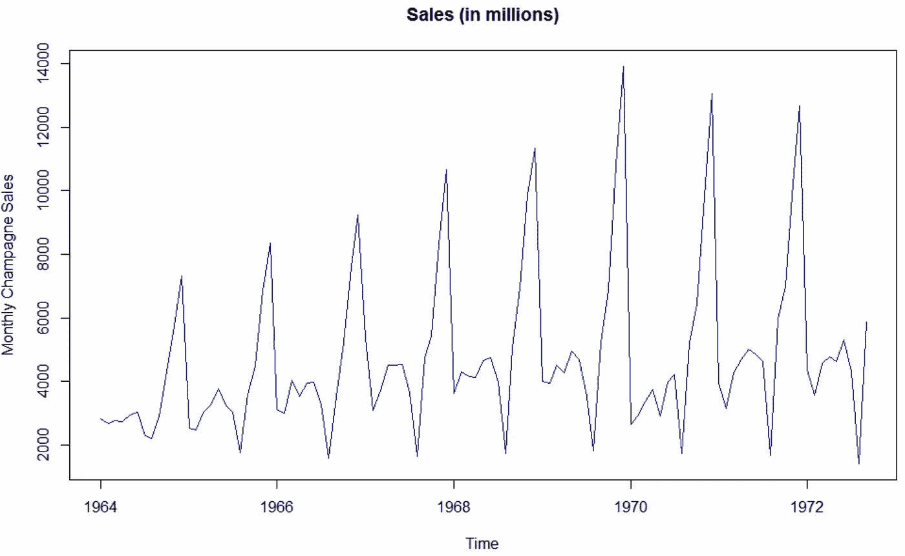**

**香槟销售的季节性**

**当数据显示上升和下降不是固定周期*时，存在**循环**模式。因此，它不同于季节性，我们在后者中看到一个固定的模式。此外，一个周期的平均长度比季节长得多，通常跨越数年。***

***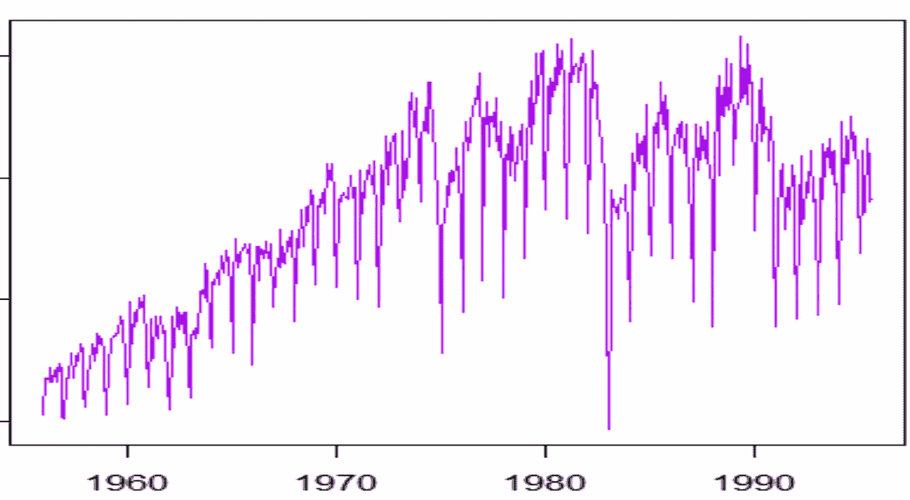***

***大多表现出多年来没有固定模式的周期性行为***

***最后， ***白噪声*** 是随机误差分量，假设其具有均值 ***= 0*** 和常数方差 *𝛔的正态分布。****

**我们将关注趋势、季节性和白噪声。循环组件建模很复杂(至少就我目前所知)，我们将尝试使用其他三个组件来解释该模型。很多时候，周期成分是用趋势本身来解释的。**

**我们可以通过两种方式组合这些组件:**

*****加法模型*** : *Y(t) =趋势(t) +季节性(t) +误差(t)***

*****乘法模型*** : *Y(t) =趋势(t) *季节性(t) *误差(t)***

**加性模型将假设随时间推移或多或少的恒定季节性。另一方面，随着时间的推移，乘法模型将会看到季节性以及趋势的显著变化。乘法模型更真实。然而，为了使用乘法模型，我们将对数据进行对数转换，使其成为加法模型，然后我们可以轻松提取趋势和季节性成分。如果你熟悉对数，你应该能理解下面的等式:**

**log( *Y(t)* ) = log( *趋势(t) *季节性(t) *误差(t))***

**log( *Y(t)* ) = log( *趋势(t)) + log(季节性(t)) + log(误差(t))***

**可视化是理解我们时间序列本质的良好开端。**

**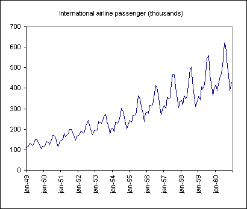**

**这看起来像一个乘法模型**

**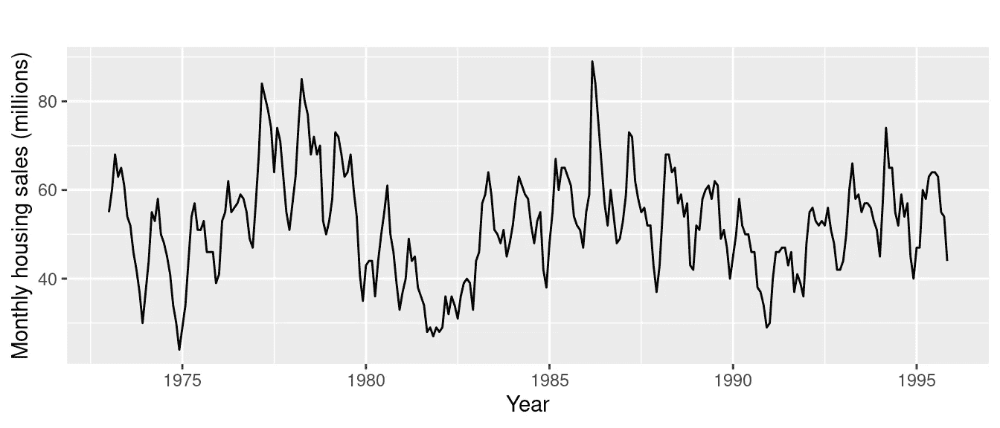**

**附加模型的插图(你对循环模式有什么看法？是还是不是？)**

**可视化有其自身的局限性。我们需要一种方法来量化和确认我们的发现——输入**分解**。**

> **分解有助于我们提取和量化时间序列的组成部分。这也有助于我们理解在解释时间序列时什么更重要。**

**让我们回到我们的超市。看完系列，我就先来个加法模型。让我们来分解我们的系列:我已经说明了所使用的各种方法中的两种。**

****经典分解****

**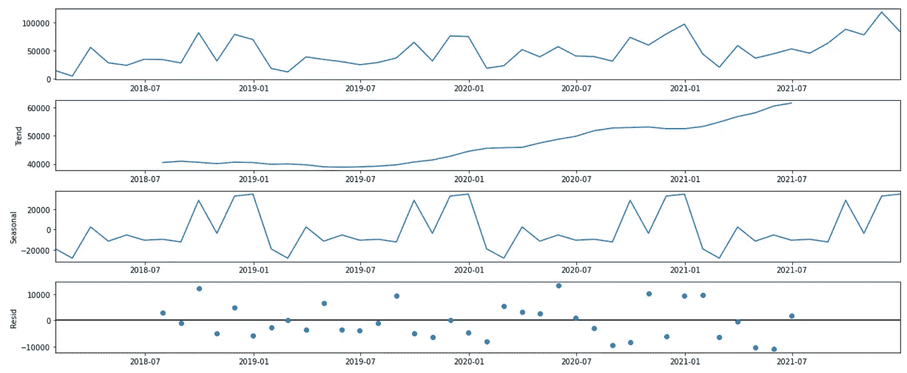**

**分解我们的时间序列**

**仔细观察趋势和季节性成分。随着时间的推移，我们可以看到一个上升的趋势和或多或少不变的季节性。同样残差以**零点为中心。*这证实了我们对加法模型的假设。***

****STL —稳健方法****

**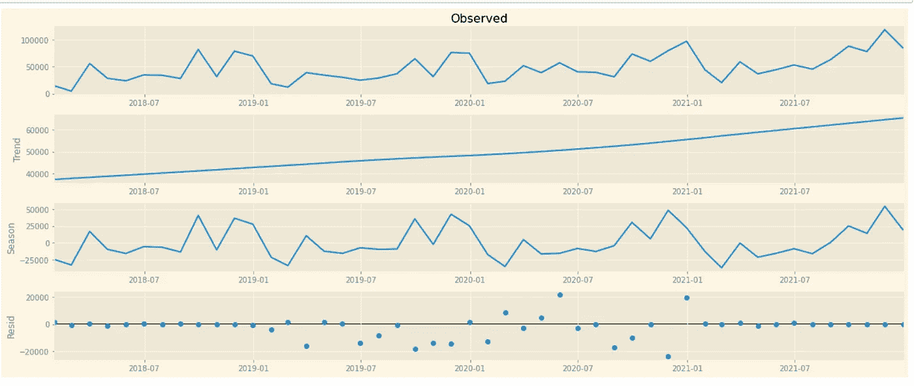**

**STL 只适用于附加模型；如果我们有乘法模型，我们使用对数变换。我们不会在这个故事中探讨这个问题。**

**我想特别强调另一种识别季节性的方法。我们可以利用 *month_plot* 来查看这些年中是否有任何月份具有显著的重复模式。**

**使用 month_plot 识别季节性**

**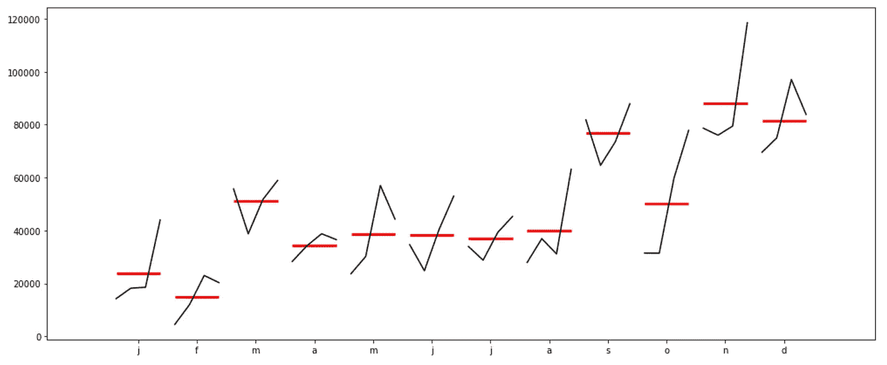**

**在销售额最低的(1 月、2 月)和销售额最高的(9 月、11 月、12 月)观察到的季节性行为**

**让我们探索一下可以用于预测的各种模型。我们将通过 ***指数平滑*** 方法和 ***ARIMA*** 方法来预测我们的时间序列。**

****指数平滑模型****

**在指数平滑法中，我们根据过去观察值的加权平均值来预测值。这些重量随着我们回到过去而衰减。这意味着我们更加重视最近的观察。参数用于计算权重，其取值介于 0 和 1 之间。**

****简单指数平滑****

**当数据中既没有明显的趋势也没有季节性时，使用这种方法。我们只是试图通过使用参数***【⍺***来平滑级数的电平。水平无非是局部的意思。数学上我们可以这样表示:**

*****y(t+1)= ⍺*y(t)+⍺(⍺-1)*y(t-1)+⍺(⍺-1)* y(t-2)+………..*** 权重随着时间的推移而衰减，⍺是所使用的平滑参数，可以在 **0** 和 **1** 之间调整。**

**让我们编码这个。**

**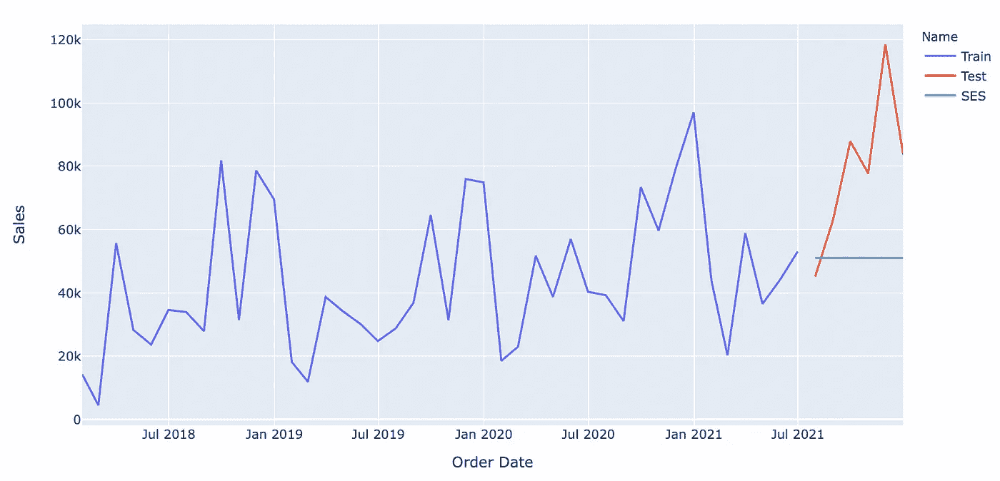**

**SES 模型**

```
**#Let's check accuracy score by using RMSE
Root mean squared error = 36203.014759074365**
```

**你可以看到天气预报并不乐观。你可以试着调整⍺的*看看你是否能得到更好的预测。简单的指数平滑总是给出一个平坦的预测，因此应该只用于预测下一个数据点。***

*****霍尔特模型或双指数平滑*****

***这里我们考虑两个属性:水平和趋势——这意味着我们将有两个平滑参数，分别是*和 ***β*** 。当有趋势但没有季节性时，我们应用这种类型的模型。****

**让我们直接进入代码。**

**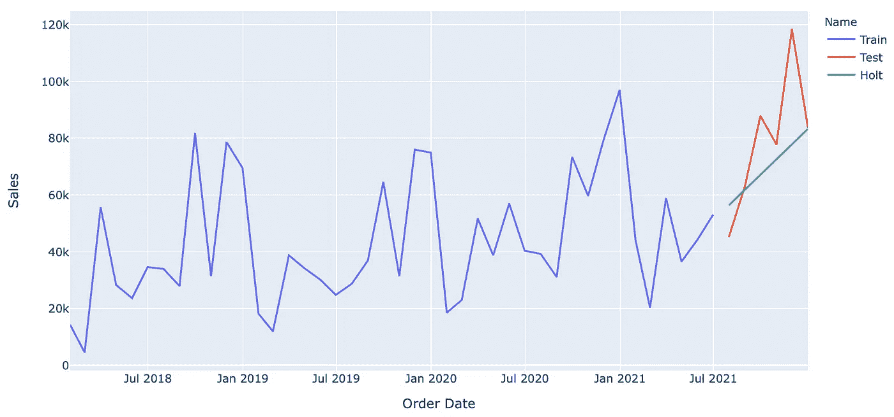**

**霍尔特线性趋势模型**

```
**#Let's check accuracy score by using RMSE
Root mean squared error = 19269.25908614305**
```

**我们可以看到，RMSE 越低，预测越好。还有一个没有任何季节性的线性趋势成分。**

**除了不能捕捉季节性之外，这种方法也不能稳定或者“抑制”趋势。在未来的日子里，它只会越来越高。这是不可取的，尤其是当我们进行长期预测时。对此的一个解决方法是添加阻尼参数。这是霍尔特线性趋势模型的扩展。**

**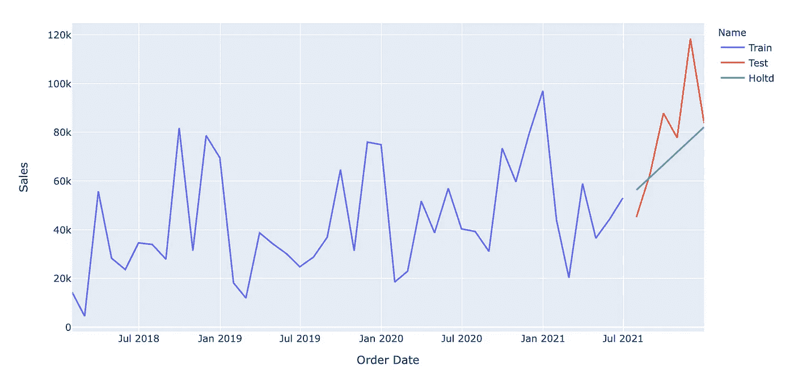**

**带阻尼的霍尔特线性趋势**

```
**#Let's check accuracy score by using RMSE
Root mean squared error = 19646.815465033545#You can see our RMSE has suffered to some extent due to damping. #This is a trade off that we need to consider while selecting the #model.**
```

****霍尔特-温特模型或三重指数平滑****

**让我们找回我们的季节性。该模型考虑了序列中的水平、趋势和季节性。由于趋势和季节性的存在，霍尔特-温特的模型可以是加法或乘法。平滑参数有三个:***⍺******β***和 ***𝜸*** 分别用于水平、趋势和季节性。如果您还记得，我们的超市数据在分解图中同时包含趋势和季节成分，那么我们可以期待这个模型能给我们带来更好的准确性。我们还假设了一个加法模型。**

**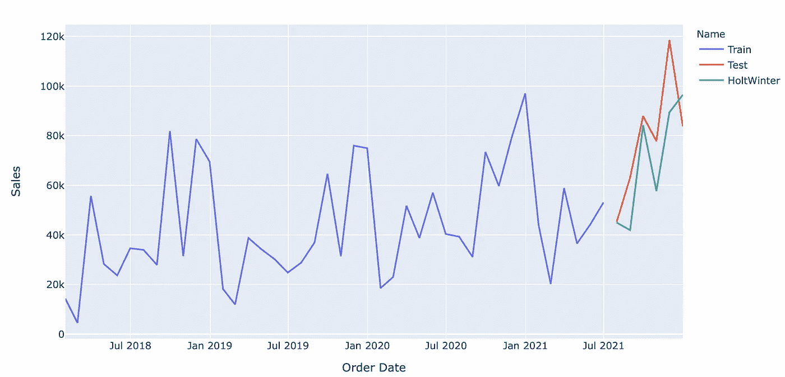**

**霍尔特·温特模型**

```
**#Let's check accuracy score by using RMSE
Root mean squared error = 17660.235617816732#Note that the model automatically applies smoothing parameters; you #can manually tune them by specifying smoothing_level, #smoothing_slope and smoothing_seasonal values.**
```

**您可以观察到，该模型捕捉到了图中的趋势和季节性。我们的 RMSE 分数也提高了。**

> **简而言之，我们已经看到我们的模型既有趋势部分又有季节部分，它们是以一种“相加”的方式结合在一起的。因此，霍尔特-温特的模型给了我们最好的结果。接下来我们将看看更复杂的自回归模型。**

****ARIMA 模式****

**ARIMA 代表自回归综合移动平均线。我们来分解一下。**

**一个**自回归**模型试图识别与其构成 **AR(p)** 分量的滞后(以前的时间段)的显著相关性。例如， **AR(1)** 过程将意味着时间 t 的值是时间 T1 的值的线性函数(换句话说，滞后 1)。从数学上来说，AR(1)模型看起来像是:**

> *****y(t)=𝛿+ɸ*y(t-1)+w(t)****，其中 w(t)为时刻(t)的白噪声，正态分布为 N(0，* 𝛔 *)***

**但是什么是 [**相关性**](https://www.google.com/url?sa=t&rct=j&q=&esrc=s&source=web&cd=&ved=2ahUKEwilwc7ewKPxAhUGfisKHf5oBpcQFjAAegQIBBAD&url=https%3A%2F%2Fen.wikipedia.org%2Fwiki%2FCorrelation_and_dependence&usg=AOvVaw2d26feV-KieUEgGVjAy7pj) 又是如何计算出来的呢？让我们来看看公式。考虑两个变量 x 和 y，相关性由下式给出:**

> *****关联= Cov(x,y)/(𝛔x * 𝛔y)*****

**分子是 x 和 y 的 [**协方差**](https://www.google.com/url?sa=t&rct=j&q=&esrc=s&source=web&cd=&ved=2ahUKEwiStezGwKPxAhUPbn0KHbVQAEMQFjACegQIBhAD&url=https%3A%2F%2Fen.wikipedia.org%2Fwiki%2FCovariance&usg=AOvVaw35yB5Pbo71eFBEZ_fnRsCe) ，分母是 x 和 y 的标准偏差的乘积。相关系数是此公式的结果，它给出了取值在-1 和 1 之间的 x 和 y 的关联程度的估计。如果你熟悉皮尔逊的 r，你会发现这里的相似之处。对于 AR(p)过程，x 和 Y 无非是 Y(t)和 Y(t-p)。**

**时间序列模型中的**移动平均**项 **MA(q)** 是过去误差(乘以一个系数)。假设相应滞后的每个误差项具有方差恒定且均值为零的正态分布。从数学上讲，一个 **MA(1)** 过程将看起来像:**

> *****【y(t)=+w(t)+𝛉*w(t-1)****，其中 w(t)为时刻(t)的白噪声，正态分布为 N(0，*【𝛔*】，* *为数列的均值***

****积分**代表数列求差的次数。差异是用前一个时间段减去当前时间段的值的过程。这将产生一阶的差异。我们可以做 d 次，这样我们的系列就是 d 阶差分系列。但是我们为什么要区分我们的系列呢— **引入平稳性的概念，这是自回归模型的强制性标准。****

**那么我们来理解一下平稳性。**

**一个数列是平稳的当且仅当:**

***a)* ***时间序列的均值是一个常数*** —这意味着具有趋势性或季节性的时间序列是非平稳的。趋势或季节性成分会影响时间序列在不同时期的值。**

***b)* ***方差/协方差随时间恒定*****

***c)* ***时间段(滞后)t 与 t + mth 之间的相关性始终是一个常数*** —这暗示着一月和十一月将具有与十二月和十月相同的相关性。**

****

**来源:[beingdatum.com](https://beingdatum.com/time-series-forecasting/)**

> **总的来说，平稳序列是统计特性不随时间变化的序列。**

**有几种方法可以使非平稳序列平稳。这些是对数转换(用于平滑方差)，消除分解后的趋势和季节性，计算移动平均数和差分序列。在上述方法中，**差分**广泛用于使我们已经描述过的数列平稳。**

**让我们测试数据的平稳性。我们将使用扩展的 Dickey-Fuller 检验来检验我们的零假设，即我们的序列不是平稳的。如果我们得到一个显著的 p 值，我们将拒绝我们的零假设，并建立我们的序列是平稳的。相反，如果我们不能拒绝我们的零假设，我们将差分序列，并再次运行测试。**

**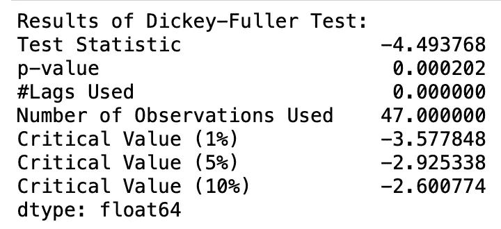**

**以 99%的置信度测试统计值大大超过临界值**

**查看结果后，我们的零假设可以被拒绝。我们可以有 99%的把握说我们的数据是稳定的。**

> **如果我们用分解代替差分，我们可以用同样的方法测试残差的平稳性**

**我们继续吧。下一步是探索 ACF(自相关函数)和 PACF(部分自相关函数)。还记得我们讨论过 AR(p)和 MA(q)过程吗？ACF 和 PACF 图有助于我们识别订单 p 和 q**

**ACF 寻找与序列滞后的相关性。滞后为 1 的序列是偏移了一个时间周期的序列。下表显示了 1、2、3 等阶的滞后序列。**

**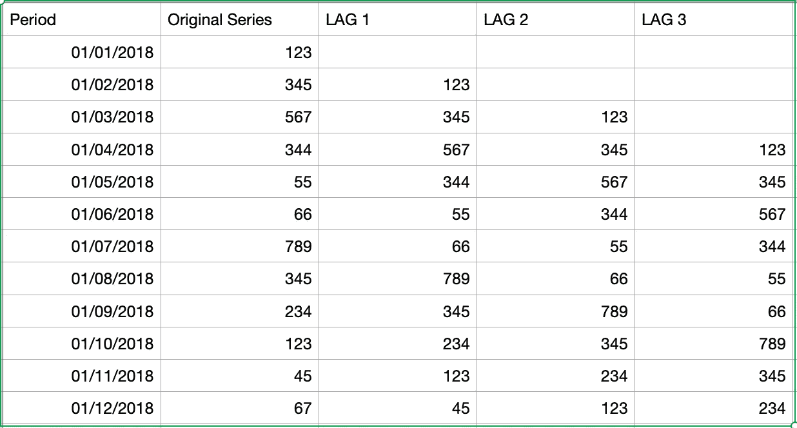**

**滞后的例证**

****ACF** 绘制原始序列与滞后 1、滞后 2 等之间的相关性。我们来看看用 python 怎么做。**

**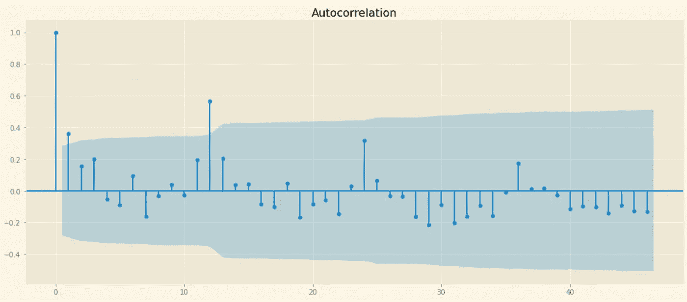**

**我们可以看到滞后(1)是显著的**

**任何高于蓝色条纹的尖峰都是有意义的。我们可以看到滞后(1)和滞后(12)是显著的。此外，我们可以看到，随着相关性的逐渐衰减(每隔 12 个滞后观察一次)，滞后之间有升有降。比方说，滞后(1)和滞后(4)之间的相关性很可能受到中间滞后(滞后(2)和滞后(3)的影响。因此，重要的是消除这些并获得真实的画面— **PACF** 图用于相同的目的。**

**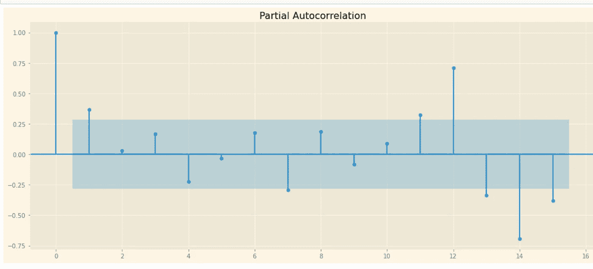**

**我们可以看到滞后(1)在其他冲击中是显著的**

**上面的 PACF 图显示滞后(1)在其他信号或冲击中是显著的。滞后(12)在这里也很重要。**

****我们如何解读 ACF 和 PACF 的阴谋？****

**下面的矩阵应该有助于我们选择最佳订单:**

**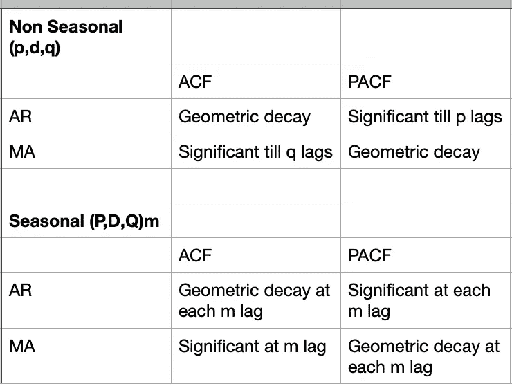**

**这里的“m”是季节周期**

**根据我们的图，看起来有季节性和非季节性的成分。每个第 12 个滞后峰值表示季节性，我们可能需要区分它。我们可以迭代不同的组合，并检查 AIC(赤池信息标准)和 BIC(贝叶斯信息标准)的分数。我们的目标是最小化这些分数以获得更好的模型性能。**

**构建 ARMA、汇总统计数据和准确度分数**

```
**#Call the function and fine tune parameters
# d=0 as we did not difference the series
#Try with p=1, q=1 based on our ACF and PACF plots
#Alternatively, start with (1,0,0) AR model and (0,0,1) MA modelarima_model(1,0,1) #ARMA model**
```

**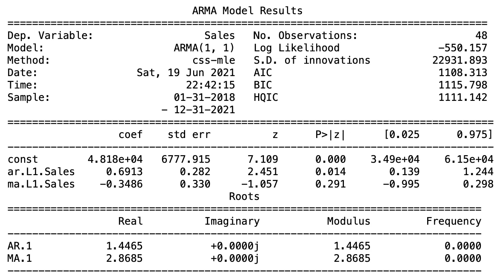****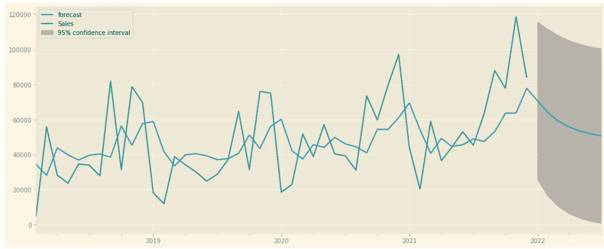**

**预测 6 个月的 ARMA 模型**

```
**#MAPE
0.6571285433084803#RMSE
23037.553921953575**
```

**精确度不是很高。我们可以尝试不同的组合，看看什么给我们最好的准确度分数。此外，MA(1)系数在统计上并不显著。我们可以放下它，再看看我们的结果。这个迭代可以继续下去，直到我们找到一个最佳的精度。请注意，我们还没有包括季节性。这为季节性 ARIMA 铺平了道路。**

**让我们来看看季节性的 ARIMA。我们将使用非季节性 arima **(p，D，q)** 的参数，并添加相应的季节性订单 **(P，D，Q)m** ，其中 m 是季节性周期；因为我们的数据是每月一次，并且模式每年重复，所以 m=12。**

```
**#Since we saw significant spikes at 12th lag in our ACF and PACF #plots, we can try the followingsarimamodel(0,1,0,12)
sarimamodel(1,0,0,12)
sarimamodel(0,0,1,12)#We need to minimize our AIC and BIC values**
```

**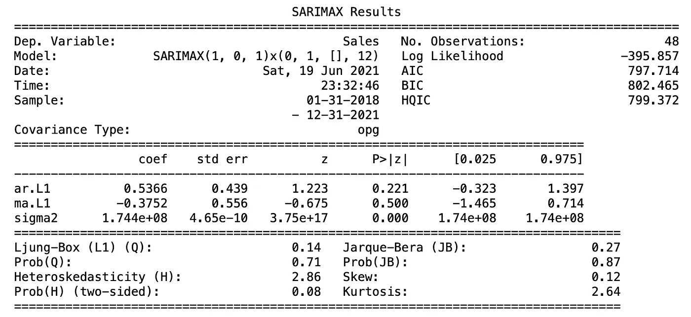****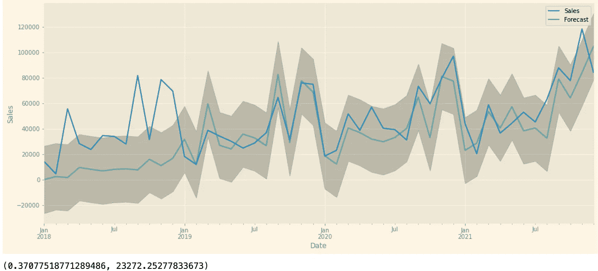**

**我们可以看到 MAPE 的显著改善**

**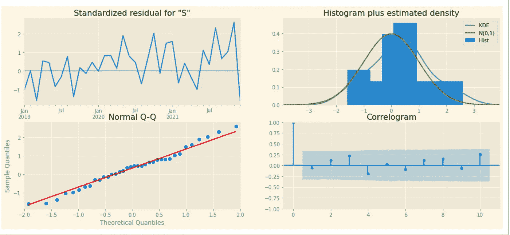**

**分析残差以查看它们是否正态分布**

**我们可以看到，在模型中引入季节性因素后，AIC、BIC 和 MAPE 的得分有了显著提高。模型残差也几乎遵循正态分布，如下所示:**

**这是两组分位数的散点图。如果两组分位数来自相同的分布，我们应该看到这些点形成一条大致笔直的线。**

****标准化残差**-这表明我们的残差经过标准化后，以零为中心。**

****直方图和 KDE** 绘制标准化残差的分布，并将其与正态分布进行比较。**

****相关图**用于查看残差之间是否有显著的自相关；我们没有。这意味着残差是稳定的，没有任何模式。**

> **残差的平稳性是最终确定模型的必要条件**

**然而，如果你观察结果，我们仍然没有重要的系数，我们应该迭代其他组合。**

**幸运的是，python 提供了一个内置函数 auto _ arima(pmdarima 包的一部分),它节省了我们确定 ARIMA 最优顺序的时间。下面是一幅插图:**

**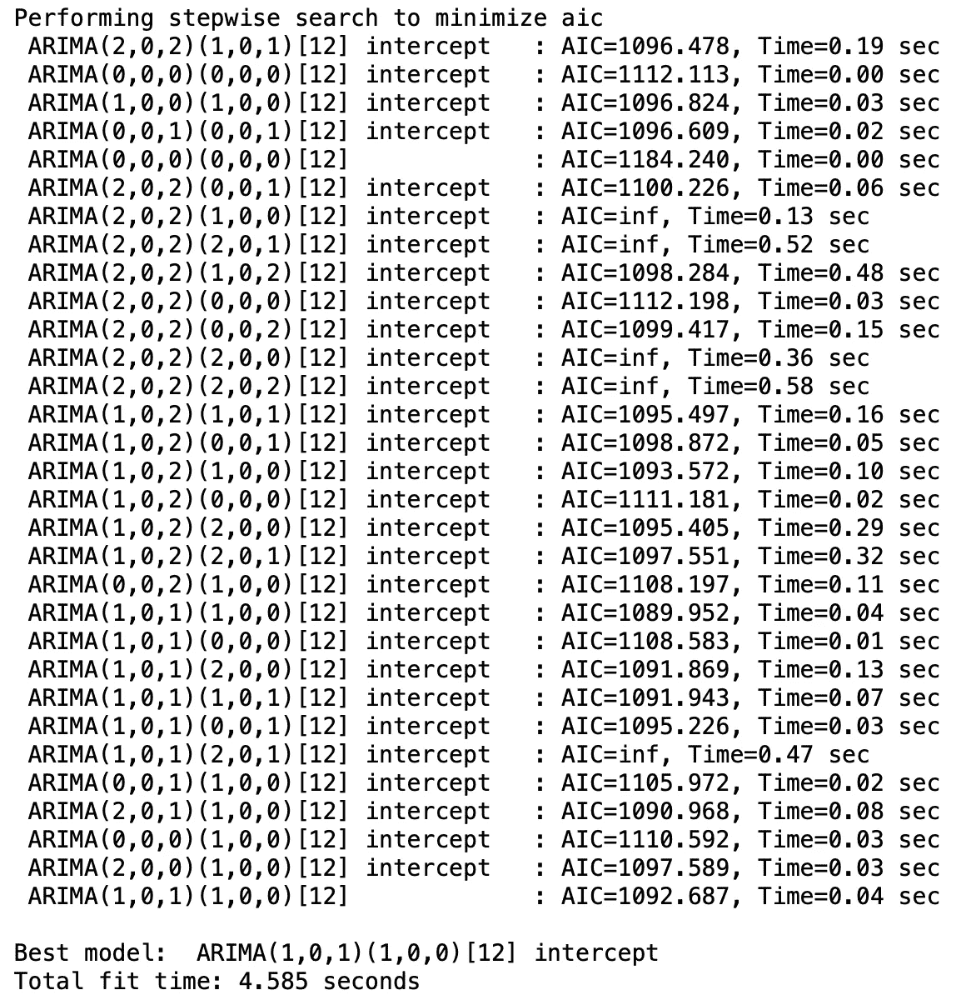**

**自动搜索最小化 AIC 的最佳模型**

**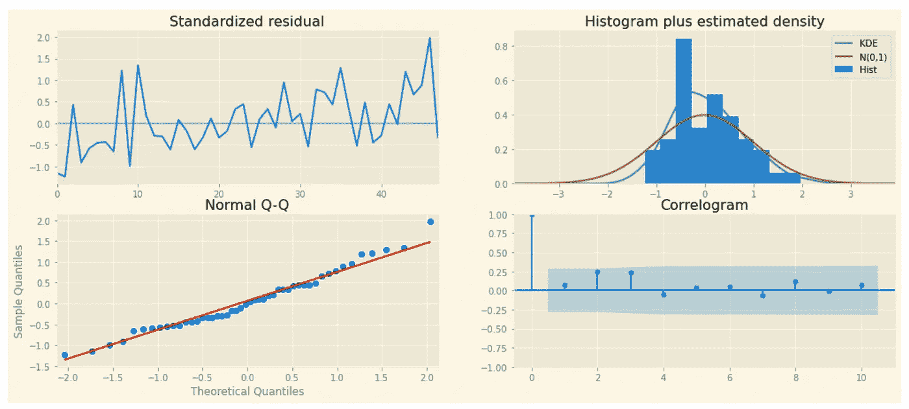**

**残差正态性**

**我们可以看到 auto_arima 选择了 ARIMA(1，0，1)(1，0，0)[12]作为最佳模型。残差看起来也是稳定的。如果你没有得到有统计学意义的参数，我们可以区分系列，并按照相同的步骤再次运行 ARIMA 模型。在快速运行 auto_arima 时，它给出了 ARIMA(2，1，0)(1，0，0)[12]。我将把它留在那里，并鼓励你尝试差异和建模。**

```
**#Differencing
data_diff = data-data.shift()
plt.plot(data_diff)**
```

**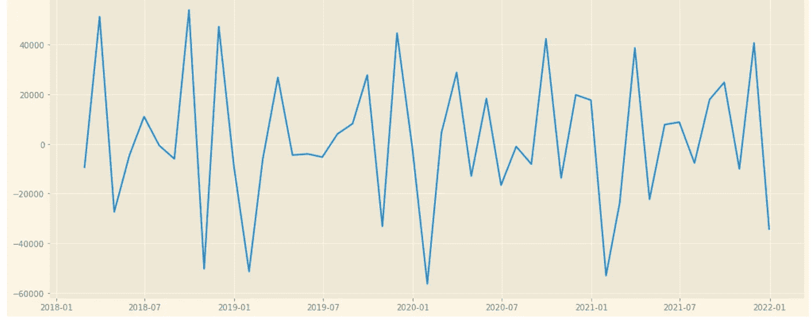**

**差分序列**

> **注意，auto_arima 在捕捉季节性方面做得不太好。因此，简单地依赖 auto_arima 不会产生最佳模型。我们必须仔细检查 ACF 和 PACF 图，了解季节效应(如果有的话)，绘制 auto_arima 以供进一步实验，并应用业务领域知识来最终确定模型参数。**

**我希望这为开始实现时间序列预测提供了一个思路。我想强调的是，我们没有在 ARIMA 模型中将数据分为训练和测试。这是因为我们没有太多的数据来建模。这是您根据可以处理的数据量做出的决定。**