# 一个盆景和一个椭圆

> 原文：<https://towardsdatascience.com/a-bonsai-and-an-ellipse-f68c78dbacb8?source=collection_archive---------20----------------------->

## 拟合图像中的椭圆形状

仙女座星系由[布莱恩·戈夫](https://unsplash.com/@bryangoffphoto)在 [Unsplash](https://unsplash.com/photos/RF4p4rTM-2s)

我最近不得不深入识别图像中的椭圆的细节。我必须承认，我天真地认为这很简单。在我参与的各种计算机视觉项目中，我必须在图像中找到圆和圆盘。椭圆是一个压扁的圆，对吗？从一个圆到一个被压扁的圆能有多难？原来*圆锥曲线*(椭圆的一个例子)有一些错综复杂的东西，在退化的圆的情况下我们可以忽略。

我邀请你跟随我在图像中拟合椭圆形状的过程。您可以在这个库中找到代码和输入图像[。](https://github.com/sebastiengilbert73/tutorial_fitting_ellipse)

我们要完成的任务是在这张图片中找到花盆边缘的椭圆形状:

花盆里的盆景。图片由作者提供。作者妻子精心照料的盆景。

# 创建遮罩

每当我们想要在图像中定位一个形状时，无论它是直线、多项式、圆还是椭圆，我们首先需要创建作为目标形状一部分的候选像素的遮罩(即二进制图像)。

在我们的例子中，与背景相比，锅边看起来是一个明亮的边缘。在这种情况下，我们的首选工具是 Canny 边缘检测器，之前进行了一些模糊处理，以忽略我们在苔藓表面和背景中的草地上看到的高频纹理。

这个操作的结果是这个掩码:

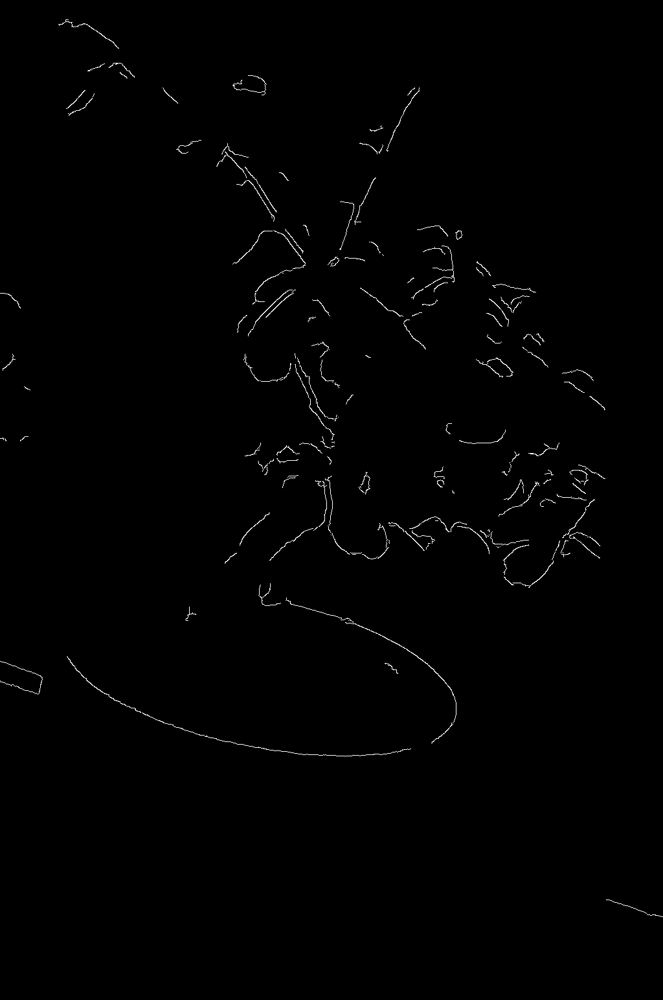

精明的面具。图片由作者提供。

除了来自树叶的大量不相关的像素之外，我们有覆盖大约 75%的花盆边缘的候选点。通过观察树叶是绿色的，而我们感兴趣的点是白色的，我们可以过滤掉大部分的异常值。我们将创建一个非绿色像素的蒙版，只保留属于这个蒙版的候选点。

我们获得以下掩码:

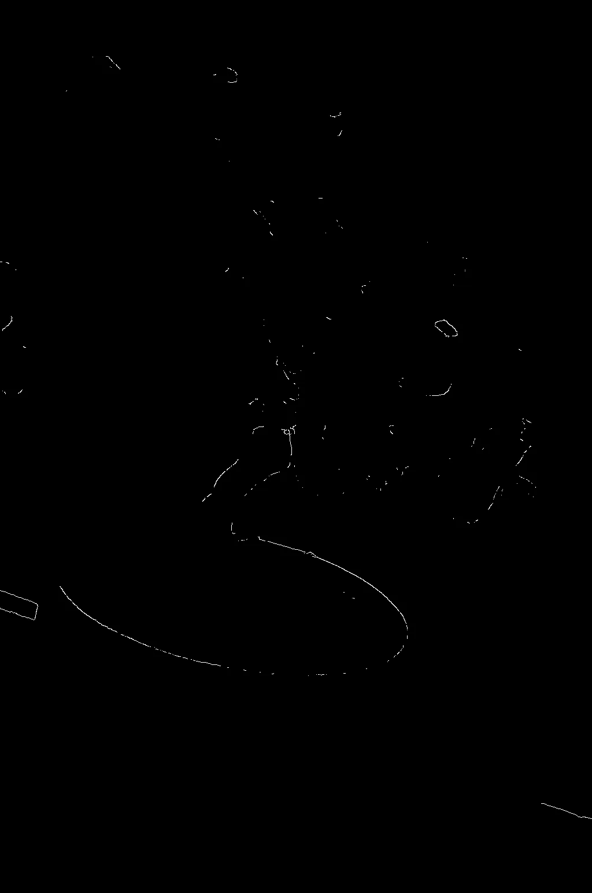

去掉以绿色为主的像素后的 Canny mask。图片由作者提供。

该操作剥夺了边缘上大约 25%的候选点，但去掉了大约 90%的离群点。那是一笔好交易。我们的目标是增加掩膜中感兴趣点的比例，但我们不必消除所有异常值。我们下一步的任务是将内联者和外联者分开。

# 用 RANSAC 建模椭圆

椭圆是称为 [*圆锥曲线*](https://en.wikipedia.org/wiki/Conic_section) 的一般对象类的实例。圆锥曲线(之所以这样叫是因为它们是一个圆锥和一个平面的交点)是以下两个变量的二次方程的解:

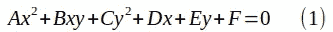

…它具有等效的矩阵形式:

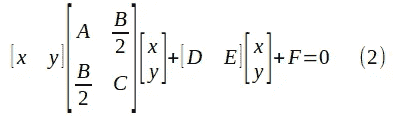

参数 A、B 和 C 的相对值将决定圆锥截面的类型。具体来说，如果判别式 B–4AC 为负，圆锥曲线将是一个椭圆。否则，圆锥曲线可能是抛物线(零判别式)或双曲线(正判别式)。在接下来的讨论中，我们将假设等式(1)代表一个椭圆。

以 Mz=0 的形式重写等式(1 ):

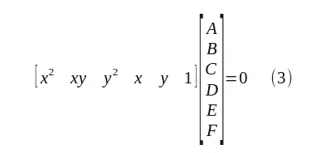

方程(3)是 6 个变量的齐次线性方程，参数为 A、B、… F。我们将需要五个这样的方程来求解系统，直到达到一个比例因子。

> 我们有六个参数需要求解。为什么不是六个线性方程？

因为它是一个 [*齐次*线性方程组](https://en.wikipedia.org/wiki/System_of_linear_equations#Homogeneous_systems)，即每个方程的右边都是 0。如果我们在这个系统中加入第六个线性独立的方程，我们就会陷入平凡解 A=B=C=D=E=F=0 的困境。这看起来不像一个有趣的椭圆。

我们将求解一个由五个线性独立方程组成的系统，因此我们的解将有一个自由度。五个点(x，y)将允许我们用 [numpy.linalg.eig()](https://numpy.org/doc/stable/reference/generated/numpy.linalg.eig.html) 创建这个由五个线性齐次方程组成的系统，我们可以通过特征值分解来求解这个系统。

解齐次线性方程组(3)。改编自[关于 StackOverflow 的讨论](https://stackoverflow.com/questions/1835246/how-to-solve-homogeneous-linear-equations-with-numpy)。

让我们假设我们有一个属于椭圆的五个 2D 点的点云。我们现在知道如何通过在五行中堆叠方程(3)来计算其二次方程的参数。不幸的是，我们有成千上万个点的点云，其中一些属于椭圆，一些不属于椭圆。这就是 [RANSAC 算法](/random-sample-consensus-helps-you-filter-those-pesky-outliers-9dbfbb8b668f)发挥作用的地方。通过随机采样 2D 点的五元组并求解相应的候选椭圆，我们可以找到满足云中最高点数的候选点。

在下图中，找到的椭圆用蓝色突出显示，内点用绿色标记，外点用红色标记[1]:

RANSAC 算法找到的椭圆、内点和外点。图片由作者提供。

> 我们找到了椭圆的二次方程的隐含参数。这很好，但是对我们真正重要的参数呢？椭圆的中心，半轴的长度，倾斜角？

我不确定我们会走这条路，但是既然你问了，我们就开始吧！

# 椭圆参数的计算

最重要的是:中心。

让我们定义函数 z(x，y):

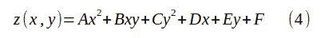

由于 A 和 C 具有相同的符号(记住:在椭圆的情况下，B–4AC 是负的)，z(x，y)可以被视为具有扁平的一杯葡萄酒的形状。

椭圆是这杯扁平的葡萄酒与平面 z=0 的交点。z(x，y)围绕其中心的径向切片是抛物线(方程(4)中的项最多是二次的)，因此我们围绕极值具有径向对称性，因为抛物线围绕它们的极值是对称的。z(x，y)的极值就是我们要找的中心。

z(x，y)的中心，以及对称的椭圆的中心，可以通过求解线性方程组来找到:

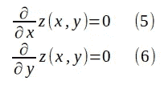

求解(xc，yc):

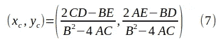

## 半轴和倾斜角

知道了椭圆的中心，我们可以定义另一个椭圆，平移使其中心为原点:

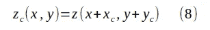

将(4)插入(8)并求解居中椭圆的参数:

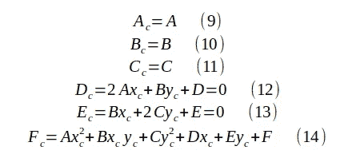

这里需要注意的重要一点是，Dc 和 Ec 项为零。因此，居中椭圆的二次方程可以写成:

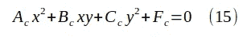

…或者，以矩阵形式:

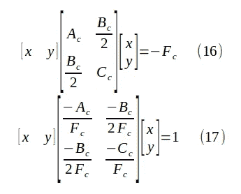

这让人想起以原点为中心的椭圆的二次方程，其轴恰好与 x 轴和 y 轴重合:

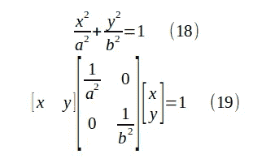

等式(17)比等式(19)更复杂，因为一般的椭圆具有相对于 x 轴的倾斜角，这导致 Bc 项非零。等式(19)只是 x 轴和 y 轴各自半轴的平方变形。

我们观察到，等式(17)中的中心 2x2 矩阵是对称的，因此可以正交对角化[2]。这意味着它的奇异值分解 A=UDVᵀ可以采取 A=UDUᵀ=RᵀDR 的形式，其中 r 是一个正交的 2x2 矩阵。我选择称它为“R ”,因为一个正交的 2x2 矩阵围绕原点旋转。

用中心矩阵的奇异值分解重写(17 ):

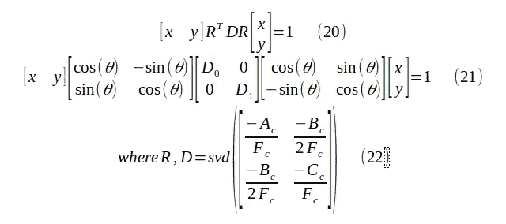

我们可以用下面的方式解释等式(21)的左边，从右向左读:

*   从属于倾斜椭圆的原始向量(x0，y0)开始，我们将它围绕原点旋转角度θ，以使椭圆的主轴与 x 和 y 轴对齐；

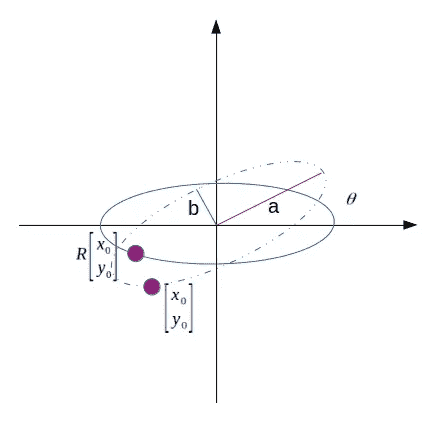

*   既然旋转的向量属于其主轴与 x 和 y 轴对齐的椭圆，我们用对角矩阵挤压轴，就像等式(19)一样；

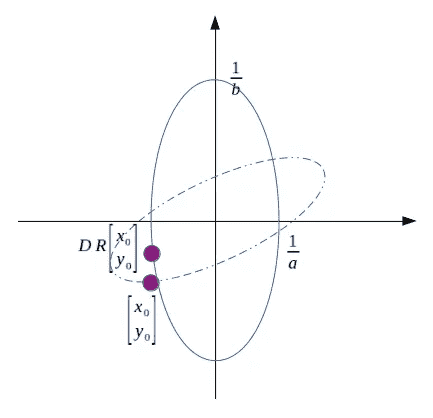

*   我们去旋转被挤压的向量，使得被挤压的椭圆的主轴与原始椭圆的主轴对齐；

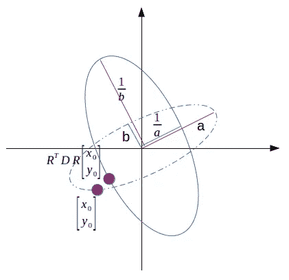

*   我们计算原始向量和去旋转向量之间的点积。

这种解释允许我们从等式(21)的条目中读取我们正在寻找的最后参数，倾斜角θ和半轴 a 和 b:

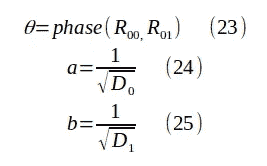

回到我们的 bonsai 图像，计算出的显式参数是非常好的估计，因为我们可以通过手动测量来确认。

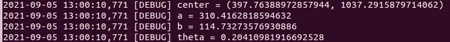

# 结论

我们经历了在图像中拟合椭圆形状的过程。我们从检测边缘开始，然后应用 RANSAC 算法来调整具有一致点的椭圆的参数。我们使用找到的二次方程的隐式参数来提取椭圆的显式参数。

如果你有一个在图像中拟合椭圆形状的应用，请告诉我。我很高兴听到这件事，并尽我所能帮助你。

[1]点云被随机子采样到 400 个点，以限制计算时间。

[2][https://math . emory . edu/~ lchen 41/teaching/2020 _ Fall/Section _ 8-2 . pdf](https://math.emory.edu/~lchen41/teaching/2020_Fall/Section_8-2.pdf)