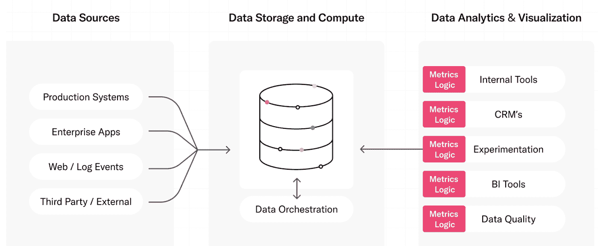
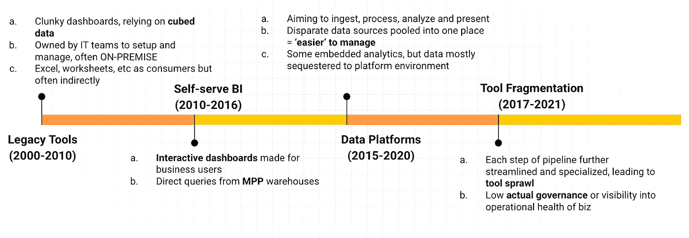
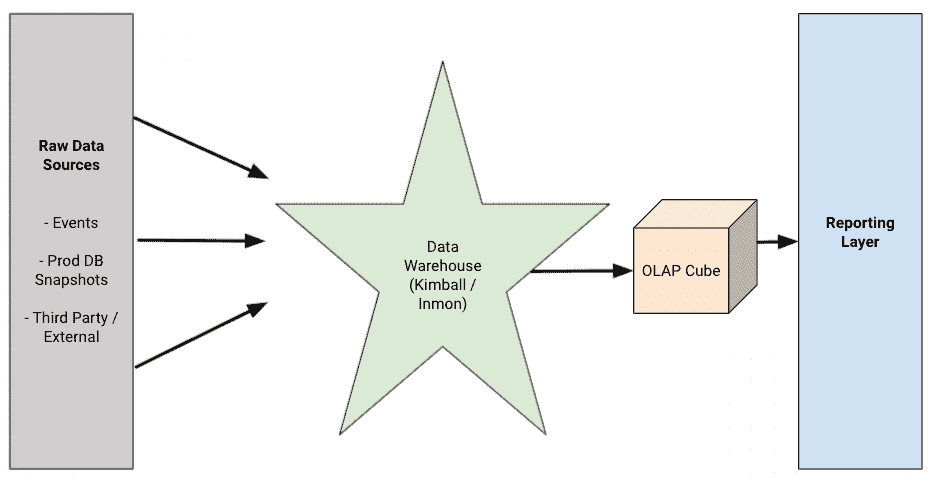
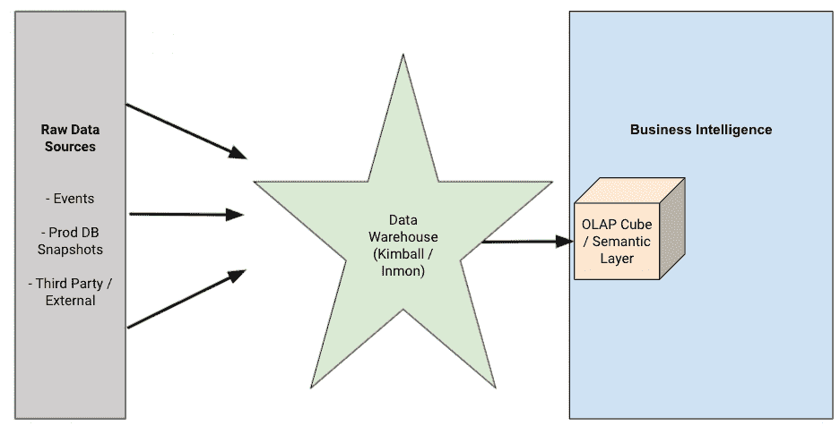
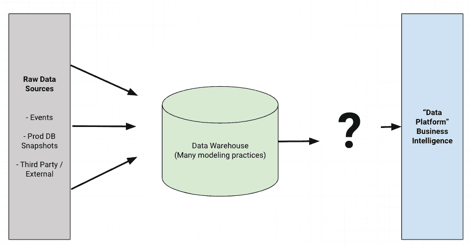
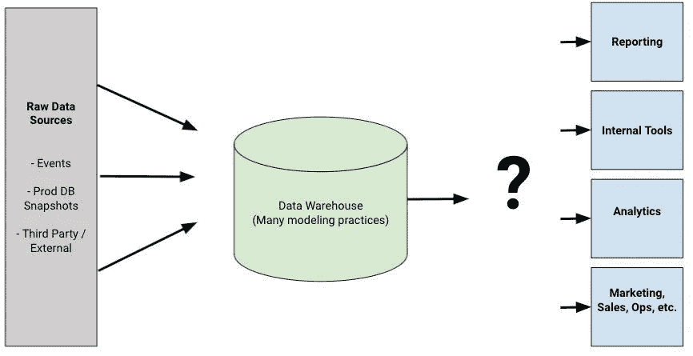
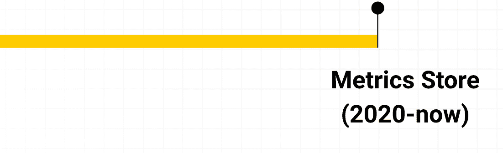
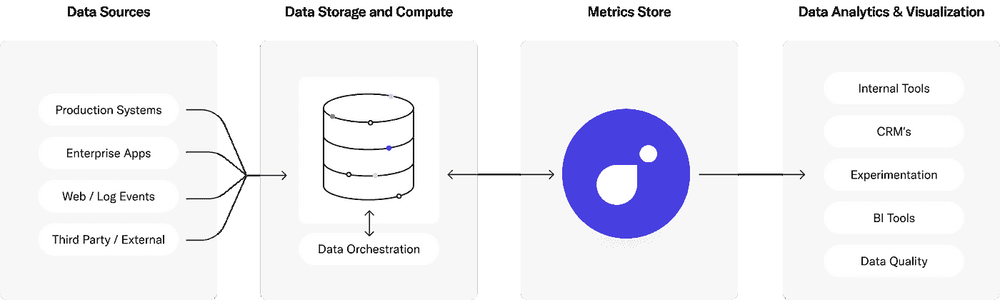

# 度量存储的简要历史

> 原文：<https://towardsdatascience.com/a-brief-history-of-the-metrics-store-28208ec8f6f1?source=collection_archive---------12----------------------->

## ***一个内部数据产品如何成为下一个热门数据工具***

术语“度量存储”在数据社区引起了一些轰动。“时髦”的东西通常是新的，对吗？实际上，与商业智能(BI)非常相似，度量存储的概念比您想象的要早。

像 [Airbnb](https://medium.com/airbnb-engineering/how-airbnb-achieved-metric-consistency-at-scale-f23cc53dea70') 、[优步](https://engineering.linkedin.com/unified-metrics-platform%20Nick%20Handel%20Nick%20Handel%203:35%20PM%20Dec%203%20@james@transformdata.io%20might%20be%20able%20to%20add%20some%20context%20here%20from%20his%20early%20days%20at%20fb%20%20Turn%20on%20screen%20reader%20support%20%20The%20Journey%20Towards%20Metric%20Standardization)和 [LinkedIn](https://engineering.linkedin.com/unified-metrics-platform) 这样的大型科技公司是一些在指标层变得酷之前就看到其价值的公司的例子。我甚至在一篇[过去的媒体文章](https://nickhandel.medium.com/my-experience-with-airbnbs-early-metrics-store-d4e79cc89920)中谈到了我在 Airbnb 的经历。这些公司发现，为了了解他们的业务、进行实验和分享见解，他们需要一个集中的位置来存放指标定义、治理和上下文。数据和分析项目只有在人们信任数据，并且在整个公司范围内，从小团队到最高管理层，每个人都同意如何报告数据的情况下才能发挥作用。

在本文中，我们将讨论[指标存储](https://blog.transform.co/what-is-a-metrics-store-why-your-data-team-should-define-business-metrics-in-code/)概念的起源，公司过去是如何处理这项技术的，以及指标存储的未来。现在，让我们踏上一次通往过去和未来的旅程。

有人看见布朗医生了吗？我们要一直追溯到 2000 年。‌ ‌Photo 由[乔尔·穆尼斯](https://unsplash.com/@jmuniz?utm_source=unsplash&utm_medium=referral&utm_content=creditCopyText)在 [Unsplash](https://unsplash.com/s/photos/delorean?utm_source=unsplash&utm_medium=referral&utm_content=creditCopyText)

# 度量存储的起源:事件的时间表

度量存储的想法来自一个常见的问题，即杂乱的数据。你已经听过一遍又一遍了，但是随着对更多数据需求的增长，复杂性也在增加。

用不了多久，您的度量逻辑就会散落一地——这是数据分析师最糟糕的噩梦。

此图显示了指标逻辑如何轻松地分散在数据分析工具中。作者照片。

那么我们是怎么到这里的呢？

导致指标存储创建的高级事件时间表。作者照片。

# 数据建模的早期(1996 - 2010 年)

在自助式 BI 出现之前，公司严重依赖人员和流程来管理消费数据集。大多数 BI 工程师可用的工具都是围绕 cron 作业和 SQL 语句构建的，这使得编排数据管道变得非常困难。存储大量数据的成本也很高，因此人们必须小心提取的内容，小心转换，然后加载小数据集以供使用。这需要非常小心地正确管理，以便数据立方体可以用于推动业务决策。为手动数据输入编排一系列手动 Excel 表格编辑是早期 BI 从业者面临的另一个挑战，IT 团队被召集来帮助构建技术步骤和流程以保持同步。

在自助式商业智能出现之前，存储大量数据的成本很高，因此团队必须小心提取的数据，进行仔细的转换，然后加载小数据集以供使用。

# 自助式商务智能工具出现(2010 年初)

2010 年后，交互式仪表盘席卷了整个行业，为数据团队和业务团队之间的更多协作铺平了道路。随着交互式报告成为数据分析师团队的主要产出，以帮助业务利益相关者消费他们自己的数据，出现了“仪表板即服务”的想法。但这也导致了复杂性，因为分析师的时间有限，无法以新请求到来的速度完成数据面包线。更糟糕的是，大多数公司有不止一个 BI 工具，因为最终用户更喜欢需要重复逻辑的不同界面。

2010 年后，交互式仪表盘席卷了整个行业，为数据团队和业务团队之间的更多协作铺平了道路。

这是像 Airbnb 这样的科技公司开始构思一个[指标库](https://medium.com/airbnb-engineering/how-airbnb-achieved-metric-consistency-at-scale-f23cc53dea70)的想法，用于报告和准备指标进行分析。

# 数据平台的进步(2015 - 2020 年)

大约在 2015 年，OLAP 立方体的概念过时了，因为人们努力为他们的 BI 工具维护这些漂亮干净的切片和骰子界面。相反，数据平台旨在接收、处理、分析和呈现不同的数据，将不同的数据集中到一个地方，以便更容易直接从数据仓库进行管理。

大约在 2015 年，OLAP 立方体的概念过时了，因为人们努力为他们的 BI 工具维护这些漂亮干净的切片和骰子界面。

但是，随着越来越多的公司投资于数据，这些工具变得更加先进，在某些情况下更加专业化。不是所有的都可以存在于单一的数据平台中。数据管道的每一步都变得更加精简和专业化，工具变得更加分散。这使得数据治理变得复杂而难以控制。

# 专业化催生新的数据应用(2017 年至今)

最近几年，这种专门化走得更远，产生了支持新应用的新颖工具。这导致了对治理的需求，以及围绕可见性、沿袭和业务运营健康的新挑战。不一致的数据集让分析师费力地通过数百行 SQL 语句来确保他们提供的答案是准确的。

如今，团队从他们的数据仓库或数据湖中提取数据，并将这些数据带入各种工具，包括多种商业智能和实验平台。

近年来，我们简化了流程的每一步，因此，我们现在拥有的工具比以往任何时候都多。这导致了两大挑战:不同的数据建模实践和治理挑战。

# 指标商店(2020 -未来)

现在，度量存储已经成为他们自己的 SaaS 产品，最终恢复了 OLAP 立方体的治理，同时减少了数据重复和逻辑重复，并支持新的数据应用程序。

度量存储(或度量层)位于组织的数据仓库和其他下游工具之间。

这意味着，所有组织现在都可以使用曾经为大型科技公司保留的复杂技术，这些公司可以集中资源，利用内部工具实现这些新的数据应用程序。让我们来谈谈那些成功创建了内部度量工具的科技公司，以及他们学到了什么。

# 获得牵引力:科技公司如何建立内部指标商店

由于像 [Transform](https://transform.co/) 这样的度量存储直到最近才开始商业化，组织用内部工具解决了不同度量定义的问题。这是一个需要解决的复杂问题，许多试图建立指标平台的公司都失败了。不幸的是，关于这些经历的博客文章并不多，但是感兴趣的人可以从这些经历中学到一些东西。

成功构建这些工具的组织通常是拥有大型创新内部数据团队的大型科技公司。他们比更广泛的行业更早地经历了治理和不断增长的数据多样性和消费点的挑战，并且拥有寻求内部工具来解决这些问题的资源。

## Airbnb: Minerva 公制平台

Airbnb 的 metric 平台 [Minerva](https://medium.com/airbnb-engineering/airbnb-metric-computation-with-minerva-part-2-9afe6695b486) 是内部 metric 商店的一个流行例子。Airbnb 的度量工具可以追溯到 2014 年，当时该公司开始扩大 A/B 测试的规模。该公司在称为“core_data”的最关键数据表的高质量数据建模方面进行了大量投资，但分析师仍然花费太多时间来收集数据集进行分析，并且经常难以报告相同的数字。为了解决这个问题，他们创建了 Minerva，它“将事实和维度表作为输入，执行数据反规范化，并将聚合的数据提供给下游应用程序。”

## 优步:uMetric 解决公制差异

优步明白指标在他们的决策中起着至关重要的作用。优步的一个众所周知的指标是[司机接受率](https://eng.uber.com/umetric/)，他们将其表示为“司机接受的请求总报价”，这是他们客户和司机体验的关键。但是确定这些类型的度量标准只是难题的一部分。由于数据民主化程度的提高，优步的数据团队也看到了一个共同的挑战——团队都有自己的数据管道和消费工具，导致完全不同的指标逻辑和价值。优步创建了 [uMetric](https://eng.uber.com/umetric/) ，目标是“构建工程解决方案来解决业务关键指标的差异。”

## LinkedIn:单一真实来源的统一度量平台

LinkedIn 在他们的[工程博客](https://engineering.linkedin.com/unified-metrics-platform)上写了一篇关于他们的统一指标平台的文章，该平台“通过提供集中的指标处理管道(即服务)、指标计算模板、一套工具和流程，以一致、可信和简化的方式促进指标生命周期，成为 LinkedIn 所有业务指标的唯一真实来源。”

## Spotify:扩展实验和分析

这些公司并不孤单。Spotify 还宣布了他们的[新实验平台](https://engineering.atspotify.com/2020/10/29/spotifys-new-experimentation-platform-part-1/)，其中包括一个指标目录，可以运行“SQL 管道将指标导入数据仓库，从那里可以将数据以亚秒级延迟提供给用户界面和笔记本电脑。”⁴

这些组织正在努力平衡更广泛的数据访问和跨所有工具的标准化度量逻辑，从他们那里可以学到很多东西。

# 未来:新技术正在铺平道路

直到最近，如果组织想要一个集中的度量位置，他们必须自己构建。这需要大量的基础设施投资，有时需要代表工程团队工作数年。

现在，度量存储作为现代数据堆栈中的一个独立类别，正在获得越来越多的关注。这项技术提供了一些关键优势:

*   **指标成为数据的语言:**您可以在一个地方构建指标逻辑并支持各种数据模型。度量标准已经是业务的语言，那么为什么不使用它作为您如何与洞察互动的模型呢？
*   **消除事实的第二来源:**整合你所有的度量标准，这样你所有的度量标准在所有的上游和下游工具中都是一致的。
*   **围绕指标建立一个知识中心:**为您的指标添加上下文，这样数据团队就不会一遍又一遍地回答相同的问题。所有的问题和上下文都已经准备好，可供数据团队和业务用户访问。

我认为未来每个人都可以使用 metrics stores，无论您的组织规模或行业如何。

[1]: Amit Pahwa，Cristian Figueroa，Zhang，Haim Grosman，John Bodley，Jonathan Parks，Maggie Zhu，，Robert Chang，Shao Xie，Sylvia Tomiyama，。(2021 年 6 月 1 日)。*Airbnb 如何规模化标准化公制计算* [https://medium . com/Airbnb-engineering/Airbnb-Metric-computing-with-Minerva-part-2-9 AFE 6695 b486](https://medium.com/airbnb-engineering/airbnb-metric-computation-with-minerva-part-2-9afe6695b486)

[2]:王晓东，，孟，俞，。(2021 年 1 月 12 日)。*迈向公制标准化的旅程* [https://eng.uber.com/umetric/](https://eng.uber.com/umetric/)

[3]:领英工程。*统一指标平台(UMP)。* [https://engineering.linkedin.com/unified-metrics-platform](https://engineering.linkedin.com/unified-metrics-platform)

[4]:约翰·里德堡。(2020 年 10 月 29 日)。 *Spotify 的新实验平台(第一部分)* [https://engineering . atsspotify . com/2020/10/29/spotifys-New-Experimentation-Platform-Part-1/](https://engineering.atspotify.com/2020/10/29/spotifys-new-experimentation-platform-part-1/)