# Azure 机器学习工作室简介

> 原文：<https://towardsdatascience.com/a-brief-introduction-to-azure-machine-learning-studio-9bbf41800a60?source=collection_archive---------7----------------------->

## Azure ML Studio 的主要概念概述:在不到 10 分钟的时间内理解基础知识

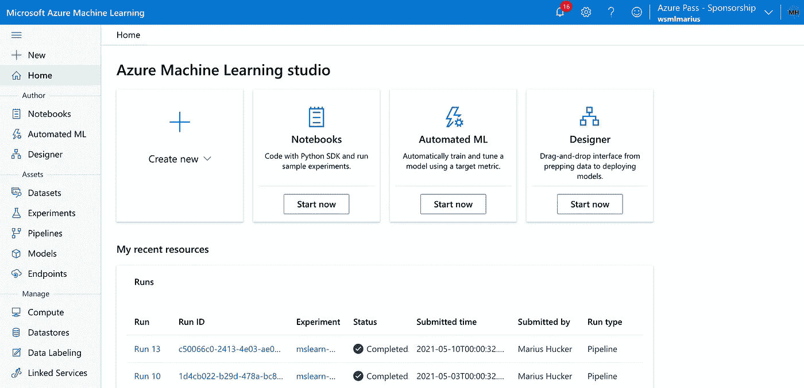

作者图片

Azure 机器学习工作室是微软在 Azure 云中机器学习计算的中心联系点。它是微软机器学习工作室 Classic 的继任者，将于 2024 年退役。多年来，微软在其 Azure ML Studio 中扩展了功能和可能性的数量，并且进展仍在继续。微软试图使算法和实验的创造和工作尽可能简单。因此，与硬编码算法相比，Azure ML 的自动化和点击界面功能会越来越多。但是现在，让我们看看工作室的主要组成部分:

Azure ML Studio 菜单分为三个主要部分:**、作者、资产和管理**。部分*作者*处理代码的创建和机器学习过程的设置。*资产*是在作者部分创建和存储的资源，比如在设计器中创建的管道。它控制资源的整个工作流程，从通过管道输入数据集到输出的端点(例如，通过 REST API 连接到真实系统)。*管理*部分用于系统的后台。它包括计算集群和实例、存储数据集的数据存储以及与其他系统的集成。不知何故，这是看不见的一层。

## **作者**

*   **笔记本**:这个部分包含了笔记本的创建、编辑和运行的所有内容。
*   **自动化的 ML:** 这个部分是为了简单的自动化和不同机器学习技术的比较。您可以很容易地输入一个数据集，并在不同的性能指标下查看各种 ml 技术的性能。
*   **设计器:**设计器是一个拖放工具，用于创建从数据集输入到评估的 ML 工作流。它很容易使用，有许多功能，可以通过文本搜索或点击左边的箭头和标题找到。

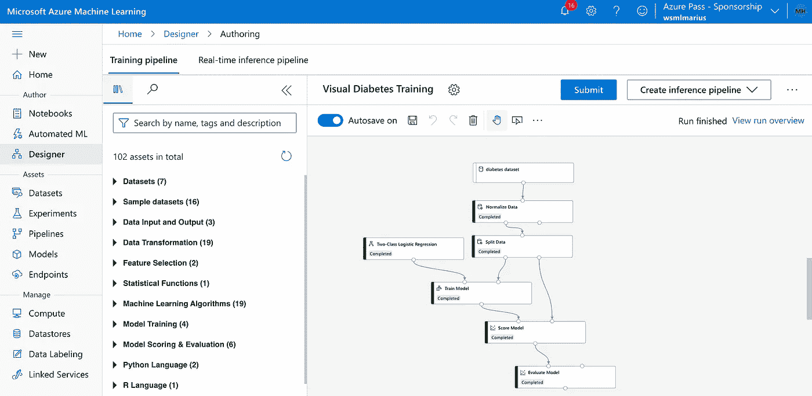

作者图片

## **资产**

*   数据集:顾名思义，这个部分用于注册和管理你的数据集。
*   **实验:**实验提供了使用不同设置(如超参数)测量运行和控制指标的可能性。
*   **管道:**通过设计器，可以创建管道并在管道段内注册，以控制运行次数、运行时间、名称等。
*   **型号:**用于注册和管理您的型号。
*   **端点:**在这里，您可以控制和查看所有端点，通过这些端点，您可以让其他系统和应用程序使用您的模型/算法。

 [## 通过我的推荐链接加入 Medium-Hucker Marius

### 作为一个媒体会员，你的会员费的一部分会给你阅读的作家，你可以完全接触到每一个故事…

medium.com](https://medium.com/@hucker.marius/membership) 

## **经营**

*   **Compute:** 这个部分允许您设置、启动和停止计算集群和实例，以及运行您的模型的推理集群
*   **数据存储:**包含数据集、模型、笔记本以及所有文件和数据的存储。
*   **数据标注:**老实说，我不明白为什么这个部分在管理下，而不在作者下。我认为数据标签更适合第一部分，因为它与数据处理有关，但也许它指的是“管理您的数据”，这就是为什么它在“管理”之下。在该部分，您可以获得很大的可能性和支持来标记您的所有数据示例。
*   **关联服务:**用于其他服务和系统的集成。

在对每个菜单点和基本类别的第一次简要解释之后，我现在将进一步看看在每个类别中你能实现什么。让我们从笔记本开始:

## 笔记本电脑

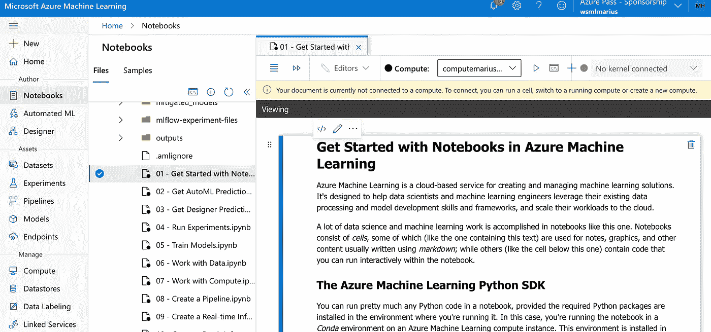

作者图片

在“笔记本”部分，您可以选择您在“计算机”下创建的计算机来运行您的笔记本。如果还没有可用的，您需要创建一个[计算资源](https://docs.microsoft.com/en-us/azure/machine-learning/how-to-create-manage-compute-instance?tabs=python)。在左手边你可以找到文件夹结构，上面你可以看到四个蓝色的小图标。左边的是打开一个终端，通过控制台管理你的系统。控制台图标旁边的加号是创建新文件夹或文件所必需的。剩下的就很简单了。双击打开您的笔记本，键入代码和文本，并通过按 enter(和 shift)打开您的单元格或笔记本。

## **自动化 ML**

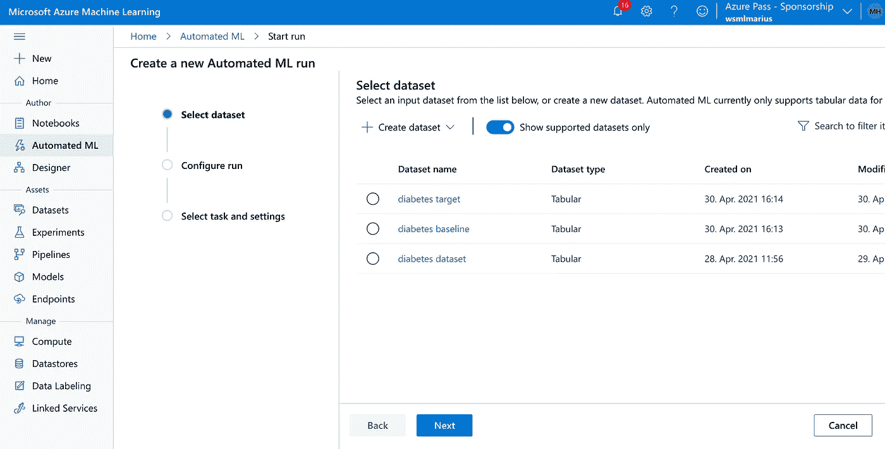

作者图片

AutoML 非常适合不使用代码创建模型。这是一个无代码的用户界面，你可以简单地点击通过一切。当然，你不能构建最复杂的模型，但是对于标准模型，获得第一次评估或者比较不同的模型是非常有用的。正如您在下图中看到的，您可以选择主要指标、运行模型的迭代次数、阈值、交叉验证的数量、应该阻止(因此不使用)的算法，以及其他一些设置。

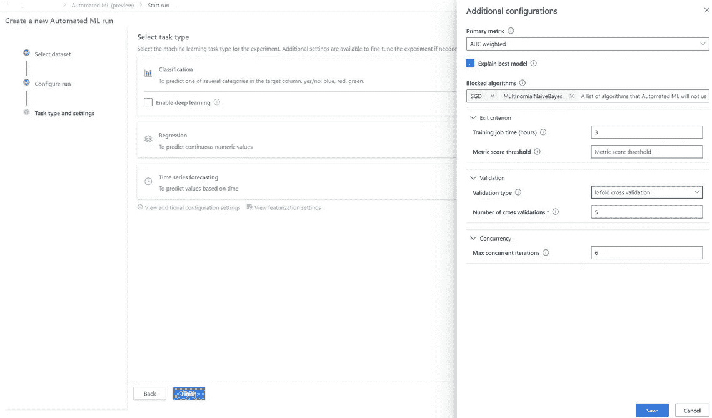

作者图片

一如既往，您可以使用的算法取决于任务类型，因此您可以轻松地在回归、分类和时间序列之间进行选择。对于一些深度学习，可以勾选深度学习复选框。此外，可以自动选择特征或定制特征。要了解更多信息，这里有一个完美的指南。

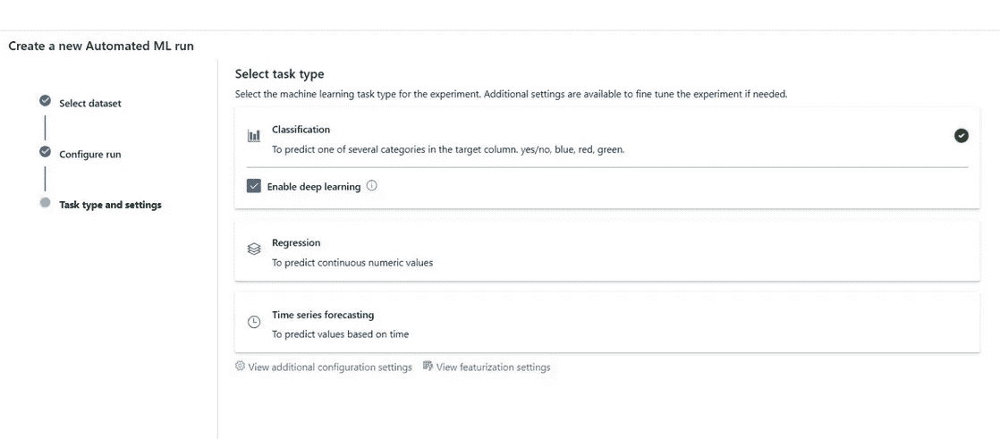

部署模型后，您可以看到模型的详细信息、解释和指标(如下图所示)。

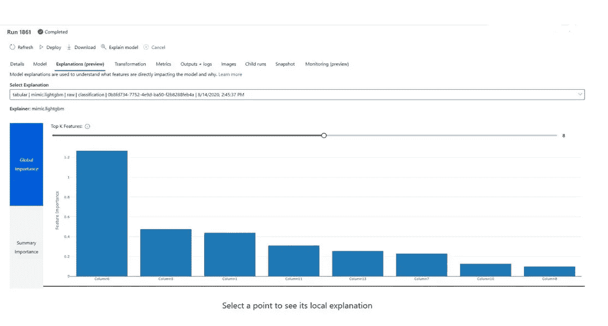

作者图片

**设计师&设计师模块**

作者图片

设计器是用来设置机器学习管道的拖放工具。对于设计者来说，目前大致有 60 多个模块，可以分为数据转换、数据输入和输出、特征选择、统计函数、回归、聚类、分类、模型训练和模型评估/评分。如你所见，这些设计模块涵盖了整个 ML 周期。所以你可以不用编码就能建立模型。您只需选择模块并连接它们，您的管道就可以进行测试和干预了。[了解更多关于模块的信息。](https://docs.microsoft.com/en-us/azure/machine-learning/studio-module-reference/a-z-module-list)

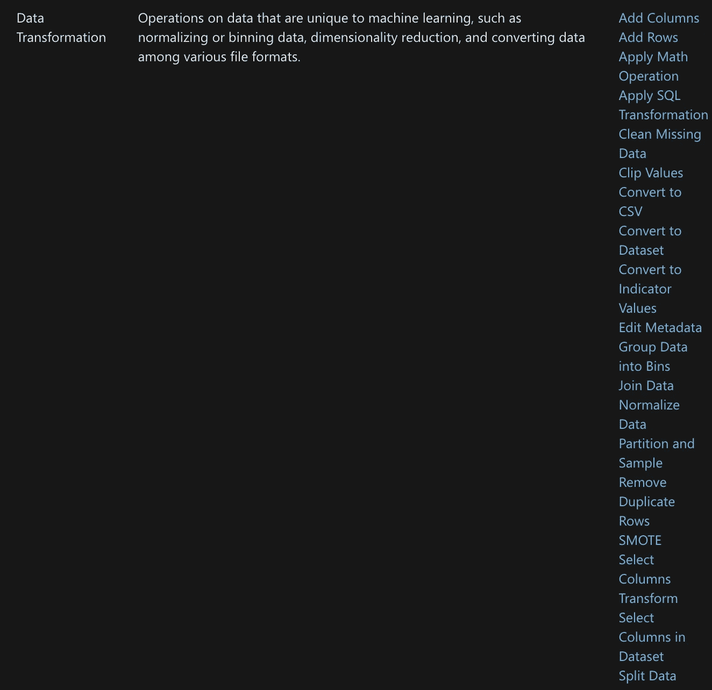

作者图片

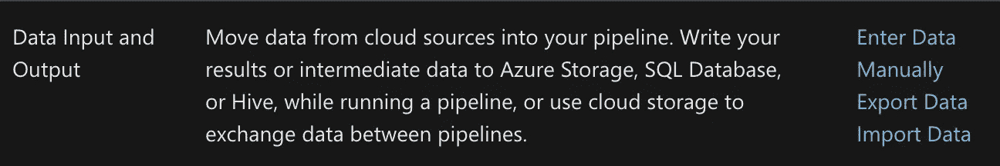

作者图片

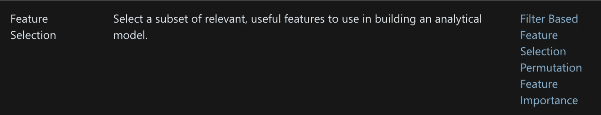

作者图片

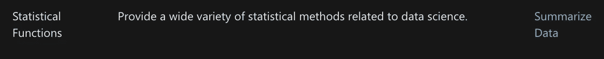

作者图片

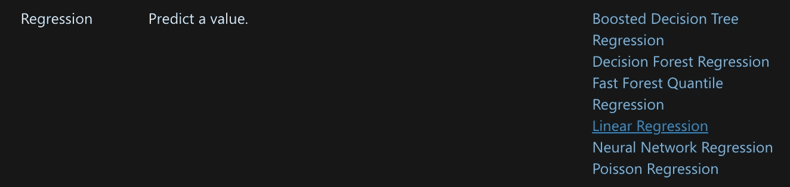

作者图片

作者图片

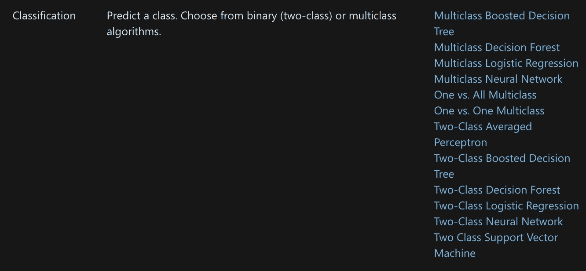

作者图片

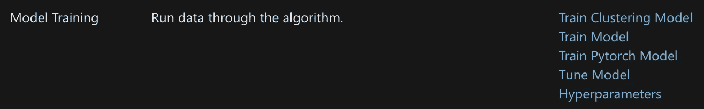

作者图片

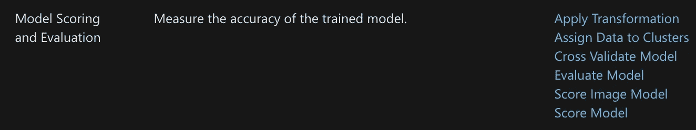

作者图片

# Azure ML 中的资产部分

## 数据集

顾名思义，这个部分是设置数据集的部分。重要的是要知道，您的数据不是传输的，而是从现有存储中引用的。因此它不会导致额外的存储空间成本。有两种类型的 Azure 数据集:文件数据集和表格数据集。文件数据集是指存储中的文件，并基于这些文件(如音频文件或图像)创建数据集。使用文件数据集时，必须已经为模型准备好数据。

表格数据集更加结构化，当然还有 excel 和 CSV 文件中的表格。这种类型的数据非常适合基于文本的数据。

## 实验

这是您可以开始 ML 模型运行的部分。实验提供了使用不同设置(如超参数)测量运行和控制指标的可能性。在实验部分，您可以跟踪指标，测试不同的超参数，并运行一些测试来检查您的模型性能是否有所提高。

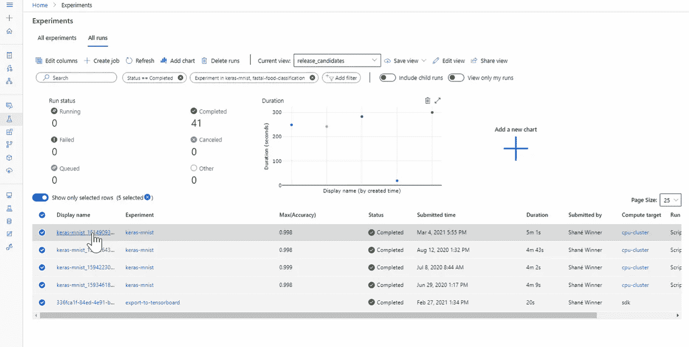

来源:[https://docs . Microsoft . com/en-us/azure/machine-learning/how-to-track-monitor-analyze-runs？tabs=python](https://docs.microsoft.com/en-us/azure/machine-learning/how-to-track-monitor-analyze-runs?tabs=python)

## 管道

您通过设计器构建的管道可以在“管道”选项卡中进行编排。您可以在那里看到您的管道运行，管道创建的时间，管道运行所需的时间，它们的状态，以及它属于哪个实验。管线运行旁边有“管线草稿”选项卡，用于查看您只计划了哪些管线而没有运行。[求更多](https://docs.microsoft.com/en-us/azure/machine-learning/how-to-create-machine-learning-pipelines)

## 模型

在模型部分，您可以编排和管理您的所有模型。对于每个模型，您可以看到细节，例如参数、工件、端点以及模型所使用或连接到的数据集。在工件部分，您可以看到模型的文件，比如 config 和 score.py。

## 端点

端点部分实际上是提供 web 服务和 API，以便其他应用程序、公司和网站可以使用您培训、构建和优化的模型和服务。在这里，您可以管理端点、密钥和与它们连接的 URL，当然，这是您可以允许干扰的地方

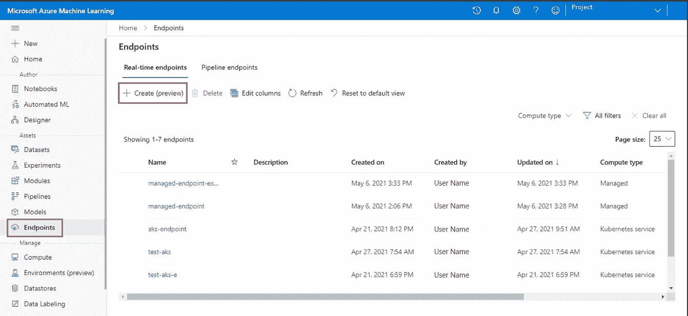

来源:[https://docs . Microsoft . com/en-us/azure/machine-learning/how-to-use-managed-online-endpoint-studio](https://docs.microsoft.com/en-us/azure/machine-learning/how-to-use-managed-online-endpoint-studio)

# **管理 Azure ML 的部分**

## 计算

计算部分为您提供了选择模型或服务所需的计算资源的可能性。微软提供各种计算资源，从只有几 GB RAM 的小型计算机到能够管理几乎所有型号的大型计算机。当然，价格也各不相同。也可以在 CPU 和 GPU 之间选择。“计算”部分中的选项包括计算实例、训练群集、推理群集和附加计算。

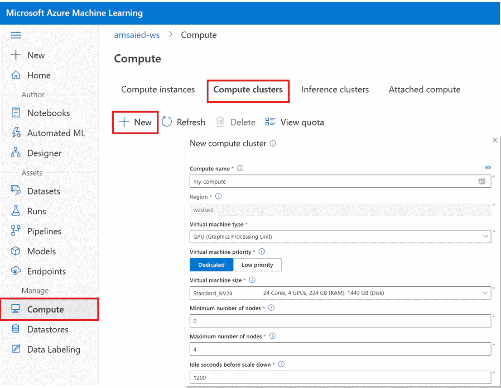

来源:[https://azure . github . io/azure ml-cheat sheets/docs/cheat sheets/python/v1/compute-targets/](https://azure.github.io/azureml-cheatsheets/docs/cheatsheets/python/v1/compute-targets/)

## 数据存储

包括存储数据集、模型、笔记本以及所有文件和数据的存储器。您可以在此部分设置和管理存储。有不同种类的数据存储。在微软网站的下图中，你可以看到所有这些。例如，您可以在您的 Azure 门户中设置类型 Azure Blob 存储，并将该存储连接到它。

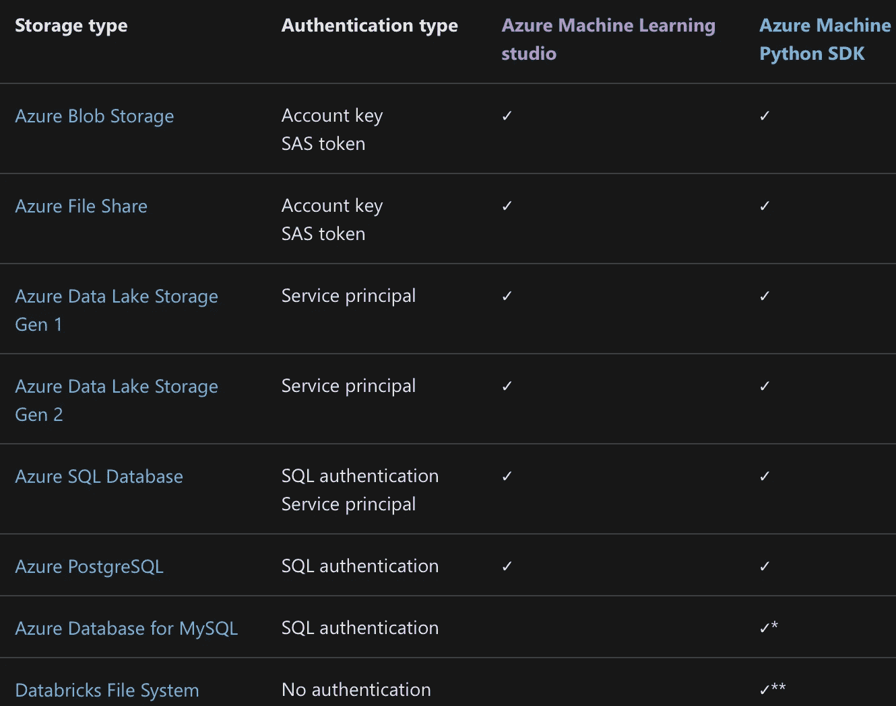

来源:[https://docs . Microsoft . com/en-us/azure/machine-learning/how-to-access-data](https://docs.microsoft.com/en-us/azure/machine-learning/how-to-access-data)

## 结论

Azure ML Studio 是一个真正强大的平台，正在被永久开发以进一步改进和促进数据科学家和数据工程师的工作。我相信在未来他们会进一步自动化流程，包括越来越多不同的和更复杂的算法。如果你还没有尝试过 Azure，有一个 30 天的试用阶段来测试资源和玩一点点。我可以推荐你深入 Azure 并了解一点它——它是许多基于机器学习的系统和应用的未来。

 [## 通过我的推荐链接加入 Medium-Hucker Marius

### 作为一个媒体会员，你的会员费的一部分会给你阅读的作家，你可以完全接触到每一个故事…

medium.com](https://medium.com/@hucker.marius/membership) 

## [阅读更多像这样的](http://Read more like this)