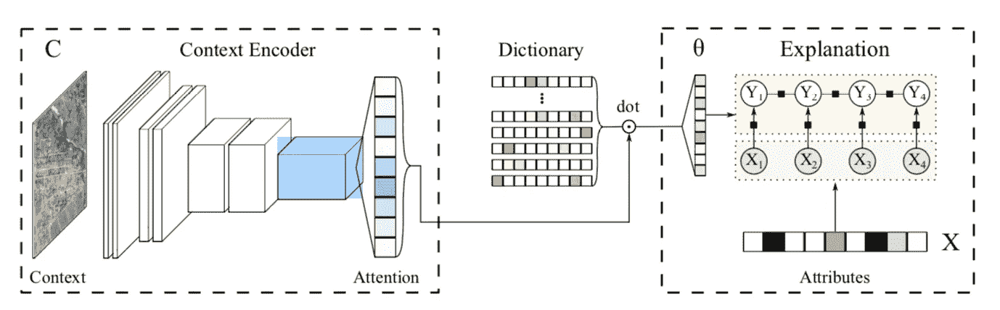

# 上下文解释网络简介

> 原文：<https://towardsdatascience.com/a-brief-introduction-to-contextual-explanation-networks-6b8f8e3956af?source=collection_archive---------46----------------------->

## CEN 学会了同时预测和解释

照片由 [JJ 英](https://unsplash.com/@jjying)在 [Unsplash](http://unsplash.com)

随着人工智能和机器学习算法在现实世界中的稳步采用(麦肯锡，2020 年)，需要更适当的方法来解释或解释算法的预测。这些算法影响着金融、医疗和刑事司法领域的关键决策。信誉度、医疗诊断或司法判决可以在很大程度上由机器来确定(Brotcke，2020；Rudin，2019)。在许多情况下，人类无法完全解释或说明一个关键决策是如何做出的。

为了解决这种类型的算法不透明性，来自卡内基梅隆大学和谷歌的一小组研究人员提出了上下文解释网络(CENs)。与以前的解释方法相反，CEN 学会了同时预测和解释，提供了定性的见解，并经常改善原始预测的性能，而不会产生额外的计算开销(Al-Shedivat 等人，2020)。

# 压榨石灰

解释模型的概念并不新鲜。2016 年，来自华盛顿大学的研究人员引入了本地可解释的模型不可知解释，俗称 LIME (Ribeiro et al .，2016)。LIME 建议用文本或视觉人工制品来补充算法，这可能会提供对其行为的定性理解。更广泛地说，目标是在数据通过算法时提供人类可理解的数据表示。例如，用于理解语言的算法(例如，Google Translate)将单词表示为高维向量空间中的点(Bengio 等人，2006)。一种更易于人类理解的表示是一个简单的二进制向量，表示一个单词的存在或不存在(Ribeiro 等人，2016)。

虽然 LIME 和其他不可知论者的解释方法可能会提供一些透明度，但解释是独立学习的，并不能保证是潜在预测的基础。这些缺点会导致对原始算法方法的错误解释或曲解(Al-Shedivat 等人，2020)。类似地，流行的不可知论方法容易被仅仅通过引入噪声或随机化数据来利用(Al-Shedivat 等人，2020；金等，2017)。相比之下，语境解释网络没有继承前人的任何固有缺陷。

# 将复杂性转移给编码器

CEN 建筑的例子(Al-Shedivat 等人，2020 年)

一般来说，CEN 的工作分两步走。首先，原始算法的输入子集生成由领域专家定义的简单概率模型(例如，稀疏线性模型)(Al-Shedivat 等人，2020)。然后，将生成的模型应用于另一个输入子集，并生成预测。简而言之，CENs 可以使用强大的编码器来表示复杂的模型类。通过将复杂性卸载到编码过程，在变量和预测之间得出简单的结论(即线性模型)(Al-Shedivat 等人，2020)。换句话说，所有的复杂性都浓缩到适合问题背景的高级概念中。

> “通过使用强大的编码器，CENs 可以表示复杂的模型类。与此同时，通过将复杂性纳入编码过程，我们实现了解释的简单性，并可以根据感兴趣的变量来解释预测。”
> 
> -谢迪瓦等人，2020 年

# 衡量成功

该团队主要着手完成两个目标。定义高性能、内在可解释的深度学习架构，并证明不可知论者的解释如何不足。当应用于常见用例(例如，计算机视觉、情感分析)时，通过 CEN 与替代方案的实证分析收集证据。

该团队使用两个指标来衡量他们的成功——相对于基线的预测性能和定性见解。在一个例子中，使用高度复杂的 VGG-F 嵌入对分类器(使用卫星图像作为输入)进行预训练。选择逻辑回归和多层感知器(MLP)作为基线。CEN 模型的表现优于简单的逻辑回归和 MLP，同时还能清晰地识别出一个有背景的、有意义的解释(Al-Shedivat 等人，2020)。

最终，实验证明了从复杂的低级输入到领域专家预先定义的高级有意义变量(例如，分类特征)的映射是可能的。该算法的预测与人类可解释的映射相结合，有效地使其变得透明。该团队设法在不产生额外开销的情况下实现了这一点，并且在某些情况下提高了性能。

# CENs 与“黑箱”问题

用 CEN 代替像莱姆这样的不可知论解释的好处是显而易见的。额外的性能、零开销和线性可解释性使 CENs 成为一种实用的替代方案。但是，CENs 可能只能部分解决“黑箱”问题，而事后解释通常是用来解决这个问题的。

在两种不同的情况下，算法被称为“黑盒”。第一种是当其基础数学计算超出人类理解时(Rudin，2019)。第二种情况是算法是专有的，方法是秘密的。

前者由 CENs 优雅地提出，至少和它的前身 LIME 一样具有可解释性。这项研究没有直接涉及后者。CEN 架构输出一个完整的解决方案，不会用于事后解释专有解决方案。

使用专有解决方案的理由是充分的。原生机器学习应用需要多学科能力、基础设施以及持续的监控和维护。依靠第三方往往不那么令人望而却步。明显的(但并非无关紧要的权衡)是不透明。很难确保它们的可靠性、稳健性和不存在不良偏差(Al-Shedivat 等人，2020 年)。像许多其他新兴的可解释性方法一样，CENs 打算用透明性来取代不透明的专有解决方案。

尽管这项研究非常清楚地证明了它的价值。没有直接对照其他事后模型不可知的方法对 CEN 进行评估。从业者可能会接受 LIME 通常代表许多其他广泛使用的解释方法，但并不是所有的解释模型都适合所有类型的模型(Hall 等人，2021)。尽管如此，这项研究并没有消除它和类似方法之间的歧义(Guidotti 等人，2019 年)。

其他当代方法呈现出许多与 CEN 相同的好处。例如，杜克大学的一个研究团队提议在算法的现有训练过程中添加一个特殊的原型层。最终的预测是与人类可解释的原型相似性的加权和(Chen et al .，2019)。2017 年，谷歌引入了概念激活向量(TCAV)测试，该测试分享了将复杂的低级功能映射到有意义的高级概念的想法(Kim et al .，2017)。这两个例子都可以作为有用的基准或 CEN 的适当替代。

# 适应性强且高效

在我看来，[语境解释网络架构](https://arxiv.org/abs/1705.10301)是对可解释性研究的一个有意义的贡献。这种方法(以及其他类似的方法)使得透明度和准确性之间的权衡变得不那么重要。CEN 对现有算法的适应性和它的计算效率使它成为重视算法透明性的从业者的一个可访问的选项。

## 参考

谢迪瓦特 M，杜比 A，兴 EP。2017.上下文解释网络。arXiv [csLG]。[访问日期:2021 年 1 月 28 日]。https://www.jmlr.org/papers/volume21/18-856/18-856.pdf.

Bengio Y，Schwenk H，Senécal J-S，Morin F，Gauvain J-L. 2006 年。神经概率语言模型。《机器学习的创新》。柏林/海德堡:施普林格出版社。第 137-186 页。

布罗特克湖 2020。在 AI/ML 时代修改模型风险管理实践。金融机构风险管理杂志。[访问日期:2021 年 2 月 6 日]。https://hs talks . com/article/5661/modificing-model-risk-management-practice-in-the-er/。

Goodfellow I，库维尔本吉奥 Y，2016 年深度学习。英国伦敦:麻省理工学院出版社。

Guidotti R，Monreale A，Ruggieri S，Turini F，Giannotti F，Pedreschi D. 2019。解释黑盒模型的方法综述。计算机监测。51(5):1–42.

H2O 无人驾驶人工智能的机器学习可解释性。H2O . ai[2021 年 2 月 8 日访问]。http://docs . H2O . ai/driverless-ai/latest-stable/docs/booklets/mli booklet . pdf

Kim B，Wattenberg M，Gilmer J，Cai C，Wexler J，Viegas F，Sayres R. 2017。特征归因之外的可解释性:概念激活向量的定量测试(TCAV)。arXiv [statML]。http://arxiv.org/abs/1711.11279.

Lundberg S，Lee S-I. 2017。解释模型预测的统一方法。arXiv [csAI]。http://arxiv.org/abs/1705.07874.

Rudin C. 2019。停止解释高风险决策的黑盒机器学习模型，而是使用可解释的模型。纳特马赫智能。1(5):206–215.

Simonyan K，Zisserman A. 2014 年。用于大规模图像识别的非常深的卷积网络。arXiv [csCV]。[http://arxiv.org/abs/1409.1556](http://arxiv.org/abs/1409.1556)。

2020 年的 AI 状态。Mckinsey.com。[访问日期:2021 年 2 月 6 日]。https://www . McKinsey . com/business-functions/McKinsey-analytics/our-insights/global-survey-the-state of-ai-in-2020。