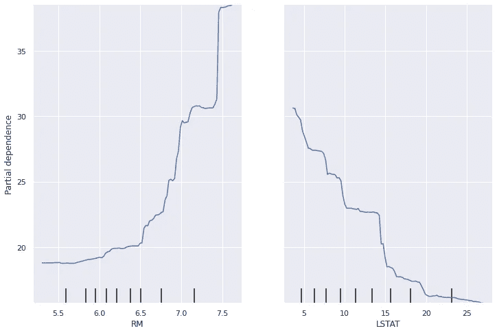
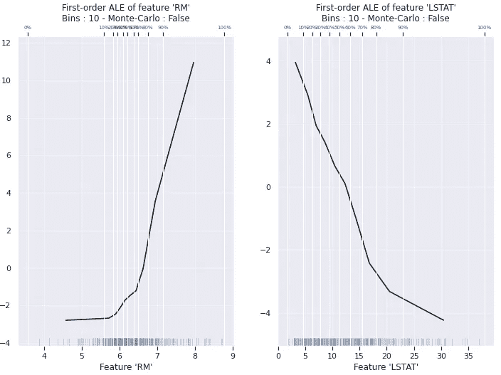
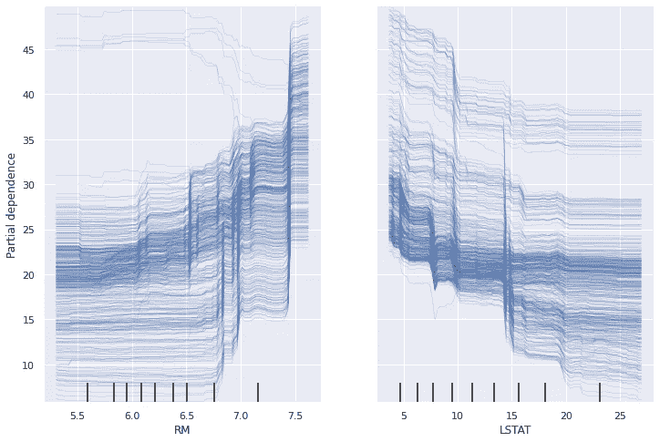
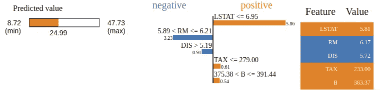
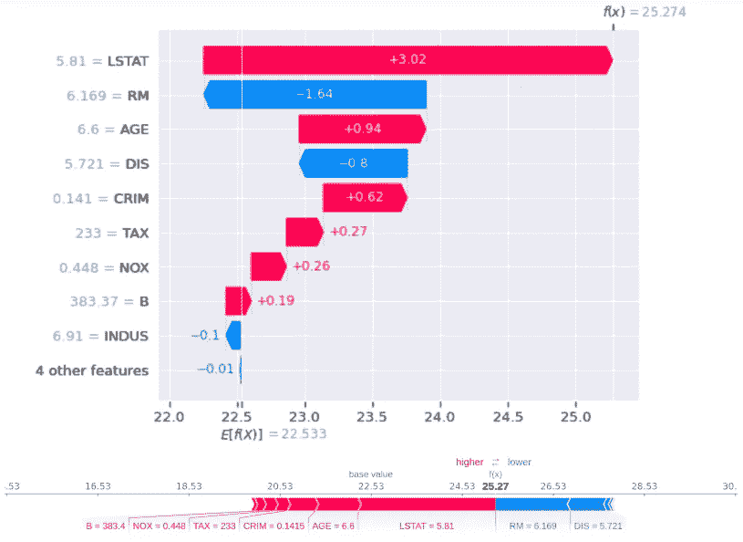

# 解释人工智能的方法概述(XAI)

> 原文：<https://towardsdatascience.com/a-brief-overview-of-methods-to-explain-ai-xai-fe0d2a7b05d6?source=collection_archive---------4----------------------->

## [模型可解释性](https://towardsdatascience.com/tagged/model-interpretability)

## 如何设计一个可解释的机器学习过程

来自 [Pixabay](https://pixabay.com/fr/) 的 [kiquebg](https://pixabay.com/fr/users/kiquebg-5133331/) 的图片。

我知道这个话题已经讨论过很多次了。但是我最近做了一些关于可解释性的演讲(针对 [SCAI](https://scai.sorbonne-universite.fr/) 和[法兰西创新](https://www.france-innovation.fr/))，并且认为在这篇文章中包含我的一些工作会很好。可解释性对于机器学习中决策过程的重要性不再需要证明。用户要求更多的解释，尽管对可解释性和可解释性没有统一和严格的定义，但解释人工智能(或 XAI)的科学论文数量正在呈指数级增长。

正如你可能知道的，有两种方法来设计一个可解释的机器学习过程。要么你设计一个本质上可解释的预测模型，例如使用基于规则的算法，要么你使用一个黑盒模型并添加一个代理模型来解释它。第二种方法叫做事后可解释性。有两种类型的事后可解释模型:描述黑箱模型平均行为的全局模型，或解释个体预测的局部模型。如今，有几种工具可以用来创建事后可解释模型，其中大多数是模型不可知的，也就是说，它们可以独立于所使用的算法来使用。

我将介绍其中最常见的。本文基于 Christoph Molnar 的参考书:[可解释机器学习](https://christophm.github.io/interpretable-ml-book/)。为了说明这些方法，我使用了常见的[波士顿住房数据集](https://www.cs.toronto.edu/~delve/data/boston/bostonDetail.html)。目标是以 1000 美元为单位的自有住房的中值价格。

# 部分相关图。

PDP 是一种全局的、与模型无关的解释方法。该方法显示了单个特征对黑盒模型预测值的贡献。它可以应用于数字和分类变量。首先，我们选择一个特征及其网格值(所选特征的范围)。然后，该特征的值被网格值代替，并且预测被平均。对于网格的每个值，都有一个对应于预测平均值的点。最后画出曲线。主要的限制是人类不能理解超过三维的图形。因此，我们不能在一个部分依赖图中分析两个以上的特性。

PDP 应用于随机森林的示例，该随机森林针对
要素 RM 和 LSTAT 的波士顿数据进行了训练。图片来自作者。

在这些图表中，我们可以看到每个住宅的平均房间数(RM)和人口中较低阶层的百分比(LSTAT)对中间价格的平均影响。比如，我们可以推导出房间数越少，价格中位数越低(这似乎是连贯的)。

函数[*plot _ partial _ dependency*](https://scikit-learn.org/stable/modules/generated/sklearn.inspection.plot_partial_dependence.html)已经在软件包 scikit-learn 的检查模块中实现。

# 累积局部效应(ALE)。

ALE 也是一种全局的、与模型无关的解释方法。它是 PDP 的替代方法，当变量高度相关时，PDP 会出现偏差。例如，表示房间数量的变量 RM 与房子的面积高度相关。所以 RM=7.5 对于一个非常小的区域来说是不现实的。ALE 背后的思想是考虑与所选变量具有相似值的实例，而不是替换所有实例的值。当你平均预测时，你得到一个 **M 图**。不幸的是，M 图代表了所有相关特征的综合效应。为了更好地理解，我引用了来自[可解释机器学习](https://christophm.github.io/interpretable-ml-book/)的例子:

> “假设居住面积对房子的预测价值没有影响，只有房间数有影响。M 图仍然会显示居住面积的大小会增加预测值，因为房间数量会随着居住面积的增加而增加。”

ALE 计算预测的差异，而不是小窗口的平均值(例如，使用经验分位数)。在下面的例子中，我用 10 个窗口绘制了特征 RM 和 LSTAT 的 ALE。

ALE 应用于随机森林的示例，该随机森林针对
特征 RM 和 LSTAT 的波士顿数据进行了训练。图片来自作者。

垂直线代表考虑中的窗口。经验分位数被设计成使得 10 %的个体位于每个窗口中。不幸的是，没有设置仓数量的解决方案，这会严重影响解释。

为了便于说明，我使用了 Github 上的开源包 [ALEPython](https://github.com/blent-ai/ALEPython) 。

# 个体条件期望。

ICE 是一种局部的、与模型无关的解释方法。这个想法和 PDP 一样，但是我们没有画出平均贡献，而是画出每个人的贡献。当然主要限制和 PDP 一样。此外，如果你有太多的个人，情节可能会变得无法解释。

ICE 应用于随机森林的示例，该随机森林针对
要素 RM 和 LSTAT 的 Housing Boston 数据进行了训练。图片来自作者。

在这里，我们看到了每个住宅的平均房间数(RM)和人口中较低阶层的百分比(LSTAT)对 506 个观察值中的每一个的中值价格的影响。再次，我们可以看到房间数量越少，价格中位数越低。然而，RM 对 5 个人表现出相反的行为。应该仔细检查这 5 个人，因为他们可能表明数据库中有错误。

函数[*plot _ partial _ dependency*](https://scikit-learn.org/stable/modules/generated/sklearn.inspection.plot_partial_dependence.html)已经在软件包 scikit-learn 的检查模块中实现。

# 局部可解释的模型不可知解释(LIME)。

LIME，顾名思义，是一种局部模型不可知的解释方法。这个想法很简单，从一个新的观察时间生成一个新的数据集，该数据集由扰动样本和底层模型的相应预测组成。然后，在这个新的数据集上拟合一个可解释的模型，该数据集通过采样的观察值与感兴趣的观察值的接近度来加权。

石灰应用于根据波士顿数据训练的随机森林的示例。选择的观察值是第 42 个，替代局部模型是岭回归。图片来自作者。

在这个石灰的视觉输出中，解释了对第 42 次观察的预测。在创建的数据集中，预测值的范围从 8.72 到 47.73。interset 观察的预测值为 24.99。我们可以看到，LSTAT 的值对预测有积极的影响，这证实了以前从 PDP 和 ICE 得出的结论。

# 沙普利加法解释(SHAP)。

SHAP 是一种基于 Shapley 值的局部模型不可知解释方法。Shapley 值来自博弈论，有几篇关于数据科学的文章和其他文章讨论了这个问题。在这里我只想提醒大家，在这个背景下，**游戏**是协作的，任务是预测，**增益**是预测和一个基线预测(通常是观测值的平均值)之间的距离，**玩家**是特征。然后，Shapley 值被用于在特征中从基线预测中分离预测偏移。因此，每个特征的实现都意味着预测的变化，积极的或消极的。SHAP 背后的想法是将沙普利值解释表示为一种附加特征归因方法。因此，它成为一个线性模型，其中截距是基线预测。下面应用于 XGBoost 的 SHAP 的图形表示说明了这些解释。

SHAP 应用于根据 Housing Boston 数据训练的 XGBoost 回归器的示例。选择的观测值是第 42 个。图片来自作者。

在这个图中，我们看到了每个变量对第 42 次预测的影响。这里，基线预测是 22.533。然后变量 INDUS=6.91 将预测移动-0.1，变量 B=383.37 将预测移动+0.19，以此类推。我们看到最大的变化来自变量 LSTAT 和 RM，它们是该数据集最重要的特征。

# 结论

局部模型比全局模型更常用。如果您想要模型的全局描述，最好使用本身可解释的预测算法。这些不是最精确的算法，但是它们允许对生成的模型进行整体描述。如果您想要一个非常准确的预测模型，通常您希望能够单独解释每个预测，而不仅仅是整个模型。例如，自动驾驶汽车的算法应该能够在发生事故的情况下解释它的每一个预测。

为了简洁起见，我省略了介绍特征重要性、特征相互作用、二阶 ALE、KernelSHAP 和其他方法。我只是做了一个简要的概述，向您展示了今天可以用来解释您的黑盒模型的内容。如果你想进一步了解这个话题，我推荐 [Christoph Molnar](https://christophm.github.io/) 的书:[可解释机器学习](https://christophm.github.io/interpretable-ml-book/)。

# 关于我们

[Advestis](https://www.advestis.com/) 是一家欧洲合同研究组织(CRO ),对统计学和可解释的机器学习技术有着深刻的理解和实践。Advestis 的专长包括复杂系统的建模和时间现象的预测分析。

*领英*:【https://www.linkedin.com/company/advestis/】T4