# 时间序列分析中反对主成分分析的一个案例

> 原文：<https://towardsdatascience.com/a-case-against-pca-for-time-series-analysis-ac66b47629e0?source=collection_archive---------7----------------------->

## [思想和理论](https://towardsdatascience.com/tagged/thoughts-and-theory)

## 如何对时间序列使用线性降维？

我们都用 PCA 进行线性降维。从图像处理到非结构化数据，随时随地为您服务。我们甚至用它来进行时间序列分析，尽管有更好的技术存在。在这篇文章中，我将向您介绍*动态模式分解* (DMD)，这是一种针对高维时间序列的线性降维技术，源于我的研究领域:流体动力学。DMD 结合了两个世界的精华:PCA 和傅立叶变换。在数学上，它与动力系统理论中的一个基本算子有关，这个算子被称为*库普曼算子*。但是在深入 DMD 的数学之前，让我们用一个相当简单的例子来说明为什么 PCA 不是高维时间序列分析的最佳选择。

## 激励人心的例子

作者的动画，灵感来自史蒂夫(@eigensteve)和宾·布伦顿。

想想这部电影。它由 1024 帧 128×128 像素的图像组成。从概念上讲，这是一个高维的时间序列。尽管有 16 384 个自由度，但很明显存在底层低秩结构。毕竟，电影只是由一个正方形和一个以两种不同频率振荡的圆形加上一些随机噪声组成。通过将每一帧重铸为 16 384 维向量，我们可以构建数据矩阵 **X** ，其中每一列都是不同的帧。因此，它是一个 16×384×1024 的矩阵。现在让我们使用主成分分析来解开这个低秩结构。PCA 依赖于 **X** 的奇异值分解，即

在 **U** 包含 PCA 模式的情况下，**σ**的对角线条目描述了这些模式的重要性，而 **V** 的列描述了它们的时间演变。此外**u**ᵀ**u**=**I**，即 PCA 模式形成正交基。类似地，**v**ᵀ**v**=**I**意味着它们的时间演化是线性不相关的。下图描述了奇异值分布以及两种主要的 PCA 模式。

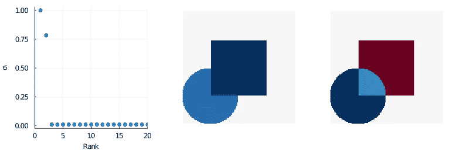

PCA 分析的结果。左:奇异值分布。中间和右边:两种主要 PCA 模式的空间支持。图片由作者提供。

正如预期的那样，我们数据集中的大部分差异被前两种模式捕获。然而，它们对应于正方形和圆形的混合。当看下面的时间演变时，这种无法将两者分开的现象尤其明显。

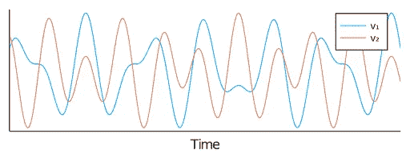

两种主要主成分分析模式的时间演变。图片由作者提供。

尽管 PCA 识别了一个好的低维子空间，但是相关联的坐标系没有提供对正在进行的简单动力学的清楚理解。那么我们能做得比这更好吗？我们能同时找到一个好的低维嵌入和坐标系统来描述这些动态吗？

# 介绍动态模式分解

数学上，PCA 主要旨在表征我们数据集的二阶统计量，而不是动力学。DMD 来了。假设我们的数据是由一个未知的动态过程产生的

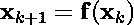

我们的目标是找到一个函数***h***(**x**):ℝⁿ ↦ ℝⁿ逼近 ***f*** ( **x** ):最小二乘意义下的ℝⁿ↦ℝⁿ。关于***h***(**x**)的不同假设导致不同的模型。在 DMD 框架中，*(**x**)被假设为线性映射*

*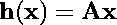*

*其中 **A** 是一个 n × n 矩阵。现在的问题是如何识别这个矩阵**一个**？*

## *数学细节*

*在没有额外信息的情况下，我们可以得到的最佳解决方案是通过解决优化问题*

*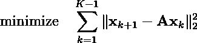*

*介绍矩阵 **X** 和 **Y** ，定义如下*

*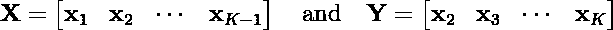*

*这个优化问题可以被改写为*

*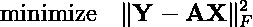*

*它的解由下式给出*

*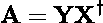*

*其中 **X** 表示 **X** 的 Moore-Penrose 伪逆。尽管易于计算，但该解决方案受到两个限制，这两个限制都与 **A** 是 n × n 矩阵的事实有关。因为在高维设置中，n 通常可以是几百万，所以显式地构造这个矩阵可能是不可能的。这也意味着我们有 n 个参数，远远超过我们有限的数据集允许我们合理估计的数量。因此，即使我们可以构造出**和**，这个模型也很难推广。*

*为了克服这些限制，可以假设 **A** 是低等级的。如果是这样，它可以分解为*

*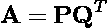*

*其中 **P** 和 **Q** 为 n × r 矩阵。在不失一般性的情况下，我们还将 r × r 单位矩阵强加给**p**ᵀ**p**=**I**和 **I** 。将这种因式分解引入到我们的优化问题中会产生*

*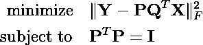*

*这是非凸问题。然而，使用简单的代数运算， **P** 和 **Q** 可以作为的 r 个主要特征向量获得*

*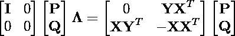*

*到目前为止，我们还没有指定线性模型的秩。然而，这是一个广义的厄米本征问题。所有的特征值都是非负的。因此，可以使用与 PCA 相同的试探法来确定我们模型的最佳等级。PCA 实际上是这个更普遍问题的一个特例。的确，假设 **X** = **Y** 和 **P** = **Q** ，就归结为 PCA 本征问题。*

*与 PCA 相比，DMD 的优势在于它不仅提供了低维嵌入，而且还适合我们未知动态过程的线性模型*

*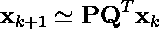*

*在计算了低秩因子分解 **A** = **PQ** ᵀ之后，它可以很容易地转换成它的本征分解*

*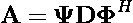*

*其中**ψ**和 **ϕ** 分别是 **A** 的左右特征向量。它们也被称为 DMD 模式。 **D** 是由 **A** 的特征值组成的对角矩阵。我们的线性模型现在可以改写为*

*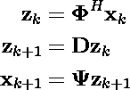*

***ψ**和 **ϕ** 因此是投射进和投射出低维空间的矩阵。此外，在这个潜在的空间，动力学是近似的一个简单的对角矩阵。正如我们将看到的，这使得我们的嵌入比 PCA 更容易理解。*

## *我们激励性例子的说明*

*让我们回到激励性的例子，用 DMD 处理数据。下图描述了广义厄米本征问题的本征值和 DMD 模式的空间支持。*

*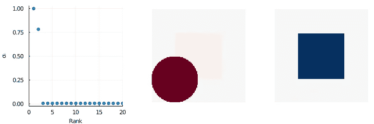*

*DMD 分析的结果。左:广义厄米特征问题的特征值。中间和右侧:两个主要 DMD 模式的空间支持(**ψ**矩阵的第一列和第二列)。图片由作者提供。*

*至于 PCA，本征值分布表明秩-2 模型，而 DMD 模式现在清楚地分开两种动力学。当描绘每个潜在变量的时间演变时，这也是可见的。*

*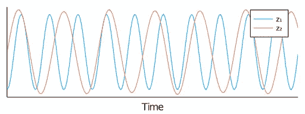*

*两种主要 DMD 模式的时间演化。图片由作者提供。*

*正如所料，DMD 恢复了两个纯音振荡。最近的研究表明，DMD 表现为源分离算法(例如 ICA)，尽管该框架可以更加灵活。对于类似的计算成本，它还提供了一个比 PCA 更容易解释的模型！*

## *流体动力学中热对流的应用*

*在结束之前，让我展示一个实际的例子，这个例子是由我自己的研究启发而来的。左边显示的配置是一个*热虹吸管*。这是一个闭环系统，流体从下面加热，从上面冷却。随着上下壁温差的增加，热流体开始上升，冷流体开始下降。这个运动产生了一个*对流单体*。超过临界温差，动力学变得混乱。对流单元经历随机的反转，导致它以顺时针或逆时针方向来回振荡。某种程度上，这是某些地球物理流的简化版。*

*我研究的一个关键目标是确定这种流动的低阶模型，我们可以用它来进行快速预测或反馈控制。然而，先决条件是具有良好的数据低维嵌入。这是 DMD 出现的地方。在收集了相当多的温度场和速度场的快照后，进行了 DMD 分析。结果如下所示。*

*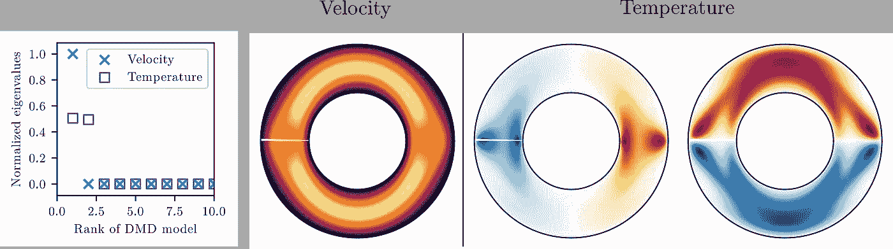*

*混沌热虹吸管的 DMD 分析。等级 1 模型捕获速度场中的大部分动态，而等级 2 模型需要用于温度。图片由作者提供。*

*尽管问题中有大量的自由度，但是动力学的固有维度是 3。一个是速度，两个是温度。DMD 模式强调速度场中的主导模式在方位角方向上基本不变。对于温度，它表明最重要的模式是左右和上下温差。这几乎是你建模动态所需要的全部(但那是另一个故事了)。将数据投影到这些 DMD 模式的跨度上会产生以下低维嵌入。*

*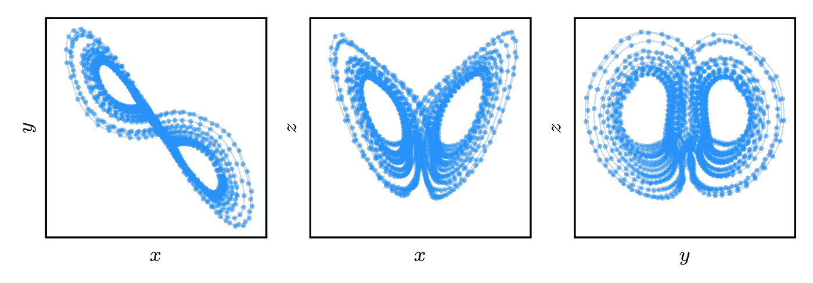*

*从 DMD 分析中获得的低维嵌入。 *x* 变量表示与速度场相关的模式的振幅，而 y 和 z 是左右和上下反对称温度分布的振幅。图片由作者提供。*

*对于任何稍微熟悉混沌理论的人来说，这种低维潜在空间动力学看起来就像洛伦兹系统！这确实是因为我没有时间在这篇文章中解释的原因。你应该记住的基本上是，即使对于这种强非线性、高维、混沌的动力系统，DMD 也提供了对所述系统的物理性质的许多见解。*

# *结论*

*PCA 因其简单而在数据科学中无处不在。由于这种简单性，它也经常在不应该使用它的情况下使用，或者在存在同样简单但更好的方法的情况下使用。高维时间序列分析就是这样一个例子。我希望您现在确信，在这种情况下，动态模式分解更好。它不仅被设计用来处理顺序数据，而且它还提供了一个比 PCA 更容易解释的模型。*

*自从 10 年前引入流体动力学以来，DMD 已经被证明是一个非常通用和健壮的框架来分析由高维动态过程产生的数据。它现在被常规应用于其他领域，如视频处理或神经科学。还提出了许多扩展。一些包括用于控制目的的输入和输出(见 [DMDc](https://epubs.siam.org/doi/abs/10.1137/15M1013857?mobileUi=0#:~:text=Our%20new%20method%2C%20dynamic%20mode,in%20accurate%20input%2Doutput%20models.) )。其他人将 DMD 与来自压缩感知的思想相结合，以进一步减少计算成本和数据存储，或者来自小波，用于[多分辨率分析](https://arxiv.org/abs/1506.00564)。可能性是无限的。如果你想了解更多，我强烈推荐 Kutz 和同事的《动态模式分解:复杂系统的数据驱动建模 》这本书。也可以看看帖子最后的参考文献。如果你觉得 DMD 实际上是你所缺少的工具，请告诉我！*

> *想看更多这方面的内容？查看我关于[低秩结构和数据驱动建模](https://loiseau-jc.medium.com/list/lowrank-structure-and-datadriven-modeling-8f39635a90ea)的其他文章，或者只是我的[机器学习基础知识](https://loiseau-jc.medium.com/list/machine-learning-basics-0baf10d8f8b5)！*

* [## 像素并非生而平等

### 利用低秩结构找到图像中最重要的像素。

towardsdatascience.com](/pixels-are-not-created-equal-b3ae4b36ffbc)*