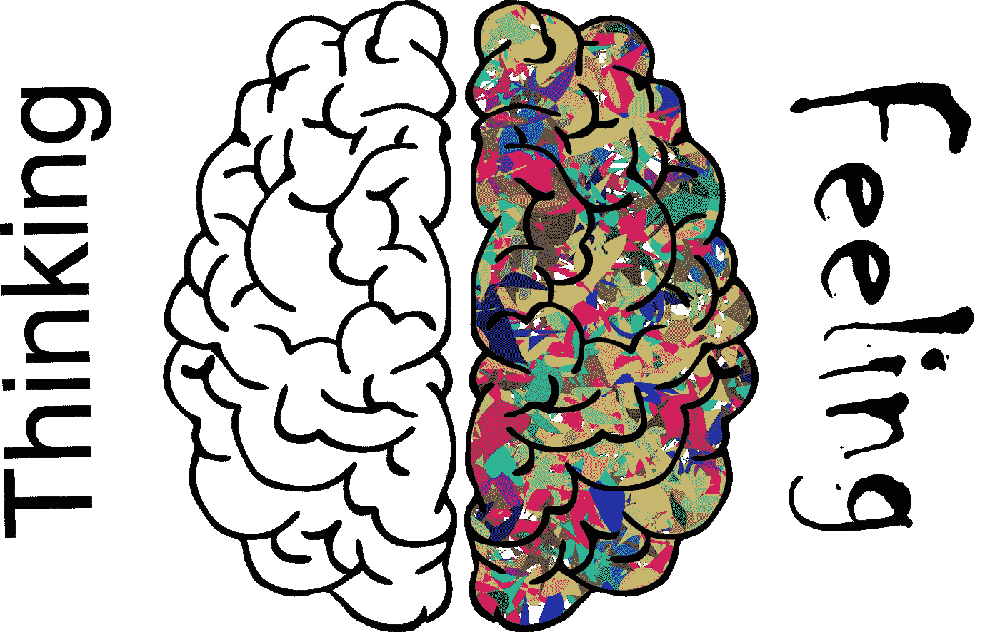
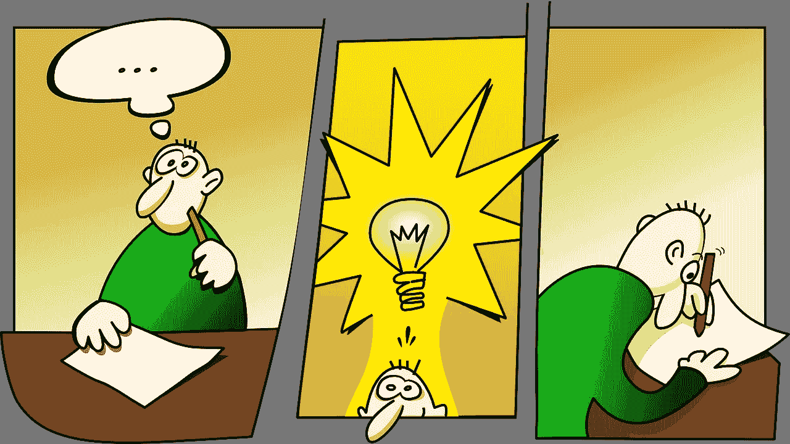

# 数据科学中直觉的一个例子

> 原文：<https://towardsdatascience.com/a-case-for-intuition-in-data-science-e1241e968a1e?source=collection_archive---------30----------------------->

## 直觉如何帮助我们成为更好的数据科学家

作者的作品，来自 [Pixabay](https://pixabay.com/?utm_source=link-attribution&utm_medium=referral&utm_campaign=image&utm_content=2750415) 的 [Gordon Johnson](https://pixabay.com/users/gdj-1086657/?utm_source=link-attribution&utm_medium=referral&utm_campaign=image&utm_content=2750415) 的图片

直觉和科学并不总是和谐相处。事实上，任何用想象或“感觉”来简化科学过程或成果的东西，在历史上都会遭到强烈的反对。正如[利里](https://scholarship.richmond.edu/cgi/viewcontent.cgi?article=1018&context=psychology-faculty-publications)在讨论感觉和想象在科学中的应用时所说:

> “科学试图通过规定可接受的情感形式和限制想象力的自由发挥来使这种矛盾心理合法化。”

数据科学也不例外。事实上，其他人也有类似的观点，数据科学可能不是凭直觉做出决策的好职业。这个论点是以最崇高的目的提出的。直觉、常识和勇气在过去让我们失望了，因为它们不仅被经验所渗透，也因此与正常、自然的人类偏见交织在一起。

图片来自 [Pixabay](https://pixabay.com/?utm_source=link-attribution&utm_medium=referral&utm_campaign=image&utm_content=3104355) 的[科林·伯伦斯](https://pixabay.com/users/colin00b-346653/?utm_source=link-attribution&utm_medium=referral&utm_campaign=image&utm_content=3104355)

所以，我们来做个区分。依靠直觉和仅仅依靠直觉与允许一个人的决策被直觉告知是非常不同的。也就是说，直觉是一种信息，尽管有偏见，但仍因我们独特且通常难以描述的经历而丰富，因此在我们的决策过程中具有价值。在科学、数据或其他方面，直觉仍然是有价值的，但不应该作为任何最终决定的唯一来源。

为了说明这一点，对直觉的研究表明，在高度复杂的行业和/或任务中，专家的直觉可以带来更快更准确的决策。

数据科学是一个复杂的行业，其特征也在于许多复杂任务的组合。此外，由于大多数数据科学家受雇于企业而非研究机构，因此快速做出决策是构建成功解决方案的必要条件。因此，我认为发展专家直觉并学会如何利用它来为决策提供信息可以帮助数据科学家成为更好的数据科学家。

那么我们如何发展专家直觉呢？

专家的直觉被定义为…

“……在具有天赋的个人获得大量学习经验并意识到每次表演的质量后，在某一领域发展起来的技能。”

发展这样的技能需要经验，但不是任何经验。这需要我所说的“修补”经验。以统计建模为例。理解统计如何工作是所有数据科学家的核心要求，但是当我们查看数据科学工具包中可用的所有模型以及数学在这些模型中的各种应用时，期望任何一个数据科学家知道它们所有的数学推导是徒劳的。

我们可以期待的是，数据科学家对这些模型如何工作有一种直觉，因为他们有修补输入和超参数并观察它们产生不同输出的经验。正是这种类型的修补产生了在模型选择和开发中快速决策所需的专家直觉，使数据科学家能够从一个不可能的可能性世界进入一组有限的“最有可能”输入和超参数值。

在这些情况下，专家的直觉也可以帮助我们在开发工作中寻找更有创造性的组合和机会。例如，对无监督算法的行为有一个总体的直觉，可能有助于为建模问题提供更具创造性的方法，因为开发人员知道如何在不丢失太多特征集信息的情况下减少数据的维度。

图片来自 [Pixabay](https://pixabay.com/?utm_source=link-attribution&utm_medium=referral&utm_campaign=image&utm_content=152213)

为了在数据科学中发展直觉，我们必须确保我们可以修补，并且有效地修补我们需要的东西…

# 模仿

不要害怕模仿。所有的学习都是从模仿开始的，所以为了成为优秀的直觉数据科学家，我们需要学会成为优秀的模仿者。但并不是任何形式的模仿就足够了。我们需要模仿最佳的、最佳的解决方案、最佳的代码、针对不同情况的最佳部署。所以，当你在模仿的时候(例如，跟随教程，浏览博客文章，浏览书籍或课程)，不要让自己陷入困境。

# 社区

找到一个让你感到安全的社区，同时尝试你不断扩展的技能。确保它是一个你可以表达你的直觉而不会感到被评判的地方。

# 灵感

记住，学习不是灌满一桶水，而是“点燃一把火”——叶芝。在谈论教育时，叶芝是否说过这些话没有这个观点提供的价值重要。学习是鼓舞人心的，因此，我们必须在追求专家直觉的过程中寻找灵感。这是一个重要的心态，因为水桶是固定的，但火只受到燃料的限制。学习也不是固定的，所以我们的学习能力更像一把火，而不是一桶我们可以装满的知识。

# 创造力

随着我们经验的积累，我们的创新能力也在增强。在你决定学习数据科学之前，不要忘记你的经历，因为这些经历可能会成为你今天所做事情的新颖和创造性应用的基础。

# 报酬

在数据科学中，在我们的代码中不出错是值得的，同样值得的是看到我们的模型准确地识别、分类或预测我们想要输出的信息。花点时间从这些胜利中获得回报，因为当你在未来寻求新的解决方案时，给自己这些时间有助于调整和训练你的专业直觉。

# 玩

最后，我们需要给自己留出玩耍的时间。玩转数据、玩转代码、玩转模型、玩转技术……不胜枚举。什么是玩耍，它和学习有什么不同？玩耍是我们发展的空间，在这里没有期望和期限。我们用自己建立的直觉进行实验。我们允许自己尝试一些事情，即使我们不知道它们是否有明确的意义。我们允许自己犯错，并把这些错误看作是我们专业直觉的进一步补充。

感谢阅读！

比如参与学习更多关于数据科学的知识？[加入我](https://www.facebook.com/groups/thinkdatascience)。