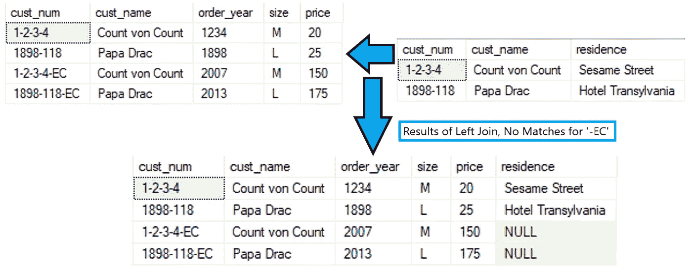
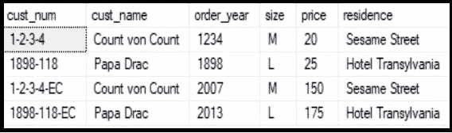

# SQL 连接中的 Case 语句

> 原文：<https://towardsdatascience.com/a-case-statement-in-a-sql-join-13496723dca9?source=collection_archive---------3----------------------->

## 俏皮的把戏

照片由伦纳德·冯·比布拉通过 Unsplash

当连接两个或更多的表时，有时会出现连接的值不完全匹配的情况。有很多方法可以解决这个问题:在要连接的表的 join 语句中使用 CASE 语句的子查询，在 temp 表中使用 CASE 语句，其中所有值都被更改为匹配，或者在 JOIN 的 ON 子句中使用 CASE 语句这种方便的小技巧。

让我们快速地看一下使用一个没有调整的常规连接(显然不是下面几个卷轴的超级酷的聚会技巧):

作者照片

在上图中，我们可以看到，当我们试图将“cust_table”左连接到超级漂亮的 capes“orders”表时，当连接到“cust_num”时，我们最终得到了一些空值。在“orders”表中，我们发现 Count von Count 和 Papa Drac 使用了我们的 E-Comm 订购系统，从而将一个漂亮的小“-EC”连接到他们的“cust_num”的末尾。他们位于' cust_table '中的客户数据没有我们喜欢的新的'-EC '字符串。

# 世纪派对把戏！

我猜这不是常识，主要是因为我不记得曾经听说过，但是 CASE 语句可以用在 JOIN 语句的 on 部分，如下所示:

现在让我们来看看结果:

作者照片

哔哔哔。成功了！

# 这个什么时候能派上用场？

根据我的经验，在更新现有查询时，这可能会节省大量时间。你可能有其他的连接或者其他你不想乱来的东西。你真正希望的是正确地加入表格。这有助于你到达那里！

# 最后的想法

SQL 是一个强大而有用的工具。肯定有不止一种方法可以敲碎鸡蛋/编写代码来做你需要它做的事情。这只是你可能想要添加到你的工具箱中的东西。下次见，继续学习！