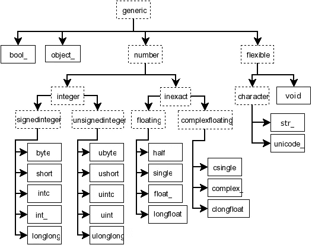
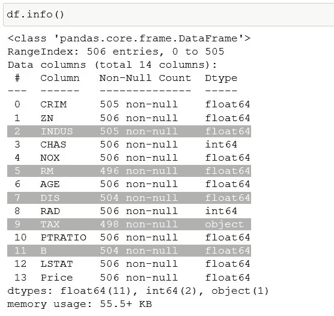
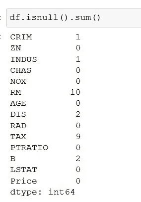
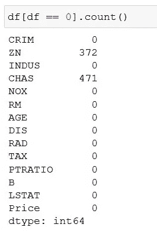
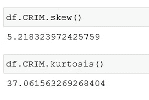
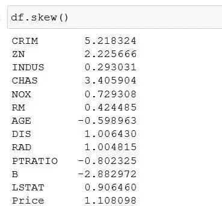
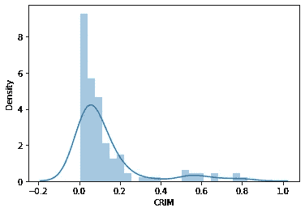
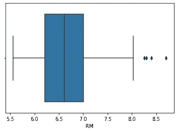
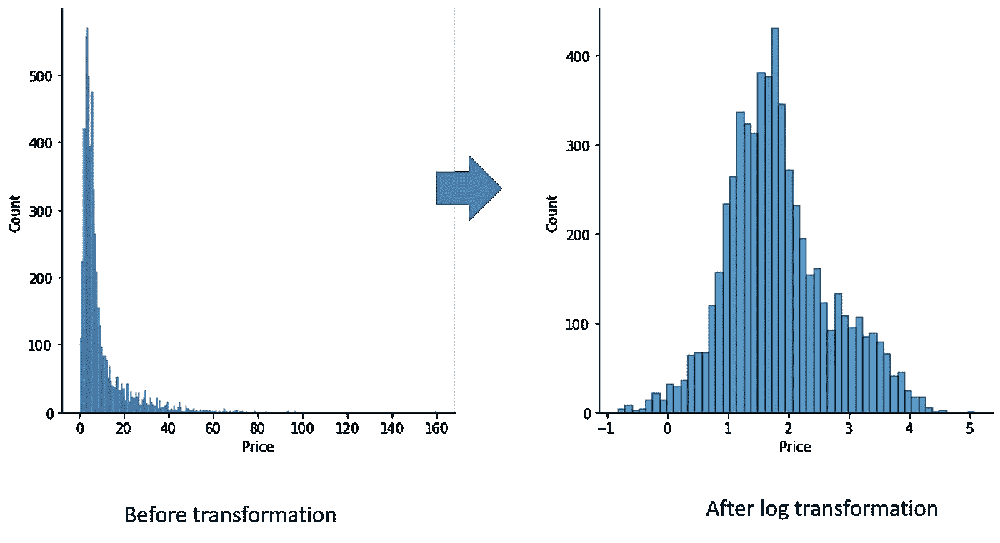

# 构建机器学习模型之前的数据预处理清单

> 原文：<https://towardsdatascience.com/a-checklist-for-data-pre-processing-before-you-build-your-machine-learning-model-91d2d04dc53f?source=collection_archive---------9----------------------->

## 创建机器学习数据集的数据预处理要做的事情列表(以及一些方便的技巧)


图片提供:unsplash.com

# 在这篇文章中

在本文中，我们将看到预处理中涉及的数据处理步骤是什么，以及 python 中执行这些操作的一些相关代码。

我们还将看到需要建立一个详尽的预处理步骤清单，您可以在您的数据集上应用。**本文提供了一份入门清单。它可以作为你正在处理的特定项目的基础。**

## 背景

大多数机器学习算法需要干净的数据集作为算法的输入。

这些是您的`train` 和`test` 数据集。这些数据集进一步分为通常所说的`x-train, y-train`和`x-test, y-test`数据集。x-train 和 x-test 被称为特征向量(因为它们包含代表`x-variables`或`features`的列)。`y-train`和`y-test`代表目标变量的数据集。

但是在得到干净的数据集之前，我们需要对原始输入数据集执行一些广泛的操作，以最终得到可用的数据集。这里有一些清单和问题要问(作为一个数据工程师/分析师)，以达到你的机器学习算法的最终干净输入。

## 命名

在本文中，我们将使用以下名称来指代变量—

`df` —数据帧的变量名

`X_train` —训练数据集(x 变量)

`y_train` —训练数据集(y 变量/目标变量)

`X_test` —测试数据集(x 变量)

`y_test` —测试数据集(y 变量/目标变量)

## 摘要

这些是我们将在本文中详细讨论的检查—

```
**1.Check for Data Types
2.Check Columns Names
3.Check for Missing Values
4.Check for Bad Data 
5.Imputation of Null values
6.Check for distribution type
7.Scaling the data 
8.Checks for outliers 
9.Check for data Imbalance 
10.Perform necessary transformations
11.Perform feature Engineering 
12.Binning Continuous data 
13.Feature selection**
```

## **数据集**

我们将使用"*波士顿房价数据"*(你可以从这里得到这个:[https://www . cs . Toronto . edu/~ delve/data/Boston/Boston detail . html](https://www.cs.toronto.edu/~delve/data/boston/bostonDetail.html)或这里[http://lib.stat.cmu.edu/datasets/boston](http://lib.stat.cmu.edu/datasets/boston))

为了方便用例，我们将对原始数据集进行一些更改(*例如:重命名一些列，引入一些空值等，以演示代码*)

数据包含以下各列—

```
>> df.dtypesCRIM       float64
ZN         float64
INDUS      float64
CHAS         int64
NOX        float64
RM         float64
AGE        float64
DIS        float64
RAD          int64
TAX         object
PTRATIO    float64
B          float64
LSTAT      float64
Price      float64
dtype: object
```

# 数据预处理的详细清单


图片提供:unsplash.com

## 1.检查数据类型

*   每列中代表哪种数据？

```
df.dtypes    # Displays all the data types of the columns in df
```

*   所有的列都被正确分类为正确的数据类型了吗？如果不是，请更改数据类型。

```
#change the datatype to floatdf['col'] = df['col'].astype('float')
```

*   有应该是数字的分类列吗(反之亦然)？

邮政编码通常被归类为数字，但是它们确实是分类的。熊猫会将它们解析为正确的数据类型吗？

*例如:日期类型分类正确吗——还是用'* `*object*` *'* 表示



来源:https://numpy.org/doc/stable/reference/arrays.scalars.html

**提示 1:** 要查看数据的描述，(不仅仅是连续变量，使用`include = 'all’`参数。这包括你的分类变量的其他函数，如`unique`、`top`和`freq`。

**提示#2** :如果你有很多列，在数据框`.T` 上使用转置功能将有助于你在一个页面中查看它(一个在另一个下面，而不是水平方向，这可能会截断显示的列数，基于你的 jupyter 笔记本设置)

```
data.describe(include='all').T
```

**提示#3:** 如果您只想选择分类列，请使用`select_dtypes`函数

```
cat_cols = data.select_dtypes(include=[“object”, “category”]).columns.tolist()
```

**提示#4** :要仅选择数字列，

```
num_cols = data.select_dtypes(include=[“number”]).columns.tolist()
```

## 2.准备数据集—检查列名

*   列名是否有冗长的名称、特殊字符、空格等？如果是，是否必须更改列名？

**提示:**如果删除列名中的空格，对列的操作会更容易。

```
data.columns =[col.replace(' ','_') for col in data.columns]#replacing spaces in column names with '_'
```

## 3.缺失值-删除还是估算？

*   您的任何要素是否有缺失值？

```
df.info()  # shows non-null values and dtypes in a single command#ordf.isnull().sum()# or to display the sum of ALL nulls in the dataframedf.isnull().sum().sum()
```



df.info()



*   你应该对自己缺失的价值观做什么处理？
*   缺失值有什么模式吗？

例如:记录可能在第 1 列、第 2 列、第 3 列有一致的值

在这个节骨眼上，有必要调查一下您丢失的数据中是否存在某种模式(并思考最初发生这种情况的可能原因)。检查他们是否—

随机失踪(MAR)
·完全随机失踪(MCAR)
·非随机失踪(MNAR)

如果一列中有许多缺失值(例如:约 60%)，最好删除这些列(而不是试图用某个值来估算)

要查找数据帧中每列缺失数据的百分比

```
df_isna().sum()*100/len(df)#or df.isnull().sum()*100 / len(df)
```

选择要删除的列，然后删除它们

```
# dropping columns 'RAD' and 'RM'  ( if there are lots of missing values )
df.drop(columns=["RAD", "RM"], inplace=True)
```

如果您只想删除某一特定列的空值记录——

```
# Keeping only the records where the 'Price' column is not null.
df = df[df["Price"].notna()]
```

## 4.错误数据

*   你的数据集中有坏数据吗？(比如'？'还是'-'代表空值？).如果你替换它们，处理这些数据可能会容易些

```
import numpy as np
df.INDUS= df.INDUS.apply(lambda x: np.nan if x == ‘?’ else x)# here we are replacing '?' with NaN
```

*   检查数据中的零。
*   注意:数据集中的零是坏数据还是数据的一部分？(在您的业务环境中，坏数据的定义是什么)

```
df[df == 0].count()   # Check for zeros in all columns 
```



检查您的列中是否有零

*   期望自然数的特性中有-ve 值吗？

例如:-2 在子女数量/工作年限等方面

*   用你的领域知识过滤掉异常的号码

例:年龄值高(年龄= 221)。这可能是数据输入/数据捕获错误

*   是否有混合了文本和数值的列需要清理？(如果列混合了数据类型(例如:数字和文本)，则列的`dtype` 显示为`object`。但是，这并不意味着如果 dtype 是 object，它就一定会有混合的数据类型)
*   你对不良数据的处理方式是什么？您是删除记录还是用其他东西替换坏数据？

```
# Remove the rows where ZN column has '0' as value
df = df[df.ZN != 0])
```

*   是否有重复的记录？真的有重复的吗？还是你必须删除它们？

```
df[df.duplicated() ]   # Shows records which are duplicatedlen(df[df.duplicated() ]) # count of records that are duplicated
```

## 5.数据处理——插补

*   为什么会出现价值缺失？(查看数据，您能否发现缺失值是否有规律可循？)
*   你对缺失值处理(插补)的策略是什么——替换这些缺失值的正确方法是什么？(均值插补、中值、随机还是只是一个固定数？)

```
df.RM = df.RM.fillna(df.RM.mean())   # mean imputation of RM columndf.RM = df.RM.fillna(df.RM.median())  # median imputation
```

*   是否要基于其他列的值进行估算？(例如:使用一些类似`**KNNImputer**` 的包)([https://scikit-learn . org/stable/modules/generated/sk learn . impute . knnimputer . html](https://scikit-learn.org/stable/modules/generated/sklearn.impute.KNNImputer.html))

## 6.数据分布

*   数据是否偏向一边？你更愿意使用什么方法来检测偏斜度(统计/视觉——通过分布图？)

找到`skew` 和`kurtosis` 将是确定任何列中的数据是否需要任何处理的良好开端。

```
df.CRIM.skew()   # Find the skew value of the data in column 'CRIM'
df.CRIM.kurtosis()  # Kurtosis of the data in column 'CRIM'
```

*   数据中可接受的“偏斜度”是多少？



查找列的偏斜度和峰度，以确定它是中度偏斜还是重度偏斜

```
df.skew()  # Or get the skew values of all the columns
```



你可以



卷曲柱的分布图将显示它是右偏的。

## 7.缩放比例

*   您的数据是否需要跨要素列表进行缩放/标准化？
*   你会用什么样的缩放方法？(标准缩放/最小-最大缩放？)

```
#Using sklear's StandardScaler package from sklearn.preprocessing import StandardScaler
X_scaled = StandardScaler().fit_transform(X)
```

## 8.极端值

*   有没有异常值？(使用方框图快速可视化您的异常值)
*   这些是真正的离群值吗？(基于您对该领域的了解)
*   如果是，这些离群值需要处理吗？
*   你会做什么样的异常处理？你会限制离群值，将它们从数据集中移除，还是让它保持原样？

```
import seaborn as sns
df.RM = df.RM.fillna(df.RM.mean())
```



RM 列的箱线图显示有一些异常值

## 9.数据不平衡

*   如果您正在构建一个分类模型，并且您的数据中的所有类至少是几乎均匀分布的吗？(换句话说，你的数据平衡吗？)

## 10.转换

*   基于数据的偏斜度，数据需要任何转换吗？
*   要应用的相关转换是什么？(对数变换/平方根/立方/逆变换)

在任何转变之前

```
import seaborn as sns 
sns.displot(df.Price); # plot without transformation
```

对数变换后

```
sns.displot(np.log(df.Price));
```



*   如果是文本数据呢？(您想标记文本数据吗，例如:使用`nltk`的`word_tokenize` 或`sentence_tokenize`)
*   将数据离散化(是否有可以分类的连续值？)

## 11.特征工程

*   可以从现有数据中创建哪些附加要素？

*例如:对于一个日期字段，你可以得到一周中的某一天，某一个月中的某一天，并且在外部数据集的一点帮助下，得到额外的信息，例如假期列表*

## 12.扔掉

*   对于连续变量，你想选择什么样的区间？
*   这些间隔是恒定的还是基于某些领域知识的，您会创建自定义的间隔条柱吗？
*   如果它们是分类值，您会使用什么业务逻辑来分类和绑定它们？

```
# Sample code demonstrating the creation of a new variable  - Income_category and bin them based on the value in the 'Income' fielddf1["Income_category"] = pd.cut(
    x=df["Income"],
    bins=[0, 15, 30, 50, 100,500,1000,10000],
    labels=["Low_income", "Lower_Middle", "Middle", "Upper_Middle","High_Income","Rich","Super_Rich"]
)# You can see the distribution of the numbers in the new variable
df1["Income_category"].value_counts()
```

## 13.分类编码

*   有分类的数据类型吗？
*   它们是有序的吗？你会做什么编码？(分类/标签编码)

## 14.特征选择/缩减

*   有可以删除的功能吗？最后，您将在您的模型中选择哪些特性，以及基于什么？
*   您是否检查过多重共线性(对于不喜欢密切相关的 x 变量的算法)

# 结束语

这是一个初学者指南，可以帮助你考虑为数据预处理步骤建立清单。你还可以在清单中添加许多其他步骤。

每个清单都有一个代码片段也是一个好主意，这样你就可以定制代码，大大减少实验时间。