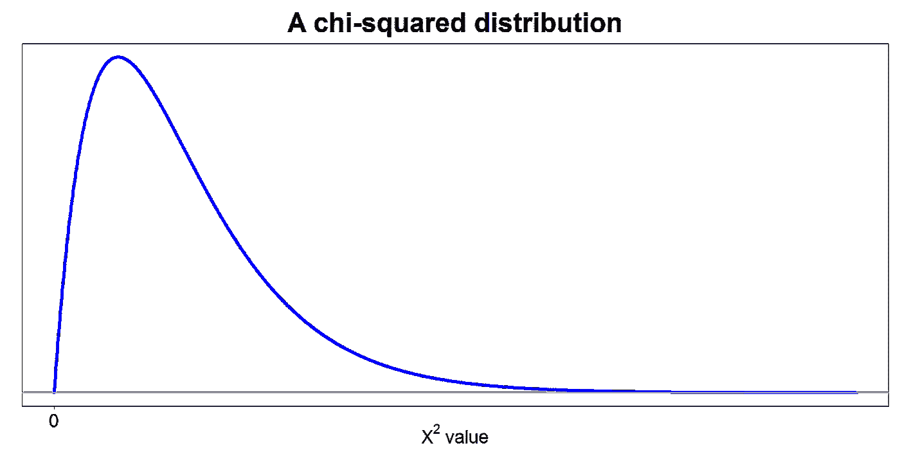

# 基本统计一览表

> 原文：<https://towardsdatascience.com/a-checklist-of-basic-statistics-24b1d671d52?source=collection_archive---------28----------------------->

## 统计推断，实验设计，显著性检验，回归。

我最近在 Coursera 上参加了斯坦福大学提供的[*免费统计学入门课程*](https://www.coursera.org/learn/stanford-statistics)*。有了物理科学的背景，我的知识严重偏向于像玻尔兹曼分布和玻色-爱因斯坦统计这样的东西。因此，我想用一些更传统和相关的东西来补充我的知识库。*

*总的来说，我很喜欢这门课。我认为这很好，即使你已经知道一些材料，因为我对他们用来强调统计学中某些概念的重要性的例子印象特别深刻。下面，我想总结一下课程中涉及的几个话题。*

**

*照片由 [Unsplash](https://unsplash.com?utm_source=medium&utm_medium=referral) 上的 [Edge2Edge Media](https://unsplash.com/@edge2edgemedia?utm_source=medium&utm_medium=referral) 拍摄*

# *统计推断*

*统计推断试图从人口样本中获得有关人口的信息。当我们感兴趣的人群如此之大，以至于我们没有资源从其中详尽地收集数据时，它通常变得相关。例如，假设我们想知道有百分之多少的选民赞成美国总统处理工作的方式。那可是大约 2.5 亿人口啊！获取这些信息的一个更容易管理的方法是使用统计学从几千个投票者的随机样本中进行估计。我们的估计可以表示为*

*估计值=参数+偏差+机会误差*

*这里，参数是我们感兴趣的人口数量(在我们的例子中，是所有美国选民中的支持率%)。因为我们是随机抽取，所以会出现随机误差。幸运的是，虽然它可以粗略计算，并可通过增加我们的样本量来减少。*

*另一方面，偏倚随着样本量的增加而增加，并且难以识别/量化。本课程讨论了两种类型的偏见:选择和参与。在这个例子中，当我们没有人口的代表性样本时，选择偏差就发生了。如果你走上芝加哥街头，询问选民对总统的看法，你就排除了其他城市的意见，引入了选择偏见。参与偏差有两个子类别:自愿和无响应偏差。假设你发布了一份在线调查。当有强烈意见的选民更有可能回应时，就会出现自愿偏见，因此你会得到极端的结果。因为这是一项在线调查，你可能会排除那些倾向于回避技术的老年人或那些来自低收入家庭、无法接触技术的人；因此，无反应偏差。*

# *随机对照实验与观察性研究*

*观察性研究测量感兴趣的结果，并可用于建立关联。但是要确定因果关系，你需要随机对照实验。*

*考虑这个问题:“吃有机食品会让你更健康吗？”(对任何人来说，这都是一个奇怪的争论话题，还是只有我这样认为？你可以去全食超市测量顾客的体重和其他健康指标。然后你去麦当劳，因为缺少一个不那么政治化的例子，进行同样的测量。然后你用计算器算一算，发现在全食超市购物/吃饭的人(假设来说)比经常去麦当劳的人更健康。*

*但是这并不意味着是食物导致了这些数字。这可能只是意味着那些在全食超市购物的人真的很注意他们的健康，因此锻炼得更多，并真的试图保持身材(假设来说)。因此，要真正尝试建立因果关系，你可以做一个随机对照实验，其中有两组人，称为“对照组”和“治疗组”。不过，我很确定我听过“治疗”的其他叫法。随机性来自于将人们随机分组。然后，你给治疗组只吃有机食物，给对照组只吃非有机食物(你问什么是非有机食物？无可奉告)。经过一段适当的时间后，你进行这些测量以得出结论。*

*在这里，可能很难引入安慰剂，它类似于治疗，但却是中性的。安慰剂在流行文化中出现得如此频繁，所以我认为不需要更多的解释。此外，实验应该是双盲的，进行评估的人不知道哪个组是哪个组，以防止他们的结论受到影响。*

# *正态和二项式分布*

*可以用正态分布近似二项分布！事实上，随着实验次数的增加，相应的直方图看起来越来越像正态分布。我们可以通过以下方式标准化二项式概率*

**

*其中 x 是成功的次数，μ是总体均值，σ是总体标准差，n 是我们进行实验/抛硬币的次数，p 是成功的概率。当通过二项式分布计算概率很繁琐时，这个公式很方便。举个例子，如果我们掷一枚硬币 100 次，问最多得到 45 个头的概率是多少，我们要计算得到 1 个头，2 个头，… 45 个头的概率，然后把它们加起来。通过用正态分布近似二项分布，我们可以得到 45 的标准化值，如下所示:*

**

*然后，我们可以使用一些软件来计算-1 左侧的正态曲线下的面积，以获得最多 45 个头的概率。*

# *统计的期望值、标准误差、置信区间和抽样分布*

*假设我们知道美国男性人口的平均体重(μ)和标准差(σ)。然后，我们随机测量 100 名男性，发现平均值与总体平均值不同。我们再做一次，找到另一个平均值。如果我们一直这样做很多次，中心极限定理告诉我们，当我们绘制计算平均值的直方图时，它将看起来像一个具有均值μ和分布的钟形曲线*

**

*其中 x-bar 是大小为 n 的样本的平均值(本例中为 100)，se 代表标准误差。这个公式告诉我们，随着样本量的增加，计算平均值的误差会减小。此外，一个相当反直觉的观点是，误差不取决于人口规模！本课程还将介绍和与百分比的标准误差，并且中心极限定理也适用于这些量。*

*然而，要应用中心极限定理，有几个注意事项。首先，我们需要替换抽样，这样每次抽取都是相互独立的。第二，兴趣的统计必须是总和(这里，平均值和百分比是伪装的总和)。最后，样本量需要足够大。人口直方图越倾斜，你需要的就越多。如果没有很强的偏态，大约 15 的样本量就足够了。*

*通常，估计值(或统计值)以如下置信区间报告:*

**

*其中 z 是对应于所需置信区间的 z 得分。例如，95%的置信区间对应于 z=1.96。在我们的例子中，估计值是一个美国成年男性的平均体重。我们首先随机测量 100 名男性，然后计算相应的平均值和标准差。然后我们代入 z=1.96，说‘我们有 95%的把握，男性的平均体重在平均+zSE 和平均-zSE 之间。但这意味着什么呢？如果我们再随机抽取 100 个样本，我们会得到一个稍微不同的置信区间。如果我们继续这样做，我们可以确定在 95%的情况下，总体平均值实际上落在我们的区间内。*

*如果我们不知道σ会怎么样？根据 bootstrap 原则，我们可以用样本的计算标准偏差来估计σ！*

# *假设检验*

*为了测试我们的假设是否为真，我们需要将其与不为真的场景(也称为零假设)进行比较。假设你买了一枚硬币，但随后怀疑它不公平。在这种情况下，零假设是硬币是公平的。如果公平，那么我们期望得到正面或反面的概率是 0.5。但是然后你抛几次硬币，观察得到人头的概率是 0.7！这足够要求你退钱了吗？*

*为了回答这个问题，我们首先设置了一个测试统计量，来衡量如果零假设为真，数据与我们应该得到的数据有多远。一个常见的测试是 z 统计:*

**

*这里，期望值和 SE 值是在假设零假设为真的情况下计算的。|z|越大，我们假设成立的证据就越强。然而，如果我们再掷硬币 10 次，我们可能会观察到不同的统计数据。结果是，如果零假设为真，那么 z 遵循标准正态曲线。然后，如果 z 为负，你可以计算曲线下 z 左侧的面积，如果 z 为正，你可以计算曲线下 z 右侧的面积，从而得到 p 值。标准是，如果 p 值小于 5%，可以拒绝零假设。*

*当样本量很小时(小于约 20)，你应该使用学生的 n-1 自由度的 t 分布，这样我们就可以用*

**

*这里，不同的 n 将给出稍微不同的 t 分布。因此，当我们报告平均值时，我们将通常的置信区间表达式替换为*

**

*测试导致错误决策的方式有两种。当我们拒绝一个被证明是正确的零假设时，第一类错误就发生了。当我们不能拒绝一个错误的零假设时，就会出现第二类错误。*

# *分类数据的χ检验*

*在 3 种情况下，χ检验统计优于其他方法。*

*拟合优度检验用于确定一组分类数据是否来自声称的分布。例如，你有没有玩过《卡坦的殖民者》,并且怀疑死亡是不公平的？我的意思是，如果 2 是如此不可能，为什么它一直出现？！你可以用χ检验来解决这个问题。假设你掷骰子 60 次。零假设是“骰子是公平的”，这意味着我们应该期望看到从 1 到 6 的每个数字出现 10。然后，我们像这样合计我们观察到的计数:*

*使用χ检验，我们得到:*

**

*然后，我们选择对应于我们的自由度(类别数-1)的χ分布，在这种情况下是 5，并查找χ值(碰巧也是 5)。p 值是χ值右侧曲线下的面积。如果它低于 5%，我们可以拒绝零假设，并得到新的模具。*

**

*当我们试图确定两个或更多的子群体是否共享同一个分类变量的相同分布时，同质性检验是有用的。例如，我们可以查看泰坦尼克号上的乘客数据(可在 Kaggle 上获得),并询问幸存者与非幸存者的比例是否取决于阶级。我们首先从零假设开始，即所有人群的生存概率是相同的，并通过汇集我们的数据来计算每一类中的预期幸存者人数。假设有 2229 名乘客，只有 713 人幸存。这意味着机上所有人的生还概率为 32%，如果头等舱有 325 名乘客，我们预计会有 104 名幸存者。然后，我们统计每个班级的实际幸存者人数，得出下表:*

*其中括号中的数字是预期的计数。然后，使用上面相同的公式，我们计算χ。这种情况下的自由度是*

*(列数— 1) x(行数— 1) = 3*

*独立性检验用于确定给定人群中的两个分类变量是否相互关联。假设我们要查看的两个类别是性别和吸烟。然后我们从 500 人中随机抽取样本*

*其中括号中的数字是零假设为真时的预期计数。如果零假设是正确的，那么我们有*

**

*然后，我们可以将这个数字乘以总数，得到男性吸烟者的预期数 150。使用上面相同的公式，我们可以获得χ，并按照相同的程序计算 p 值。*

*独立性检验和同质性检验之间可能有些混淆。区别在于我们如何设计实验。在独立性测试中，从总体中随机收集单位，每个单位记录 2 个类别。在同质性检验中，从每个子群体中抽取随机样本。*

# *线性回归*

*在线性回归中，相关系数 r 从-1 到 1 不等。符号告诉我们相关线的斜率是向上(+)还是向下(-)。幅度告诉我们 x 和 y 之间的线性关系的强度。如果幅度接近于零，当我们绘制 x 与 y 的关系时，我们不应该期望看到任何类似的直线。但是，r = 0 并不意味着 x 和 y 之间没有相关性。它只是意味着 x 和 y 之间的关系不是线性的。*

*我们线上的每一点都由*

**

*最小二乘法背后的思想是，最好的线是最小化的线*

**

*线性回归并不总是合适的回归方法。检验是否如此的一个好方法是将数据的散点图可视化，并检查它是否至少看起来像足球。另一个好的(补充的)方法是绘制残差图(预测值和真实值之间的差异),看看是否有任何可检测的模式。只有当残差的散点图无模式时，线性回归才是合适的。有时，我们可以转换数据，使结果图具有正确的形状(平方根和对数是流行的)。*

# *总结*

*我会推荐这门课吗？如果你是新手或者想复习，我强烈推荐这门课。讲师不会浪费时间，他会用非常有启发性的例子非常透彻地解释这些概念。几乎每个视频的中间和/或结尾都有小测验。还有非同小可的周末测验，所以你有足够的机会来测试和巩固你的理解。此外，请记住，这门课涵盖了比我在这里谈到的更多的主题。*

# *我的更多文章*

* [## 下一个回归项目的 6 个通用指标

### 优势、劣势和主要陷阱

towardsdatascience.com](/6-common-metrics-for-your-next-regression-project-4667cbc534a7)  [## 希腊利用强化学习遏制新冠肺炎的涌入

### TL；大卫:看起来效果很好

medium.com](https://medium.com/@h-vo/greece-used-reinforcement-learning-to-curb-influx-of-covid-19-a7d62ccfe508)  [## 机器学习在医疗保健领域的进展如何？

### 对已经完成的工作进行高层次的审视

towardsdatascience.com](/what-has-machine-learning-been-up-to-in-healthcare-a137db866f05)*