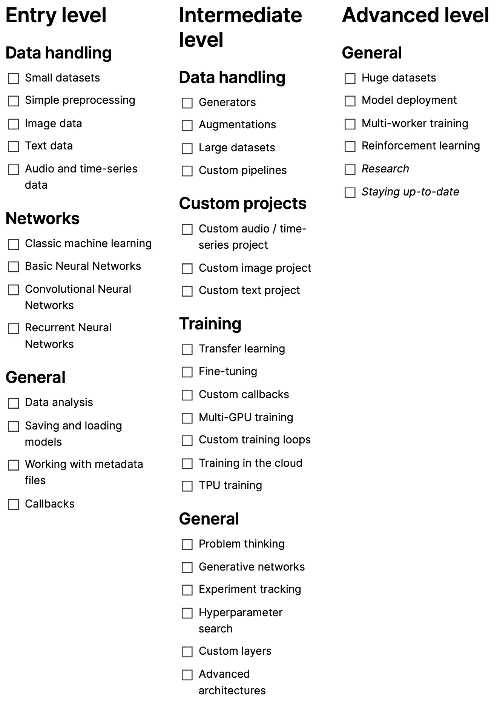

# 跟踪数据科学进展的清单

> 原文：<https://towardsdatascience.com/a-checklist-to-track-your-data-science-progress-bf92e878edf2?source=collection_archive---------6----------------------->

## [入门](https://towardsdatascience.com/tagged/getting-started)

## 使用每周一天的原则来逐步勾选它

学数据科学有很多牛逼的课程。还有很多证明你成功的证书。

但是，你如何跟踪你的进展呢？你怎么知道你已经取得了什么，还有什么需要你去做？

下面的清单可以帮助你了解你的进展。它的目的是为用户寻找一个大致的轮廓，他们在他们的旅程。它没有强调具体的指南、课程和软件包，而是侧重于一般概念:

图片由作者提供。在这里的概念[上可用，在这里](https://www.notion.so/A-checklist-to-track-your-Data-Science-progress-9de80b1b23c04634904168991247b651)的 PDF [上可用，在这里](https://drive.google.com/file/d/1CjuSlqhzjq1rUX5JYvJhx7YWIjxs5tdF/view?usp=sharing)的 GitHub [上可用。](https://github.com/phrasenmaeher/data-science-checklist)

让我们详细介绍各个级别，从入门级开始，继续到中级，最后到高级的广泛领域。

# 入学水平

这是开始的地方。它涵盖了您未来旅程的基本要素。

## 数据处理

这一类别的目的是为了能够处理最常见的数据类型:

*   形象
*   文本
*   音频/时间序列

一般来说，这个阶段的数据集非常小，处理大于内存的数据集没有(精神上的)开销。典型的例子有经典的 MNIST 图像数据集( [PyTorch](https://pytorch.org/vision/stable/datasets.html#mnist) 、 [TensorFlow](https://www.tensorflow.org/api_docs/python/tf/keras/datasets/mnist) )、IMDB 评论文本数据集( [PyTorch](https://pytorch.org/text/stable/datasets.html#imdb) 、 [TensorFlow](https://www.tensorflow.org/api_docs/python/tf/keras/datasets/imdb) )，以及小型音频或时间序列数据集。它们最多只有几百兆字节，可以轻松放入内存。

其中一些数据集需要最少的预处理(缩放图像、缩短句子)，这通常不超过几行代码。由于示例的数量很少，或者它们很小，所以您可以在运行时轻松地进行处理(而不是预先运行单独的复杂脚本)。

总之，这一类别强调处理小型音频/时间序列、图像和文本数据集，并应用简单的操作来预处理数据。

## 网络

这一类别背后的目的是从经典的机器学习过渡到神经网络，并了解常见的构建模块:

经典的机器学习技术包括支持向量机、线性回归和聚类算法。尽管更复杂的亲戚，神经网络，似乎主导了最近的研究，但它们对小问题很方便——或者作为基线。在分析数据时，知道如何使用它们也很方便。

当向深度学习进展时，密集层是一个好的开始；我猜它们几乎被用在每一个(分类)模型中，至少用来构建输出层。

第二种常用的网络类型是卷积神经网络，其核心使用卷积运算。很难想象有任何成功的研究没有使用并受益于这个简单的操作:在输入上滑动一个内核，然后计算内核与其覆盖的补丁之间的内积。卷积运算从输入数据的每个可能位置提取一小组特征。难怪他们在图像分类方面非常成功，重要的特征分散在四周。

前两种网络类型主要用于静态输入，我们事先知道数据的形状。当你有不同形状的数据时，以句子为例，你可能会寻找更灵活的方法。这就是递归神经网络的用武之地:它们可以长时间保留信息，这使得“我今天早上起床穿衣后，带着我的狗散步”和“带着我的狗散步”中的“我”能够连接起来，以回答“谁带着狗散步了？”。

总之，这一类别侧重于使用简单的密集、卷积和递归神经网络对图像、文本和时序数据进行分类。

## 一般

此类别的目的是学习数据科学相关任务的一般处理。

重要的一步是了解数据本身。这不仅仅限于图像数据或文本数据，还包括时间序列和音频数据，以及任何其他数据类型。术语*探索性数据分析*(感谢 [Andryas Waurzenczak](https://medium.com/@andryaas) 指出了这一点)最好地描述了这一步:使用技术来发现模式、离群值(超出公共范围的数据点)、子结构、标签分布，以及可视化数据。这可能包括主成分分析或降维技术。此时，您所使用的数据集通常已经被详细研究过了(尝试搜索数据集名称以找到有趣的特征)，但是一旦您开始学习自定义数据集，现在学习这些内容将会有所收获。

您还将学习如何加载和保存上面的那些模型，以便您可以在以后重用它们。同样常见的是将关于数据的数据，即*元数据*，存储在单独的文件中。以 CSV 文件为例:第一列存储数据示例的文件路径，第二列存储示例的类。能够解析这个是强制性的，但是感谢许多库，这是一个简单的任务。

当你开始在那些小数据集上训练你的基本网络时，使用上面的那些架构，你会逐渐发现回调的有用性。回调是在训练过程中执行的代码，它们实现了许多功能:定期保存您的模型以使其防故障、停止训练或更改参数。最常见的已经内置在大多数库中，只需一个简短的函数调用就可以使用它们！

总之，这个类别让你学会处理在小数据集上运行神经网络的任务。

# 中间能级

在我看来，这是伟大的乐趣开始的地方，你会比你想象的更快地到达它！我发现这种转变很自然地发生了:你寻找一种更有效的方法来处理数据——在你意识到这一点之前，你已经为一个大型数据集编写了一个定制管道。

## 数据处理

这一阶段的目的是能够处理更大或更复杂的数据集，这些数据集可能需要以增强和定制预处理管道的形式进行特殊处理。

在这个阶段，数据集往往会变得更大，可能不再适合您的内存。高效的预处理变得更加重要，因为你不会让你的硬件闲着。此外，当您处理不同形状的样本、从数据库中提取样本或进行自定义预处理时，您可能需要编写自己的生成器。

或者处理复杂且不平衡的数据集，其中大部分样本属于一个类，只有少数样本属于所需的类。您将学到一些有用的技术:扩充数据以生成更多的次要类样本，或者缩减主要类的样本。

对于这两种数据集类型，自定义管道变得更加重要。当您想要快速迭代设置时，例如将图像裁剪为 32x32 而不是 50x50，您很少想要启动长时间运行的脚本。将这种可能性融入到您的管道中可以实现快速试验。

总之，数据集往往变得更复杂(认为不平衡)和更大(认为高达 30，40 GBs ),需要更复杂的处理。

## 自定义项目

这是中级的心脏。这背后的意图是定制项目，从而学习和使用许多其他类别的项目。

第一个层次可能会引导您在 MNIST 数据集上训练一个网络；在这个层次上，您自然会更加关注您自己的数据以及如何解析它。我只列出了三个主要领域:音频、图像和文本，但还有很多。

通过参与自己的项目，你可以将之前学到的知识联系起来，解决你面临的挑战。

## 培养

这一类别背后的意图是学习更多关于训练神经网络的知识。这个类别是中级水平上最大的类别，这是由于关注更高级的主题。

定制培训的第一步是使用迁移学习和微调。以前您通常会使用标准方法来训练和测试您的模型，但是现在您可能需要更强大的工具。这就是简单地重用其他从业者训练的模型的方便之处。你加载他们的模型，并在你自己的数据集上仔细训练他们。

万一您错过了一些特性，这就是您开始编写定制训练循环和定制回调的地方。想每 20 批打印一些统计数据？编写自定义回调。想累计 20 批以上的渐变？编写一个自定义的训练循环。

更复杂的循环可能需要更多的资源:多 GPU 培训即将到来！然而，这不是简单地增加第二个、第三个甚至更多的资源；你必须足够快地获取数据。请记住，多设备训练增加了复杂性。PyTorch 和 TensorFlow 已经完成了大部分的后台工作，它们只需对代码做一些小的修改就可以处理这种情况，但是前端部分就留给您了。(但是不要担心，有很多指南可以帮助你完成这件事！).

如果你像我一样，无法使用多个 GPU，那么下一步可能是在云上进行培训。所有主要的云服务都为您提供所需的资源。起初，从本地设置过渡到云计算会有一些(精神上的)开销，经过一些尝试后，这变得更容易了。(当我开始在 Kubernetes 集群上运行脚本时，事情变得非常棘手:什么是 Dockerfile？如何运行 jobs？如何利用当地资源？数据如何进出？经过试验之后，我已经习惯了，现在只需几个简单的命令就可以让我的脚本运行了)。

当你已经在云端，为什么不试试 TPU 培训？TPU 是谷歌定制的芯片。他们速度很快:一年前，我和一个团队一起对一个大型文本语料库进行分类，大约有 20 000 个文档，每个文档大约有 10 页文本。我们只在 CPU 上运行了我们的第一个实验，一个时期花费了 8 个小时。下一步，我们改进了预处理、缓存，并使用了单个 GPU:时间下降到了 15 分钟，这是一个巨大的飞跃。在阅读了 TensorFlow 的文档并摆弄了我们的代码后，我设法让 TPU 训练成为可能，一个纪元下降到了 *15 秒*。因此，我鼓励您升级您的渠道，并在 TPU 上开展培训。

总之，这一类别侧重于扩展实际的训练部分，向更复杂的训练循环和定制回调发展。

## 一般

这一类别背后的意图是了解除了使用普通架构之外还有什么可能。

既然您正在处理自定义数据集，掌握问题思维就变得很重要。让我这样解释:假设你正在处理一个音频数据集。你已经做了你的初始数据分析，结果发现你的数据不仅不平衡，而且样本长度不一样。有些只有三秒钟，有些有 20 秒甚至更长。此外，您只想对音频片段进行分类，而不是按原样对整个剪辑进行分类。最后，这是一个行业项目，所以有限制。把所有这些结合在一起是你所需要的。

幸运的是，你并不孤单。数据分析已勾选，预处理自定义数据也已勾选。这里最受关注的是工业部分。检查其他人做了什么(并发表在 GitHub 上)，询问你的人，并尝试不同的技术。

比方说，您想要一个遵循自定义方案对数据进行规范化的网络层。查看您的库文档，您不会发现任何类似的已经实现的东西。现在是时候自己实现这样的功能了。和以前一样， [TensorFlow](https://www.tensorflow.org/tutorials/customization/custom_layers) 和 PyTorch(这使得这个方法更加简单)首先提供了一些很好的资源。

不久前的一个项目，我想写一个自定义嵌入层。在发现没有实现之后，我决定通过编写一个自定义的来解决这个问题。现在，这是一个挑战！经过多次反复试验，我终于想出了一个工作 TensorFlow 层。(讽刺的是，最后并没有证明比现有的更好)。

深度学习的另一个大领域现在开放了:生成网络。之前，您主要是对现有数据进行分类，但是没有什么可以阻止您生成数据。这正是生成网络所做的，他们最近的成功很大一部分来自一篇论文:[生成对抗网络](https://papers.nips.cc/paper/2014/file/5ca3e9b122f61f8f06494c97b1afccf3-Paper.pdf)。研究人员真的想出了一些聪明的东西:不是训练一个网络，而是训练两个网络，并且随着时间的推移，两个网络都变得更好。详细检查他们的工作超出了这里的范围，但约瑟夫和巴蒂斯特罗卡做了一个了不起的工作解释他们[在这里](/understanding-generative-adversarial-networks-gans-cd6e4651a29)。

除了使用更多种类的模型，你还需要跟踪你的实验。当您想要理解模型的度量如何受其参数影响时，这是很有帮助的。说到这里，您还可以开始参数搜索，目的是找到优化目标指标的最佳参数集。

作为最后一部分，你肯定会用更高级的型号。除了那些生成网络，还有庞大的语言模型。听说过变形金刚(不是电影)？我敢打赌你有，现在是时候把它们用在你自己的项目上了。或者尝试访问 GPT 3 号，并与它讨论人工智能。

总之，这一类别扩展到了正常模型之外，并进一步探索了相关技术。

# 优等

这是最后一个阶段，尽管与前一个阶段的界限确实很模糊。祝贺你来到这里！只有一个类别可供您探索，因为这些项目是基于您之前的经验:

## 一般

即使你已经走了这么远，仍然有更多的事情需要探索。

第一项是*庞大的数据集*。虽然开始训练过程是你现在的例行任务，但这里的重点是快速训练，尽管数据集很大。我指的是数百 GB 甚至更多的数据集。想想 ImageNet 规模或[堆](https://github.com/EleutherAI/the-pile)规模。解决这些问题需要考虑您的存储选项、数据获取和预处理管道。不仅大小增加了，而且复杂性也增加了:一个几百 GB 的多模型数据集，其中每幅图像都伴随着文本和听觉描述？这需要一些思考。

当处理如此巨大的数据集时，可能需要运行一个多工人培训设置。GPU 不再安装在一台机器上，而是分布在多台机器上，即工人。管理工作负载和数据的分布变得很有必要。谢天谢地，PyTorch 和 T2 tensor flow 在这方面也有一些资源。

在您花了几个小时建立模型之后，为什么不部署它们呢？使用一些可以让你轻松构建一个好的 GUI 的库(比如 [streamlit.io](http://streamlit.io) )，并部署你的模型，这样其他从业者就可以实时看到你的工作。

当你也做到这一点，进入强化学习。将它放在高级部分可能不是 100%正确的(基础可以很早就掌握)，但是它与你目前从事的领域有很大的不同。一如既往，有一些 [资源](https://web.stanford.edu/class/psych209/Readings/SuttonBartoIPRLBook2ndEd.pdf) [可用](https://pytorch.org/tutorials/intermediate/reinforcement_q_learning.html)让你开始。

既然你已经获得了大量的经验和知识，是时候做研究了。你在旅途中有没有注意到任何可以改进的地方？这可能是第一件要做的事情。或者通过向他们的存储库提供代码来为其他研究项目做出贡献。与其他爱好者合作，不断学习。

这可能是这里留下的最后一样东西:保持最新。数据科学是一个快速发展的领域，每天都有许多令人兴奋的新事物出现。跟踪重要的事情很难，所以选择一些时事通讯(我读过吴恩达和 deeplearning.ai 的 [The Batch](https://www.deeplearning.ai/the-batch/) )来获得浓缩信息。为了缩小范围，你还可以使用安德鲁·卡帕西的 Arxiv [理智保护工具](http://www.arxiv-sanity.com/)，它可以帮助你过滤符合你兴趣的论文。

总之，这一类别侧重于将强化学习作为一个全新的领域进行探索，为研究做出贡献，并保持最新——最后两点从未真正被选中。

# 接下来去哪里？

你可以在这里找到概念清单[，在这里](https://www.notion.so/A-checklist-to-track-your-Data-Science-progress-9de80b1b23c04634904168991247b651)找到 PDF [。做一个拷贝，自定义，然后逐步打勾。](https://drive.google.com/file/d/1CjuSlqhzjq1rUX5JYvJhx7YWIjxs5tdF/view?usp=sharing)

请在 [GitHub](https://github.com/phrasenmaeher/data-science-checklist) 上留下任何建议或评论。

如果您正在寻找特定的资源:

*   deeplearning.ai 的 [TensorFlow 开发者职业证书](https://www.coursera.org/professional-certificates/tensorflow-in-practice) (事后试试 TF 考试，看看自己已经学会了什么！)
*   Berkley 的[全栈深度学习](https://fall2019.fullstackdeeplearning.com/#who-is-this-for)课程涵盖了部分入门级、中级和高级水平
*   DeepMind 的[高级深度学习&强化学习](https://www.youtube.com/playlist?list=PLqYmG7hTraZDNJre23vqCGIVpfZ_K2RZs)讲座涵盖了中高级水平的部分内容
*   deeplearning.ai 的[张量流:数据和部署专精](https://www.coursera.org/specializations/tensorflow-data-and-deployment)和[张量流:高级技术专精](https://www.coursera.org/specializations/tensorflow-advanced-techniques)涵盖了部分中级和高级水平

如果你在寻找更具体的清单，你可以点击这里查看丹尼尔·伯克的路线图。

Thanks to [林彥良](https://lawrence123.medium.com/?source=responses-----bf92e878edf2----1----------------------------) and [Andryas Waurzenczak](https://medium.com/@andryaas?source=responses-----bf92e878edf2----0----------------------------) at this point for pointing out a bias towards ML and DL; and to [Elliot Gunn](/@elliot.j.gunn) for providing feedback on a raw first draft.

# 问题

> …不见了。

留下评论让我知道。请记住，本清单旨在作为一个总体概述，因此不包含*与 NumPy/pandas/TensorFlow/…* 合作或类似的具体项目。

> 某些类别之间不是有重叠吗？

是的，肯定的。不同类别的一些项目之间没有明显的分界线。例如，当您处理图像时，您可能已经将它们存储在磁盘上，而 CSV 文件包含所有文件路径和标签。因此，您可以一次勾选两个项目。

同样，同一类别中的两个项目有时会有重叠。这种情况发生在它们大部分是齐头并进的，但仍然有些不同的时候。

> 有顺序吗？

我最初试图维持每个类别的顺序(例如，在*训练*中)，最容易的任务在顶部，较难的任务在底部。但是两个项目之间并不总是有明确的难度排序。以*转移学习*和*微调*为例:两者紧密交织，没有明确的先后顺序。

> TPUs 有什么特别的地方给他们单独的地方？

虽然去 [Colab](https://colab.research.google.com) 选择 TPU 很容易，但快速准备好数据是至关重要的。我在这一点背后的意图不是简单地在 TPUs 的帮助下运行一个模型，而是使您的管道非常有效，以便数据按时到达 TPU。因此，重点更多的是高效的预处理，而不是加速计算。

不可否认，在 TPU 上运行您的代码非常酷。

> 名单很长。怎么才能完成？

两个简短的回答:

—你不必；我是远离这一点的我自己。把它作为你下一步努力的指南。

—您不必先完成一个级别或类别，然后再进入下一个级别或类别。

还有一个更长的答案:

每周花一天时间，排除所有其他事情。

在其他日子，你可以做你的研究。周三、周四和周五参加课程。周末学习是额外的收获。

然后，周一你重复过去几天所学的内容，利用周末巩固知识。

在你被封锁的星期二，你把你的新知识应用到你自己的项目中。

这些项目不必很大:

学到了一些关于高效数据处理的知识？为您自己的数据建立一个管道(并勾选*自定义管道*)。

学会了图像分类？给你房间里的东西拍些图像，并分类(并勾选*自定义图像项目*)。

了解了一个具体的网络架构？使用您选择的库并简单地重新实现它(并勾选*高级架构*或*卷积神经网络*或两者)。

使用这些简短的独立项目来接触广泛的主题。你做的小主题越多，你就越容易开始那些一开始看起来令人生畏的大项目——因为它们只是由你已经采取的许多小步骤组成的。