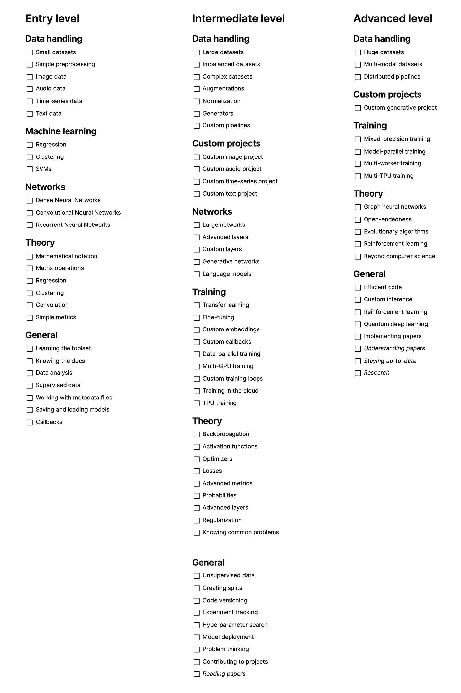
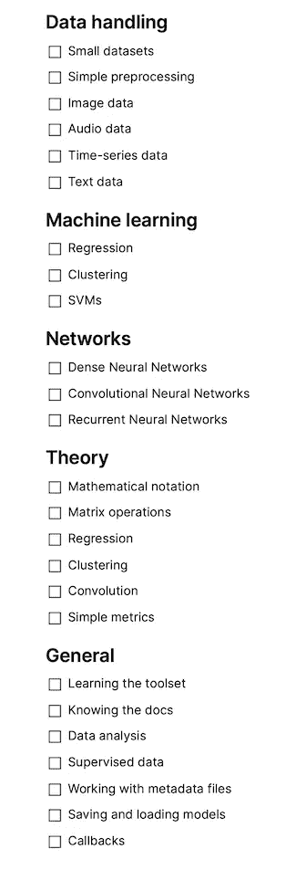
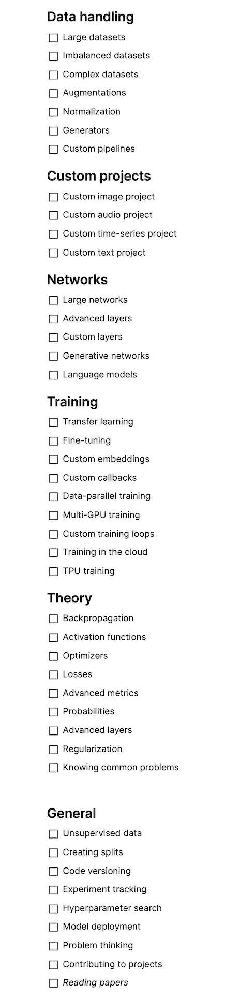
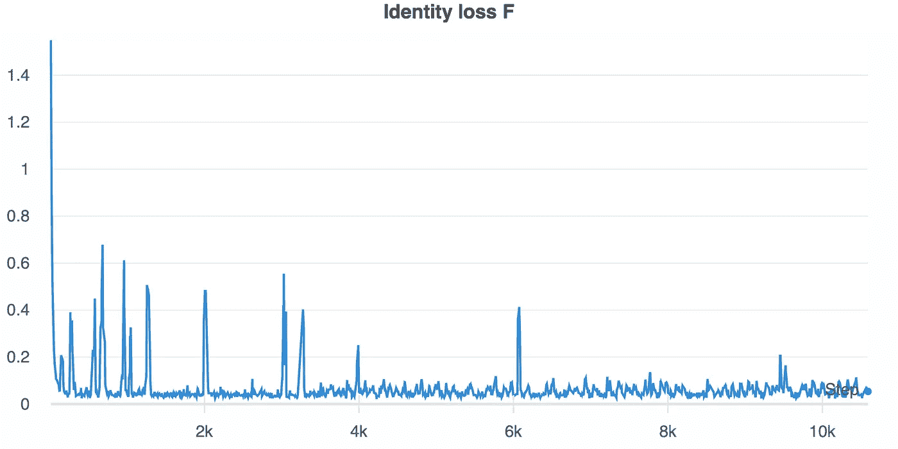
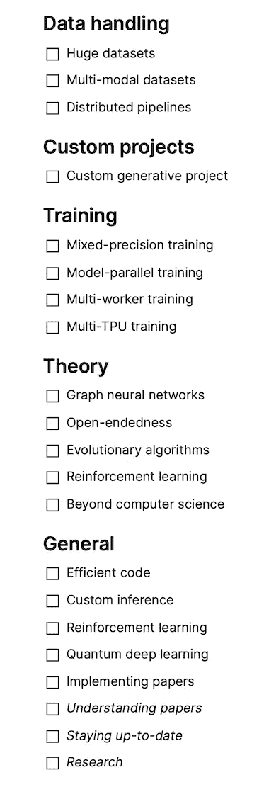

# 跟踪机器学习进度的清单

> 原文：<https://towardsdatascience.com/a-checklist-to-track-your-machine-learning-progress-801405f5cf86?source=collection_archive---------2----------------------->

## [入门](https://towardsdatascience.com/tagged/getting-started)

## 可能对深度学习有最小的偏见

你有没有问过自己，在你的机器学习之旅中，你目前处于什么位置？你还能学到什么呢？

这个清单可以帮助你回答这些问题。它提供了这个领域的大纲，分为三个大的层次:入门层次(每个人都从这里开始)，中级层次(你很快就能达到)，高级层次(你要在这里呆很长时间)。它没有列出具体的课程或软件，而是侧重于一般概念:

清单概述，图片由作者提供。在这里的观念[和这里](https://www.notion.so/A-checklist-to-track-your-Machine-Learning-progress-e6b4501e99e54cdf93131e0e7bfd6ecf)的 GitHub [上可以找到。](https://github.com/phrasenmaeher/ml-checklist)

让我们从入门级开始，更详细地介绍各个级别。

# 入学水平

入门级产品概述。作者摘录；完整的列表可以在[这里](https://www.notion.so/A-checklist-to-track-your-Machine-Learning-progress-e6b4501e99e54cdf93131e0e7bfd6ecf)找到。

入门级分为 5 类:

*   *数据处理*侧重于能够处理小型数据集
*   *机器学习*涵盖了经典机器学习的关键概念
*   *网络*局限于 dnn、CNN 和 rnn
*   *理论*意在帮助你理解机器学习背后的思想
*   *概述*列出了您将在此阶段处理的主要事项

## 数据处理

这个类别侧重于使您能够处理小型数据集。

最常见的数据类型有

*   形象
*   声音的
*   时间序列
*   文本

这一级别的数据集通常已经内置在 PyTorch 或 TensorFlow 中；不需要额外下载。它们通常在尺寸和复杂度上都很小，并且它们通常适合于存储器。一个很好的图像示例是经典的 MNIST 图像数据集( [PyTorch](https://pytorch.org/vision/stable/datasets.html#mnist) 、 [TensorFlow](https://www.tensorflow.org/api_docs/python/tf/keras/datasets/mnist) )，用于 IMDB 评论数据集( [PyTorch](https://pytorch.org/text/stable/datasets.html#imdb) 、 [TensorFlow](https://www.tensorflow.org/api_docs/python/tf/keras/datasets/imdb) )，用于文本数据，以及小型音频或时间序列数据集。

一些初学者友好的数据集需要预处理——这通常只不过是调整图像大小或缩短句子。几行代码就可以了。由于示例的数量很少，或者它们很小，所以您可以在运行时进行(而不是预先运行单独的复杂脚本)。

由于您正在处理经过仔细检查的数据，因此您通常会在网上找到有用的指南、提示和工作解决方案。

总结一下这个类别:重点是处理小型(内置)数据集和应用简单的预处理。

## 机器学习

不可否认，与深度学习模型相比，经典方法看起来很乏味。但是请相信有一天你也会遇到他们。有几个概念很突出:

回归重在回归数据。通常给你的是数据点，你不得不推断出那些看不见的数据点。这些新点依赖于已知(可观察)点，而回归的目的是找到这种依赖性。

聚类包含许多算法，它们都做同样的事情:将相似的数据样本聚类在一起，并将不相似的样本分开。已经出现了许多不同的方法来解决这个任务，但是我建议首先检查 k-Means。

最后，我们有支持向量机，一种更复杂的算法。支持向量机试图构建一个超平面，以最合适的方式将类别相互分离。一旦你了解了前两种方法，请阅读并使用这种方法。

总结一下:虽然这份清单的重点是深度学习，而不是经典的机器学习，但学习久经考验的基础知识也是有用的。

## 网络

这一类别侧重于从以前的经典 ML 走向神经网络。

密集层和密集神经网络通常是一个很好的起点。我猜这些层在 90 %的分类模型中使用*非常频繁*。例如，在最基本的设置中，您将输入乘以一个权重，并添加一个偏差:w₁ × x₁ + b

如果你有两个输入，用各自的权重相乘，然后加上一个偏差:w₁ × x₁ + w₂ × x₂ + b

如果你有三个、四个、一百个输入，那么对于单个神经元来说，这个过程是一样的。如果你有两个接收神经元和一个输入，那么每个神经元就有一个权重和偏差:w₁₁和 w₂₁，b₁和 b₂.如果有 20 个输入，每个接收神经元有 20 个权重，每个神经元有一个偏差。如果这让你感到困惑，不要担心。你拿到这个后，它就不是问题了。

名单上的下一个网络是卷积神经网络，简称 CNN。CNN 使用卷积运算，其中一个核遍历一个矩阵，并计算其自身和所覆盖的补片之间的内积。通过这种方式，您可以从数据中提取少量要素，并帮助网络检测这些要素，而不管其实际位置如何。换句话说:虽然图像上的鞋子可能在底部，但当它在上半部分时，网络也能发现它。很难想象有哪个成功的研究没有使用并受益于这个简单的操作。

第三大类网络是递归神经网络。当你必须长时间保留信息时，这些网络是有用的。比如，考虑一下这句话:“狗叫，然后它跳”。要推断“他”是谁，必须记住句子的开头“狗”。rnn 和它们的衍生物帮助你建模这样的时间依赖性。

总结这一类:你从密集的神经网络开始，它们容易理解，应用广泛。然后，您使用 CNN 提取分散的特征，并在时间依赖性起作用时继续使用 RNNs。

## 理论

这一类侧重于理论概念。这不仅仅是数学，更是对一般的 ML 和具体的 DL 技术的一种理解。

要做到这一点，学习数学符号是一个很好的开始。以σ为例。一旦你使用它一段时间，你会开始接受它的简洁。例如，与其重复地写“我们计算所有单个元素的总和乘以概率”，不如写:

这种方式更短，随着时间的推移，也更精确。我们要乘以最终的总和吗？还是我们把每个元素相乘？使用数学符号，这是清楚的。

留在数学领域，要学的一件事就是矩阵运算。还记得我建议作为良好起点的密集层吗？它们可以写成矩阵运算；使用“偏差技巧”，您还可以整合偏差。

学习像回归和聚类这样的经典机器学习技术也包括学习它们的背景。这是齐头并进的:一旦你学习了一种新的算法，你同时也学习了它背后的理论。一次勾选多个项目很好！

一旦你从经典学习转向深度学习——也就是说，一旦你开始使用神经网络——你就会遇到卷积运算。在入门级别，这是我建议熟悉的唯一技术。

当你开始用这样的层来增强你的网络时，你当然想要测量效果。这就是度量标准的用武之地，目标函数量化了你的方法的成功。准确度、均方误差、召回率和精确度是标准的。由于数据集不太复杂，所以还不需要切换到高级指标；你可以留着以后用。

总结一下这个类别:你学习阅读数学符号，普通技术背后的(数学)思想，以及如何衡量你的神经网络的成功。

## 一般

这个类别包含您早期学习的技术和最佳实践。

要使用神经网络，您需要使用一些有用的工具。其中包括一个 IDE(帮助你写代码的计算机程序)和 GitHub(一个为你的代码版本化的服务)。

如果你不熟悉一门编程语言，我建议从 *python* 开始。这种特殊语言的资源数量是巨大的。这是一个临界点；作为初学者，您希望避免构建自定义操作，并查阅文档来利用内置特性。

一旦您分析数据集，这些提供的功能也会派上用场。比如，取值范围是多少？是否存在一些异常值？他们有多极端？是否存在不可用的数据样本？这些是你想回答的问题，通常发生在旅途中:

你写一小段代码——因为数据样本不同而中断——你更新代码——你对数据有了更多的了解。

通常，您处理的数据在这个阶段受到监督，这意味着它包含了*数据* → *标签*映射。对于一个图像，这可能是一只狗或一只猫；对于文本，它可能是正面的，也可能是负面的；对于音频，可能是音乐类型。

这些映射是元数据的一部分，元数据是关于实际数据的数据。这些额外的知识通常是通过 CSV 或 JSON 文件提供的。因此，能够解析它们是件好事。幸运的是，主要的编程语言都提供了实现这一点的代码；几行就行了。

成功解析元数据并准备好数据后，您还需要将训练好的模型保存到磁盘上。保存和加载模型变得很重要

*   当你与其他学习者分享你的作品时，
*   当你想验证你的结果时，
*   当您只想将它们保存到磁盘上并在以后运行推理时

如果你也这样做了，你应该看看回调，在训练中执行的代码。想要定期保存您的模型吗？想提前取消训练？这些和其他标准回调是大型深度学习框架附带的。你不必从头开始写。一、两行代码就足够了。把复杂的回调留到以后。

总的来说，这一类别关注的是您将在早期遇到的一般事情，比如解析元数据文件、使用 ide 和分析数据集。

# 中间能级

中级概述。作者摘录；完整的列表可以在[这里](https://www.notion.so/A-checklist-to-track-your-Machine-Learning-progress-e6b4501e99e54cdf93131e0e7bfd6ecf)找到。

中间级别是您将花费大量时间的地方，这里有很多东西可以探索:语言模型、大型数据集、定制训练循环、超参数搜索，等等。但是，从上一级到这一级的过渡非常顺利。我会说这需要三到四个月的时间，这取决于你的背景，但是:你会比你想象的更快到达那里！

你学到的东西分布在六大类中:

*   *数据处理*关注大型数据集和定制预处理
*   *定制项目*希望你获得这方面的经验
*   *网络*包含了这个层面的几个趋势
*   训练涵盖了前两点带来的很多内容
*   *理论*侧重于拓展你的背景知识
*   *General* 列出了您在该级别使用的几个项目

## 数据处理

数据处理侧重于更大更复杂的数据集、广泛的定制预处理和高效的数据加载。

我观察到，这个级别的数据集往往会变得更大或更复杂。或者两者都有。以前您处理的是可以轻松放入 RAM 的小型数据集，现在您可以处理 30 到 100 GBs 的数据。然而，这不应该吓到你。一旦你查阅了 TensorFlow 或 PyTorch 的文档，你就会知道该怎么做了。

不平衡数据集也是如此，这是现阶段的第二个趋势。标签——如果这毕竟是一个分类问题的话——不再平均分布，而是集中在一个大类上。这与更复杂的数据集密切相关，在这种情况下，数据可能具有不规则的形状。

然后你探索的一种技术是增强，人工改变现有的数据以产生新的样本。您可以将此应用于只有少量样本的类。或者，您可以随机旋转图像，使您的网络更强大。

说到图像，通常还需要对数据进行规范化。例如，一些图像可能是 400 × 400，但大多数是 350 × 350。这是一个重新标度的例子，一种可能的技术。但是，它们并不局限于图像数据。对于音频、文本和时间序列数据也存在其他策略。

在你标准化了你的数据之后，你必须把它提供给网络。简单地将它加载到 RAM 中不再可能，但是编写一个定制的生成器是可能的。你不必在这里重新发明轮子；有很多资源可以帮助你获得动力。

这种生成器也可以是自定义管道的一部分:在输入数据之前，在生成器中对数据进行预处理；不需要名为*预处理数据的单独文件夹*。你的管道也可能帮助同学；为什么不分享呢？

总之，这一类别侧重于大型、复杂、不平衡的数据集，这带来了几个需要克服的挑战。

## 自定义项目

定制项目是中间级别的核心。从我自己的经验来看，我保证你从做这些事情中获得巨大的协同效应:

您可以从一个新的数据集开始，甚至从头开始创建一个数据集。要做到这一点，你必须编写一个自定义管道(tick)，处理大型数据集(tick)，并使用高级(tick)和自定义层(tick)。

但是，自定义数据集不是强制性的。相反，你可以使用一个现有的，并尝试新的算法。或者你可以参加一个(Kaggle)挑战，击败你的竞争对手。

你看，通过一些你自己的项目，你会学到大量的新东西。这就是我们所追求的。

总的来说，这个类别可能很短，但是从您的定制项目中得到的东西是很长的。

## 网络

在中间层次，所使用的网络变得更加先进:

第一个趋势是网络变得更大。前一阶段的模型通常只有几兆字节大小，几层就够了。现在这将变成数百兆字节，通常使用超过 100、200、500 层。

第二个趋势是标准层被诸如批处理规范化、池化和注意等操作所取代。这些是更复杂的，如果你缺少一个功能:现在是时候写一个自定义层。

说到更高级的特性，生成网络和语言模型现在进入了人们的视线。有了你的基础，你现在就可以玩它们了——如果你能在本地运行它们的话(看看你，变形金刚)。如果你需要更多的马力，尝试切换到 Colab 并保留一个 GPU 或甚至一个 TPU。没有必要仅仅为了玩玩就去租一个云计算实例。一旦你完成了你的模型并准备好训练一些纪元，就这样做。

与其他网络一样，代码通常是可用的。例如， [Hugginface](https://huggingface.co/) 在他们的变形金刚库方面做得非常出色，TensorFlow 也有一些关于生成网络的教程。

总之，使用更高级的网络和图层与定制项目是相互关联的。

## 培养

*培训*类别关注的是与培训模特相关的所有东西。

如果我们的资源有限，我们可能无法完全训练一个网络——但是，我们可以训练它的一部分。这种技巧是迁移学习的一部分:

我们只需加载一个在类似任务上预先训练好的模型，然后在我们自己的数据集上对其部分内容进行微调。当然，您也可以利用一个完全不同领域的模型，比如图像分类，来对声音或文本数据进行分类。因为经典的预训练模型是随主要的 DL 框架一起提供的，所以您可以在这样的网络之间快速切换。

下一点是*定制嵌入*。嵌入是一种计算和使用存储在我们数据中的信息的聪明方法。一个例子:

一张桌子和一把椅子连在一起。这反映在两个单词的嵌入中，这两个单词只是任意大小(通常为~300)的浮点向量。前面提到的单词的相似性被处理到它们的向量中。这个概念并不局限于文本数据——尽管在那个领域它是直观的——而是也可以扩展到音频和图像数据。

嵌入主要是针对单个单词计算的。因此，您可以下载最常见的插件，如“the”、“like”、“You”、“car”。不利的一面是，这些可能无法反映您的数据中的知识:他们预先训练的数据集可能是关于汽车比赛的，因此具有不同类型之间的广泛关系:卡车、豪华轿车、跑车。另一方面，你自己的数据并不关注汽车，所以不必要的信息太多，有用的信息太少。简而言之，预先训练的嵌入不能反映数据点之间的相似性。解决方案是训练你自己的嵌入。这其实是在神经网络的帮助下完成的！

一旦您训练了定制嵌入，您可能也会对定制回调感兴趣。循环学习率？有可能。提前终止一个模型？有可能。训练时提取中间层的输出？同样，这是可能的，但需要努力。当标准回调没有提供您需要的东西时，只需实现您自己的回调。

接下来的点，*数据并行性*和*多 GPU 训练*，是紧密相连的。一旦你幸运地使用了不止一个 GPU，或者一旦你的训练花费了很长时间，这些概念提供了一种补救方法。您可以利用多个 GPU，而不是使用单个 GPU 来处理数据。输入在您的设备之间共享，每个设备运行相同的模型，并且它们的权重保持同步。

用更高级的模型实现这样的东西通常需要您编写定制的循环。不利的一面是，您必须从头开始编写训练逻辑，但是作为回报，您会获得洞察力和很多自由。PyTorch 和 TensorFlow 都提供了这方面的指南。

最后两项再次交织在一起:TPU 仅在云中可用，并且都需要一些努力才能实现。但是它们很快:对于一年前的一个项目，我的团队最初在 CPU 上运行一个模型，每个时期运行八个小时。使用 GPU 将时间缩短到了 15 分钟。经过一番争论后，我设法在 TPUs 上运行我们的代码，我们获得了每个纪元 15 秒的*。真快。*

*从转移学习到云 TPU 培训，这一类别侧重于培训高级模型时附带的技术，通常是为了减少培训时间或实现自定义功能。*

## *理论*

*这个类别收集了这个层次的想法背后的概念。*

*反向传播是这一切的动力；一个聪明的技术来计算你的网络更新，梯度。简单来说就是链式法则的应用，连续多次。这是可能的，因为您的网络可以被视为一个简单功能的(复杂)链。这些简单的功能是你的网络的操作，而一个层的激活功能在这里起着至关重要的作用。*

*听说过 ReLU 吗？这就是这样一个[激活函数](https://en.wikipedia.org/wiki/Activation_function#Comparison_of_activation_functions)——不使用任何函数(或者只使用线性函数，例如 y = x+2)会将你的网络简化为一个线性分类器。(有关这方面的更多信息，请参见注释)。全世界都在研究这个。以泄漏的 ReLU 或 LReLU 为例:*

*正常的 ReLU 是 y = max(x，0)。如果你的输入低于 0，这将设置导数为零。这意味着向后传递中后面的每个渐变(即前面的每个层)也是零。这就是 LReLUs 的原因:当 x < 0 时，y = αx，否则就是 y = x，这是解决上述问题的一个简单方法。*

*还有更多的功能可供选择:GeLU、swish、卢瑟等等。只要你能推导出来，就没问题。*

*如上所述，计算梯度需要导数。一旦你有了它们，优化器的任务就是应用更新。这就是学习率发挥作用的地方:*

*wᵘᵖᵈᵃᵗᵉᵈ=wᵒˡᵈ——学习率×梯度*

*这是普通梯度下降的更新规则，它与梯度相反。其他优化器有自己的更新步骤，看看 Adam 或 RMSProp 了解更多。*

*首先计算梯度需要一个损失函数。这个函数告诉你对于给定的输入，你的输出有多好。标准损失是交叉熵、均方误差等等，但是对于更高级的任务有更高级的损失。*

*当准确性本身不再起作用时，这通常与更高级的度量标准相结合。对于不平衡的数据集，精确度不是一个有意义的度量；在这种情况下，切换到宏 F1。提示:为了在以后计算任何丢失的度量，保存网络的预测和基本事实。*

*在这个层次上，掌握概率是必要的一步。我从自己的经历来说:还可以。从许多来源听到统计和随机数据后，情况会变得更清楚。在计算数据的平均值或正常数据范围时，您可能已经使用了一些方法。看看 Coursera 了解更多，或者浏览顶级大学的讲座，这些讲座经常免费上传。(能够免费获得高质量的资料真是一件幸事！).*

*因为我们已经在讨论高级主题，所以试着理解高级层的概念。退学是一个好的开始，BatchNorm 是下一个候选人。*

*这同样适用于学习正则化。一般来说，这些是在不影响测试结果的情况下减少训练错误的技术。换句话说:让你的网络在训练数据上做得好，而不是在单独的测试数据上做得差。*

**理论*范畴的最后一点是相当模糊的:了解常见问题。我打算让你获得与深度神经网络相关的广泛知识。这包括消失梯度、模式崩溃和过拟合等现象。你可能会在旅途中遇到他们中的一些，然后知道发生了什么是有利的。最终，这有助于你解决问题，并让你下次避免它们。*

*总之，这一类别涵盖了巩固你对机器学习的理解的相关主题。*

## *一般*

*这一大类涵盖了您在这一级别会遇到的各种主题。*

*从有监督的数据——可以使用(人类)注释的数据——开始，您现在可以扩展到无监督的数据。使用生成技术时就是这种情况。你也可以结合两个世界的优点:训练一个自动编码器来生成真实的图像，并在另一个分类器网络中使用学习到的权重。这是某种(高级)迁移学习。*

*处理任何数据，无论是否受监督，通常都需要将数据分成一个训练集(也称为开发集)、一个验证集和一个测试集。将数据分成三部分很容易，但您通常会希望进行分层拆分，在所有拆分中，类百分比保持大致相似。例如，当您有 100 个数据点，A 类和 B 类有 50 个数据点时，您希望在所有三个拆分中都保留此比率。*

*为了以后追溯您所做的任何事情，不仅仅是在分割数据集时，对代码进行版本化是一个很好的做法。您不需要维护 100 个文件夹。使用对你有帮助的工具会更容易、更舒服:Git 是第一位的。*

*这与跟踪你的实验是一致的。跟踪可以包括存储模型，但基本上意味着保存任何指标和设置。对于我几个月前的一些跑步，我最近不得不检查平均跑步时间。如果我没有使用像 Weights & Biases 这样的工具来保存实验数据，我可能已经被束缚住了。有了它，获得所需信息就相当容易了。*

*这同样适用于模型配置:要复制运行或论文，您需要知道每层的过滤器数量、内核大小、退出概率等等。跟踪你的实验因此成为一件强制性的事情。它不仅客观地告诉我们哪些跑步做得最好，而且看到这些图表填充起来也很酷:*

**

*实验跟踪的样本可视化；作者写的。你能看出这里可能发生了什么样的问题吗？*

*进一步进行实验跟踪，您还可以进行超参数搜索。为了确定最佳值，您可以并行启动多次运行。每次运行使用一组不同的参数值，一个中央协调器决定哪一个导致更好的分数。这是一个时间和计算密集型过程，需要一些初始设置。但是一旦你完成了一次搜索，你就为下一次做好了准备。*

*已经花了很多时间来确定最佳度量、最佳参数、最佳优化器，您不希望让最终的模型变得尘土飞扬。相反，使用一些工具，如 [streamlit.io](https://streamlit.io/) 来快速构建应用程序原型，然后使用您的云技能来部署您的模型。最后，记录代码并在 GitHub 上发布您的发现。像我这样的人会为此感谢你的！*

*看了这么多，练了这么多模型，你肯定在*问题思考*方面有了一些经验。我不确定这是不是真的，但它只是意味着知道当 *xyz* 发生时该做什么。这可能会简化问题，在 StackOverflow 上提问，或者咨询其他人。这是我们学习过程中必不可少的一部分:即使两个问题可能完全不同，我们总会从之前的第三个问题中学到一些我们现在可以使用的东西。*

*这对于您的工作和对其他项目的贡献都是一项有用的技能:像 Hugginface 和 PyTorch 这样的大型软件包依赖于社区的反馈来发展。运用你所学到的知识进行合作。*

*最后，记住所有这些，要知道这是一个持续不断的过程。提出新发现并证伪旧发现是研究领域的一部分。阅读论文是了解这一进展的好方法，但它永远不会真正完成。*

*从抽象开始。这部分通常在实际论文之前提交，所以作者在这里花一些时间。它总结了一篇论文的故事。事后妄下结论。如果你认为这篇论文适合你，那么你可以完整地阅读它。对于那些得到大量媒体报道的报纸，聪明人可能已经写了一篇博文，用他们的方式解释了。检查一下也无妨。*

*总之，这一类别涵盖了关于机器学习进展的广泛主题:从创建数据分割到阅读论文，这里有很多内容。*

# *优等*

**

*高级水平概述。作者摘录；完整的列表可以在[这里](https://www.notion.so/A-checklist-to-track-your-Machine-Learning-progress-e6b4501e99e54cdf93131e0e7bfd6ecf)找到。*

*相比中级，这个显得矮了点。那是个陷阱！这块地很大。到目前为止，你所学的一切都在这里发挥了作用。优化者？发明你自己的。自定义训练循环？现在创建一个全新的算法。参与项目？在报纸上发表你自己的文章。*

*以下所有类别都扩展了上一级别的概念:*

*   **数据处理*现在专注于庞大的多模态数据集*
*   **定制项目*现在具有生成技术*
*   **培训*建立在之前的基础上，变得更加复杂*
*   *理论扩展到全新的领域*
*   **概括性*延伸到更广泛的话题*

## *数据处理*

*这一类别比中间级别的对应类别更进了一步，并转移到更大的数据集。*

*形容词*巨大*是对数据集大小相对模糊的描述。就 GB 而言，这超过了 100、200 GBs。就纪元时间而言，这是单程一个多小时。这取决于您可用的计算能力——您的多 GPU 或 TPU 培训知识会派上用场。你可以申请 [TPU 研究云](https://sites.research.google/trc/)来加速你的训练。*

*加速也可以通过运行分布式管道来实现。对于数据集预处理，Apache Beam 就是这样一个框架；对于 TensorFlow，我知道你也可以分发数据预处理(不是训练而是实际的预处理)。您肯定希望在这里使用 Kubernetes 集群或类似的集群。大型云提供商(AWS、GCP、Azure)提供相关解决方案。*

*这些分布式管道在处理多模型数据集时非常有用。您使用的不再是单一的数据类型，而是多种数据类型的组合。一个简单的例子是文本和图像，其中文本描述了图像的内容。存储和解析这些数据可能会很麻烦；您可能想编写一个定制的生成器来使事情变得更简单。*

*总之，这一类别扩展到更大和更复杂的数据集。*

## *自定义项目*

*此类别仅包含一个项目:*

*处理自定义创成式项目。GAN 的领域已经变得相当大:BGAN，GAN，*GAN，CycleGAN，…选择一个并使用自定义数据集。上一层的很多东西都在这里汇集:正则化、高级损失、概率、自定义图层。因此，这是一个将你所学付诸实践的好机会。*

## *培养*

**训练*类别现在专注于加速训练。*

*随着数据集越来越大，训练时间也越来越长。第一种方法是使用混合精度训练。该模型尝试使用 16 位精度，而不是使用 32 位精度。确保数值稳定性(舍入误差等。)，部分权重保持其原始类型，并在可能的情况下使用 16 位精度计算。最近的 GPU 有特殊的硬件来加速 float16 格式的计算；这种训练通常可以加快 2 到 3 倍。*

*减少培训时间的第二种方法是从多 GPU 扩展到多工人培训。这些设备不再安装在单个节点上，而是分布在多个节点上。如果你能在一个地方安装它们，那么就这样做，因为在运行多工人安装时会有通信开销。然而，这通常被限制为每个节点 8 或 16 个 GPU，如果这还不够，您仍然可以通过将培训负载分配给多个工作人员来扩展计算，每个工作人员有多个 GPU。*

*当然，如果你有多个 TPU，那么训练时间也会减少。这然后使用 TPU 吊舱；谷歌在这里有大量的文档。从 8 个 TPU 内核到 2048 年，有一种神奇的感觉。您肯定希望确保您的代码是高效的，因为计算时间就是金钱。*

*最后一步主要是为大于 RAM 的模型定制的:模型并行训练。在此设置中，模型不再在特定设备上复制，而是放置在所有设备上。因此，例如，一组层可能由 GPUs 0 到 4 处理，下一组由 GPU 4 到 8 处理，依此类推。这也是当 [a 层激活大于可用 RAM](https://github.com/tensorflow/mesh) 时诉诸的技术。*

*综上所述，训练重在速度。越快越好。*

## *理论*

*理论部分介绍了机器学习广泛领域中的几个全新领域，从图形神经网络开始。*

*图可以模拟许多数据交互。想象一张地图，其中顶点是特别感兴趣的地方，边是它们之间的连接。这样的结构也存在于分子和社交网络中。图形神经网络使用 DL 中的技术来使用这种图形存储的数据。有一个大的正在进行的研究领域。*

**开放式*也是如此。这是整个列表中最有趣的一点。想想大自然，想想经常从你窗前飞过的鸟儿。他们并不总是那样看。他们也不会永远保持这种状态。进化在这里起了作用，尽管这个措辞太弱了。进化不是一个过程；是工作中的某件事发明了一切。你，我，电脑，鸟，鱼，树。而且绝对没有完成。因此，进化是一种永不终止的算法(T2 停顿问题，有人知道吗？).人工智能的一个希望是实现类似的东西，创造新的东西。就像我们人类一样。*

*这个方向的第一步是进化算法，它创造了一些东西。但只是少量。和自然/进化比起来，这根本不算什么。这同样适用于我们日常做的许多事情。一千个俯卧撑？当然，但是大自然创造了鸟、植物、狗、猫、树——试着与之匹配。倒立？好吧，但是大自然创造了鱼、牛、猪、花、细菌——与之匹配。我们已经取得了很多成就，但还有很多需要学习(和发明)。看看[这篇文章](https://www.oreilly.com/radar/open-endedness-the-last-grand-challenge-youve-never-heard-of/)，了解更多关于这个*有趣的*话题。*

*一个更容易进入的领域是强化学习。我已经把它放在高级水平，以免吓到初学者。如果我在早期看到了 RL 的所有概念(事实上，我看到了)，我会怀疑我是否能掌握这一切。这些概念并不难，但是对于初学者到中级用户来说太难了。一旦你有了一个坚实的基础，你就可以开始学习 RL 了。*

**理论*范畴的最后一点是扩展你的知识，超越计算机科学。知道得多总是有益的，生物学、化学、心理学、物理学……都是你可以涉足的伟大领域。这并不是说你必须做一个完整的学习，而是这些领域的一两门课程已经足够了。*

*生物学是我们研究的一个很好的例子:拥有数十亿连接的 GPT x，图灵 NLG 和威震天 LM，以及拥有惊人的一万亿参数的开关变压器。他们只能做一两件事。而作为人类，我们无法插入额外的硬件或在几分钟内处理数 TB 的数据，因此我们可以做得更多。边走边解数学？明白了。游泳和重播面试？明白了。写论文吃零食？明白了。*

*睡觉、吃饭、走路、游泳、淋浴、哭、笑、跳、摔、潜、爬、开车、惊奇、学习、写作、作曲、创作、做梦、思考的时候，运行你的心？甚至不需要我们的注意。*

*与一个人或一群人所能做的相比，这些模型有所欠缺。这也是生物学、化学、物理学和其他领域可以帮助我们提高技术水平的地方。*

*总之，你可以从标准的 DL 任务扩展到那些重要的任务。*

## *一般*

*这个类别列出了在高级阶段出现的一般模式。*

*高效的代码:显然，这在早期很重要，但是当你在 5 天内用 128 个 GPU 在 3 台服务器上训练你的 5 亿个参数模型时，你*真的*想要确保你的代码很快。这不再是一个人的项目，而是一个团队的努力。看一看[的变形金刚论文](https://papers.nips.cc/paper/2017/file/3f5ee243547dee91fbd053c1c4a845aa-Paper.pdf)告诉我们，它是许多人的共同努力才能让事情发生。*

*诚然，从高效代码到量子深度学习，这是一个相当大的挑战。但是在这个层次上，你已经学到了太多，以至于不能不看一看这个领域。它被列在*一般*而不是*理论*中，因为它是一个强烈分离的领域。生物学可以促进算法的发展，但量子物理学是一个完全独立的领域。还是那句话，主要动力是做事，要快。尝试一系列密码的组合是乏味的。同时尝试一千个很快。我们甚至不必看得太远；从候鸟身上，我们目前假设它们利用量子效应来感受地球磁场。大自然又一次参与其中。*

*如果你还没有完成，实现论文是一个很好的实践:你学习新的东西，巩固你的编码技能，甚至[挣钱](https://wandb.ai/wandb_fc/reproducibility-challenge/reports/ML-Reproducibility-Challenge-Spring-2021--Vmlldzo2NDEwMzQ?galleryTag=)。*

*说到论文，现在是从阅读论文到理解(大部分)论文的时候了。你会很自然地专注于几个领域，并试图抓住那里的东西。这是跟上时代的一部分。人工智能研究领域发生了太多事情:*

*一年前，我和 ML 有一个关于 NLP 的讲座。我们有一些模型大小的图表，威震天 LM 被列为最大的模型之一。然后，演讲结束后不久，GPT-3 出现了，爆炸规模。这只是一个领域。还有 GANs，音频模型，图像分类器，还有很多很多。所以这归结为有一个总的概述，由时事通讯提供，如吴恩达的 [The Batch](https://www.deeplearning.ai/the-batch/) ，然后专注于你自己的领域。*

*那就是研究了。和前面两点一样，这一点永远不会完全做到。*

*总之，您需要高效的代码，并希望保持最新。*

# *接下来去哪里？*

*你可以在 GitHub [这里](https://github.com/phrasenmaeher/ml-checklist)找到清单，在这里找到概念[。复制定制，然后逐步打勾。](https://www.notion.so/A-checklist-to-track-your-Machine-Learning-progress-e6b4501e99e54cdf93131e0e7bfd6ecf)*

*如果您正在寻找特定的资源:*

*   *deeplearning.ai 的 [TensorFlow 开发者专业证书](https://www.coursera.org/professional-certificates/tensorflow-in-practice)涵盖了大部分入门级，可以作为 TF 考试的备考(此处涵盖)*
*   *Berkley 的[全栈深度学习](https://fall2019.fullstackdeeplearning.com/#who-is-this-for)课程涵盖了部分入门级、中级和高级水平*
*   *DeepMind 的[高级深度学习&强化学习](https://www.youtube.com/playlist?list=PLqYmG7hTraZDNJre23vqCGIVpfZ_K2RZs)讲座涵盖了中高级水平的部分内容*
*   *deeplearning.ai 的[张量流:数据和部署专精](https://www.coursera.org/specializations/tensorflow-data-and-deployment)和[张量流:高级技术专精](https://www.coursera.org/specializations/tensorflow-advanced-techniques)涵盖了部分中级和高级水平*

*如果你正在寻找一个更具体的清单，你可以查看丹尼尔·伯克的路线图[这里](https://whimsical.com/machine-learning-roadmap-2020-CA7f3ykvXpnJ9Az32vYXva)。*

# *进一步说明*

1.  *这个清单以我自己的经验来看是有偏差的。*
2.  *RNNs 可以用于任何类型的数据。然而，逐渐消失的坡度和长时间的训练使它们更难训练。*
3.  *PyTorch 和 TensorFlow 没有太大区别。作为初学者，没有压力去选择一个而不是另一个。然而，一旦您有了更多的进展，您可能会遇到一个问题，并注意到它在其他框架中可能更容易。那是相当普遍的，但是我这么说:
    你遇到这样的问题，说明你在物质的深处；因此，转换框架将导致从头开始的巨大开销。因此，硬着头皮挺过去往往更好。(我在 TensorFlow 写自定义图层的时候也有过类似的经历。那是多么大的努力啊！).*
4.  *嵌入不限于单个数据点。例如，你可以计算完整句子的嵌入。此外，预制致密层也经常用作嵌入层。*
5.  *嵌入只是浮点的数组:[0.1213，0.542，1.993，...]，可以经常检查。*
6.  *我注意到，不使用激活函数可以使您的网络可复制到单个线性分类器。这对于仅密集的神经网络是正确的。这样做的问题是，你只能学习线性依赖，这一般不是你想要的。*
7.  *生成技术可以扩展到监督数据，例如，CycleGAN 就是这样做的:你在两个已知的域之间转换，因此需要每个域的标记数据。不过，最初的生成技术，即最初的 GAN、AEs 和 VAEs，并不依赖于这些标签。*
8.  *我确实错过了一些事情。请留下评论，让我知道。*
9.  *你不必去上大学课程来学习所有这些。互联网已经使知识的传递民主化，所以只要看看 YouTube、谷歌的博客、OpenAI 的博客、DeepMind 的博客等等。*