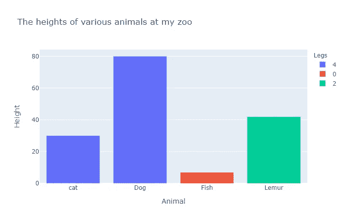
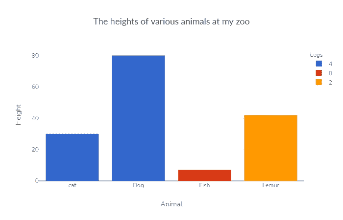
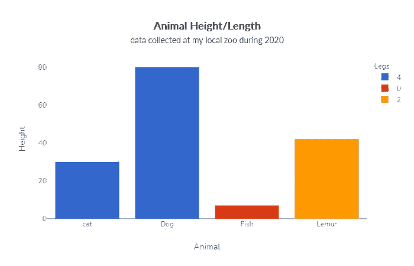

# 绘图图表的简洁风格

> 原文：<https://towardsdatascience.com/a-clean-style-for-plotly-charts-250ba2f5f015?source=collection_archive---------10----------------------->

## 开箱即用的默认图表看起来很棒，但我经常发现自己做了一些常见的更改来使它们“流行”。

> 直到最近，当我在构建一个报告管道时，我才发现了 plotly 的定制模板功能。在此之前，我制作图表，然后编辑它们的外观。使用 plotly 中的自定义模板功能，您可以定义在创建图表时应用的自定义样式。这个方便的功能降低了我的报告管道的复杂性，并且已经成为我在专业和家庭中使用 plotly 的核心部分。

为了了解这是如何工作的，让我们创建一个玩具数据集。请参见下面所需的导入和数据集的生成，以帮助说明如何使 plotly 图表看起来更专业。

出于本文的目的，我们将给出一个使用条形图的例子，因为它是对两个分类变量和一个数值进行编码的好选择。我们将沿 X 轴编码动物，沿 Y 轴编码高度，并用颜色编码腿的数量。

帕特里克·科菲的图片

虽然上面的图表本身没有任何问题，但它看起来有点无聊和普通。我觉得灰色的背景对我来说有点太暗了，标题和标签字体也有点太淡了。让我们定义一个自定义样式模板，并将其应用到我们的图表中，以解决其中的一些问题。

在上面的自定义样式模板中，我们将标题字体改为 Lato，因为这是一种很好的可读字体，就宽度而言也很紧凑。这使得标题可以更长，而不会脱离图表的边缘，这是一种更好地描述图表试图传达的故事的简单方法。

> 印刷术是一门我无法理解的艺术；我选择试错法！

Nunito 是我用这种方法找到的一种字体，我用它作为轴标签。对我来说，它看起来有点像漫画 Sans 的方形版本，讽刺的是在图表上看起来很专业。如果你的标签很长，那么试试 Lato 可能是个好主意，因为它是一种稍微精简的字体，在同样的宽度下可以容纳更多的字符。让我们看看当我们应用这个样式时，我们的图表是什么样子的！

帕特里克·科菲的图片

好了，现在我们开始有所进展了！除了字体之外，我们还做了一些其他的改变，让图表看起来更好。我们采用了不同的配色方案；我通常选择 plotly 内置的 G10 配色方案作为起点。它似乎被我为之制作图表并在许多不同美学领域工作的人们广泛接受。它可能有点亮，但我认为这让我们的编码数据从其他图表元素中脱颖而出。背景颜色已被切换为白色。

> 这允许来自编码数据的更大的负对比度，这再次帮助它“弹出”。

Y 轴网格线使用非常浅的灰色阴影，并且非常细；这使得他们仍然可以被看到，但不会在解读图表时给读者增加太多的认知负担。这些标签也受到了类似的待遇。它们被略微变灰，以避免分散读者对数据的注意力，当读者需要它们时，它们仍然在那里作为参考，但它们不会下意识地将用户的视线从数据上引开，直到它们准备好。

我使用的另一个常用技巧是为我的图表创建一个副标题。这使我能够在副标题中描述数据范围或收集方法等重要信息时有一个简洁明了的标题，这为图表添加了一些很好的上下文(有时甚至在需要数据集属性时是强制性的！).

> 在 plotly 中，我们可以通过在标题字符串中添加一些 HTML 格式来实现一个副标题。

我们将加粗标题，强调它，添加一个换行符，然后使用一个缩小字体大小的 span 元素来添加一个副标题。

帕特里克·科菲的图片

就是这样！现在，您可以使用我坚持的自定义样式作为起点，在 plotly 中制作专业外观的图表。祝好运和快乐的阴谋！