# ggplot2 中的数据可视化集合

> 原文：<https://towardsdatascience.com/a-collection-of-data-visualizations-in-ggplot2-3648a6ba71bc?source=collection_archive---------26----------------------->


迈克尔·泽兹奇在 [Unsplash](https://unsplash.com?utm_source=medium&utm_medium=referral) 上的照片

## [入门](https://towardsdatascience.com/tagged/getting-started)

## 对初学者来说也是很好的学习材料

对于 R 用户来说，ggplot2 是最受欢迎的可视化库，拥有大量可用的图形。它使用简单，能够用简单的命令快速生成复杂的图形。对于 R 用户来说，没有理由不使用 ggplot2 进行数据可视化

正如我前面提到的，有很多选项和图形可用。没有人能记住所有这些。所以，手里有一份小抄或指南是很有帮助的。本文试图为从基础到高级的一些常见类型的情节制作一个很好的指南或备忘单。

为了做这里的所有练习，我使用了 RStudio。希望这对你也有好处。让我们从基础开始。

如果您还没有安装 ggplot2，这是安装它的命令:

```
install.packages("ggplot2")
```

安装完成后，需要像这样调用这个库:

```
**library**("ggplot2")
```

ggplot 可以使用了。是时候做一些很酷的策划了。

> ***基本散点图***

该平台内置了大量数据集用于练习。我将在本文的所有演示中使用其中的一些，从非常流行的 iris 数据集开始。

```
data(iris)
```

请使用 head()命令查看数据集的前 5 行，以检查数据集

```
head(iris)
```

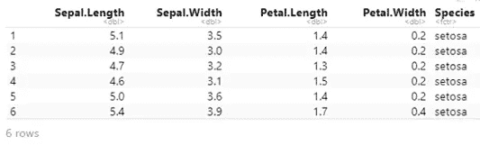

数据集足够小，可以在这里显示一个截图。下面是如何在 ggplot 中绘制一个基本的散点图。萼片长度将在 x 轴上，花瓣长度将在 y 轴上。

```
ggplot(iris, aes(x=Sepal.Length, y=Petal.Length))+geom_point()
```

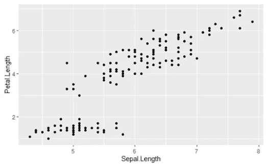

代码非常简单明了。第一个输入是数据集本身。然后在美学上，有‘x’和‘y’参数。最后是定义绘图类型的函数。在这种情况下，“geom_point()”。这个函数可以接受一些样式参数，这些参数将在本文后面讨论。

> *按颜色区分物种*

数据集显示，有不同的物种。有趣的是，不同物种的萼片长度和花瓣长度各不相同。它只需要在美学上增加一个颜色参数。我们将颜色设置为物种。所以，不同的物种会有不同的颜色。

```
ggplot(iris, aes(x=Sepal.Length, y=Petal.Length, col=Species))+geom_point()
```

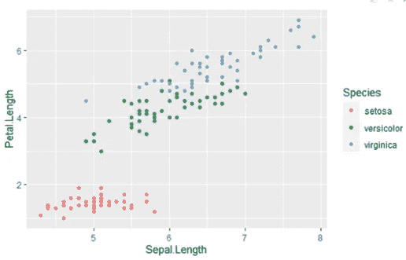

区别很明显。有些人喜欢用不同的形状来表示不同。下面是怎么做的。

```
ggplot(iris, aes(x=Sepal.Length, y=Petal.Length, col=Species, shape=Species))+geom_point()
```

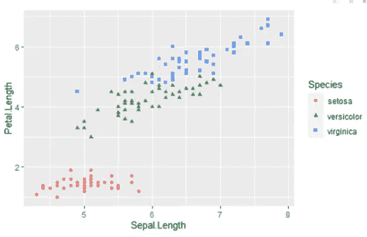

可以使用透明度添加另一个变量。我将添加阿尔法参数，并将其设置为花瓣长度。所以花瓣长度越短，点就越透明。

```
ggplot(iris, aes(x=Sepal.Length, y=Petal.Length, col=Species, shape=Species, size=Sepal.Width, alpha=Petal.Width))+geom_point()
```

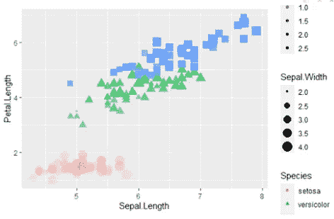

太多传说了！有时候少即是多。我们应该去掉一些传说。让我们摆脱阿尔法和大小传说。只有物种就够了。“指南”功能将有助于消除图例。

```
ggplot(iris, aes(x=Sepal.Length, y=Petal.Length, col=Species, shape=Species, size=Sepal.Width, alpha=Petal.Width))+geom_point() +guides(size=FALSE, alpha=FALSE)
```

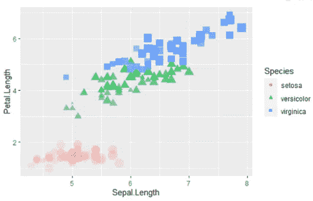

不是每个参数都适用于每个图。

在这里，我将展示另一种方法，在同一个图中显示所有五个变量:

```
ggplot(iris) + geom_point(aes(x=Sepal.Length, y=Petal.Length, colour=Sepal.Width, size = Sepal.Width, shape=Species))+guides(colour='legend')
```

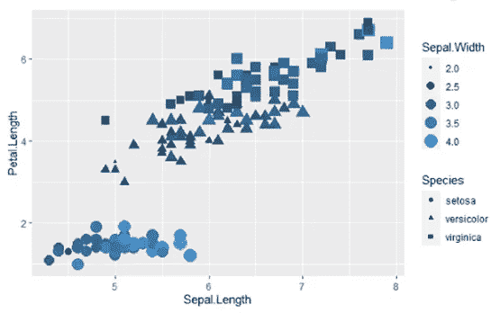

> ***直方图***

像往常一样，从最基本的直方图开始是个好主意。这是萼片长度的分布。

```
ggplot(iris, aes(x=Sepal.Length))+geom_histogram()
```

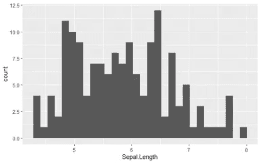

> *增加一些颜色和一个变量会更好看，同时也更有意义*

```
ggplot(iris, aes(x=Sepal.Length, fill=Species))+geom_histogram()
```

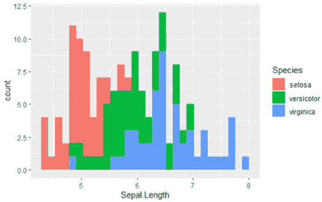

三种颜色显示了三种不同物种的分布。

这是另一件很酷的事情。除了显示另一个变量，还可以使用一个条件作为颜色。如花瓣长度> 4。

```
ggplot(iris, aes(x=Sepal.Length, fill=Petal.Length > 4))+geom_histogram()
```

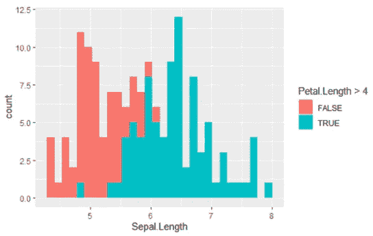

> *条件也可用于散点图。如果您还没有尝试过，请尝试一下。*

这个情节有一个问题。两个图相互叠加。这可以通过增加透明度并将位置设置为“身份”来避免。

```
ggplot(iris, aes(x=Sepal.Length, fill=Petal.Length >4))+geom_histogram(position='identity', alpha=0.4 )
```

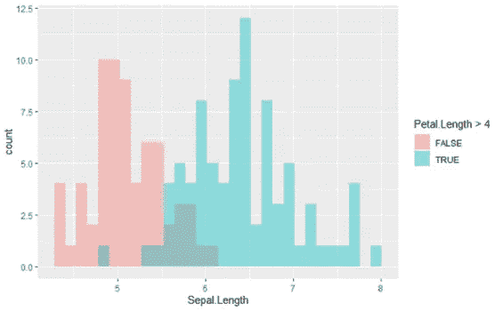

现在看到隐藏的部分了吗？或者在发行版中简单地使用侧边栏是另一种解决方案。因为该位置需要设置为“闪避”。

```
ggplot(iris, aes(x=Sepal.Length, fill=Petal.Length >4))+geom_histogram(position='dodge', alpha=0.7)
```

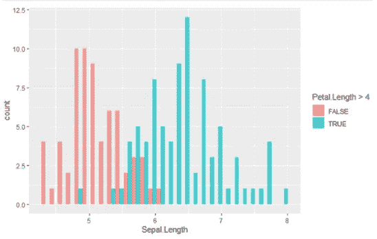

哪个是更好的选择？每个人都有自己的观点和选择。

> ***柱状图***

我将使用具有更多分类变量的不同数据集。另一个内置数据集名为“mpg”。

```
data(mpg)
```

这个数据集比上一个大。因此，这里不可能显示整个宽度的截图。请运行此代码查看前五行，亲自检查数据集:

```
head(mpg)
```

该数据集显示汽车的制造商、级别、公路里程、汽缸、年份、型号和一些其他变量。

这是一个基本的条形图，显示了数据集中每个制造商的汽车数量。这里还介绍了一个功能，即“主题”。这里我改变了文本在 x 轴上的角度。稍后我们会看到更多的“主题”功能的使用。

```
ggplot(mpg, aes(x=manufacturer))+geom_bar()+theme(axis.text.x =element_text(angle = 90))
```


制造商的名字不得不放在 45 度角，因为它们变得太杂乱了。在这个图中，只有 x 的值是足够的。因为 ggplot 可以计算幕后的计数。

> *如果您只需要百分比而不是计数怎么办*

函数‘after _ stat’需要作为美学中的 y 参数使用。以下是方法:

```
ggplot(mpg, aes(x=manufacturer, y = after_stat(100*count / sum(count))))+geom_bar()+theme(axis.text.x =element_text(angle = 90))+ labs(y="Percentage of cars")
```

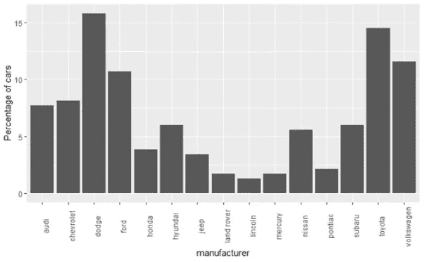

如果你注意到，我们在这里改变了 y 轴的标签，否则，它会把百分比公式作为 y 轴标签。

> *添加一些额外的样式和信息*

为了这个演示，让我们制作一个新的情节。这次 x 轴将代表类别，y 轴上将有“hwy”。该图还将引入“stat”参数。在“geom_bar”函数中，我们将使用“stat”作为“summary ”,使用“fun”作为“mean ”,以条形图上的点的形式获得平均值。以下是完整的代码:

```
ggplot(mpg, aes(class, hwy))+geom_bar(stat='summary', fun="mean", 
                                      fill='steelblue')+geom_point()
```

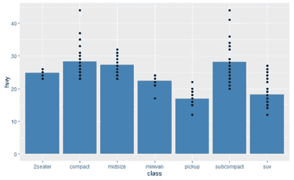

这些点也显示了数据的差异。

有些人更喜欢抖动点而不是规则点。这里有一个例子。情节之后我会再解释一些:

```
ggplot(mpg, aes(class, hwy))+geom_bar(stat="summary", fill='steelblue', col='black')+
  geom_point(position=position_jitter(0.2), size=2, shape=15)+
  labs(
    title="hwy for Each Class",
    x = NULL,
    y = NULL
  )+
  theme(panel.grid=element_blank(),
        panel.background = element_rect(fill = 'White'),
        panel.border=element_rect(colour = 'white', fill=NA, size=0.2))
```

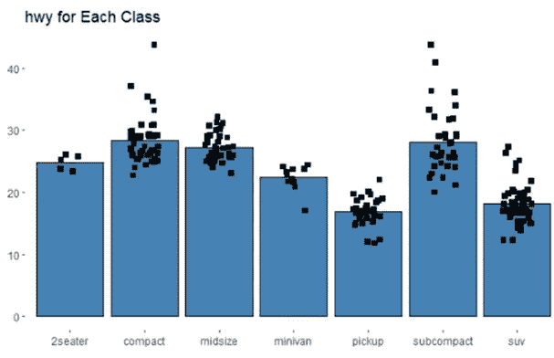

我喜欢我的情节尽可能的简洁明了。这里，x 轴和 y 轴的标签被拿掉了。仅仅因为它感觉是多余的。标题上写着‘hwy’代表每一类”。x 轴上的名字清楚地表明它们是类。那么 y 轴上有什么呢？所以，已经很清楚了。在“labs”函数中，x 和 y 被设置为空，以避免 x 和 y 标签。

> *在*上方的柱状图中增加一个变量

上面的情节只是简单的“阶级”对“公路”。在 x 轴上添加另一个分类变量将使它提供更多信息。我为第三个变量选择“cyl”。

```
ggplot(mpg, aes(class, hwy, fill=as.factor(cyl)))+
  geom_bar(stat="summary", fun="median", col="black",
           position="dodge")+
  geom_point(position=position_dodge(0.9))
```

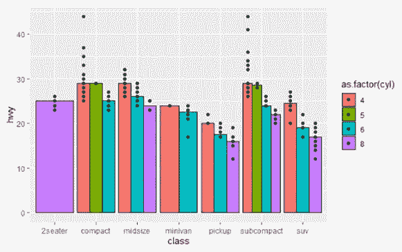

此处，x 轴显示了每个类别中不同“类别”和不同“气缸”类型的不同条形图。在“2seater”类中，该数据集中只有 8 种“cyl”类型可用。所以，那一个占据了整个宽度。同样,“超小型”类拥有所有四种“气缸”类型。它显示那里有四个小节。正如我们之前讨论过的，position = 'dodge '将条形并排放置，而不是堆叠在一起。

> ***箱线图***

另一个常用的可视化。它在一个盒子里提供了关于数据的伟大的基本统计。如果你对盒状图完全陌生，这里有一个教程解释了如何从盒状图中检索数据。虽然情节是用 Python 写的。但是箱线图的解释是简单明了的英语。这对任何人都适用。

[](/understanding-the-data-using-histogram-and-boxplot-with-example-425a52b5b8a6) [## 使用直方图和箱线图理解数据，并举例说明

### 了解如何从直方图和箱线图中提取最多的信息。

towardsdatascience.com](/understanding-the-data-using-histogram-and-boxplot-with-example-425a52b5b8a6) 

这是一个基本的箱线图:

```
ggplot(mpg, aes(class, hwy))+
  geom_boxplot(fill='steelblue', col="black")
```


代码很简单。它接受美学函数中的数据集、x 和 y 参数，我决定将颜色放在 geom_boxplot 函数中。

给它添加更多的风格:

```
ggplot(mpg, aes(class, hwy))+geom_point()+
  geom_boxplot(fill='steelblue', col="black", , notch=TRUE)
```

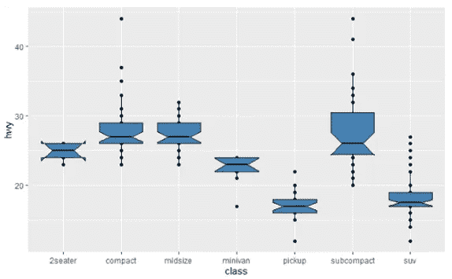

增加了一些缺口，给人一点有趣的看法。

> ***抖动图***

抖动图实际上是散点图的修改版。它随机地将点展开一点点或展开指定的量，这样点就不会彼此重叠。

这里有一个例子。我将把 class 放在 x 轴上，把 hwy 放在 y 轴上。

```
ggplot(mpg, aes(x=class, y=hwy), )+geom_jitter(width=0.2)
```

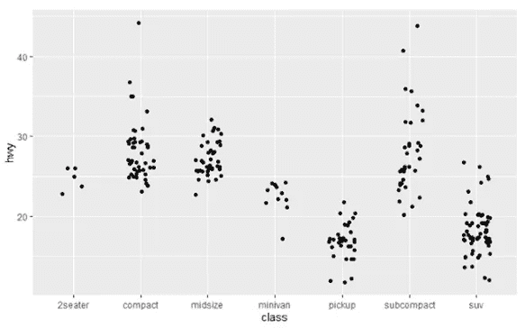

如果你画一个散点图，那些点将会在一条垂直的直线上。因为这是一个抖动图，这些点有点分散。当宽度参数设定为 0.2 时，点分散在该范围内。请随意更改 geom_jitter()函数中“宽度”参数，以查看不同宽度下的图形变化。

> *添加更多信息到其中*

添加一个红点，代表这些点的平均值。

```
ggplot(mpg, aes(x=class, y=hwy), )+geom_jitter(width=0.2)+
  stat_summary(aes(x=class, y=hwy), fun=mean, geom='point', colour='red', size=3)
```

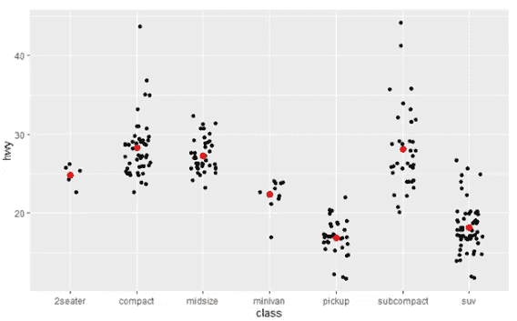

那些红点使情节变得更漂亮，也更有用。

> ***小平面网格***

非常有用。因为它提供了一个以更清晰的方式比较数据的机会。我们将在第一个情节之后解释更多。因为一张图胜过千言万语。

在这次演示中，我将使用不同的数据集。让我们在这里导入数据集:

```
gap = read.csv("[https://raw.githubusercontent.com/resbaz/r-novice-gapminder-files/master/data/gapminder-FiveYearData.csv](https://raw.githubusercontent.com/resbaz/r-novice-gapminder-files/master/data/gapminder-FiveYearData.csv)")
head(gap)
```

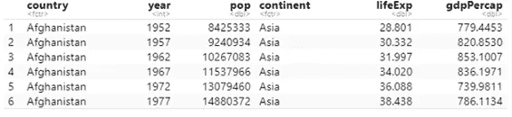

我将该数据集命名为“gap”。请看看上面数据集的前五行。这是不言自明的。

这是我们的第一个面网格图:

```
ggplot(gap, aes(x=lifeExp, fill=continent))+ geom_histogram(bins=20)+ facet_wrap(~continent)
```

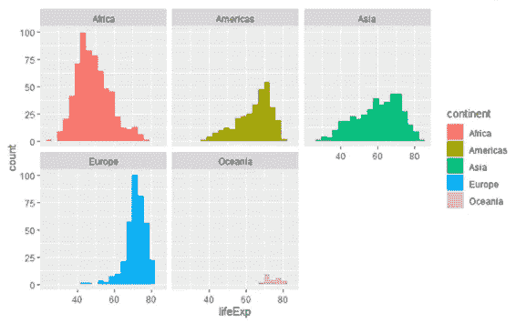

这就是小平面网格。在这里，我们用一行代码在同一个图中制作了每个大陆的预期寿命直方图。您也可以使用上一节直方图中显示的技术将所有直方图放在一个图中。

但这是另一种方式。而且看起来也很干净清晰。我想删除图例，以节省一些空间。这样图片会有更多的空间。反正传说看起来没必要。

```
ggplot(gap, aes(x=lifeExp, fill=continent))+ geom_histogram(bins=20)+
  facet_wrap(~continent)+
  theme_minimal()+
  theme(legend.position = 'None')+
  xlab("Life Extectancy")+
  ylab("count")
```

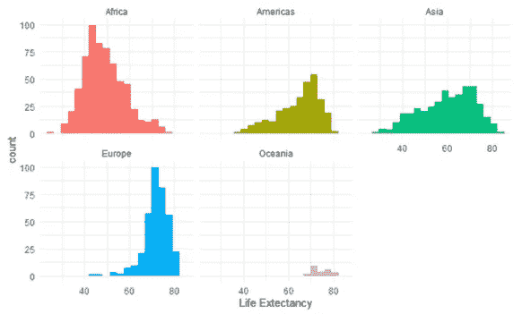

参数的图例。“位置”被设置为“无”以删除图例。

> *但也可以设置为“上”、“下”、“左”或“右”*

这个情节中添加的另一个重要功能是“theme_minimal()”。这样，它在这里给出了一个有点不同的背景。

有这么多不同的主题可供选择。以下是其中的一些:

theme_bw()，

主题 _ 经典()，

theme_dark()，

theme_gray()，

主题 _ 灯光()，

theme_dark()

还有很多。

一个使用这些大陆数据的散点图，其中 x 轴为“gdpPercap ”, y 轴为“lifeExp”。

```
ggplot(gap)+
  geom_point(aes(x=gdpPercap, y=lifeExp))+
  facet_wrap(~continent)
```

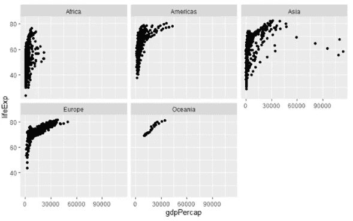

虽然我认为在大多数情况下保持相同的规模会有所帮助。因为在尺度相同的情况下，很容易比较不同大洲的数据。但与此同时，当数据如此混乱时，从头到尾改变尺度可能看起来不错。

```
ggplot(gap)+
  geom_point(aes(x=gdpPercap, y=lifeExp))+
  facet_wrap(~continent, scale='free')
```

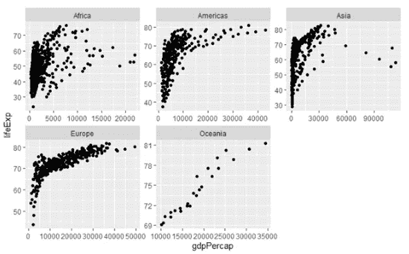

每个散点图都有自己的刻度，这意味着不同的 x 轴和 y 轴值。

> *也可以在刻面 _ 包裹功能*中使用‘自由 _ x’或‘自由 _ y’作为刻度，只改变 x 轴或 y 轴的值

“facet_wrap”可以接受多个变量。回到我们的“mpg”数据集，让我们使用“year”和“drv”为 facet_wrap 绘制一个 facet_grid 图。

```
ggplot(mpg)+
  geom_point(aes(x=displ, y=hwy))+
  facet_wrap(~year+drv)
```

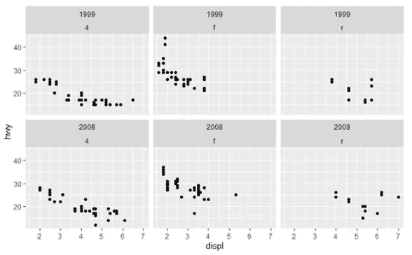

请随意多做一些实验。

> *最后一个使用 facet_wrap()的例子包含了很多风格的想法*

该图将再次使用“mpg”数据集。这是一个柱状图，显示了各个年份每个制造商的汽车数量。

```
ggplot(mpg)+
  geom_bar(aes(y=manufacturer))+
  facet_wrap(~year)+
  labs(title = "Number of cars per manufacturer",
       x = NULL,
       y=NULL)+
  scale_x_continuous(expand = c(0, NA))+
  theme_minimal()+
  theme(
    text = element_text("Tahoma"),
    strip.text = element_text(face='bold',
                              hjust=0),
    panel.grid.major = element_line('white', size=0.6),
    panel.grid.minor = element_blank(),
    panel.grid.major.y = element_blank(),
    panel.ontop = TRUE
  )
```

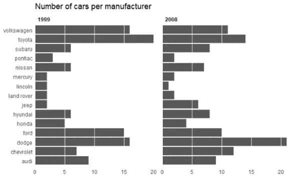

这里使用了 theme_minimal()。但是看，即使你使用内置的主题，你也可以加入你自己的风格。在这个图中，x 和 y 的标签被拿掉了，因为标题说明了一切。面板网格次要项留空，面板网格主要项设置为“白色”，大小为 0.8。那给情节增添了许多风格。添加'面板。“ontop = TRUE”将这些面板样式添加到绘图顶部。如果你删除这条线，那些细网格就不会显示出来。

> ***包括一些统计参数***

在本节中，我们将添加回归线和置信区间。在本演示中，来自“mpg”数据集的“displ”将放在 x 轴上，“hwy”将放在 y 轴上。颜色将被“cyl”改变。

```
ggplot(mpg, aes(x= displ, 
                y = hwy))+
  geom_point(aes(colour = cyl))+
  geom_smooth()+
  labs(x = 'displ',
       y = 'hwy',
       title = "displ vs hwy")+
  theme_minimal()
```

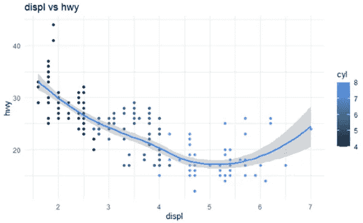

上面的 geom_smooth()'函数添加了这条回归线和显示每个点的置信区间的置信带。

在统计学的不同情况下，标度变换是一种非常常见的做法。我现在不打算深入细节，因为那不是本文的范围。但我将在 ggplot 中显示比例转换，而不是使用默认回归，而是在绘图中使用线性回归线。

```
ggplot(mpg, aes(x= displ, 
                y = hwy))+
  geom_point(aes(colour = cyl))+
  geom_smooth(method='lm')+
  scale_x_log10()+
  labs(x = 'displ',
       y = 'hwy',
       title = "displ vs hwy")+
  theme_minimal()
```

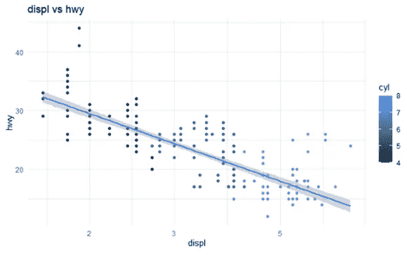

在此图中，通过 x 轴使用 log10 变换，并通过在 geom_smooth()函数中设置“method='lm '引入线性回归线。**请随意尝试 y 轴上的 log10 变换。**

# 结论

ggplot 库有大量可用的图形。更多的几何图形，更多的风格。我可以在这篇文章中展示一些。如果你是一个初学者，并且完成了上面所有的练习，你已经走了很长的路。同时，还有很长的路要走。我以后会在 ggplot 上做更多的教程。我希望你能在你的工作或项目中运用这些想法。

欢迎在[推特](https://twitter.com/rashida048)上关注我，并喜欢我的[脸书](https://www.facebook.com/rashida.smith.161)页面。