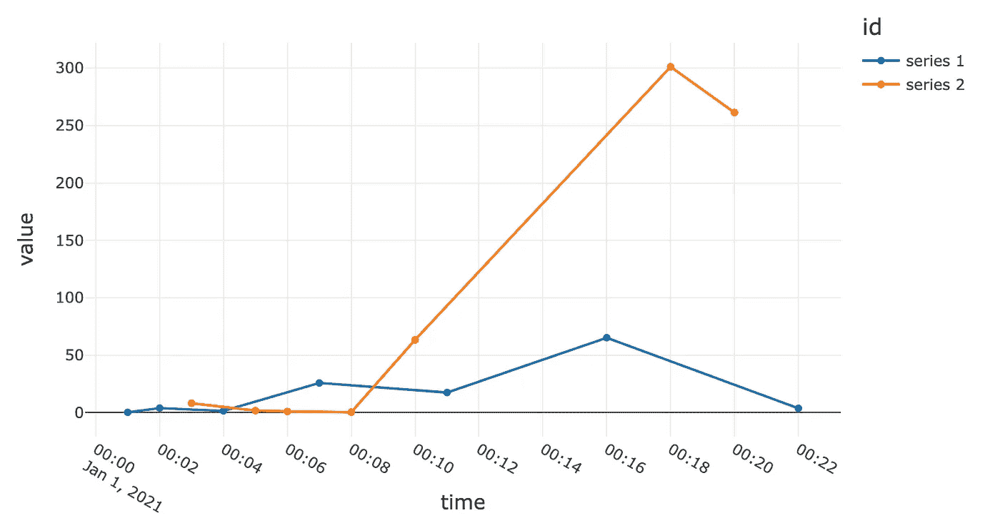
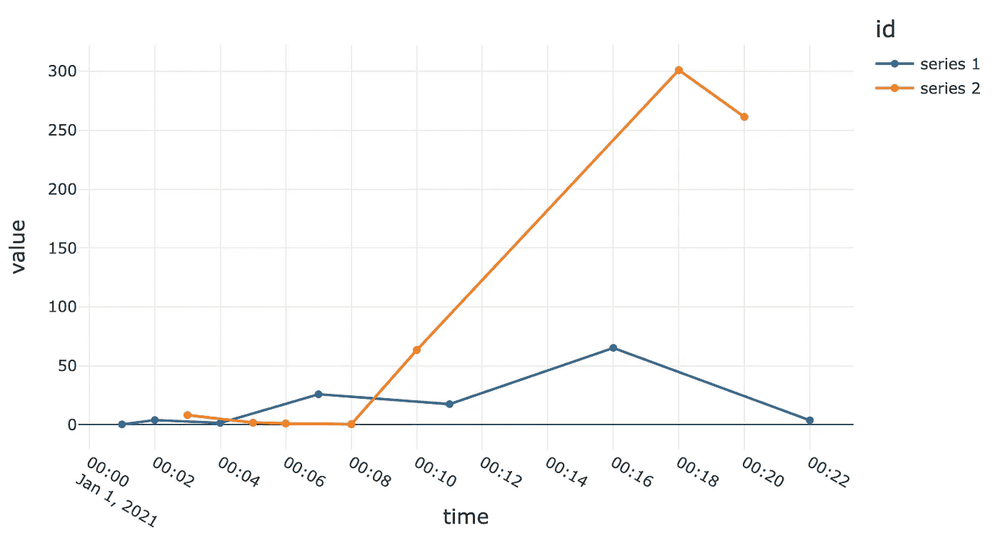
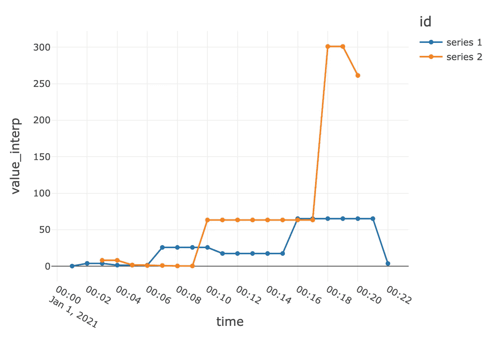
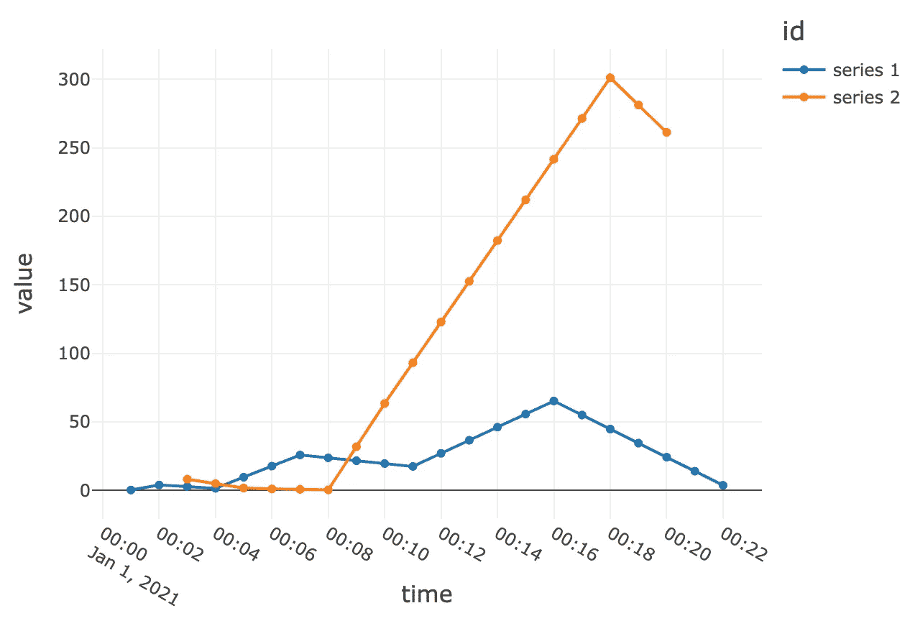
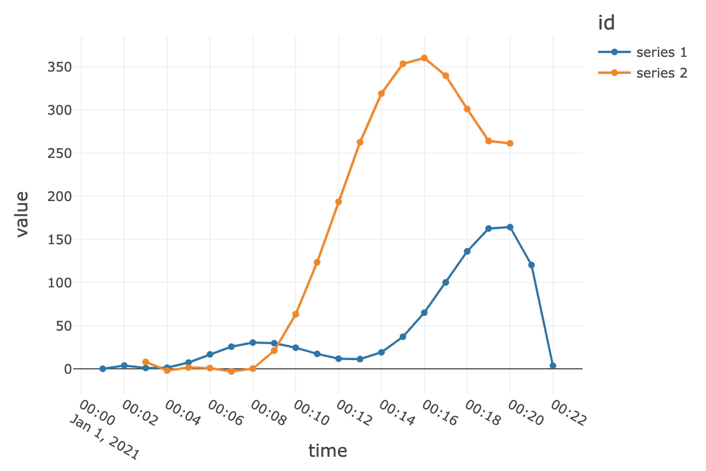

# 如何不分析时间序列

> 原文：<https://towardsdatascience.com/a-common-mistake-to-avoid-when-working-with-time-series-data-eedf60a8b4c1?source=collection_archive---------10----------------------->

艾萨克·史密斯在 [Unsplash](https://unsplash.com?utm_source=medium&utm_medium=referral) 上拍摄的照片

我看到初级数据科学家和面试候选人犯的最常见的时间序列数据错误之一是假设数据有规律的跳动，没有间隙。这是一个糟糕的假设。

以一次面试练习为例，我向候选人提供了一个数据集，其中包含数百个应用程序的下载和使用指标。我要求候选人从投资的角度来看，找出哪些应用是有趣的，并暗示增长可能是有趣的一个很好的指标。候选人通常会直接计算增长率，方法是将每个应用程序的最新分数与最新分数之前的分数进行比较，然后根据计算出的增长率对应用程序进行排名。这假设每个系列中的最新数据点代表相同的时间点，并且相应的先前点在 1 个时间单位之外。事实证明，我提供的数据集不是这样的，会导致不正确的结果。数据集中的许多时间序列都有缺失的数据点，并且刻度的间隔不均匀或不一致。正如您在下面的可视化示例中看到的，不考虑变化的分笔成交点大小和数据缺口的简单逐点分析就像将苹果与橙子进行比较。

两个不均匀勾选的时间序列-作者图片

大多数真实世界的数据集将遭受这种类型的问题，因为它们通常是从有缺陷的系统和过程中排出的，这些系统和过程在设计时没有考虑到分析用例。因此，在进行任何分析或建模之前，理解数据中的这些缺陷并正确地解释它是很重要的。否则，很可能导致垃圾进，垃圾出。

那么，对于时间序列数据，我们如何做到这一点呢？我通常遵循的步骤是

1.  通过直观查看示例时间序列，了解时间序列的时间范围和刻度粒度
2.  将每个时间序列中的实际刻度数与(最大值减去最小值时间戳)除以刻度间距得出的理论刻度数进行比较。该比率有时被称为填充比率-远小于 1 的值意味着缺少很多刻度。
3.  筛选出填充率低的系列。我经常使用 40%作为信息内容不足的界限，但这可能会根据手头的具体任务而有所不同。
4.  通过向上采样到更精细的分辨率，标准化跨时间序列的刻度间距。
5.  为您的分析使用适当的插值方法填充上采样分笔成交点。例如，采用最后已知的值，或者线性/二次插值等

下面是我用 PySpark 实现这种时间序列标准化方法的一些示例代码:

值得注意的一点是——我在分组的 PySpark 数据帧上使用了`applyInPandas`方法进行插值。在底层，它使用了 pandasUDF，相对于 PySpark 中的普通 UDF，它提供了巨大的性能提升。通过 Apache Arrow 实现更高效的数据传输，通过 Pandas 矢量化实现更高效的计算，从而提高了性能。只要有可能，总是尽量使用 pandasUDF。参见 [API 文档](https://spark.apache.org/docs/latest/api/python/reference/api/pyspark.sql.functions.pandas_udf.html)了解更多信息。

为了更直观地说明代码执行时底层时间序列发生了什么，下面是流程各个阶段的图表。希望这能让人们明白，不经过标准化，就不能简单地开始逐点计算增长指标。

开始，不均匀打勾时间序列-作者图片

以 1 分钟为间隔进行上采样，并使用最后一个已知值进行插值，得出以下时间序列

向上采样并用最后一个已知值填充-图片由作者提供

上采样和线性插值产生以下结果

向上采样和线性插值—图片由作者提供

只是为了好玩，五次多项式插值

希望这是一次有益的讨论，我已经帮助你避免将来犯这样的错误。如果您有任何意见或问题，请随时联系我们。[Twitter](https://twitter.com/yifei_huang)|[Linkedin](https://www.linkedin.com/in/yifeihuangdatascience/)|[Medium](https://yifei-huang.medium.com/)