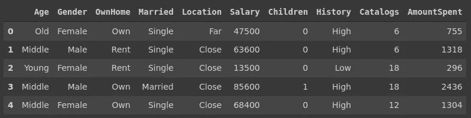
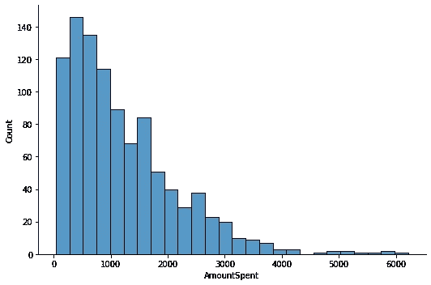
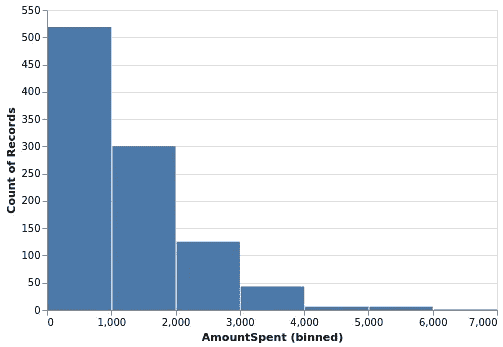
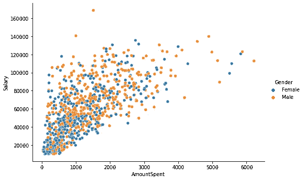
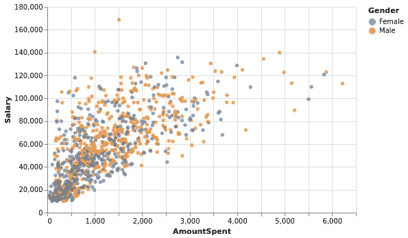
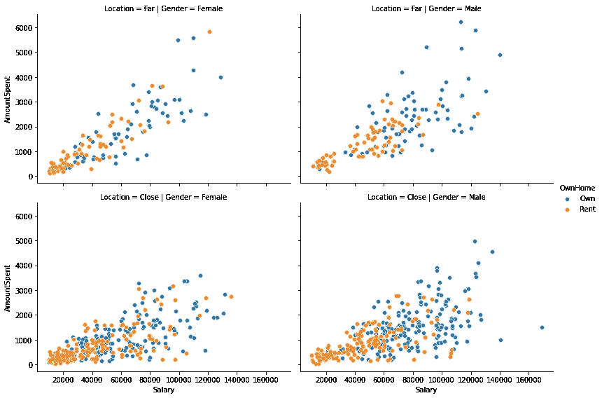
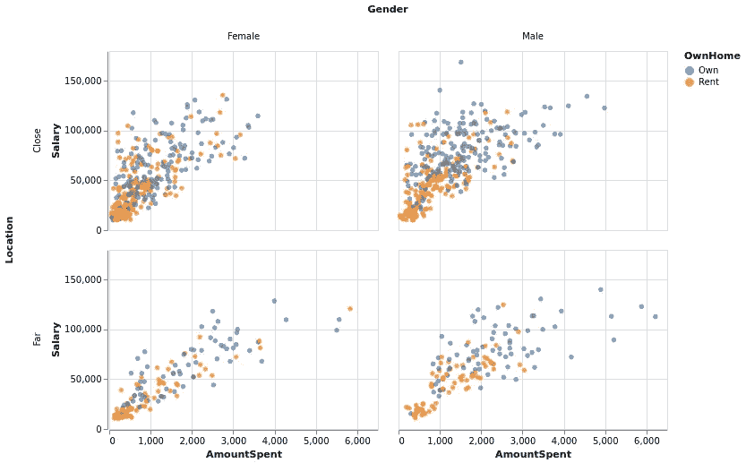

# 海本与牛郎星之比较

> 原文：<https://towardsdatascience.com/a-comparison-of-seaborn-and-altair-640b11ca2e7b?source=collection_archive---------41----------------------->

## 两个流行的 Python 数据可视化库


约尔根·哈兰在 [Unsplash](https://unsplash.com/s/photos/twice?utm_source=unsplash&utm_medium=referral&utm_content=creditCopyText) 上的照片

数据可视化是数据科学的重要组成部分。揭示变量之间的关系有助于更好地理解数据。还可以使用设计良好的数据可视化来探索数据集中的底层结构。

在本文中，我们将比较两个流行的 Python 数据可视化库:Seaborn 和 Altair。

比较将基于使用两个库创建 3 组可视化。比较的重点是语法、图形结构以及这些库如何处理变量之间的关系。

我们将使用营销[数据集](https://www.kaggle.com/yoghurtpatil/direct-marketing)来创建可视化效果。让我们从导入依赖项并把数据集读入 Pandas 数据帧开始。

```
import numpy as np
import pandas as pdimport seaborn as sns
import altair as altdf_marketing = pd.read_csv("/content/DirectMarketing.csv")df_marketing.head()
```



(图片由作者提供)

## 柱状图

第一组可视化包括基本直方图。

在 Seaborn 中，我们传递数据帧的名称和要绘制的列的名称。高度和纵横比参数用于修改地块的大小。纵横比是宽度与高度的比率。

```
sns.displot(df_marketing, x='AmountSpent', aspect=1.5)
```



Seaborn 直方图(图片由作者提供)

在 Altair 中，我们从一个顶级图表对象开始，它将数据帧作为参数。然后我们指定绘图的类型。encode 函数获取要绘制的列、关系和转换。我们放入编码函数的任何内容都需要链接到传递给图表的数据帧。最后，属性函数调整绘图的大小。

```
alt.Chart(df_marketing).mark_bar().encode(
  alt.X('AmountSpent:Q', bin=True), y='count()'
).properties(height=300, width=450)
```



牛郎星直方图(图片由作者提供)

Altair 在数据转换方面非常高效。让我们解释一下为创建上面的直方图所做的转换。

```
alt.X('AmountSpent:Q', bin=True), y='count()'
```

这一行的作用是将“花费的金额”列分成多个箱，并计算每个箱中数据点的数量。

## 基于分类变量的分离

Seaborn 和 Altair 都提供了简单的方法，根据分类变量中的不同组来区分数值变量的数据点。

在 Seaborn 中，这种分离可以通过色调、颜色或行参数来实现。下面的代码将返回一个散点图的金额和工资列和分离将根据性别进行。

```
sns.relplot(
    data=df_marketing, x='AmountSpent', y='Salary', 
    kind='scatter', hue='Gender', aspect=1.5
)
```



Seaborn 散点图(图片由作者提供)

在 Altair 中，我们在编码函数中使用颜色参数。类似于 Seaborn 的色相参数。

```
alt.Chart(df_marketing).mark_circle().encode(
  x='AmountSpent', y='Salary', color='Gender'
).properties(height=300, width=450)
```



牛郎星散点图(图片由作者提供)

## 创建地块网格

在某些情况下，在一个可视化中使用多个图会更有吸引力或提供更多信息。每个子情节都可以用来强调某个特定的特征或关系，因此整体视觉传达更多的信息。

有许多方法可以创建多图可视化。在 Seaborn 中，我们可以使用 Matplotlib 的 pyplot 接口，通过指定图形中轴对象的数量来手动创建网格。然后，我们可以为每个轴对象生成一个图。

另一种方法是使用 FacetGrid 或 PairGrid 来自动生成绘图网格。基于给定的变量(即特征)，FacetGrid 创建一个子图网格，它允许将数据集的结构转移到可视化中。Row、col 和 hue 参数可以看作是 FacetGrid 对象的三个维度。

```
g = sns.FacetGrid(
   data=df_marketing, col='Gender', row='Location', hue='OwnHome',   
   height=4, aspect=1.4
)g.map(sns.scatterplot, "Salary", "AmountSpent").add_legend()
```



Seaborn FacetGrid(图片由作者提供)

我们首先使用 hue、col 和 row 参数构建模式。色调参数使用不同的颜色进行分色，而 col 和 row 参数分别使用 x 轴和 y 轴。然后，映射函数用于指定绘图类型以及要绘制的变量(即数据帧中的列)。

在 Altair 中，创建这种网格的逻辑与 Seaborn 非常相似。

```
alt.Chart(df_marketing).mark_circle().encode(
  x='AmountSpent', y='Salary', color='OwnHome',
  column='Gender', row='Location'
).properties(height=200, width=300)
```



牵牛星网格图(图片由作者提供)

除了颜色参数之外，我们还使用 encode 函数中的 column 和 row 参数向返回的可视化添加维度。

## 结论

Seaborn 和 Altair 都是流行的 Python 数据可视化库。对于大多数数据可视化任务来说，这两种方法都足够了。在不同方面都有一个比另一个小的优势。

我认为 Seaborn 的语法比 Altair 的语法简单一点，更容易阅读。另一方面，Altair 在[数据转换](/altair-statistical-visualization-library-for-python-part-2-4c8ce134e743)方面优于 Seaborn。牛郎星还提供了[交互式](/altair-statistical-visualization-library-for-python-part-3-c1e650a8411e)可视化。

感谢您的阅读。如果您有任何反馈，请告诉我。