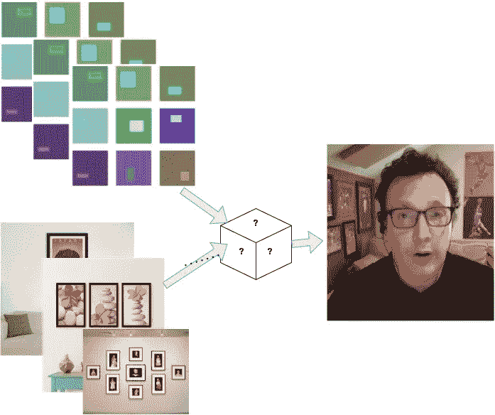
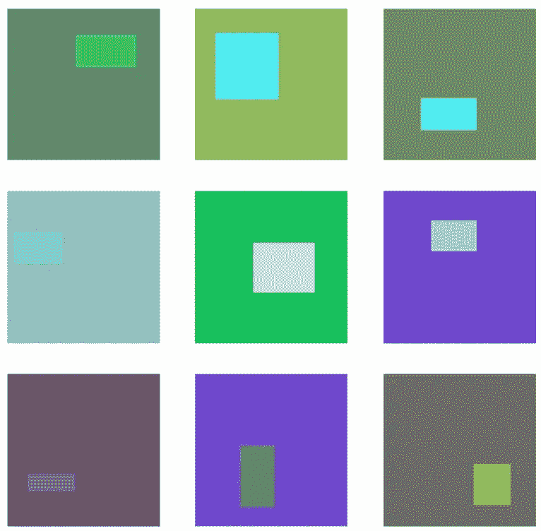
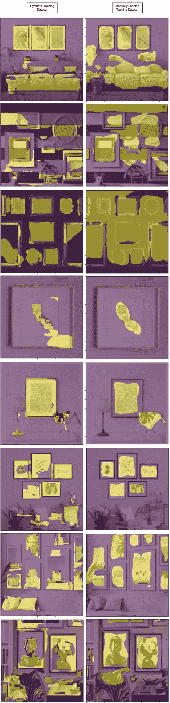

# 训练 UNet 分割模型的合成与人工标记数据集的比较

> 原文：<https://towardsdatascience.com/a-comparison-of-synthetic-vs-human-labeled-dataset-to-train-a-unet-segmentation-model-10588f8d9c12?source=collection_archive---------37----------------------->

## [理解大数据](https://towardsdatascience.com/tagged/making-sense-of-big-data)

作者:[伦索林格](https://www.linkedin.com/in/aaronsoellinger/) & [威尔昆兹](https://www.linkedin.com/in/willkunz/)@[WallShots.co](https://wallshots.co/)



将合成训练数据与传统训练数据进行比较(图片由作者提供)

手动标记数据既昂贵又繁琐。一种紧急的方法是使用合成数据生成来大规模减少标记足够大的数据集以进行分割所必需的提升。在本文中，我们使用一个合成数据集和一个传统标记的小型数据集创建了一个基准模型。在我们的例子中，没有现成的训练数据集，所以我们必须创建它。

我们正在构建的模型的目标是识别图像中的任何图片框架。具体来说，我们希望识别包含图片的图片帧区域(不是填充或帧本身)。本文描述了我们的解决方案架构，以及我们如何使用它来比较用两种不同方法创建的基线模型，以形成训练数据集。首先，我们生成一个简单的合成数据集，它由彩色矩形组成。我们将其与另一种方法进行比较，即所谓的“传统方法”，在这种方法中，使用我们的标记工具(Label Studio)找到并标记“野生的”。

我们针对这个问题的栈是 Label Studio，用 Python Fast.ai 训练环境进行标注。在本文中，实验基于带有`resnet34`主干的 unet 架构。

最后，我们将展示使用不同方法训练的两个基线模型的比较，以开发训练数据集。我们希望这篇文章对那些实现细分模型的人来说是一个有趣的案例研究。

对于传统的标签任务，我们使用 Label Studio。我们贴标设置的详细描述可在此处找到:

[https://towardsdatascience . com/development-of-a-benchmark-dataset-with-a-interface-to-the-fastai-data loader-using-label-studio-d3aa 3c 26661 f](/development-of-a-benchmark-dataset-with-an-interface-to-the-fastai-dataloader-using-label-studio-d3aa3c26661f)

# 数据集

## 合成数据集

处理 1:在具有以下特征的 2000 幅合成生成的图像上进行训练:

*   单一矩形，即放置在背景“场景”上的“框架”
*   在界限内随机调整大小
*   在界限内随机着色
*   随机放置在固定大小(224x224)的背景矩形边界内



可视化小批量合成数据示例(图片由作者提供)

```
## Primary synthetic data generator method, amount of desired data can be adjusted ##
def _random_select_valid_tl(scene:MaskedImg, frame_template:dict, mask:MaskedImg):
    """
    TODO: support multiple frames, currently could have overlapping frames
    """
    sx,sy,sz = scene.img.shape
    vertices = np.array(frame_template['label_data'])
    fwidth = abs(
        max(vertices[:,0]) -
        min(vertices[:,0])
    )
    flength = abs(
        max(vertices[:,1]) - 
        min(vertices[:,1])
    )
    tlx,tly = (
        np.random.randint(0, sx-fwidth-1),
        np.random.randint(0, sy-flength-1)
    )
    return tlx,tlydef add_frame_to_scene(scene:MaskedImg, frame_template:dict, mask:MaskedImg, plot:bool):
    """
    In:
        scene: np.array, mutable, frame gets written on top
        frame: np.array, list of vertices

    """
    # adjust the frame coords
    tlx,tly = _random_select_valid_tl(
        scene=scene, frame_template=frame_template, mask=mask
    )
    frame = np.array(frame_template['label_data']).copy()
    frame[:,0] = frame[:,0] + tlx
    frame[:,1] = frame[:,1] + tly

    # create the "filled scene"
    vertices_to_region(
        mask_i=scene.img, # gets muted
        label_data=frame.tolist(),
        label_num=frame_template['color'],
        plot=plot
    )

    # update the mask to reflect the frame added to the scene
    vertices_to_region(
        mask_i=mask.img, # gets muted
        label_data=frame.tolist(),
        label_num=frame_template['label_num'],
        plot=plot
    )
    # plt.imshow(mask.img)
    # plt.show()def select_random_color(color_list:list):
    sc = color_list[np.random.randint(0,len(color_list))]
    return color_list[
        np.random.randint(0,len([x for x in color_list if x != sc]))
    ]def generator(scene_shapes, frame_templates, color_list, masks_path, scenes_path, plot=False):
    errors = 0
    for i in range(len(scene_shapes)):
        scene_shape = scene_shapes[i]
        frame_template = frame_templates[i]

        # instantiate the scene
        scene = MaskedImg()
        scene.load_from_parameters(
            shape=scene_shape,
            value=select_random_color(color_list),
            value_space='rgb'
        )# instantiate the mask
        mask = MaskedImg()
        mask.load_from_parameters(
            shape=scene_shape[:2],
            value=0,
            value_space='int'
        )
        try:
            add_frame_to_scene(
                scene=scene, 
                frame_template=frame_template, 
                mask=mask,
                plot=plot
            )
        except:
            errors += 1
            continue

        # plt.imshow(scene.img)
        # plt.show()
        # plt.imshow(mask.img)
        # plt.show()

        maskfp = f'{str(masks_path)}/{i}.tif'
        scenefp = f'{str(scenes_path)}/{i}.jpeg'
        mask.save(fp=maskfp)
        scene.save(fp=scenefp)

    print('Finished with {} errors.'.format(errors))exp_id = 0
scenes_path = Path("/ws/data/wallshots-framefinder/{}/scenes".format(exp_id))
masks_path = Path("/ws/data/wallshots-framefinder/{}/masks".format(exp_id))
scenes_path.mkdir(exist_ok=True, parents=True)
masks_path.mkdir(exist_ok=True, parents=True) n = 2000
color_list = [
    (0, 0, 255), (102, 255, 51), (204, 153, 0), (255, 51, 204), 
    (51, 102, 153), (255, 0, 0), (0, 255, 0), (255, 255, 0), (0, 255, 255),
    (128, 0, 255), (204, 102, 0), (153, 0, 51), (255, 102, 153),
    (102, 255, 153), (204, 255, 153), (255, 255, 204), (51, 51, 0), 
    (126, 153,64), (230, 30, 120), (50, 23, 200)]scene_shapes = [(224,224) for i in range(n)]
lws = [(np.random.randint(10,100),np.random.randint(10,100)) for i in range(n)]
frame_templates = [{
        'label_data': np.array([
            (0,0), (0,lw[1]), (lw[0],lw[1]), (lw[0],0)
        ]),
        'color': select_random_color(color_list),
        'label_num': 1
    } for lw in lws]generator(
    scene_shapes=scene_shapes, 
    frame_templates=frame_templates, 
    color_list=color_list,
    scenes_path=scenes_path,
    masks_path=masks_path,
    plot=False
)
```

## 手动标记的数据集

从互联网上选择 10 张图片，并使用我们的标签测试平台进行标签。我们再次使用 Label Studio 完成传统的标记任务，建立了一个新的 Label Studio 项目，这样我们就不会混淆我们为基准目的标记的图像和我们为训练目的创建的标签。

*   10 张基础图片取自“野外”资源，如谷歌搜索。
*   在没有显著微调的情况下，在“第一遍”中手动标记。
*   图像包含真实世界或真实世界人造场景中的图片框架


Label Studio 设置的屏幕截图(图片由作者提供)


可视化小批量的传统标签示例(图片由作者提供)

## 基准数据集

我们通过仔细选择“来自野外”的示例图像并使用 label studio 分段功能对其进行标记，创建了一个基准数据集。参见我们之前的一篇文章，该文章对此进行了深入描述:[https://towardsdatascience . com/development-of-a-benchmark-dataset-with-a-interface-to-the-fastai-data loader-using-label-studio-d3aa 3c 26661 f](/development-of-a-benchmark-dataset-with-an-interface-to-the-fastai-dataloader-using-label-studio-d3aa3c26661f)

*   8 基本图像取自“野外”来源，如谷歌搜索。
*   手动标记，并进行重大微调。
*   图像包含真实世界或真实世界人造场景中的图片框架。
*   图像选择绊倒模型。例如，条纹墙、障碍物、景深、图像噪声。


可视化基准数据集(作者提供的图片)

# 实验

## 测量结果

每个实验中创建的模型都根据独立的基准数据集进行评估，该数据集旨在准确地表示模型的真实环境。单独的基准数据集将是实验结果的唯一真实来源。我们之所以有一个单独的基准数据集和自己的数据管道，是因为基准数据集的目的需要明确，并反映在创建它的底层流程中。这里定义了一个基准数据集来注入导致模型失效的例子。与此相反，训练数据集旨在使模型尽可能好。我们认为这可能是一个重要的区别，它保证了单独维护基准数据集的额外开销。

## 模型

这里，我们比较两个不同实验的结果。这些模型将非常相似，但不同之处在于它们训练的训练数据集。在每种情况下，模型的实例化都是相似的，使用 fastai `unet_learner`需要一个分段数据加载器。我们能够对所有数据集使用相同的目录结构，这简化了数据加载器的创建，因为它们可以共享相同的代码。该结构如下所示:

```
benchmark/
├── masks
│   ├── 1.tif
│   ├── 2.tif
│   ├── 3.tif
│   ├── 4.tif
│   ├── 5.tif
│   ├── 6.tif
│   ├── 8.tif
│   └── 9.tif
└── scenes
    ├── 1.jpg
    ├── 2.jpg
    ├── 3.jpg
    ├── 4.jpg
    ├── 5.jpg
    ├── 6.jpg
    ├── 8.jpg
    └── 9.jpg
```

数据加载器实例化如下，其中`saveto`是文件夹位置(例如在`benchmark/`之上):

```
size = 224
imgs_saveto = saveto/'scenes'
dls = SegmentationDataLoaders.from_label_func(
    imgs_saveto, 
    bs=6,
    fnames=[
        name 
        for name in imgs_saveto.iterdir()
        if not name.is_dir()
    ],
    label_func=
        lambda x: 
        str(x).replace('scenes', 'masks').replace('jpg', 'tif'),
    item_tfms=[Resize((size,size))],
    batch_tfms=[
        Normalize.from_stats(*imagenet_stats)
    ],
    valid_pct=0.00
)
```

在传统创建的训练示例的情况下，`valid_pct`参数为 0.0，因为我们想要利用所有 10 个图像，因为图像很少。每一个都是珍贵的…

## 培养

我们通过绘制覆盖在来自基准数据集的输入图像上的预测掩膜，对两个模型进行了并排比较。为此，我们对用合成数据训练的模型运行了以下训练程序:

```
learn = unet_learner(
    dls, 
    resnet34,
    cbs=WandbCallback(),
    n_out=2,
    path=Path('.')
)learn.fit_one_cycle(10, slice(1e-2, 1e-3))
learn.save('model1-a-0')
learn.fit_one_cycle(10, slice(1e-2, 1e-3))
learn.fit_one_cycle(10, slice(1e-5, 1e-7))
learn.fit_one_cycle(10, slice(1e-6, 1e-7))
learn.save('model1-a-1')
```

对于每个历元，合成数据集比传统标记的数据集花费更长的时间。我们使用的训练策略只是给定数据的一个合理的起点。对于传统标记的数据集，我们运行以下程序:

```
learn = unet_learner(
    dls,
    resnet34,
    cbs=WandbCallback(), 
    n_out=2, 
    path=Path('.')
)learn.fit_one_cycle(20, slice(1e-2, 1e-3))
learn.fit_one_cycle(20, slice(1e-2, 1e-3))
learn.fit_one_cycle(20, slice(1e-2, 1e-3))
learn.fit_one_cycle(20, slice(1e-2, 1e-3))
learn.fit_one_cycle(20, slice(1e-2, 1e-3))
learn.fit_one_cycle(20, slice(1e-5, 1e-7))
learn.fit_one_cycle(20, slice(1e-6, 1e-7))
learn.save('model2')
```

## 定性评价

在下图中，我们将调整了大小的输入上的预测掩码叠加到使用上面粘贴的策略训练的每个模型上。在左侧，图像通过仅使用合成数据创建的模型运行，而右侧是来自我们手动标记的数据集的模型。



用 2000 个简单合成生成的图像(左)与 10 个手动标记的图像(右)训练的模型的比较(图像由作者提供)

## 结论

这个练习的目的是对下一次投资做出决定。我们应该花费更多的资源来标记数据，还是应该进一步开发代码以使合成数据集更加真实？我们对传统上标记为训练数据集的 10 图像的有效性印象最深。因此，前进的道路是添加数据扩充，以更好地最大化来自传统数据集的每个训练样本。我们直观地看到，虽然很有希望，但使合成标签代码更真实的前期投资是很高的。因此，我们决定以后再来。有价值的方法是传统和合成标记方法的结合，这将使我们能够生成大量有点真实的标记图像，而无需在标记或虚拟现实开发方面的巨大投资。