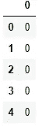

# Python 中从头开始的完整异常检测算法:分步指南

> 原文：<https://towardsdatascience.com/a-complete-anomaly-detection-algorithm-from-scratch-in-python-step-by-step-guide-4c115e65d54e?source=collection_archive---------20----------------------->


由 [Unsplash](https://unsplash.com?utm_source=medium&utm_medium=referral) 上的 [Edge2Edge 媒体](https://unsplash.com/@edge2edgemedia?utm_source=medium&utm_medium=referral)拍摄

## 基于概率的异常检测算法

异常检测可以被视为异常值分析的统计任务。但如果我们开发一个机器学习模型，它可以自动化，像往常一样，可以节省很多时间。异常检测有很多使用案例。信用卡欺诈检测、故障机器检测或基于异常特征的硬件系统检测、基于医疗记录的疾病检测都是很好的例子。还有更多的用例。异常检测的使用只会越来越多。

在本文中，我将解释用 Python 从头开始开发异常检测算法的过程。

## 配方和流程

这将比我之前解释的其他机器学习算法简单得多。该算法将使用平均值和方差来计算每个训练数据的概率。

如果一个训练样本的概率很高，这是正常的。如果某个训练示例的概率很低，则它是一个异常示例。对于不同的训练集，高概率和低概率的定义是不同的。我们稍后将讨论如何确定这一点。

如果非要我解释异常检测的工作流程，那就很简单了。

1.  使用以下公式计算**平均值**:


这里 m 是数据集的长度或训练数据的数量，xi 是单个训练示例。如果你有几个训练特征，大多数情况下，需要计算每个特征的平均值。

2.使用以下公式计算**方差**:


这里，mu 是上一步计算的平均值。

3.现在，用这个概率公式计算每个训练示例的概率。


> 不要被这个公式中的求和符号迷惑了！这实际上是对角线形状的方差。

稍后当我们实现算法时，你会看到它的样子。

4.我们现在需要找到概率的阈值。正如我之前提到的，如果一个训练样本的概率很低，这就是一个异常的例子。

**多大概率才算低概率？**

对此没有普遍的限制。我们需要为我们的训练数据集找出答案。

我们从第 3 步得到的输出中取一系列概率值。对于每种概率，找出数据是异常还是正常的标签。

然后计算一系列概率的精确度、召回率和 f1 分数。

**精度可以使用下面的公式**计算


**召回率可以通过以下公式计算:**


这里，**真阳性**是算法将一个例子检测为异常而实际上它是异常的情况的数量。

**假阳性**发生在当算法检测到一个例子是异常的时候，但事实上它不是。

**假阴性**表示该算法检测到一个示例不异常，但实际上，它是一个异常示例。

从上面的公式中，你可以看到更高的精确度和更高的召回率总是好的，因为这意味着我们有更多的真阳性。但与此同时，假阳性和假阴性也起着至关重要的作用，正如你在公式中看到的那样。这里需要一个平衡。根据你所在的行业，你需要决定哪一种是你可以忍受的。

好的方法是取一个平均值。取平均值有一个独特的公式。这就是 f1 的分数。f1 分数的公式为:


这里 P 和 R 分别是精度和召回率。

我不会详细解释为什么这个配方如此独特。因为这篇文章是关于异常检测的。如果您有兴趣了解更多关于精确度、召回率和 f1 分数的信息，我这里有一篇关于该主题的详细文章:

[](/a-complete-understanding-of-precision-recall-and-f-score-concepts-23dc44defef6) [## 完全理解精确度、召回率和 F 分数的概念

### 机器学习中如何处理倾斜数据集

towardsdatascience.com](/a-complete-understanding-of-precision-recall-and-f-score-concepts-23dc44defef6) 

基于 f1 的分数，你需要选择你的阈值概率。

> 1 是完美的 f 值，0 是最差的概率值

## 异常检测算法

我将使用来自[吴恩达的机器学习课程](https://www.coursera.org/learn/machine-learning/home/welcome)的数据集，该课程有两个训练特征。我在本文中没有使用真实世界的数据集，因为这个数据集非常适合学习。它只有两个特点。在任何真实世界的数据集中，都不太可能只有两个要素。

拥有两个特性的好处是你可以将数据可视化，这对学习者来说很好。请随意从该链接下载数据集，并遵循:

[](https://github.com/rashida048/Machine-Learning-With-Python/blob/master/ex8data1.xlsx) [## master rashida 048/Machine-Learning-With-Python/ex 8 data 1 . xlsx

### 通过在 GitHub 上创建一个帐户，为 rashida 048/用 Python 进行机器学习开发做出贡献。

github.com](https://github.com/rashida048/Machine-Learning-With-Python/blob/master/ex8data1.xlsx) 

**我们开始任务吧！**

首先，导入必要的包

```
import pandas as pd 
import numpy as np
```

导入数据集。这是一个 excel 数据集。在这里，训练数据和交叉验证数据存储在单独的表中。所以，我们把训练数据拿来。

```
df = pd.read_excel('ex8data1.xlsx', sheet_name='X', header=None)
df.head()
```


让我们对照第 1 列绘制第 0 列。

```
plt.figure()
plt.scatter(df[0], df[1])
plt.show()
```


通过看这个图表，你可能知道哪些数据是异常的。

检查此数据集中有多少训练示例:

```
m = len(df)
```

计算每个特征的平均值。这里我们只有两个特性:0 和 1。

```
s = np.sum(df, axis=0)
mu = s/m
mu
```

输出:

```
0    14.112226
1    14.997711
dtype: float64
```

根据上面“公式和过程”一节中描述的公式，我们来计算方差:

```
vr = np.sum((df - mu)**2, axis=0)
variance = vr/m
variance
```

输出:

```
0    1.832631
1    1.709745
dtype: float64
```

现在把它做成对角线形状。正如我在概率公式之后的“公式和过程”一节中解释的，求和符号实际上是方差的对角线。

```
var_dia = np.diag(variance)
var_dia
```

输出:

```
array([[1.83263141, 0\.        ],
       [0\.        , 1.70974533]])
```

计算概率:

```
k = len(mu)
X = df - mu
p = 1/((2*np.pi)**(k/2)*(np.linalg.det(var_dia)**0.5))* np.exp(-0.5* np.sum(X @ np.linalg.pinv(var_dia) * X,axis=1))
p
```


训练部分完成了。

让我们把所有这些概率计算放入一个函数中，以备将来使用。

```
def probability(df):
    s = np.sum(df, axis=0)
    m = len(df)
    mu = s/m
    vr = np.sum((df - mu)**2, axis=0)
    variance = vr/m
    var_dia = np.diag(variance)
    k = len(mu)
    X = df - mu
    p = 1/((2*np.pi)**(k/2)*(np.linalg.det(var_dia)**0.5))* np.exp(-0.5* np.sum(X @ np.linalg.pinv(var_dia) * X,axis=1))
    return p
```

下一步是找出阈值概率。如果概率低于阈值概率，则示例数据是异常数据。但是我们需要找出我们特殊情况下的阈值。

对于这一步，我们使用交叉验证数据和标签。在这个数据集中，我们有交叉验证数据，也有单独工作表中的标签。

> 对于您的情况，您可以简单地保留一部分原始数据用于交叉验证。

现在导入交叉验证数据和标签:

```
cvx = pd.read_excel('ex8data1.xlsx', sheet_name='Xval', header=None)
cvx.head()
```


以下是标签:

```
cvy = pd.read_excel('ex8data1.xlsx', sheet_name='y', header=None)
cvy.head()
```



> 交叉验证数据的目的是计算阈值概率。我们将使用阈值概率来发现测向异常数据。

现在调用我们之前定义的概率函数，找出交叉验证数据“cvx”的概率:

```
p1 = probability(cvx)
```

我将把 cvy 转换成 NumPy 数组，因为我喜欢使用数组。数据帧也很好。

```
y = np.array(cvy)
```

输出:

```
#Part of the array
array([[0],
       [0],
       [0],
       [0],
       [0],
       [0],
       [0],
       [0],
       [0],
```

这里,“y”值 0 表示这是一个正常的例子，而“y”值 1 表示这是一个异常的例子。

**现在，如何选择阈值？**

我不想只检查概率列表中的所有概率。这可能是不必要的。让我们进一步检查概率值。

```
p.describe()
```

输出:

```
count    3.070000e+02
mean     5.378568e-02
std      1.928081e-02
min      1.800521e-30
25%      4.212979e-02
50%      5.935014e-02
75%      6.924909e-02
max      7.864731e-02
dtype: float64
```

如图所示，我们没有太多异常数据。所以，如果我们只是从 75%的值开始，那应该是好的。但是为了安全起见，我将从平均值开始这个范围。

所以，我们将从平均值和更低取一个概率范围。我们将检查该范围内每个概率的 f1 分数。

首先，定义一个函数来计算真阳性、假阳性和假阴性:

```
def tpfpfn(ep, p):
    tp, fp, fn = 0, 0, 0
    for i in range(len(y)):
        if p[i] <= ep and y[i][0] == 1:
            tp += 1
        elif p[i] <= ep and y[i][0] == 0:
            fp += 1
        elif p[i] > ep and y[i][0] == 1:
            fn += 1
    return tp, fp, fn
```

列出低于或等于平均概率的概率。

```
eps = [i for i in p1 if i <= p1.mean()]
```

检查，列表的长度、

```
len(eps)
```

输出:

```
128
```

根据我们之前讨论的公式定义一个函数来计算“f1”分数:

```
def f1(ep, p):
    tp, fp, fn = tpfpfn(ep)
    prec = tp/(tp + fp)
    rec = tp/(tp + fn)
    f1 = 2*prec*rec/(prec + rec)
    return f1
```

所有功能都准备好了！

现在计算我们之前选择的所有ε或概率值范围的 f1 分数。

```
f = []
for i in eps:
    f.append(f1(i, p1))
f
```

输出:

```
[0.16470588235294117,
 0.208955223880597,
 0.15384615384615385,
 0.3181818181818182,
 0.15555555555555556,
 0.125,
 0.56,
 0.13333333333333333,
 0.16867469879518074,
 0.12612612612612614,
 0.14583333333333331,
 0.22950819672131148,
 0.15053763440860213,
 0.16666666666666666,
 0.3888888888888889,
 0.12389380530973451,
```

这是 f 评分表的一部分。长度应该是 128。f 分数通常在 0 到 1 之间，其中 1 是完美的 f 分数。f1 分数越高越好。所以，我们需要从我们刚刚计算的 f 分数列表中取最高的 f 分数。

现在，使用“argmax”函数来确定最大 f 分数值的索引。

```
np.array(f).argmax()
```

输出:

```
127
```

现在用这个指数得到阈值概率。

```
e = eps[127]
e
```

输出:

```
0.00014529639061630078
```

## 找出反常的例子

我们有了阈值概率。我们可以从中找出我们训练数据的标签。

如果概率值低于或等于该阈值，则数据是异常的，否则是正常的。我们将正常和异常数据分别表示为 0 和 1，

```
label = []
for i in range(len(df)):
    if p[i] <= e:
        label.append(1)
    else:
        label.append(0)
label
```

输出:

```
[0,
 0,
 0,
 0,
 0,
 0,
 0,
 0,
 0,
 0,
```

这是标签列表的一部分。

我将在上面的训练数据集中添加这些计算出的标签:

```
df['label'] = np.array(label)
df.head()
```


我绘制了数据，其中红色标签为 1，黑色标签为 0。剧情是这样的。


## 有意义吗？

是的，对吗？红色的数据显然是异常的。

## 结论

我试图一步一步地解释开发异常检测算法的过程。我没有在这里隐藏任何步骤。希望可以理解。如果你仅仅通过阅读理解有困难，我建议你自己在笔记本上运行每一段代码。这将使事情变得非常清楚。

如果你正在用这个算法做一些很酷的项目，请不要犹豫分享。

欢迎在推特上关注我，喜欢我的 T2 脸书页面。