# Python 和 scikit 中的完整数据分析工作流程-学习

> 原文：<https://towardsdatascience.com/a-complete-data-analysis-workflow-in-python-and-scikit-learn-9a77f7c283d3?source=collection_archive---------1----------------------->

## 数据分析

## 一个现成的代码，包括预处理，参数调整和模型运行和评估。


来自 [Pixabay](https://pixabay.com/?utm_source=link-attribution&utm_medium=referral&utm_campaign=image&utm_content=5475660) 的 [Buffik](https://pixabay.com/users/buffik-17824401/?utm_source=link-attribution&utm_medium=referral&utm_campaign=image&utm_content=5475660) 的图像

在这个简短的教程中，我展示了一个利用`scikit-learn` Python 库的完整数据分析过程。该过程包括

*   预处理，包括特征选择、归一化和平衡化
*   带参数调整的模型选择
*   模型评估

本教程的代码可以从我的 [Github 库](https://github.com/alod83/data-science/blob/master/DataAnalysis/Data%20Analysis.ipynb)下载。

# 加载数据集

首先，我通过 Python `pandas`库加载数据集。我利用了由 [Kaggle 库](https://www.kaggle.com/rashikrahmanpritom/heart-attack-analysis-prediction-dataset)提供的`heart.csv`数据集。

```
import pandas as pddf = pd.read_csv('source/heart.csv')
df.head()
```

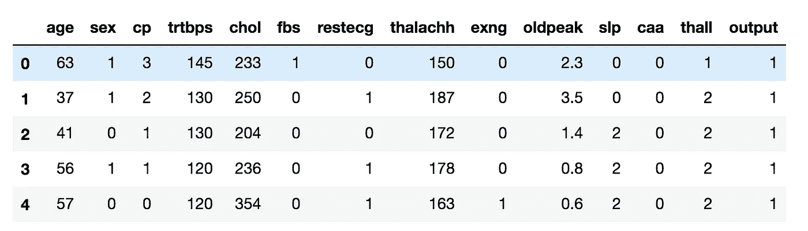

作者图片

我计算数据集中的记录数和列数:

```
df.shape
```

它给出了以下输出:

```
(303, 14)
```

# 功能选择

现在，我将数据集的列分为输入(`X`)和输出(`Y`)。我使用除了`output`之外的所有列作为输入特征。

```
features = []
for column in df.columns:
    if column != 'output':
        features.append(column)
X = df[features]
Y = df['output']
```

为了选择输入特征的最小集合，我通过由`pandas dataframe`提供的`corr()`函数计算特征之间的皮尔逊相关系数。

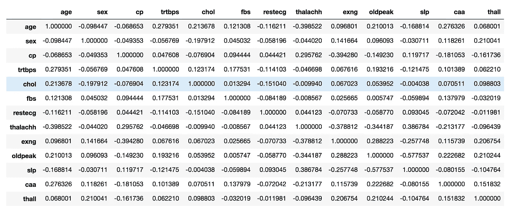

作者图片

我注意到所有的特征都具有低相关性，因此我可以将它们都作为输入特征。

# 数据标准化

数据归一化会在相同的时间间隔内缩放所有要素。我利用了由`scikit-learn`库提供的`MinMaxScaler()`。在我的[上一篇文章](/data-normalization-with-python-scikit-learn-e9c5640fed58)中，我在`scikit-learn`中讨论了数据规范化，而在我的[这篇](/data-preprocessing-with-python-pandas-part-3-normalisation-5b5392d27673)文章中，我描述了没有`scikit-learn`的数据规范化的一般过程。

```
X.describe()
```

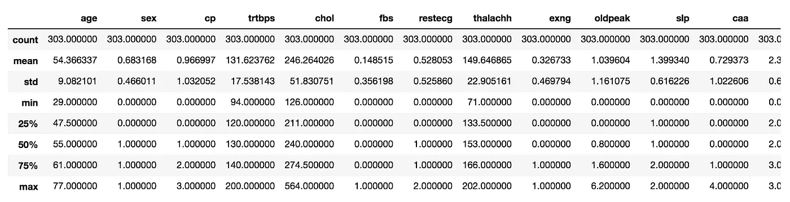

作者图片

查看每个特性的最小值和最大值，我注意到有许多特性超出了范围[0，1]，因此我需要对它们进行缩放。

对于每个输入特征，我计算`MinMaxScaler()`并将结果存储在同一个`X`列中。`MinMaxScaler()`必须先通过`fit()`功能进行拟合，然后才能通过`transform()`功能申请转换。注意，我必须对格式(-1，1)中的每个特征进行整形，以便作为缩放器的输入参数传递。例如，`Reshape(-1,1)`将数组`[0,1,2,3,5]`转换为`[[0],[1],[2],[3],[5]]`。

```
from sklearn.preprocessing import MinMaxScalerfor column in X.columns:
    feature = np.array(X[column]).reshape(-1,1)
    scaler = MinMaxScaler()
    scaler.fit(feature)
    feature_scaled = scaler.transform(feature)
    X[column] = feature_scaled.reshape(1,-1)[0]
```

# 在训练和测试中拆分数据集

现在我把数据集分成两部分:训练集和测试集。测试集的大小是整个数据集的 20%。我利用了`scikit-learn`函数`train_test_split()`。我将使用训练集来训练模型，使用测试集来测试模型的性能。

```
import numpy as np
from sklearn.model_selection import train_test_splitX_train, X_test, y_train, y_test = train_test_split( X, Y, test_size=0.20, random_state=42)
```

# 平衡

我检查数据集是否平衡，即训练集中的输出类是否被同等地表示。我可以使用`value_counts()`函数来计算每个输出类中的记录数。

```
y_train.value_counts()
```

它给出了以下输出:

```
1    133
0    109
```

输出类不平衡，因此我可以平衡它。我可以利用`imblearn`库来执行平衡。我尝试过采样少数类和欠采样多数类。关于不平衡学习库的更多细节可以在[这里](https://imbalanced-learn.org/stable/)找到。首先，我通过`RandomOverSampler()`执行过采样。我创建模型，然后我适应训练集。`fit_resample()`函数返回平衡的训练集。

```
from imblearn.over_sampling import RandomOverSampler
over_sampler = RandomOverSampler(random_state=42)
X_bal_over, y_bal_over = over_sampler.fit_resample(X_train, y_train)
```

我通过`value_counts()`函数计算每个类中的记录数，我注意到现在数据集是平衡的。

```
y_bal_over.value_counts()
```

它给出了以下输出:

```
1    133
0    133
```

其次，我通过`RandomUnderSampler()`模型执行欠采样。

```
from imblearn.under_sampling import RandomUnderSamplerunder_sampler = RandomUnderSampler(random_state=42)
X_bal_under, y_bal_under = under_sampler.fit_resample(X_train, y_train)
```

# 模型选择和培训

现在，我准备好训练模型了。我选择一个`KNeighborsClassifier`，首先用不平衡数据训练它。我利用`fit()`函数来训练模型，然后利用`predict_proba()`函数来预测测试集的值。

```
from sklearn.neighbors import KNeighborsClassifiermodel = KNeighborsClassifier(n_neighbors=3)
model.fit(X_train, y_train)
y_score = model.predict_proba(X_test)
```

我计算模型的性能。特别是，我计算了`roc_curve()`和`precision_recall()`，然后绘制它们。我利用`scikitplot`库来绘制曲线。

从图中我注意到每个类别都有一条 roc 曲线。关于精确召回曲线，类别 1 比类别 0 工作得更好，可能是因为它由更大数量的样本表示。

```
import matplotlib.pyplot as plt
from sklearn.metrics import roc_curve
from scikitplot.metrics import plot_roc,auc
from scikitplot.metrics import plot_precision_recallfpr0, tpr0, thresholds = roc_curve(y_test, y_score[:, 1])# Plot metrics 
plot_roc(y_test, y_score)
plt.show()

plot_precision_recall(y_test, y_score)
plt.show()
```

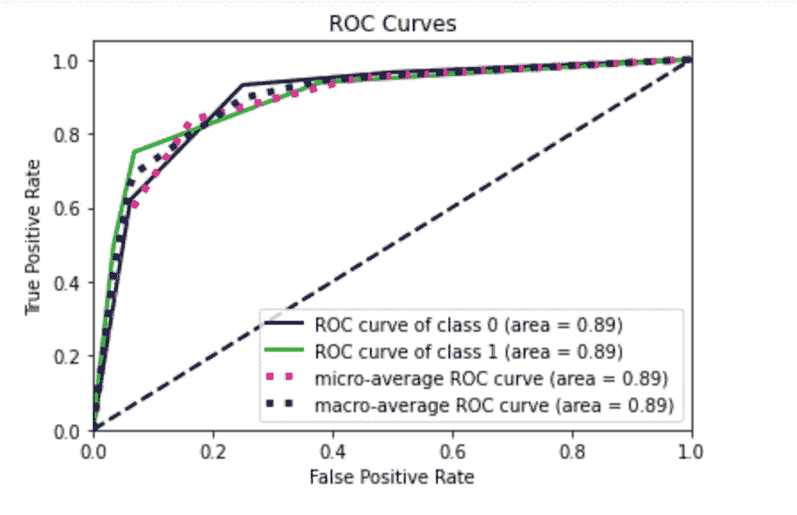

作者图片

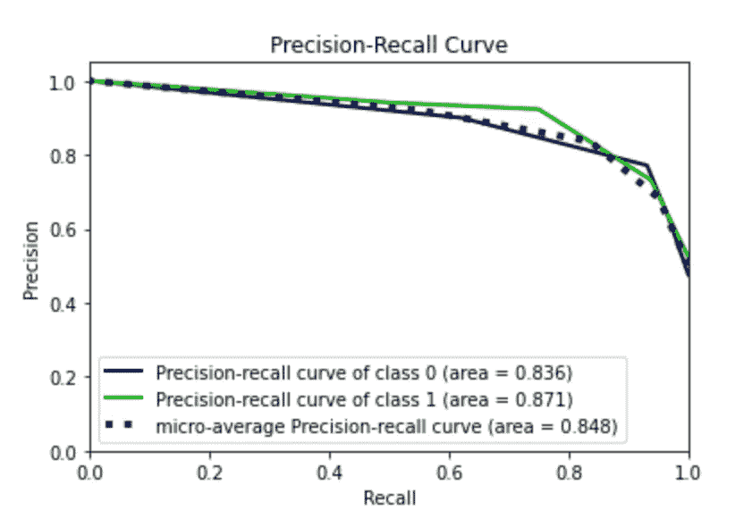

作者图片

现在，我用过采样平衡重新计算同样的事情。我注意到类 0 的精确召回曲线增加，而类 1 的精确召回曲线减少。

```
model = KNeighborsClassifier(n_neighbors=3)
model.fit(X_bal_over, y_bal_over)
y_score = model.predict_proba(X_test)
fpr0, tpr0, thresholds = roc_curve(y_test, y_score[:, 1])# Plot metrics 
plot_roc(y_test, y_score)
plt.show()

plot_precision_recall(y_test, y_score)
plt.show()
```

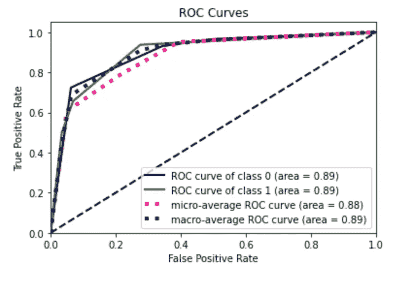

作者图片

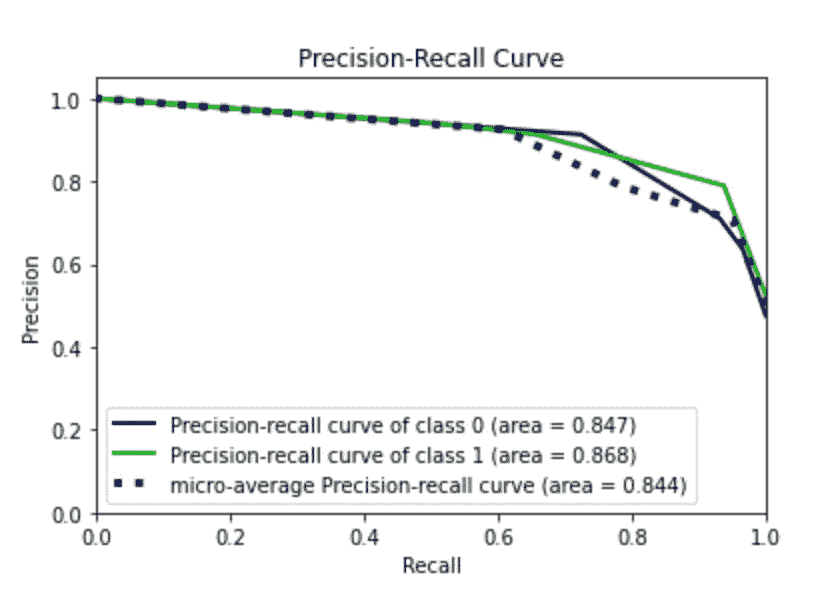

作者图片

最后，我通过欠采样数据来训练模型，我注意到性能普遍下降。

```
model = KNeighborsClassifier(n_neighbors=3)
model.fit(X_bal_under, y_bal_under)
y_score = model.predict_proba(X_test)
fpr0, tpr0, thresholds = roc_curve(y_test, y_score[:, 1])# Plot metrics 
plot_roc(y_test, y_score)
plt.show()

plot_precision_recall(y_test, y_score)
plt.show()
```

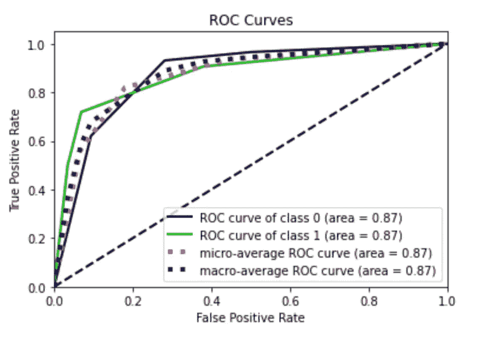

作者图片

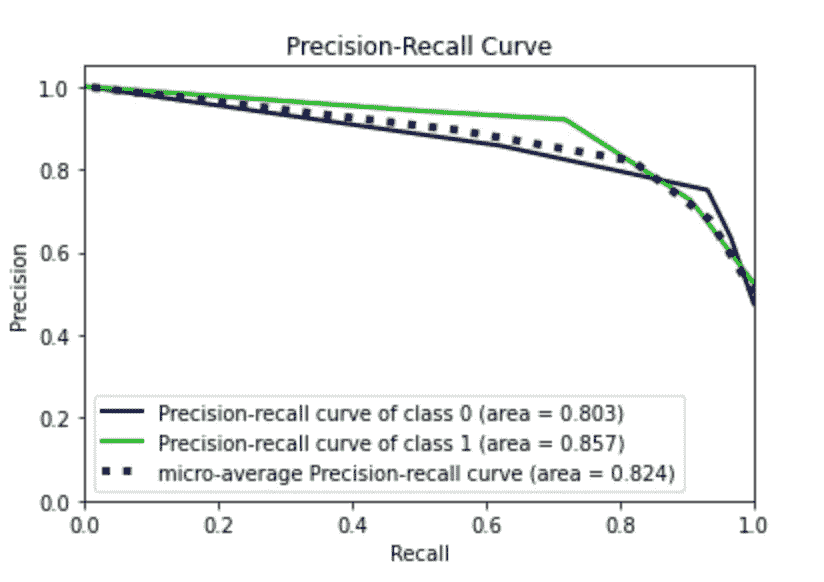

作者图片

# 参数调整

在本教程的最后一部分，我试图通过为我的模型搜索最佳参数来提高模型的性能。我利用了由`scikit-learn`库提供的`GridSearchCV`机制。我为要测试的每个参数选择一系列值，并将它们放入`param_grid`变量中。我创建了一个`GridSearchCV()`对象，与训练集相适应，然后检索包含在`best_estimator_`变量中的最佳估计值。

```
from sklearn.model_selection import GridSearchCVmodel = KNeighborsClassifier()param_grid = {
   'n_neighbors': np.arange(2,8),
   'algorithm' : ['auto', 'ball_tree', 'kd_tree', 'brute'],
    'metric' : ['euclidean','manhattan','chebyshev','minkowski']
}grid = GridSearchCV(model, param_grid = param_grid)
grid.fit(X_train, y_train)best_estimator = grid.best_estimator_
```

我利用最佳估计量作为我的预测模型，并计算算法的性能。

```
best_estimator.fit(X_train, y_train)
y_score = best_estimator.predict_proba(X_test)
fpr0, tpr0, thresholds = roc_curve(y_test, y_score[:, 1])# Plot metrics 
plot_roc(y_test, y_score)
plt.show()

plot_precision_recall(y_test, y_score)
plt.show()
```

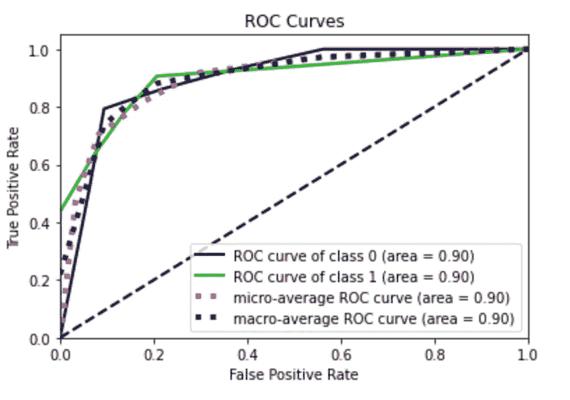

作者图片

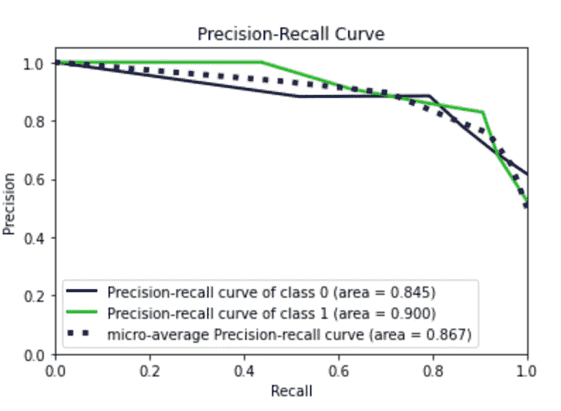

作者图片

我注意到 roc 曲线有所改善。我现在尝试使用过采样的训练集。我省略了代码，因为它与前面的代码相同。在这种情况下，我获得了最佳性能。

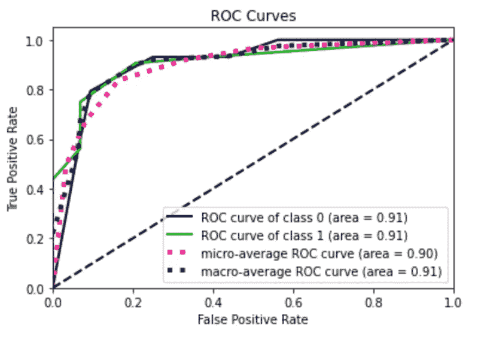

作者图片

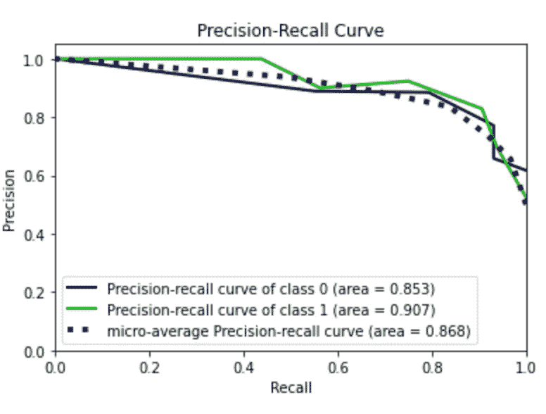

作者图片

# 摘要

在本教程中，我展示了为数据分析构建良好模型的完整工作流程。工作流程包括:

*   数据预处理，包括特征选择和平衡
*   利用交叉验证的网格搜索进行模型选择和参数调整
*   模型评估，通过 ROC 曲线和精确召回曲线。

在本教程中，我没有处理异常值检测。如果你想了解这方面的东西，可以看一下[我之前的文章](/how-to-detect-outliers-with-python-pyod-aa7147359e4b)。

如果你想了解我的研究和其他活动的最新情况，你可以在 [Twitter](https://twitter.com/alod83) 、 [Youtube](https://www.youtube.com/channel/UC4O8-FtQqGIsgDW_ytXIWOg?view_as=subscriber) 和 [Github](https://github.com/alod83) 上关注我。

# 相关文章

</a-complete-data-analysis-workflow-in-python-pycaret-9a13c0fa51d4>  </machine-learning-getting-started-with-the-k-neighbours-classifier-d7e6b25f2b09>  

# 新到中？您可以每月订阅几美元，并解锁无限的文章— [点击此处](https://alod83.medium.com/membership)。