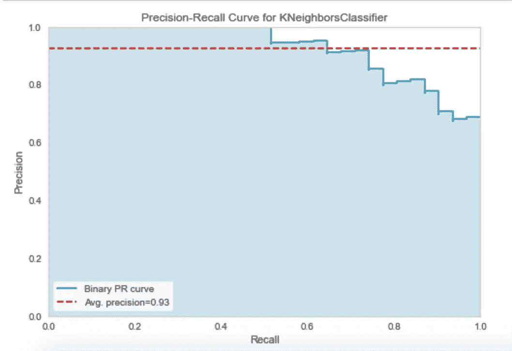

# Python PyCaret 中的完整数据分析工作流

> 原文：<https://towardsdatascience.com/a-complete-data-analysis-workflow-in-python-pycaret-9a13c0fa51d4?source=collection_archive---------19----------------------->

## 数据分析

## 这是一个现成的教程，利用了我用过的最好的机器学习库。


图片由 [xresch](https://pixabay.com/users/xresch-7410129/?utm_source=link-attribution&utm_medium=referral&utm_campaign=image&utm_content=5090539) 从 [Pixabay](https://pixabay.com/?utm_source=link-attribution&utm_medium=referral&utm_campaign=image&utm_content=5090539) 获得

在这个简短的教程中，我展示了一个利用`pycaret` Python 库的完整数据分析过程。这个库的文档可以在[这个链接](https://pycaret.org/)找到。该过程包括:

*   预处理，包括标准化和平衡化
*   带参数调整的模型选择
*   模型评估
*   在看不见的数据上部署。

本教程的完整代码可以从[我的 Github 库](https://github.com/alod83/data-science/blob/master/DataAnalysis/Data%20Analysis%20with%20pycaret.ipynb)下载。

# 加载数据集

首先，我通过 Python `pandas`库加载数据集。我利用了由 [Kaggle 库](https://www.kaggle.com/rashikrahmanpritom/heart-attack-analysis-prediction-dataset)提供的`heart.csv`数据集。该数据集可用于执行二元分类。数据集包含 303 条记录和 13 个输入要素。

```
import pandas as pddf = pd.read_csv('source/heart.csv')
df.head()
```


作者图片

# 分割数据

现在，我可以将数据分为用于建模的数据和用于预测的不可见数据。用于建模的数据将被分割成训练集和测试集，但是我将在本教程的后面执行这个操作。

通过`dataframe`函数`sample()`使用建模/不可见分割，该函数返回随机项目的一部分，并接收要返回的项目的一部分作为输入(`frac`)。在我的例子中，我保留 95%的数据用于建模，5%用于隐藏。

```
data = df.sample(frac=0.95, random_state=42)
```

当先前提取的数据被丢弃时，我将`data_unseen`计算为剩余的数据帧。

```
data_unseen = df.drop(data.index)
```

我重置了`data`和`data_unseen`的索引。

```
data.reset_index(inplace=True, drop=True)
data_unseen.reset_index(inplace=True, drop=True)
```

最后，我打印两个数据集的大小。

```
print('Data for Modeling: ' + str(data.shape))
print('Unseen Data For Predictions: ' + str(data_unseen.shape))
```

它给出了以下输出:

```
Data for Modeling: (288, 14)
Unseen Data For Predictions: (15, 14)
```

# 数据预处理

数据预处理通过`setup()`函数在`pycaret`中完成，该函数可以接收数量惊人的参数作为输入。在本教程中，我利用了三种预处理技术:

*   **标准化**，在同一区间内缩放所有特征。我利用了`minmax`函数。我在我的[上一篇文章](/data-preprocessing-with-python-pandas-part-3-normalisation-5b5392d27673)中讨论了数据标准化。
*   **训练测试分割**，将数据集分割成两部分:训练和测试集。训练集大小是整个数据集的 80%。
*   **平衡**，试图平衡阶级。我试图对少数民族阶层进行过度采样。`pycaret`库利用`imblearn`库来执行平衡。关于不平衡学习库的更多细节可以在这里找到[。](https://imbalanced-learn.org/stable/)

在执行平衡之前，我会检查数据集是否平衡，即训练集中的输出类是否被均等地表示。我可以使用`value_counts()`函数来计算每个输出类中的记录数。输出类是不平衡的，因此我可以平衡它们。在本教程中，我通过`RandomOverSampler()`执行过采样。

```
data['output'].value_counts()
```

它给出了以下输出:

```
1    155
0    133
```

`setup()`功能接收以下输入:

*   `normalize = True`和`normalize_method='minmax'`，指定如何执行标准化
*   `train_size = 0.8`执行训练/测试分割
*   `fix_imbalance = True`和`fix_imbalance_method=RandomOverSampler()`指定如何执行平衡

其他参数包括:

*   `session_id=123`，用于实验的再现性。值`123`可以是随机数
*   `data = data`，指定型号数据
*   `target = 'output'`，指定目标类。

在运行设置之前，该功能要求确认参数的自动识别。

```
from pycaret.classification import *
from imblearn.over_sampling import RandomOverSamplermodel = setup(data = data, target = 'output', normalize = True, normalize_method='minmax', train_size = 0.8,fix_imbalance = True, fix_imbalance_method=RandomOverSampler(), session_id=123)
```

# 模型选择和调整

型号选择有两种方式:

*   选择一个特定的模型，然后调整它
*   AutoML:让库选择最好的模型，然后调整它。

## 选择具体型号

在这种情况下，我选择 K-Neighbors 分类器。首先，我通过`create_model()`函数创建模型，然后通过`tune_model()`函数调整它。有趣的是，该模型不将数据作为输入，因为它们已经通过`setup()`函数包含在`pycaret`中。作为默认选项，`tune_model()`执行 10 重验证。

作为输出，`tune_model()`函数打印每个折叠的以下指标，以及平均值和标准偏差:准确性、AUC、召回率、精确度、F1、Kappa、MCC。

```
knn = create_model('knn')
tuned_knn = tune_model(knn)
```


作者图片

`pycaret`库还提供了`plot_model()`函数，允许绘制一些度量标准，如`auc` (ROC 曲线)和`pr`(精确召回曲线)。

```
plot_model(tuned_knn, plot = 'auc')
```


作者图片

```
plot_model(tuned_knn, plot = 'pr')
```



作者图片

现在，我可以利用调整后的模型对用于建模的所有数据集中的项目进行分类(包括训练集和测试集)。这可以通过`predict_model()`函数来完成，该函数返回计算出的指标。此外，对于数据集中的每一项，它返回原始输入、输出、预测标签(列`Label`)和分数(列`Score`)。

```
predict_model(tuned_knn)
```


作者图片

## AutoML

AutoML 可通过`compare_models()`功能完成，该功能分析所有可用模型，返回最佳模型，并打印每个测试模型的测量指标。

```
best = compare_models()
```


作者图片

最佳模式是:

```
LinearDiscriminantAnalysis(n_components=None, priors=None, shrinkage=None, solver='svd', store_covariance=False, tol=0.0001)
```

现在，我可以通过`tune_model()`功能调整最佳型号。该过程类似于单个模型所遵循的过程。因此，在模型调优之后，我可以绘制一些度量标准，比如精度-召回曲线。

```
tuned_best = tune_model(best)
```


作者图片

```
plot_model(tuned, plot = 'pr')
```


作者图片

# 最终确定模型

一旦模型被调优，它就可以被最终确定，即通过包含测试集来重新调优。

```
final_best = finalize_model(tuned_best)
```

首先，通过再次调用`predict_model()`功能，可以检查最终模型的性能。

```
predict_model(final_best)
```


作者图片

最后，可以在看不见的数据上测试模型的性能。

```
predict_model(final_best, data = data_unseen)
```


作者图片

# 摘要

在本教程中，我展示了如何利用 Python `pycaret`库执行完整的数据分析工作流。该工作流程包括以下步骤:

*   数据预处理
*   模型选择和调整
*   模型最终确定。

如果你想了解我的研究和其他活动的最新情况，你可以在 [Twitter](https://twitter.com/alod83) 、 [Youtube](https://www.youtube.com/channel/UC4O8-FtQqGIsgDW_ytXIWOg?view_as=subscriber) 和 [Github](https://github.com/alod83) 上关注我。

# 相关文章

[](/a-complete-data-analysis-workflow-in-python-and-scikit-learn-9a77f7c283d3) [## Python 和 scikit 中的完整数据分析工作流程-学习

towardsdatascience.com](/a-complete-data-analysis-workflow-in-python-and-scikit-learn-9a77f7c283d3) [](/how-to-detect-outliers-with-python-pyod-aa7147359e4b) [## 如何用 Python pyod 检测异常值

### 关于 pyod 库使用的快速教程。

towardsdatascience.com](/how-to-detect-outliers-with-python-pyod-aa7147359e4b) [](/automl-in-python-a-comparison-between-hyperopt-sklearn-and-tpot-8c12aaf7e829) [## Python 中的 AutoML:Hyperopt sk learn 和 TPOT 的比较

### 两种流行的 Python AutoML 库的优缺点

towardsdatascience.com](/automl-in-python-a-comparison-between-hyperopt-sklearn-and-tpot-8c12aaf7e829) 

# 新到中？您可以每月订阅几美元，并解锁无限的文章— [单击此处](https://alod83.medium.com/membership)。