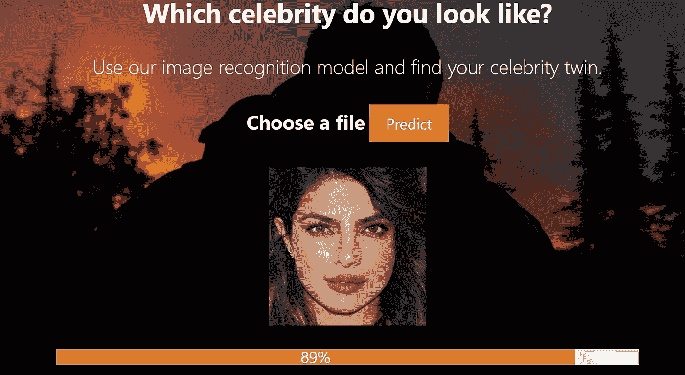
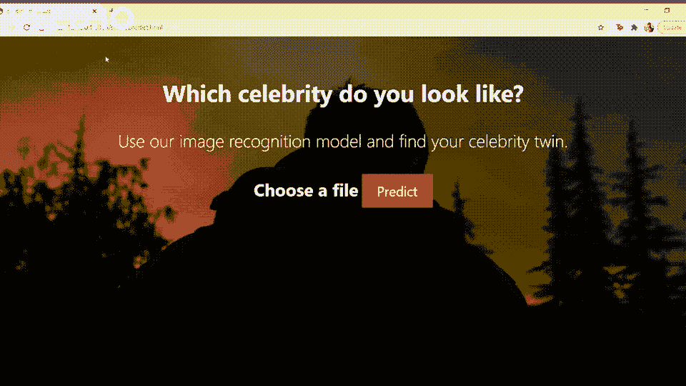
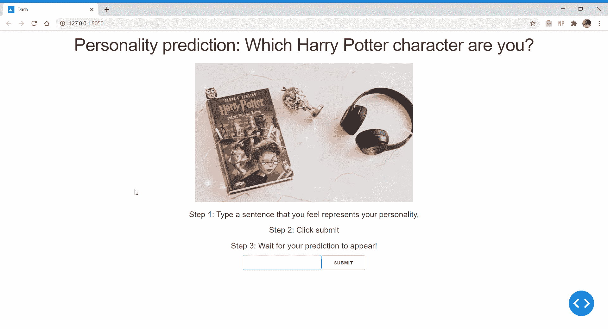

# 一个完整的深度学习组合项目

> 原文：<https://towardsdatascience.com/a-complete-deep-learning-portfolio-project-9c5dc7f3f2ef?source=collection_archive---------15----------------------->

## 用 Python 创建和部署面部识别应用程序

作者图片

在本文中，我将涉及以下主题:

*   为什么在你的投资组合中展示深度学习项目？
*   投资组合项目的重要性
*   我面部识别项目的预演
*   学习模型部署的资源
*   学习深度学习的资源

如果您愿意，可以随意跳到这些部分。你可以在这里找到我的 web 应用程序的代码。

# 为什么在你的投资组合中展示深度学习项目？

[附身摄影](https://unsplash.com/@possessedphotography?utm_source=unsplash&utm_medium=referral&utm_content=creditCopyText)在 [Unsplash](https://unsplash.com/s/photos/ai?utm_source=unsplash&utm_medium=referral&utm_content=creditCopyText) 上拍照

深度学习是最受追捧的机器学习技术之一。

当业外人士想到机器学习时，他们通常会想到自动驾驶汽车或面部识别系统——所有这些都属于深度学习。

自动编码器、物体检测和面部识别系统等深度学习应用可能会在你的投资组合中留下非常深刻的印象。

老实说，创建深度学习模型并不是一项非常困难的任务。研究人员已经花了大量的时间将深度学习大众化。

像 Keras 和 FastAI 这样的高级库让人们建立和训练深度学习模型变得越来越容易。

像[Deep Learning . ai specialization](https://www.deeplearning.ai/)这样的在线课程，结合像[面向程序员的实用深度学习](https://www.youtube.com/watch?v=0oyCUWLL_fU)这样的材料，可以帮助人们相当快速地进入深度学习领域。

# 投资组合项目的重要性

[斯坦利戴](https://unsplash.com/@stanleydai?utm_source=unsplash&utm_medium=referral&utm_content=creditCopyText)在 [Unsplash](https://unsplash.com/s/photos/project?utm_source=unsplash&utm_medium=referral&utm_content=creditCopyText) 上的照片

如果你之前没有机器学习工作经验或正规教育，你可以做以下两件事之一来展示你的技能:

*   参加在线课程并获得高分认证
*   创建个人项目以展示在您的作品集上

我总是选择后者。

如果你想学习一个新的话题，在线课程是一个很好的开始方式。他们给你指出正确的资源，并给你一个很好的主题基础。

然而，强化这些概念并深入主题的唯一方法是实践。

当你用学到的材料解决现实世界的问题时，你将能够在理论和实践之间架起一座桥梁。你也将开始理解机器学习中的不同用例，以及应用哪种算法来解决不同的问题。

除了是很好的学习经历之外，个人项目在你的简历上看起来也很不错。

事实上，展示我的**个人项目帮助我获得了第一份数据科学实习**。你可以在这里读到我的经历。

# 不要只是告诉，展示

照片由[陈茂三潭](https://unsplash.com/@tranmautritam?utm_source=unsplash&utm_medium=referral&utm_content=creditCopyText)在 [Unsplash](https://unsplash.com/s/photos/cat-dog?utm_source=unsplash&utm_medium=referral&utm_content=creditCopyText) 上拍摄

几个月前，我创建了一个简单的“猫和狗”图像分类模型。该模型可以区分给定图像是猫还是狗。

我告诉我的朋友我正在做的模型。她来自非技术背景，问我她是否能看到它是如何工作的。

我让她给我发一张猫的图片，存到我的笔记本里，打开我的 Jupyter 笔记本里的图片路径。然后，我运行了单元，并自豪地向她展示了结果。模特预测她的猫是只猫！

她似乎对此不太兴奋。

她解释说:“如果我能上传图片，看看它是如何为自己工作的，那就更好了。”

她来自非技术背景，所以可以理解她不理解任何代码，只是想看看它是如何工作的。

但问题是。大多数招聘人员和猎头都是非技术背景。他们每天浏览数百份 LinkedIn 个人资料和简历，几乎所有这些都链接到 GitHub 知识库。

如果你的简历和他们那天看过的几百份简历差不多，他们凭什么挑你？是什么让你与众不同？

## 创造一些人们可以使用的东西。这会让你脱颖而出。

即使您创建了像猫狗分类模型这样简单的东西，也要部署它并共享链接。

如果招聘人员偶然发现你的个人资料并点击链接，他们会发现一些他们可以利用的东西。他们甚至会上传自己狗狗的照片，来试用这个模型。

不管它是不是一个好的模型，它都会激发人们的兴趣。

足够的兴趣让他们好奇它是如何工作的，并实际尝试一下。

这将使他们记住你，并将你与其他潜在候选人区分开来。

一个巨大的好处是它很有趣。

模型部署很有趣，因为您可以创建一些其他人可以与之交互的东西。你在为你的机器学习模型建立一个可用的界面，其他人都可以使用。

虽然这可能比实际构建模型花费更多的时间，但这很有趣。一旦你完成了，你会为创造一个有用的产品而感到非常自豪。

您可能已经熟悉使用 Python 进行机器学习，所以模型部署应该不会太难。

在这个项目中，我创建了一个面部识别模型。我用名人的图片训练模型，然后部署它。

现在，我将向您介绍我是如何创建这个项目的。我将向您展示它是如何工作的，并向您介绍我使用的工具和编程语言。

# 项目演练

我的应用程序的工作方式非常简单。你只需要上传一张你自己的照片，然后点击“预测”按钮。

它会给你一个你最喜欢的名人的名字。

你也可以和真正的名人一起试用这个应用程序，这就是我将在这里演示的:

作者图片

够简单！

## 创建 web 应用程序

*(注意:如果你不想要所有的技术细节，可以随意跳到下一节标题为* ***的一些教程，你可能会发现有用的****”*

我研究了不同的方法来部署我的面部识别模型。

最初，我打算创建一个没有 web 服务的基于浏览器的模型，用 HTML、CSS 和 Javascript 做所有的事情。

这意味着我不需要后端应用程序，可以在前端做任何我需要做的事情。

然而，我很快意识到这是不可能的。

用户上传的图像需要用 Keras 中的模块和 Javascript 中没有的其他几个库进行预处理。

无论我在前端做什么，我都需要一个后端 Python 应用程序来做预处理、做预测和解码输出。

因此，我选择使用 **Flask** 来创建 web 应用程序。在前端，我决定使用 **HTML** 、 **CSS** 和 **Javascript** 。

*   **Flask** : Flask 是一个 web 框架，是一个用来用 Python 开发 web 应用的库。我为这个项目选择 Flask 的原因是因为它的设置相对简单。如果您已经了解 Python，那么为您的模型运行 Flask web 服务器应该很容易。
*   **HTML、CSS 和 Javascript** :我用这些语言搭建了 app 的前端界面，像“上传图片”和预测按钮。

# 您可能会发现一些有用的模型部署教程

Rami Al-zayat 在 [Unsplash](https://unsplash.com/s/photos/app?utm_source=unsplash&utm_medium=referral&utm_content=creditCopyText) 上拍摄的照片

如果你不熟悉 web 开发，而且我上面说的对你来说听起来像希腊语，不要烦恼！

你不需要对 web 开发有广泛的理解就可以在线部署你的深度学习模型。

我建议从一些关于 web 如何工作的教程开始，然后继续学习一些 Flask 模型部署教程。

以下是一些帮助我开始的方法:

1.  [客户端机器学习模型](https://www.youtube.com/watch?v=jmznx0Q1fP0):如果您希望纯粹在前端部署机器学习模型，您应该遵循本系列的所有教程。丹是一个不可思议的教练，他的热情会让你想继续看下去。请记住，本系列不涉及任何服务器端编程。所有的模型都将使用纯 Javascript 进行部署。
2.  [Flask 教程](https://blog.miguelgrinberg.com/post/the-flask-mega-tutorial-part-i-hello-world):如果你想用 Python 后端应用程序创建你的模型，你需要学习 Flask。
3.  [用 Flask 部署 Keras 模型](https://deeplizard.com/learn/video/SI1hVGvbbZ4):这是一个很棒的教程系列，教你如何用 Flask web 服务部署 Keras 模型。前端使用 HTML 和 Jquery。如果你只有时间跟随其中一个教程，我推荐这个。它教你如何设置 Flask，并且假设你没有 web 开发方面的知识。

如果你想要一些不涉及太多开发的东西，或者不想使用 Flask 和 Javascript，可以尝试创建一个更轻量级的应用程序。

您可以通过 Jupyter 笔记本直接部署您的模型，其中一些包括**瞧**和 **Jupyter-Dash** 。

这是我不久前用 Jupyter-Dash 创建的一个机器学习应用程序:

作者图片

如果你觉得在 Jupyter 笔记本上工作更舒服，用 Voila 或 Jupyter-Dash 部署应用程序会更容易。但是，请记住，这些应用程序更加简单，您无法设计它们的样式或使网页具有交互性。

你可以看看[这个](https://github.com/voila-dashboards/voila) GitHub 库来开始学习。

# 深度学习资源

汤姆·赫曼斯在 [Unsplash](https://unsplash.com/s/photos/books?utm_source=unsplash&utm_medium=referral&utm_content=creditCopyText) 上的照片

通过使用预先训练的模型，即使没有正确理解深度学习，也可以创建深度学习 web 应用程序。

我上面链接的所有教程都使用预先训练好的模型来帮助你创建一个机器学习 web 应用程序。

然而，不可能在每种情况下都使用预先训练好的模型。如果你想创建自己的深度学习模型来解决特定问题，有不同的课程/教程可供选择。

如果你想学习深度学习，我认为这里有一些课程和书籍会对你有用:

1.  [深度学习专精](https://www.coursera.org/specializations/deep-learning) —这是吴恩达在 Coursera 上做的深度学习专精，用 Tensorflow 授课。他用一种容易理解的方式分解数学概念。他不仅教授实践，还确保你对模型如何工作有很好的理论理解。
2.  [面向程序员的深度学习](https://course.fast.ai/) —如果你喜欢用自上而下的方法学习(先实践实现，后理论)，那么我推荐 Fast.ai 的这门课程。这门课程完全免费，你将使用 FastAI 库完成所有的实现。
3.  [用 Python 进行深度学习](https://www.amazon.com/Deep-Learning-Python-Francois-Chollet/dp/1617294438) —这是一本由 Francois Chollet 写的书，他是 Keras 图书馆的作者。他在理论和实际实施之间提供了极好的平衡。你将带着对深度学习的巨大直觉，对要使用的超参数调整技术的理解，以及适用于不同用例的模型来完成这本书。所有实际实施都将在 Keras 进行。

所有这些都是学习深度学习的惊人资源。没有必要做所有的事情，只需选择上面的一个。

以上资源都可以免费访问。用 Python 书的深度学习在网上是免费的，不需要证书可以选择审核 Coursera 专业化。

# 结论

如果你过去参加过深度学习或机器学习课程，巩固你的理解的最好方法是将你所学的应用到现实世界中。

通过创建项目展示你所学到的东西。不要在 GitHub 存储库中创建项目，而是尝试部署您的模型并创建一个功能性的 web 应用程序。

这样，你会激发人们的兴趣。通过以这种方式展示你的技能，你也会在求职时从其他求职者中脱颖而出。