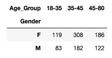

# 如何在 Python 中选择和应用正确的统计测试的完整指南

> 原文：<https://towardsdatascience.com/a-complete-guide-of-how-to-choose-and-apply-the-right-statistical-test-in-python-5fcaf5fb9351?source=collection_archive---------19----------------------->

## 基本了解何时应该应用 Z 检验、T 检验、卡方检验、方差分析和相关性检验


作者图片

我们经常低估统计数据及其重要性，根据我自己的经验，我可以肯定地说，这是数据科学中最重要的部分。数据科学中统计学最有用的部分之一是统计测试和假设检验。我们需要知道什么时候使用统计检验，这样我们才能对一个假设得出正确的结论。

假设检验有 3 个主要步骤:

1.  陈述你的无效(Ho)和替代(H1)假设。
2.  执行适当的统计测试。
3.  决定是否拒绝零假设。

为了决定是否拒绝零假设，我们需要为 p 值设置一个阈值，称为 alpha 值。如果我们将 alpha 值设置为 0.05，这意味着我们对结果有 95%的把握。对于下面的统计测试，alpha 被设置为 **0.05** 。

数据集中主要有两种类型的变量。像性别这样的**分类变量**和像体重和身高这样的**数字变量**。

让我们创建一个包含两个分类变量和两个数值变量的数据集。

```
import pandas as pd import numpy as np
import random df=pd.DataFrame({'Gender':random.choices(["M",'F'],weights=(0.4,0.6),k=1000), 'Age_Group':random.choices(["18-35",'35-45','45-80'],weights=(0.2,0.5,0.3),k=1000)})df['Weight']=np.where(df['Gender']=="F",np.random.normal(loc=55,scale=5,size=1000),np.random.normal(loc=70,scale=5,size=1000))
 df['Height']=np.where(df['Gender']=="F",np.random.normal(loc=160,scale=5,size=1000),np.random.normal(loc=172,scale=5,size=1000)) df['Weight']=df['Weight'].astype(int) df['Height']=df['Height'].astype(int) df.head()
```


# 关于一个分类变量的检验

> 样题:人口中男女数量有区别吗？

对于我们想要检查其值的数量之间是否存在差异的单个分类变量，我们将使用 **one proportion Z 检验。**我们来陈述一下假设:

*   胡先生:男女人数没有区别
*   H1:男人和女人的数量是不同的

我们需要澄清这是一个双边测试，因为我们正在检查男性 Pm**和女性 Pm** 的比例是否不同。如果我们想检查 **Pm > Pw** 或 **Pm < Pw** ，那么我们将进行单尾测试。

```
from statsmodels.stats.proportion import proportions_ztestcount = 592 #number of females
nobs = 1000 #number of rows | or trials
value = 0.5 #This is the value of the null hypothesis.
#That means porpotion of men = porpotion of women = 0.5#we are using alternative='two-sided' because we are chcking Pm≠Pw. #for Pw>Pm we have to set it to "larger" and for Pw<Pm to "smaller" stat, pval = proportions_ztest(count, nobs, value, alternative='two-sided')
print("p_value: ",round(pval,3))
```

p 值小于 0.05。因此，我们在 95%的置信度下拒绝零假设。这意味着人口中男性和女性的数量存在差异。

# 关于两个分类变量的检验

> 例题:不同年龄段的男女比例是否不同？

如果我们想要检查两个分类值的独立性，我们将使用**卡方检验。**

让我们陈述假设:

*   胡先生:性别和年龄组是独立的
*   H1:性别和年龄组有依赖性

```
from scipy.stats import chi2_contingency
#The easiest way to apply a chi-squared test is to compute the #contigency table.contigency= pd.crosstab(df['Gender'], df['Age_Group'])
contigency
```



```
#Chi-square test of independence.
c, p, dof, expected = chi2_contingency(contigency)print("p_value: ",round(p,3))p_value: 0.579
```

p 值不小于 0.05。因此，我们无法在 95%的置信水平下拒绝零假设。这意味着性别和年龄组是独立的。

# 测试一个分类变量和一个数字变量

> *样题:男女身高有差异吗？*

在这种情况下，我们将使用 T 检验(学生 T 检验)。

```
from scipy.stats import ttest_ind
#this is a two-sided test #you can divide the two-sided p-value by #two, and this will give you the one-sided one.t_stat, p = ttest_ind(df.query('Gender=="M"')['Height'], df.query('Gender=="F"')['Height'])print("p_value: ",round(p,3))
```

p 值小于 0.05。因此，我们在 95%的置信度下拒绝零假设。这意味着男女身高有差异。

# 测试一个具有两个以上唯一值和一个数值变量的分类。

> *样题:各年龄段之间身高有差异吗？*

现在，我们将使用 ANOVA(方差分析)测试。

*   胡先生:各组的平均身高是相等的
*   H1:至少，一个群体的平均身高不同于其他群体

```
import scipy.stats as stats
#stats f_oneway functions takes the groups as input and returns #ANOVA F and p value
fvalue, pvalue = stats.f_oneway(df.query('Age_Group=="18-35"')['Height'], df.query('Age_Group=="35-45"')['Height'], df.query('Age_Group=="45-80"')['Height']) print("p_value: ",round(pvalue,3))p_value: 0.141
```

p 值不小于 0.05。因此，我们无法在 95%的置信水平下拒绝零假设。

# 测试两个数值变量

> *样题:身高和体重有关系吗？*

*   胡先生:身高和体重没有关系
*   H1:身高和体重是有关系的

我们将使用相关性测试。相关性测试会给我们两个结果，一个相关系数和一个 p 值。正如你可能已经知道的，相关系数是显示两个变量相关程度的数字。对于其 p 值，我们应用与之前相同的原则，如果 p 值小于 0.05，我们拒绝零假设。

```
import scipy.stats as stats
#for this example we will use the Pearson Correlation.
pearson_coef, p_value = stats.pearsonr(df["Weight"], df["Height"]) print("Pearson Correlation Coefficient: ", pearson_coef, "and a P-value of:", round(p_value,3) )Pearson Correlation Coefficient: 0.6213650837211053 and a P-value of: 0.0
```

正如我们所见，p 值小于 0.05，因此，我们在 95%的置信水平上拒绝了零假设。这意味着身高和体重之间有关系。

# 总结一下

这是对统计测试和假设检验的介绍。根据变量类型和一些常见问题，我们对何时应该应用 Z 检验、T 检验、卡方检验、方差分析和相关性检验有了基本的了解。你可以把这篇文章作为统计测试的备忘单，但是我鼓励你阅读更多关于它们的内容，因为正如我之前所说的，统计学是数据科学中最重要的部分。

【https://predictivehacks.com】最初发表于[](https://predictivehacks.com/how-to-choose-and-apply-the-right-statistical-test-in-python/)**。**