# 为生产中的机器学习系统构建 Docker 映像的完整指南

> 原文：<https://towardsdatascience.com/a-complete-guide-to-building-a-docker-image-serving-a-machine-learning-system-in-production-d8b5b0533bde?source=collection_archive---------2----------------------->

## 一个完整的分步指南，用于构建 Docker 映像(GPU 或 CPU ),并解释所有应遵循的最佳实践，这些实践将用于任何基于机器学习的软件


作者图片

与开发 ML 系统的其他组件(如数据管道、模型训练、服务基础设施等)相比，构建 Docker 映像通常被认为是微不足道的。但是，低效、庞大的 docker 映像会大大降低性能，甚至会导致服务中断。

## 0.免责声明:

这个博客旨在建立一个理想的码头工人形象，而不是它的概念或好处。我假设你对写给 Docker 的几个主题有基本的了解:

*   码头工人的一般工作
*   Docker 构建、运行的基础知识
*   Dockerfile 文件的编写和语法

## 1.通用码头构建最佳实践

有很多关于一般最佳实践的非常好的资源，比如官方 docker 指南，但是我希望这篇文章简短并且与基于 ML 系统的项目相关

*   Requirements.txt 必须始终有一个 python 包版本。永远不要只写包名，因为它将总是安装最新的包，在这个过程中完全违背了使用 docker 的目的。

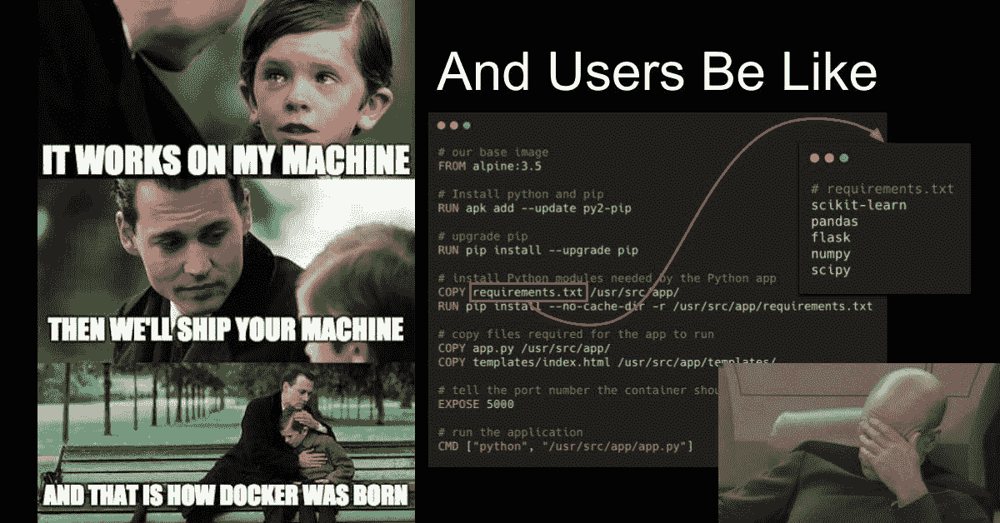

来源:[阿布舍克·塔库尔(推特)](https://twitter.com/abhi1thakur/status/1357346972630351874/photo/1)

*   始终将类似的运行命令组合在一起，这将产生一个停靠层。(我将避免解释这一点，因为这有点超出范围)

例如:

```
RUN apt update && \
apt install --no-install-recommends -y build-essential gcc curl      ca-certificates python3 && \
apt clean && rm -rf /var/lib/apt/lists/*
```

*   使用 pip 的“- -no-cache-dir”标志，因为目标环境是生产环境

```
RUN pip install --no-cache-dir --user -r /req.txt
```

*   使用。避免不必要的构建上下文。这就像。gitignore
*   尽可能使用基本映像的精简版本，如 python:buster-slim、debian:buster-slim 等。
*   避免使用基于 Alpine 的基本 Docker 图像。这可能有一点争议，但相信我，它们与 Python 配合得不好。请参考伊塔马尔·特纳-图雷的这篇精彩的[博客](https://pythonspeed.com/articles/alpine-docker-python/)。

## 2.为任何 Python 项目构建 Docker 映像(CPU):

大多数情况下，ML 系统都是基于 Python 的，因此高效地构建任何基于 Python 的 Docker 映像都是至关重要的。让我们一一道来。

**2.1 单级**

*   单级将在同一个/单个 docker 构建时间内执行所有任务。
*   流程是，选择基本映像、安装操作系统包、复制源代码、安装包、设置入口点(如果需要)或其他命令。

单级 Docker 构建示例

出于演示目的，我使用以下软件包:

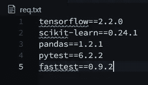

作者图片

运行 docker build 命令后，docker 映像的大小为 1.64 gb。

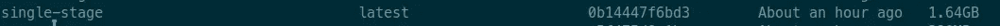

单级 docker 构建的大小(图片由作者提供)

*   单级非常简单，可以在许多用例中工作。这是一个不错的实践，但是有一些基本的缺点，特别是对于基于 python 的项目。
*   这里，在 apt 中使用'--no-install-recommendes '和在 pip 中使用'- -no-cache-dir '是关键，正如我前面说过的，我们不希望存储缓存，因为它不是为开发环境设计的，而是为生产环境设计的。事实上，如果您使用的是任何存储空间有限的 CI/CD 平台(如 Github action ),则只能使用这种方法。
*   Python 库不是开箱即用的，必须先用 c 编译，我们只需要任何库的编译部分，而不是其他所有的剩余部分。正如你在上面的单级 eg 中看到的；当执行“pip 安装”时，所有的库首先被下载，然后被编译。
*   我们应该移除(我们可以使用 bash 命令)安装库时创建的所有中间和剩余组件。这将充满了麻烦，甚至可以打破一个图书馆，如果做得不正确。这是一个真正的交易破坏者，所以我们中的许多人会避免它&将笨重的形象带入生产。但是 Docker Multi-stage 拯救了我们。

**2.2 多级**

*   多阶段 Docker 构建是迄今为止最有效的优化技术之一，同时保持它们易于阅读和维护。要编写一个真正高效的 Dockerfile，您通常需要使用 shell 技巧和其他逻辑来保持层尽可能小，并确保每一层都有它需要的来自前一层的工件，而没有其他东西。
*   对于多阶段构建，您可以在 docker 文件中使用多个`FROM`语句。每条`FROM`指令可以使用不同的基础，并且它们中的每一条都开始了构建的新阶段。您可以有选择地将工件从一个阶段复制到另一个阶段，在最终图像中留下所有不想要的东西。为了说明这是如何工作的，请看例子。

多阶段 Docker 构建的示例

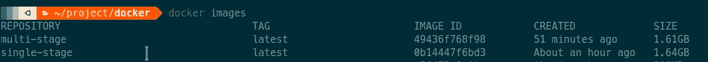

作者图片

对比一下，多级 docker 镜像大小为 1.61 gb，单级为 1.64 gb。这是一个进步(尽管看起来很小)，这里有很多东西，让我们试着用简单的话来理解。

*   第 1–5 行是第一阶段或编译器阶段，我们在这里安装 python 库(首先下载，然后用 C 编译，这就是我们安装 gcc 的原因)。然后，我们只是使用语法将编译后的库从阶段 1 复制到阶段 2 或运行时阶段

```
COPY --from=<stage 1> stage1/src stage2/destination
```

*   但是从截图中我们可以看到，我们并没有看到太大的改善。我们肯定会在其他语言中看到巨大的进步，但是 python 也有一些窍门，

→现在许多库都是预编译的。whl 是 PyPi 的车轮格式，不需要任何编译。

→那么这是否意味着，Python 项目没有多阶段构建的范围？ ***绝对是的！！！*** 不是每一个来自 PyPi 的包都是预编译的。whl 格式，许多都是传统的 tar.gz(压缩的 tarballs)，需要首先编译&在这里，多阶段构建将发挥其魅力。

→此外，如果您正在从源代码构建 python 包或使用 setup.py 使用本地包，多阶段也是适用的，同样，它们需要首先进行编译。

→我强烈建议你阅读这篇来自[真实 Python](https://realpython.com) 的[文章](https://realpython.com/python-wheels/)，解释什么是 Python 中的轮子。

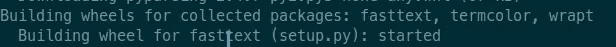

作者图片

→从我在演示中使用的 req.txt 来看，只有上面的包不是轮式格式&而且它们的尺寸已经很小了。但是如果一些软件包不是预先编译好的，并且大小很大，最终会浪费很多磁盘空间

## 3.为任何 Python 项目(GPU)构建 Docker 映像:

构建基于 CPU 的 docker 映像并不复杂，但构建基于 GPU 的 Docker 则不同。如果建造不当，它最终会变得巨大无比。我将把重点放在实践和实现部分，而不是理论部分(因为我认为这超出了本文的范围)。

**3.1 了解先决条件**

*   Tensorflow 和 Pytorch 都使用 Nvidia CUDA gpu 驱动。因此，最新的 Nvidia 驱动程序、CUDA 驱动程序及其各自的 cuDNN 必须首先安装在主机上(我不能在这里包括它的过程，因为它超出了范围，可能是其他一些博客)。
*   在准备好主机设备后，必须安装 nvidia-docker2 ，这使得 docker 引擎能够访问底层 Nvidia gpu 驱动程序。
*   最关键的部分是选择正确的 CUDA 版本/标签，cuDNN 为 nvidia docker 镜像，tensorflow/pytorch wrt 为其。因此 ML 系统可以利用底层 gpu 硬件。相信我，这确实是一项令人沮丧的任务，所以我有一些经验法则:

→在 Docker 映像中始终使用与底层主机中相同的 CUDA 和 cuDNN 版本。

→不要盲目安装 PyPi 最新的 tensorflow/pytorch 库。这是绝对不正确的，任何版本的这两个软件包将与任何版本的 CUDA，cuDNN。其实两者最新版本的组合，tensorflow/pytorch 和 CUDA/cuDNN 可能不兼容。总是首先在开发环境中测试组合。

Nvidia 的 Docker hub 有很多图片，所以了解它们的标签并选择正确的图片是最重要的组成部分。来自 Nvidia docker hub 官方的描述是，

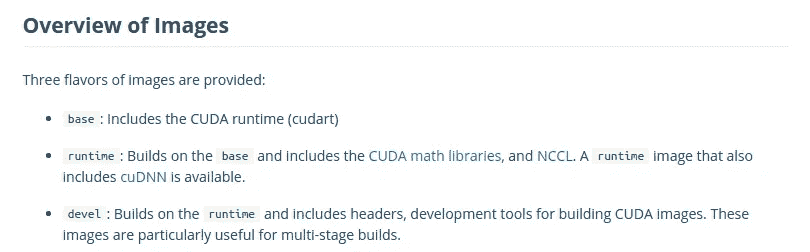

来源:[英伟达 Docker hub](https://hub.docker.com/r/nvidia/cuda)

我们只对 base、runtime 感兴趣，对 devel 不感兴趣(因为我们的目标是 prod 环境)。如何选择一个确切的特定标签？我将在下面的部分回答这个问题。

**3.2 单级**

*   选择标签:我遵循的经验法则是:

I .步骤 1:检查底层主机的 CUDA 和 cuDNN 版本

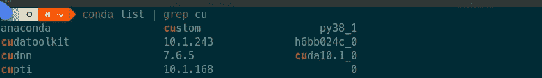

我有 CUDA=10.1，cuDNN=7.5(图片由作者提供)

二。步骤 2:根据步骤 1 选择 Docker 图像。所以就我而言，我选择了‘NVIDIA/cuda:10.1-cud nn 7-runtime’。为什么是运行时？因为这是一个既包含 CUDA 又包含 cuDNN 的。

三。第三步:选择与此版本 CUDA 和 cuDNN 兼容的正确版本 tensorflow/pytorch。在我的例子中，它是张量流=2.20。

四。注意:Nvidia 的 docker 镜像可能是旧的 Ubuntu (18.04 甚至 16.04)，它将安装 python 3.6。所以这里必须注意检查你的项目以及外部包与 python 版本的兼容性。不管怎样，特定的版本可以从源代码安装。

单级 docker 构建(GPU)示例

注意:正如你所看到的，nvidia 的 Docker 镜像是基于 ubuntu 18.04 的，我必须做一点额外的调整来安装 tensorflow=2.2.0。

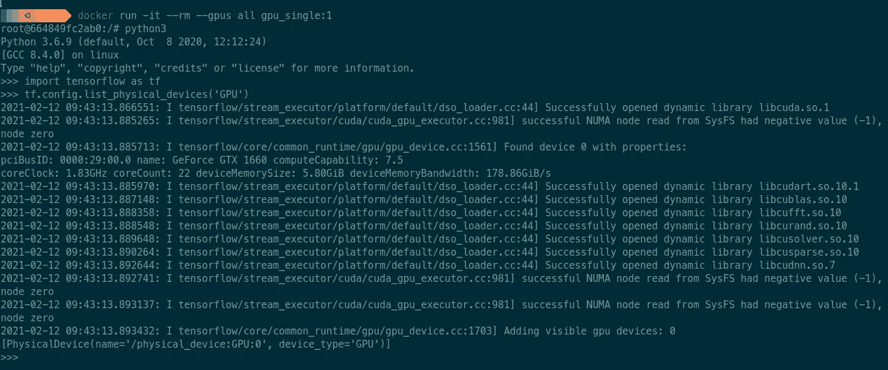

tensorflow 可以使用 gpu 的验证(图片由作者提供)

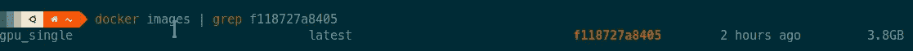

使用单阶段构建的 Docker 图像的大小(图像由作者提供)

**3.3 多级**

*   我们可以使用我在 2.2 中展示的相同机制。
*   第一阶段将用于下载和编译 python 包，然后它们将被复制到第二阶段或运行时阶段
*   这里还必须使用 3.2 中的所有经验法则

多阶段 docker 构建(GPU)示例

注意:为了使 python 3.8 成为默认版本，我添加了一些额外的代码，如果你不是这样，那么你可以避免这个麻烦。

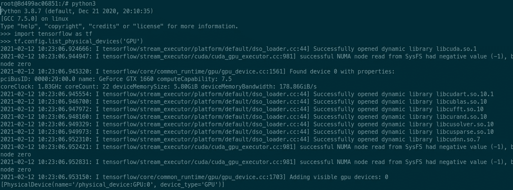

tensorflow 可以使用 gpu 的验证(图片由作者提供)

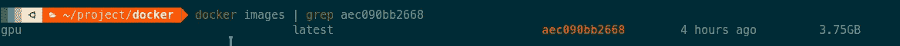

使用多阶段构建的 Docker 图像的大小(由作者创建的图像)

*   同样，这不是一个显著的改进，但即使在这里，逻辑/解释也适用，如情况 2.2
*   我强烈推荐在任何用例中总是使用多阶段构建，因为它也提高了可读性。

## 4.使用 Dive 检查 Docker 图像

*   即使通过遵循所有可能的最佳实践建立了 docker 形象，我们仍然应该调查任何改进。
*   Dive 是一个优秀的命令行工具，用于探索 docker 图像、图层内容，并发现缩小 Docker/OCI 图像大小的方法。它有 24k+ GitHub 星。此外，它非常容易使用和导航。
*   它有两个非常有用的矩阵:

一、潜在浪费空间
二。图像效率得分

*   但是它最好的特性是与任何 CI 工具的集成。我们可以为这两个指标中的任何一个或两个设置条件，如果[条件](https://github.com/wagoodman/dive#ci-integration)失败，CI 作业也将失败。通过这种方式，我们可以始终对每项 CI 工作创建的 Docker 形象建立信心。

**结论:**首要目标始终必须是最小的 docker 映像大小，因为为 ML 系统构建的任何 docker 映像总是很大。我们应该始终遵循所有的最佳实践，尤其是多阶段构建和软件包的版本控制。对于基于 gpu 的映像，最后也是最重要的是在开发环境中测试配置。

*如果需要帮助，可以通过*[*LinkedIn*](https://www.linkedin.com/in/akashdesarda/)*联系我。*