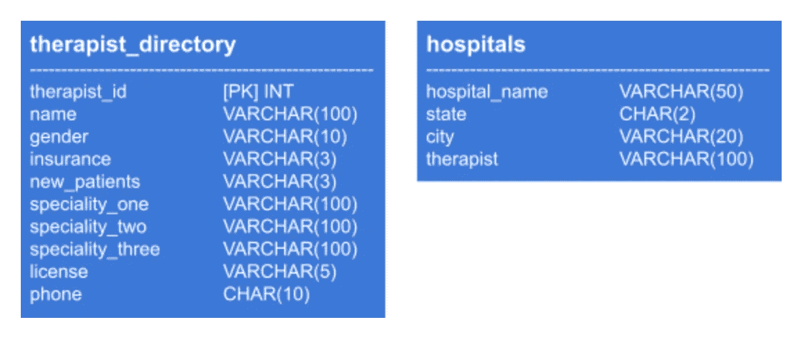
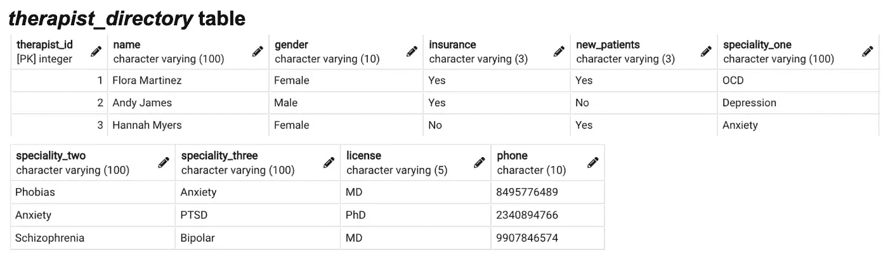
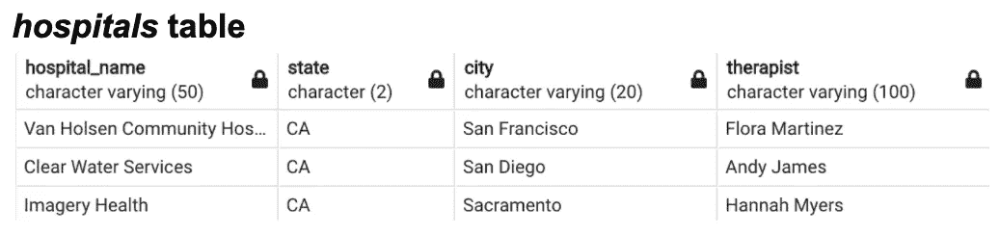
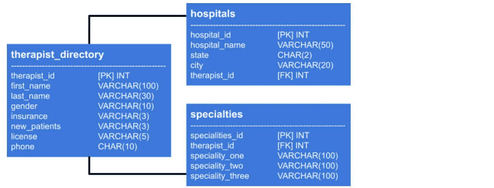
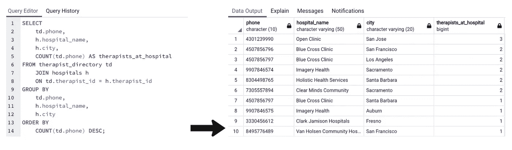
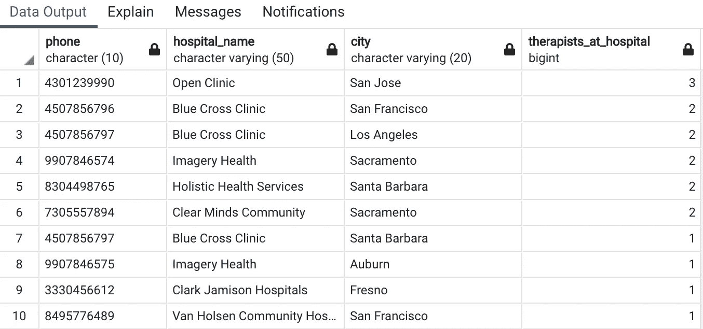
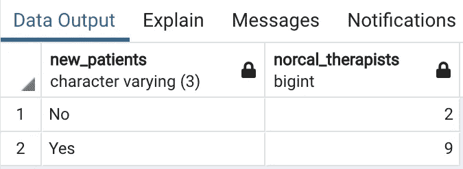

# SQL 数据库规范化完全指南

> 原文：<https://towardsdatascience.com/a-complete-guide-to-database-normalization-in-sql-6b16544deb0?source=collection_archive---------1----------------------->

## 使用 PostgreSQL 正面处理混乱的表格。


萨姆·穆卡达姆在 [Unsplash](https://unsplash.com?utm_source=medium&utm_medium=referral) 上拍摄的照片

假设您刚刚被要求管理公司的关系数据库系统。为了给人留下深刻印象，您很快运行了几个初始查询来熟悉数据…却发现表格杂乱无章。

你冻僵了。您担心不一致的依赖关系可能会对未来的数据操作查询和长期分析产生负面影响。但是您也不确定采取什么步骤来正确地重新设计表格。突然，一种不受欢迎的冲动开始困扰你，那就是翻看你很久以前上过的数据库管理课程的笔记。

听起来熟悉吗？

不要惊慌。你是否继承了一个杂乱的数据库，无意间合成了一个完整性很差的(呜呜！😬)，或者想完全避免上述情况，**数据库规范化**是您的解决方案。

# 什么是数据库规范化？

根据[维基百科](https://en.wikipedia.org/wiki/Database_normalization)上的数据库规范化页面:

> “规范化需要组织数据库的列(属性)和表(关系),以确保它们的依赖关系由数据库完整性约束来正确实施。”

呀。

不要让这些类型的定义吓跑你。简单地说，这意味着**规范化是创建最高效的关系数据库的过程。**本质上，应该组织数据库以减少冗余并避免依赖性异常。

更简单地说，*你的数据库结构应该有直观的意义。*如果你的同事害怕在使用你创建的数据库时犯致命错误，即使你已经向他们解释了，你的数据库可能还没有规范化。

这些规范化理念可以应用于数据库**合成**(从头开始创建数据库)或**分解**(改进现有设计)。

# 什么是范式？

Giphy 的 Gif

“规范化”是一个宽泛的概念，当您迷失在无数杂乱的表格中时，它没有太多的实际用途。为了给这个过程增加具体的步骤，埃德加·f·科德制定了详细的正式规则。

Codd 的规范化指南有五种正式的范式，但是(谢天谢地)前三种通常和你需要的一样深入。让我们在这里简单回顾一下:

## 第一范式(1NF)

这一组初始规则为保持数据库的合理组织设置了基本准则。

*   删除任何重复的数据组*(即注意同一表格中重复的列或行)*
*   为每组相关数据创建单独的表
*   每个表应该有一个主键(*，即一个用非空的唯一值*标识每一行的字段)

## 第二范式(2NF)

下一组规则建立在 1NF 中概述的规则之上。

*   满足 1NF 的所有规则
*   删除不依赖于表主键的数据*(将数据移动到适当的表或创建新的表和主键)*
*   外键用于标识表关系

## 第三范式(3NF)

这组规则将 1NF 和 2NF 中概述的规则向前推进了一步。

*   满足 1NF 和 2NF 的所有规则
*   删除依赖于其他非键属性的属性*(即删除依赖于非外键或主键的列的列)*

# 你为什么要在乎？

Giphy 的 Gif

是的，高端数据库规范化通常被认为是一种奢侈，而不是绝对的需求。但是，即使是朝着正确方向迈出的一小步，也有助于避免数据完整性随着时间的推移而慢慢退化。

> 确保您的数据库依赖关系有逻辑意义并且冗余被最小化，同样也确保了最大程度的有洞察力的查询和分析。

规范化还可以防止数据操作(比如删除、插入和更新)异常。如果依赖关系没有被规范化，您将冒允许部分更新(因此，部分不正确)数据的风险。部分不正确的数据=部分不正确的查询结果。

# 数据库规范化示例

为了充分理解这些抽象的定义，让我们用一个具体的例子来回顾一下每个范式。在整个例子中，我们将关注于*分解*，但是这些概念仍然适用于基于合成的项目。

对于这些例子，我个人使用了 [PostgreSQL](https://www.postgresql.org/) (一个流行的开源关系数据库)和它的开发平台对应物 [pgAdmin](https://www.pgadmin.org/) 。但是，同样，如果您喜欢替代的 SQL 服务器，如 [MySQL](http://mysql.com) 或 [Oracle](https://www.oracle.com/database/) ，您可以将这里讨论的技术移植到您选择的平台上。

如果您对这些工具完全不熟悉，请参考提供的网站的概述和指导信息，或者 PostgreSQL/pgAdmin 上的数据科学文章，如本 [one](/sql-cheat-sheet-776f8e3189fa) 或 [one](/a-practical-guide-to-getting-set-up-with-postgresql-a1bf37a0cfd7) 。

## 数据

让我们假设你被一家公司雇佣，这家公司有一个数据库，里面有位于加利福尼亚的治疗师的信息。出于本教程的目的，我创建了一个模拟的 PostgreSQL 数据库，通过 pgAdmin 托管，其中的数据试图模拟一个类似的真实数据库可能包含的一小部分内容。该数据库包含以下表格:



原始数据库模式

从表中，我们可以看到我们有一系列与治疗师有关的变量，他们在哪里工作，他们擅长什么，以及我们如何联系他们。

在我们开始之前，先浏览一下可用数据本身。分解之前一定要仔细检查你的值- *不要假设你只通过列名就知道表中有什么。*



我们将在整个教程中继续使用这些合成表。如果您想查看用于创建和填充这些表的原始 SQL 语法，请访问我的 GitHub 项目报告[这里](https://github.com/emiburns/complete_guide_to_database_normalization_in_SQL)。还请记住**此处使用的所有合成数据仅用于演示目的**，并不能准确代表加州医院、治疗师人口统计数据或典型的数据集规模(您可能已经知道，SQL 通常用于大数据项目，而不是总共有 20 行的表格)。

## 最初的询问

使用上面显示的数据库，您的公司希望您运行一个查询:

> 确定北加州专门治疗情绪障碍的治疗师的数量，以及这些治疗师中，有多少目前正在接受新病人。

然而，在查看了这些表之后，您会发现尝试准确的查询可能是一个挑战。这两个表之间的关系尚未建立，似乎有冗余信息。在运行请求的查询之前，您必须进行一些分解。

## 1NF

回想一下，规范化的第一步(1NF)涉及正确的行标识和正确的数据分组。

我们先来补救一下两个表的关系:*治疗师 _ 目录*(父表)和*医院*(子表)。*治疗师 _ 目录*已经有一个主键(“治疗师 _id”)，但是*医院*缺少主键和外键。我们可以用序列和主键规范为*医院*添加一个递增的主键:

```
ALTER TABLE hospitals ADD COLUMN hospital_id SERIAL PRIMARY KEY;
```

添加一个外键将需要从*治疗师目录*表中提取信息，以将其与*医院*准确链接。尽管*医院*表中的“治疗师”列有每个治疗师的姓名，但这并不是理想的外键，因为正如您将在接下来的步骤中看到的，我们将更新*治疗师 _ 目录*中相应的“姓名”列。相反，为了一致起见，让我们将治疗师的 id 添加到*医院*中。

```
UPDATE hospital h 
SET therapist_id = td.therapist_id
FROM therapist_directory td
WHERE td.name = h.therapist;
```

现在，我们可以更新医院中包含的“therapist_id”列，以表明它是一个外键，从而准确地链接数据库中的表。因此，从*医院*中删除“治疗师”一栏也将确保表格中的数据与治疗师的工作地点特别相关。

```
ALTER TABLE hospitals
    ADD CONSTRAINT fk_therapist_directory
    FOREIGN KEY (therapist_id)
    REFERENCES therapist_directory(therapist_id);
```

现在，让我们解决表中出现的冗余信息。

再次引用数据后，我们看到，为了使数据保持最简化的形式，我们应该使用 SUBSTRING()将*治疗师 _ 目录*的“姓名”列拆分为名字和姓氏列。

```
/* make new last_name column */
ALTER TABLE therapist_directory ADD COLUMN last_name VARCHAR(30); /* add last name values to last_name */
UPDATE therapist_directory
SET last_name = 
    SUBSTRING(name, POSITION(' ' IN name)+1,   LENGTH(name)); /* update name column to first_name */
ALTER TABLE therapist_directory 
RENAME COLUMN name TO first_name; /* remove last name substring from first_name */
UPDATE therapist_directory
SET first_name = 
    SUBSTRING(first_name, 1, POSITION(' ' IN first_name)-1);
```

*治疗师 _ 目录*表中也有重复的数据组(“专业 _ 一”、“专业 _ 二”、“专业 _ 三”)。我们将把这些变量移到它们自己的表中。*不要忘记给新表添加一个主键和外键！*(参见 GitHub [此处](https://github.com/emiburns/complete_guide_to_database_normalization_in_SQL)了解使用的全部 SQL)。

```
CREATE TABLE IF NOT EXISTS specialties( 
    specialties_key serial PRIMARY KEY, 
    speciality_one VARCHAR(100),  
    speciality_two VARCHAR(100),  
    speciality_three VARCHAR(100), 
    therapist_id INTEGER, 
    CONSTRAINT fk_therapist      
        FOREIGN KEY(therapist_id)    
        REFERENCES therapist_directory(therapist_id));
```

现在让我们看一下数据库模式。



到目前为止一切看起来都很好。是时候去 2NF 了。

## 2NF

回想一下，第二种范式涉及删除与主键无关的数据，并建立外键来巩固表关系。

因为我们所有的表目前都有外键(万岁！)，我们可以重点识别不相关的数据。

在*治疗师目录*中，我们有三列与“治疗师 id”主键不匹配:**保险、新患者和电话**。“保险”和“新病人”并没有指明每个治疗师是谁。相反，每个人都指出了选择治疗师时要考虑的访问规范。

考虑到这一点，让我们将这两个变量移到它们自己的名为 *visit_specifications* 的表中。我们可以通过再次使用 CREATE TABLE 语法来做到这一点。并且，请记住，只要表是以一对一的关系连接的，那么如果一个列同时作为主键和外键也是可以的。

```
CREATE TABLE IF NOT EXISTS visit_specifications( 
    therapist_id INTEGER PRIMARY KEY, 
    insurance VARCHAR(3) CHECK(insurance IN ('Yes', 'No')),        
    new_patients VARCHAR(3) CHECK(insurance IN ('Yes', 'No')),    
    CONSTRAINT fk_visits      
        FOREIGN KEY(therapist_id)    
        REFERENCES therapist_directory(therapist_id));
```

太好了，现在我们在*治疗师 _ 目录*里只剩下一个不相关的栏目:**电话**。仔细看，我们可以看到列出的号码实际上是医院的电话号码，而不是每个治疗师的个人联系信息。



我们可以继续将电话号码添加到更合适的*医院*表中，但是这种修改会违反 3NF！让我们转到第三范式来详细解释为什么会这样。

## 3NF

回想一下，第三种范式涉及删除依赖于列的**。**

…这实际上意味着什么？🤨

让我们一步一步地看“phone”列的例子来理解这个需求。

如上所述，我们可以将“phone”列添加到*医院*表中，以更好地匹配“hospital_id”主键。然而，电话号码值将取决于“hospital _ id”*和*医院所在的城市。让我们再来看一下上一个查询返回的数据:



我们可以清楚地看到，在同一城市的同一家医院工作的治疗师都有相同的电话号码(*例如，有 2 名治疗师在旧金山的蓝十字诊所工作*，但在不同地点的同一家医院工作的治疗师有不同的电话号码(*还有 2 名治疗师也在蓝十字诊所工作，但因为他们位于洛杉矶，所以他们的电话号码与旧金山的两名蓝十字诊所治疗师的电话号码不同*)。

这意味着电话号码取决于医院(主键)和医院所在的城市。将“电话”值放入他们自己的表中，而不是医院的表中，可以防止在不改变电话号码的情况下意外改变治疗师的城市。

这是传递依赖的基础:*列值根据主键和表中的其他列而变化。*

为了避免破坏数据完整性，我们可以创建三个表:一个为每个特定位置的医院建立一个键，一个根据医院 id 建立电话号码，一个为每个治疗师对应的医院 id。最终的数据库模式如下所示(再次使用*，查看提供的 GitHub 页面* [*，这里的*](https://github.com/emiburns/complete_guide_to_database_normalization_in_SQL) *用于完整的 SQL 查询*):


太棒了，现在我们的列只依赖于它们各自的主键！🥳，我们的正常化步骤到此结束

## 重新访问最初的查询

既然数据库符合 1NF、2NF 和 3NF 标准，您可以重新访问您的公司所请求的查询。以防万一，这里有一个复习:

> 确定北加州专门治疗情绪障碍的治疗师的数量，以及这些治疗师中，有多少目前正在接受新病人。

假设情绪障碍包括“焦虑”、“抑郁”和“躁郁症”，您可以使用以下查询，而不会对数据完整性产生怀疑:

```
SELECT 
 sub.new_patients,
 COUNT(therapist_id) AS norcal_therapists
FROM 
 (SELECT s.therapist_id, s.speciality_one, s.speciality_two, s.speciality_three, td.new_patients 
  FROM specialties s 
   JOIN therapist_directory td ON s.therapist_id = td.therapist_id
   JOIN therapist_location tl ON td.therapist_id = tl.therapist_id
   JOIN locations l ON tl.hospital_id = l.hospital_id
  WHERE l.city ~ '(San Francisco|Oakland|San Jose|Sacramento|Auburn)') sub
WHERE 
 speciality_one ~ '(Anxiety|Depression|Bipolar)'
 OR speciality_two ~ '(Anxiety|Depression|Bipolar)'
 OR speciality_three ~ '(Anxiety|Depression|Bipolar)'
GROUP BY sub.new_patients;
```



根据调查结果，北加州有 11 名治疗师专门治疗情绪障碍，而这 11 人中，有 9 人目前正在接受新病人！

除了像这样的一般分析之外，具有非传递依赖列的规范化数据库同样允许我们满怀信心地完成**数据操作查询**。如果你的公司要求你改变一个治疗师工作的城市(而不是医院),你可以很容易地使用一个更新语句来完成，而不用担心意外地没有同时更新电话号码。

```
UPDATE
    therapist_location 
SET  
    hospital_id = (SELECT hospital_id        
                   FROM locations        
                   WHERE hospital_name = 'Open Clinic'          
                       AND city = 'San Jose')
WHERE 
    therapist_id = 15;
```

上述查询将 Sid Michael(therapist _ id = 15)的医院位置从奥克兰更改为圣何塞。因为她的医院 id 现在在*治疗师 _ 位置*表中是最新的，所以我们不需要通过另一个更新查询来手动更改 Sid 的联系信息。相反，Sid 的联系信息会根据她的新医院 id 自动更新。我们可以用一个 JOIN 语句对此进行双重检查。

```
SELECT  
    td.first_name,  
    td.last_name,   
    l.hospital_name,  
    l.city pn.phone_number 
FROM  
    therapist_directory td 
    JOIN   
        therapist_location tl   
        ON td.therapist_id = tl.therapist_id 
    JOIN   
        locations l   
        ON l.hospital_id = tl.hospital_id 
    JOIN   
        phone_numbers pn  
        ON tl.hospital_id = pn.hospital_id
WHERE  
    td.therapist_id = 15;
```


# 简短的闭幕词

分解一个数据库可以简单到 1(NF)，2(NF)，3(NF)！要更深入地了解模拟的“Northern_California_Therapists”数据库和为本文合成的单个 SQL 查询，请查看我的相关 GitHub 知识库[这里](https://github.com/emiburns/complete_guide_to_database_normalization_in_SQL)。

正常化快乐！🤖