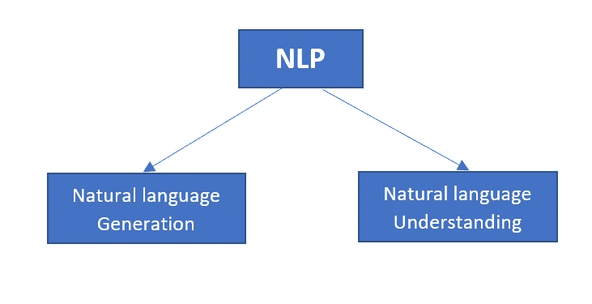
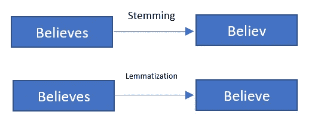
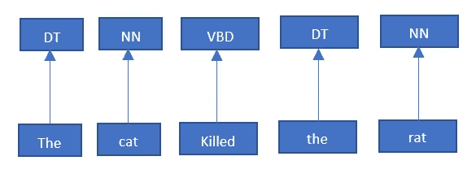

# 自然语言处理完全指南(第三部分)

> 原文：<https://towardsdatascience.com/a-complete-guide-to-natural-language-processing-nlp-c91f1cfd3b0c?source=collection_archive---------8----------------------->

## 机器如何识别人类语言并据此行动

与 Raj 在 [Unsplash](https://unsplash.com?utm_source=medium&utm_medium=referral) 上的[公路旅行照片](https://unsplash.com/@roadtripwithraj?utm_source=medium&utm_medium=referral)

> “语言是文化的路线图。它告诉你它的人民来自哪里，他们将去哪里”——**丽塔·梅·布朗**

## 动机

我想分享一下我的真实经历。早在 2016 年，我被孟加拉国一所著名的工程大学录取，目标是成为计算机科学毕业生。在我第四学期开始的时候，我开始知道机器学习这个时髦词。我立即投入到机器学习中，并渴望了解相关技术。我开始从最基础的 ML 算法开始学习。在熟悉了 ML 算法之后，我做了一些项目来了解如何实现 ML 算法来解决现实生活中的问题。我惊讶于我的 ML 模型的令人满意的结果。在一个无聊的晚上，我是员工，坐在宿舍的阳台上，探索我的智能手机的功能。发现语音助手选项这么准，纳闷。我的心灵被某种感觉所触发，我应该知道这项技术的机制。随即，我冲到房间，拿着笔记本电脑坐了回去，用谷歌搜索了一下，发现一个名为**自然语言处理(NLP)** 的新术语是语音助手的关键。我开始深入了解 NLP。乍一看，我认为这很难，但是经过几天的学习，我清楚地知道 NLP 只不过是一些与 ML 模型集成的技术。有趣的是，这些技巧与语法规则非常兼容。

然而，在这篇文章中，我将讨论我所学到的 NLP 所必需的所有基础知识。阅读这篇文章不需要任何先验知识。

## 基本概述

语言作为人与人之间交流的媒介起着非常重要的作用。它将人类与其他生物区分开来。一般来说，语言(书面或口头)承载着巨大的信息。当我们说话或写东西时，它表示包含一些单词、语法规则、音调信号等的主题。语言的每一部分都提供了一些信息。如果有人试图分析这些信息，他可能会得到综合信息，表明一些行动或类似的事情。

当我们致力于为机器开发一个自动系统时，我们必须从这个角度考虑问题。考虑一个真实的场景，一个人可以生成成千上万的单词和句子。另外，不同的人的句子结构和风格是不同的。你能找到表示数据的通用方法吗？你不能。另一个例子是推特、脸书等社交媒体的帖子。人们的用词、造句、表达方式等。可能因个人和地理区域而异。所有这些都是**非结构化**数据的例子。这些很容易被人脑识别和处理。但是如果是机器呢！？一些现代技术，如机器学习、数据科学，使之成为可能。

现在，我们可以很容易地获取句子的意思，识别演讲，从一堆书面文件中推断信息，分析情感，将句子从一种语言翻译成另一种语言等等。

*试着正式一点……*

自然语言是指人类用来交流和自然进化的语言。*埃拉·库马尔*在他的书“*自然语言处理*”中对自然语言处理的定义如下——

> 自然语言处理是计算机科学和语言学的一个领域，涉及计算机和人类(自然)语言之间的交互。自然语言生成系统将计算机数据库中的信息转换成可读的人类语言[1]。

如今大多数现代工业都在使用自然语言处理。这是一个蓬勃发展的部门。不断增长的计算能力、对数据的大量访问以及使用数据科学的现代技术成为可能。

## 我们在哪里使用 NLP

简单地说，NLP 用于需要通过自然语言与智能系统进行人类交互的地方。自然语言处理的应用越来越广泛。在各行各业，我们都在下意识地使用 NLP。

为了深入了解自然语言处理在我们日常生活中的作用，下面给出了一些例子

*   在农业领域，NLP 可以通过提供基于问题分析的智能解决方案来支持新手农民。NLP 还用于使用实时农民数据分析[作物疾病](https://winkjs.org/blog/nlp-in-agriculture.html)的趋势。它还可以通过语音助手帮助发展中国家的文盲农民。
*   NLP 广泛应用于医疗保健行业。这种疾病是通过分析病人的病历和语音检测出来的。基于疾病和症状的药物建议是 NLP 的另一个重要应用。它还有助于支持临床决策。
*   在需要大量技术支持的大型行业中，聊天机器人在自动回复和智能服务客户方面发挥着关键作用。BM Watson 是一款有趣的基于自然语言处理的行业级聊天机器人支持工具。
*   电子商务的推荐系统是 NLP 的另一个应用。电子商务在现代工业中占有很大份额。从这个角度来看，基于自然语言处理的推荐系统对商业有很大的影响。
*   NLP 的另一个有前途的用例是网络安全。谷歌、雅虎等。邮件服务使用 NLP 来检测垃圾邮件。钓鱼和不安全的网站也可以用 NLP 检测出来。[点击这里](https://www.hitechnectar.com/blogs/machine-learning-in-cybersecurity/)，您可能还会了解到 NLP 在网络安全表单中的更多应用。
*   Google 也使用 NLP 将一种语言翻译成另一种语言。 [**斯坦福自然语言处理小组**](https://nlp.stanford.edu/projects/mt.shtml) 在*机器翻译*领域也做得非常出色。
*   对于一个智能系统来说，根据自然语言命令行动不是一件容易的事情。谷歌的语音助手，苹果的 Siri，亚马逊的 Alexa 都在使用 NLP 作为语音助手。
*   情感分析也是 NLP 的一个重要且广泛使用的用例。通过分析社交媒体帖子和其他文章的情绪，我们可以获得有意义的信息。

NLP 的应用不仅限于上述用例。关于 [**算法等级**](https://algoscale.com/) 的文章解释了下一篇文章中的一些其他用例—

[*2021 年改变电子商务和在线零售的七大 NLP 趋势*](https://algoscale.com/tech-corner/top-7-nlp-trends-transforming-e-commerce-and-online-retail-in-2021/)

## 面向绝对初学者的 NLP 基础

> **语言**，作为社会群体的成员和文化的参与者，人类用来表达自己的一种传统的口语、手势语(手语)或书面符号系统[2]。

当我们相互交流时，人脑对语言的编译和识别并不困难。在大多数情况下，人们不必在意语法规则，这似乎是人脑的一个自动过程。但是对于一台机器来说，事情并不那么容易。这是一项复杂的任务，需要严格遵守规则。因此，在自然语言处理中应该有效地使用几种技术。这些技术很有趣，python、R 和其他编程语言库被用来完成这些任务(代码将在接下来的文章中讨论)。NLP 有两个组成部分。分别是 *i)自然语言生成 ii)自然语言理解。*

**NLP 的组件**

作者图片

*   **自然语言生成**是指使用 NLP 技术生成有意义的语言。
*   **自然语言理解**表示对特定语言含义的提取。它比自然语言生成更复杂。尤其是对机器而言。这需要一些技巧和一套规则。

*是时候了解这些技术了—*

**标记化**

标记化是自然语言处理的第一步。想法很简单，把句子分成独特的单元。先说个例子。

> 孟加拉的自然美景深深吸引了我。

如果我们把这个句子符号化，它将如下。

作者图片

好像挺简单的吧！只是通过跟随空格来分隔句子。在标记化中，标点符号会被自动删除。但是对于所有的语言来说，情况并不总是一样的。还有一些其他的场景。假设在一个句子中，有一个名字，迈赫迪博士，它应该是一个记号，因为它代表一个名字。博士和迈赫迪的分离没有意义。另一个例外可能是硅谷这样的地方的名字。如果我们考虑在一个空格后划分记号的简单过程，硅和谷将是两个不同的记号。但它代表一个地点的名称。在使用学名的情况下，我们会经常遇到这些问题。所以，我们应该非常小心。

**词干**

词干提取是为了找到词根而删减单词的过程。主要是通过去掉一个单词的后缀和前缀来完成的。让我们对后缀和前缀有一些了解。

> *加在单词开头部分的词缀，称为前缀(如不高兴。“un”加在 happy 这个词的开头。所以，‘un’是前缀)。另一方面，后缀是指加在单词最后的额外部分(例如，小心。ful 加在 care 这个词的最后。所以，‘ful’是后缀)。*

举个例子，

`Doing → Do`，`Helping → Help`但并不总是正确的。这个过程有很多限制。如果我们考虑新闻和应用词干，它将是`news → new`。但它已经完全改变了意义。
虽然词干法有局限性，但它被用来提高速度和降低计算成本。

**词汇化**

词汇化与词干化是兼容的。词汇化的主要思想是从单词的不同形式中找出词根，并统一同义词。例如，‘affected’是‘affect’的过去式。在这里，“情感”是词根。考虑到形容词的比较级和最高级形式的转换，bad 是 bad 和 worst。在这里，词根是“坏”。

> 词汇化是一个语言学术语，指的是将具有相同词根或词汇，但具有不同词形变化或意义导数的单词组合在一起，以便它们可以作为一个项目进行分析[2]。

这里，“lemma”是词根的意思。从上面的例子来看，单词“坏”和“影响”是引理。

“词干化”和“词汇化”的过程有些不同。词汇化过程总是找出实际的词根。但是词干提取过程只是把单词砍掉，去掉后缀和前缀，并不总能找到词根。让我们举个例子——

作者图片

从上面的例子中，我们可以看到，在单词“believes”的词源中，只有后缀“es”被删除，但在词汇化的情况下，我们发现了一个有意义的单词。

词汇化更准确，但它需要复杂的语法知识和其他规则。它也需要强大的计算能力

**停止字**

停用词是指在 NLP 情况下没有价值或价值极小的词。“一个”、“一个”、“这个”等词。有助于造句。但是如果我们想推断出什么信息，我们可能会发现这些词并不重要。停用词不是固定的。

在编码中，有一些 python、R 和其他编程语言的库可以去掉停用词。我们可以根据需要添加或删除默认单词。去除停用词有助于我们提高效率。它减少了数据库的大小和计算能力。

**位置标记**

词性标注。词性标注是对特定句子的单词的词性进行标注的过程。例如，句子“*猫杀死了老鼠*”的词性标注如下

作者图片

这里，`**the → determinant, cat → noun, killed → verb, rat → noun**`。有时，当同一个词用在不同的词类时，就变得很困难。一般来说，“谷歌”是一个名词，但如果你看看这个句子“我已经谷歌过这个话题。”在这里，“谷歌”被用作动词。

**命名实体识别**

它将句子中的名词分为不同的类别，如人、组织、地点、时间表达、数量、货币价值、百分比等[3]。让我们举个例子——

> 穆罕默德·哈姆扎加入谷歌时是纽约分公司的软件工程师。

这里，`**Mohammed Hamza → person, google → organization, New York → location**`。

还有一个基础话题叫做**话袋**。这可能会在另一篇文章中讨论。现在，[你可以从这里读出这袋单词。](https://machinelearningmastery.com/gentle-introduction-bag-words-model/)

照片由[卡尼·贝内迪克托娃](https://unsplash.com/@nika_benedictova?utm_source=medium&utm_medium=referral)在 [Unsplash](https://unsplash.com?utm_source=medium&utm_medium=referral) 上拍摄

毫无疑问，自然语言处理使我们的生活变得更容易，减少了我们的工作量，提高了效率。最后一点，NLP 不仅仅适用于英语，而是适用于所有语言。

***你也可以读出以下有趣的文章作为 NLP 的基础***

</tips-and-tricks-to-work-with-text-files-in-python-89f14a755315>  </manipulate-pdf-files-extract-information-with-pypdf2-and-regular-expression-39ff697db0ca>  

## 参考

[1].K. Ela，自然语言处理(2011)，IK 国际私人有限公司

[2].[语言|定义、类型、特征、&事实|大英百科全书](https://www.britannica.com/topic/language)

[3].[https://www.techslang.com/definition/what-is-lemmatization/](https://www.techslang.com/definition/what-is-lemmatization/)

[4].[基于 NLTK 和 SpaCy 的命名实体识别| Susan Li |走向数据科学](/named-entity-recognition-with-nltk-and-spacy-8c4a7d88e7da)