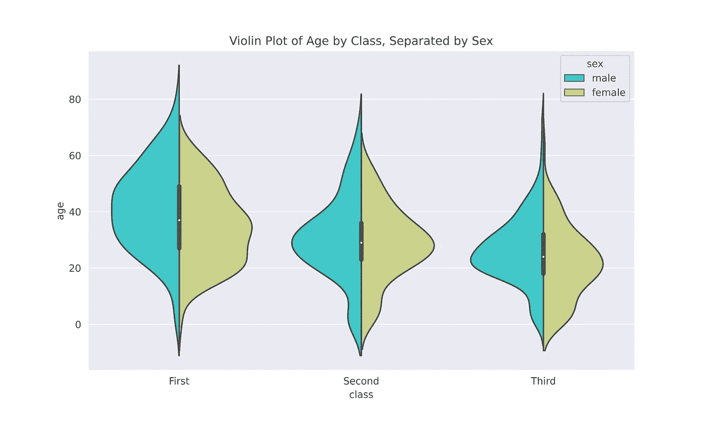

# 用 Seaborn 绘制分类变量的完全指南

> 原文：<https://towardsdatascience.com/a-complete-guide-to-plotting-categorical-variables-with-seaborn-bfe54db66bec?source=collection_archive---------2----------------------->

## 了解 Seaborn 如何让您的绘图看起来更好，传达更多信息，并且只需要几行代码


从@ [v2osk](https://unsplash.com/@v2osk) 到 [Unsplash](https://unsplash.com/photos/c9OfrVeD_tQ)

## 目录

[数据](#8f9e)
[分类分布图](#52ab)
∘ [箱型图](#a05d)
∘ [小提琴图](#931b)
∘ [箱型图](#ee8c)
[分类估计图](#ad55)
∘ [柱状图](#b3e9)
点状图
∘ [计数图](#69ab)
[分类散点图](#7831)

# 数据

在本帖中，我们将使用 Seaborn 的一个关于泰坦尼克号的方便可用的数据集，我相信许多读者已经看过了。Seaborn 有相当多的数据集可以加载到 Python 中进行实践；它们非常适合练习数据处理、探索和基本的机器学习技术。

```
titanic = sns.load_dataset('titanic')titanic.head()
```


泰坦尼克号. head()

```
titanic.info()titanic['species'].unique()
```


泰坦尼克号信息()

这个数据集很棒，因为它有相当数量的条目——近 900 个——同时还有一个有趣的故事可以挖掘。有很多问题要问，变量之间的关系要探索，使它成为一个很好的示例数据集。对于本文来说，最重要的是，还有一个很好的数字和分类变量的混合。

# 分类分布图

我们有两种不同的分类分布图，箱形图和小提琴图。这些类型的图允许我们选择一个数字变量，如年龄，并在选择的分类变量中绘制每个类别的年龄分布。

## 箱线图

这些年来，我们中的许多人可能已经绘制了相当多的方框图。它们是通过四分位数可视化数字数据组的简单而有效的方法。Seaborn 使创建有吸引力的盒状图变得简单，并允许我们轻松地将一个额外的维度与许多 Seaborn 函数中出现的`hue`参数进行比较。

**基本方框图**

让我们来看看乘客等级的年龄分布。

```
plt.figure(figsize=(8,5))sns.boxplot(x='class',y='age',data=titanic, palette='rainbow')plt.title("Age by Passenger Class, Titanic")
```


基本 Seaborn 箱线图

我们可以看到，随着乘客级别的降低，年龄有下降的趋势。这是有道理的，年轻人倾向于在预算内旅行。注意创建一个非常美观的情节需要多少代码？Seaborn 的基本剧情都很打磨。

还要注意我们如何将 Matplotlib 格式语法包装在 Seaborn 图中。这只在我们使用轴级函数时有效，你可以在我的另一篇关于 Seaborn 中图形级和轴级函数的文章中读到。

**添加色调**

像 Seaborn 中许多其他可用的图一样，箱线图可以采用一个添加的`hue`参数来添加另一个变量进行比较。


带色调的箱线图

添加色调向我们表明，不管阶级如何，幸存乘客的年龄一般都低于那些去世的乘客。

使用`hue`进行额外的比较，可以使这个盒状图的信息非常密集。情节越复杂，观众理解它就需要越长的时间，但当有趣的见解更容易以额外的维度显示时，有这个选项是很好的。

## 小提琴情节

小提琴情节并不经常使用，但我发现它们有时很有用，它们是对更受欢迎的选项的有趣改变。他们为每个类别绘制了一个垂直的核密度图，并绘制了一个小方框图来总结重要的统计数据。

```
plt.figure(figsize=(10,6))sns.violinplot(x='class',y="age",data=titanic, hue='sex', palette='rainbow')plt.title("Violin Plot of Age by Class, Separated by Sex")
```


小提琴情节

虽然我喜欢这个图，但我认为用稍微不同的格式来比较性别更容易:

```
plt.figure(figsize=(10,6))sns.violinplot(x='class',y="age",data=titanic, hue='sex', **split='True'**, palette='rainbow')plt.title("Violin Plot of Age by Class, Separated by Sex")
```



小提琴情节在色调上分裂

当我们把小提琴按色调分开时，就很容易看出每个 KDE 的不同。然而，IQR 的统计数据不再按性别划分了；相反，它们适用于整个班级。因此，以特定方式设计您的地块需要权衡利弊。

## 博兴图

boxen 图，也称为字母值图，是一种适用于大型数据集(n > 10，000)的箱形图。它类似于传统的箱线图，但本质上只是绘制了更多的分位数。有了更多的分位数，我们可以看到超过中心 50%数据的分布形状的更多信息；这种额外的细节尤其出现在尾部，这里的盒状图提供的信息有限。

```
plt.figure(figsize=(8,5))sns.boxenplot(x='class', y='age', data=titanic, palette='rainbow')plt.title("Distribution of Age by Passenger Class")
```


简单博森图

万一这里还没有发生足够的事情，我们还可以在一个 boxen 情节中添加一个`hue`！

```
plt.figure(figsize=(8,5))sns.boxenplot(x='class', y='age', data=titanic, palette='rainbow', hue='survived')plt.title("Distribution of Age by Passenger Class, Separated by Survival")
```


带色调的 Boxen 图

我们可以看到，除了中间的 50%的数据，boxen 图给了我们更多的信息。但是，请记住，boxen 图适用于条目在 10，000 到 100，000 之间的较大数据集。这个不到 1000 个条目的数据集肯定不理想。这里有一篇论文的链接，这篇论文很好地解释了博兴地块的产生。

# 分类估计图

## 条形图

条形图很经典。你得到了 x 轴上每一类数值变量的集中趋势的估计值。假设我们想知道来自不同城镇的乘客的平均票价:

```
plt.figure(figsize=(8,5))sns.barplot(x='embark_town',y='fare',data=titanic, palette='rainbow')plt.title("Fare of Passenger by Embarked Town")
```


基本条形图

Seaborn 将平均值作为默认值，但是您也可以使用其他集中趋势的度量。瑟堡和其他两个城镇有明显的不同，让我们把酒吧按等级分开，看看每个城镇都有谁在寄宿。

```
plt.figure(figsize=(8,5))sns.barplot(x='embark_town',y='fare',data=titanic, palette='rainbow', hue='class')plt.title("Fare of Passenger by Embarked Town, Divided by Class")
```


带色调的条形图

现在我们可以看到，由于一些非常昂贵的头等舱机票，瑟堡的平均票价如此之高。从瑟堡出发的头等舱票价上的大误差栏也很有趣；这可能意味着一些价格非常高的异常门票和其他门票之间存在很大的差异。我们将在下面的组合图部分进一步探讨这个问题！

## 点图

点图传达的信息与样式不同的条形图相同。它们可以很好地覆盖不同的地块，因为它们占用的空间较小。

```
plt.figure(figsize=(8,5))sns.pointplot(x='embark_town',y='fare',data=titanic)plt.title("Average Fare Price by Embarked Town")
```


基点图

```
plt.figure(figsize=(8,5))sns.pointplot(x='embark_town',y='fare',data=titanic, hue='class')plt.title("Average Fare Price by Embarked Town, Separated by Sex")
```


带色调的点图

## 计数图

计数图本质上是分类变量的直方图。他们采用与 Seaborn 中条形图相同的参数，这有助于保持事情的简单性。

```
plt.figure(figsize=(8,5))sns.countplot(x='embark_town',data=titanic, palette='rainbow')plt.title("Count of Passengers that Embarked in Each City")
```


基本计数图

```
plt.figure(figsize=(8,5))sns.countplot(x='embark_town',data=titanic, palette='rainbow',hue='sex')plt.title("Count of Passengers that Embarked in Each City, Separated by Sex")
```


用色调计数绘图

# 分类散点图

带状图和群集图本质上都是散点图，其中一个变量是分类的。我喜欢使用它们作为其他类型的图的补充，我们将在下面讨论，因为它们对于快速可视化一个组中的数据点的数量很有用。

## 带状图

```
plt.figure(figsize=(12,8))sns.stripplot(x='class', y='age', data=titanic, jitter=True, hue='alive', dodge=True, palette='viridis')
```


当你有很多数据点时，我不喜欢带状图的样子。但是群体图可能会让这个更有用一点。带状图可以用更少的数据点看起来很棒，并且它们可以传达数据的真正有趣的属性，因为它们没有隐藏聚合背后的细节。

## 群体图

群体图非常奇妙，因为它们提供了一种简单的方法来显示分布中的单个数据点。与带状图中的大斑点不同，群图只是沿 x 轴调整点。尽管它们也不能很好地适应大量的价值，但它们提供了更有组织的洞察力。

```
plt.figure(figsize=(10,7))sns.swarmplot(x='class', y='age', data=titanic, hue='alive', dodge=True, palette='viridis')plt.title("Age by Passenger Class, Separated by Survival")
```


群体图

在这里，我们可以更容易地看到密集的年龄组在哪里，而不是上面难以解释的带状图。

# 组合图

我最喜欢用群体图来增强另一种图，因为它们很好地传达了相对量。正如我们将在下面的 violin 图中看到的，尽管在某一点上 KDE 值可能看起来类似“大”，但每个类中的数据点的数量可能有很大不同。我们可以在 violin 图的基础上添加一个蜂群图来显示各个数据点，这有助于给我们一个更完整的画面。

```
plt.figure(figsize=(12,8))sns.violinplot(x='class',y="age", data=titanic, hue='survived', split='True', palette='rainbow')sns.swarmplot(x='class',y="age", data=titanic, hue='survived', dodge='True', color='grey', alpha=.8, s=4)plt.title("Age by Passenger Class, Separated by Survival")
```


小提琴图和蜂群图

通过添加虫群图，我们可以看到实际大多数数据点包含在哪里。我曾多次看到小提琴图被曲解，观众可能会假设大约相同数量的 25 岁三等舱乘客在三等舱生存，而蜂群图很好地澄清了这一点。

```
plt.figure(figsize=(12,8))sns.boxplot(x='class',y='age',hue='survived',data=titanic, palette='rainbow')sns.swarmplot(x='class',y='age',hue='survived', dodge=True,data=titanic, alpha=.8,color='grey',s=4)plt.title("Age by Passenger Class, Separated by Survival")
```


箱形图和群集图

这个故事与盒子情节和小提琴情节非常相似。每组的汇总统计非常有用，但是添加群体图有助于展示一个更完整的故事。

还记得我们之前看的按乘客等级划分的城镇平均票价吗？


带色调的条形图

我们看到瑟堡机票的价格很高，这是因为瑟堡头等舱机票的平均价格很高。瑟堡头等舱机票的平均价格也有很大的误差。使用带状图，我们可以尝试更好地了解那里正在发生的事情。

```
plt.figure(figsize=(12,7))sns.barplot(x='embark_town',y='fare',data=titanic, palette='rainbow', hue='class')sns.stripplot(x='embark_town',y="fare",data=titanic, hue='class', dodge='True', color='grey', alpha=.8, s=2)plt.title("Fare of Passenger by Embarked Town, Divided by Class")
```


条形图和条形图

现在我们可以看到在瑟堡卖出了两张非常昂贵的票，这扭曲了平均值，这就是为什么我们的头等舱柱状图有一个很大的误差线。虽然有两个人支付了接近第二贵的头等舱机票的两倍，但也有头等舱的人支付了比二等舱乘客更低的票价！当我们组合情节时，我们会获得各种新的见解。

# 使用 Catplot 对数据进行分面

`Catplot()`是图形级函数，可以创建我们讨论过的所有上述图。图形级函数绘制 Seaborn 对象并与 Matplotlib API 接口，而不是像 Seaborn 的轴级函数那样创建 Matplotlib 对象。

虽然使用图形级函数通常更复杂，文档也不太清晰，但在某些情况下，它们有一些优点值得使用。正如我们在下面看到的，他们特别擅长将数据分成支线剧情。

```
g = sns.catplot(x='class',y='survived', col = 'who', data=titanic,
                kind='bar', aspect=.6, palette='Set2')(g.set_axis_labels("Class", "Survival Rate")
  .set_titles("{col_name}")
  .set(ylim=(0,1)))plt.tight_layout()
plt.savefig('seaborn_catplot.png', dpi=1000)
```


Catplot 数据分面

分面数据允许我们以不同的粒度查看数据。分面实际上是一个时髦的词，用于将数据按照特定的维度分成不同的类。因此，这里我们将数据与“谁”变量分开，这使我们可以分别绘制每种类型的人。

能够说`col='<column_name>'`来自动分面是大多数图形级函数都可以使用的强大选项。在 Matplotlib 中完成同样的事情需要更多的时间来设置数据子集和手动创建多个子图。我会在这篇文章的[中讨论图形级绘图的威力。](/a-major-seaborn-plotting-tip-i-wish-i-had-learned-earlier-d8209ad0a20e)

不要忘记，我们仍然可以添加一个`hue`参数来为这个图添加更多的信息！使用 Seaborn 的图形级功能对数据进行分面处理是制作更复杂绘图的一种很好的方式。

你会注意到 Seaborn 图形需要不同的函数来格式化，然而保存绘图仍然可以通过`plt.savefig()`来完成，因为最终的 Seaborn 图形与 Matplotlib API 接口。我不会详细讨论图形级别的绘制，因为有很多内容需要讨论，但是如果你感兴趣的话，请阅读我的另一篇文章。

# 包扎

在这篇文章中，我们经历了许多不同的情节。我希望你已经看到了 Seaborn 可以多么容易地制作出一个美学上令人愉悦的情节，向观众传达许多有用的信息。一旦我习惯了使用它，Seaborn 为我节省了大量的时间，编写了更少的代码来产生令人愉快的可视化效果。

如果你喜欢在 Medium 上阅读我和其他人的内容，考虑使用下面的链接订阅，以支持像这样的内容创建并解锁无限的故事！

[](https://medium.com/@willmnorris/membership) [## 通过我的推荐链接加入 Medium—Will Norris

### 作为一个媒体会员，你的会员费的一部分会给你阅读的作家，你可以完全接触到每一个故事…

medium.com](https://medium.com/@willmnorris/membership) 

# 文档和链接

## 海生的

*   [箱线图](https://seaborn.pydata.org/generated/seaborn.boxplot.html#seaborn.boxplot)
*   [小提琴剧情](https://seaborn.pydata.org/generated/seaborn.violinplot.html#seaborn.violinplot)
*   [博森情节](https://seaborn.pydata.org/generated/seaborn.boxenplot.html#seaborn.boxenplot)
*   [带状图](https://seaborn.pydata.org/generated/seaborn.stripplot.html#seaborn.stripplot)
*   [虫群图](https://seaborn.pydata.org/generated/seaborn.swarmplot.html#seaborn.swarmplot)
*   [点状图](https://seaborn.pydata.org/generated/seaborn.pointplot.html#seaborn.pointplot)
*   [Bar Plot](https://seaborn.pydata.org/generated/seaborn.barplot.html#seaborn.barplot)
*   [Count Plot](https://seaborn.pydata.org/generated/seaborn.countplot.html#seaborn.countplot)
*   [Catplot](https://seaborn.pydata.org/generated/seaborn.catplot.html#seaborn.catplot)