# 推荐系统完全指南——包含 Sklearn、Surprise、Keras 和推荐器的教程

> 原文：<https://towardsdatascience.com/a-complete-guide-to-recommender-system-tutorial-with-sklearn-surprise-keras-recommender-5e52e8ceace1?source=collection_archive---------0----------------------->

## 推荐系统实施的简要介绍和实践指南


哈基姆·拉赫曼在 [Unsplash](https://unsplash.com?utm_source=medium&utm_medium=referral) 上的照片

# 介绍

我们都知道，推荐系统在从零售、电子商务、娱乐到食品配送等许多行业中起着至关重要的作用。它极大地提升了任何平台上的用户体验。想象一下，你反复滚动 marketplace feed，你对手中所有推荐的东西都非常满意，尽管你可能不想要。这个组件是任何业务的事实上的标准。

对于我自己来说，我也是在 **Spotify** 的推荐系统中留下印象进入数据科学领域的。我很惊讶 **Spotify** 的推荐有多精准。我探索我从未听过的音乐新趋势和流派，发掘我喜欢的歌曲类型。这个灵感驱使我写这篇文章。

# 目录

您在本文中可以期待的是:

*   概述—介绍推荐系统的前景
*   实现——说明如何实现各种推荐系统。

提供了以下实现:

*   基于受欢迎度，IMDB 加权评级
*   基于内容的风格特征
*   协同过滤——基于记忆——亲和矩阵
*   协同过滤—基于内存—截断的 VD (Sklearn)
*   协同过滤—基于模型— Funk MF(惊喜)
*   协同过滤——基于模型——GMF(Keras)
*   协同过滤——基于模型——NCF(推荐器)
*   其他先进的算法

此外，在文章的结尾还提供了动手教程笔记本。

# 概述

今天，我们将深入探讨各种推荐系统，我们将为您提供每个部分的实践教程代码和解释。我们几乎没有找到完整的描述和实践指南。因此，本文将这两个方面整合在一起，为您提供启动推荐系统实现的一站式服务。

## 概观

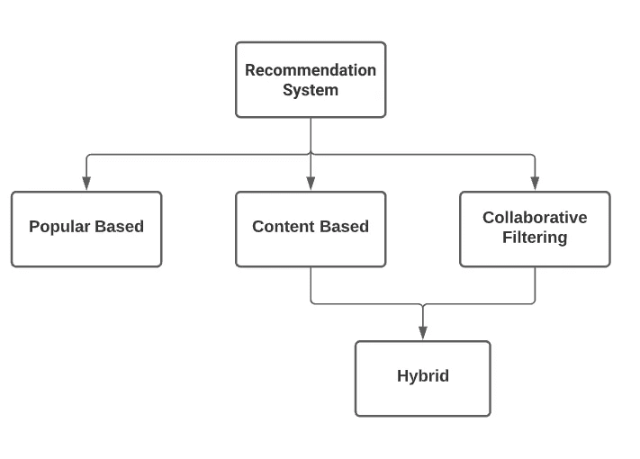

推荐系统概述，图片由作者提供

上图显示了推荐系统的高级概览。看起来它没有太多种类的推荐引擎。然而，在每个基于的建议中有许多变化。我们将向您介绍一些算法，并为您提供进一步的资源供您探索。如今，这一研究领域仍在迅速发展。因此，要在这篇文章中囊括所有最新的技术并不容易。

现在，让我给你解释一下上面每个建筑盒子的基本描述。

1. ***流行型*** —这是基线表现，也是我们随处可见的最直观的推荐。例子有 [**IMDB** 收视率最高的电影](https://www.imdb.com/chart/top/)，今日贵国前十名**网飞**等**。**当你是一名新加入者，并且提供商没有足够的关于你的信息时，可以找到这些建议。所以向你推荐别人喜欢的东西是一个稳妥的选择。

❗限制:所有用户得到相同的推荐集。不是个性化的。

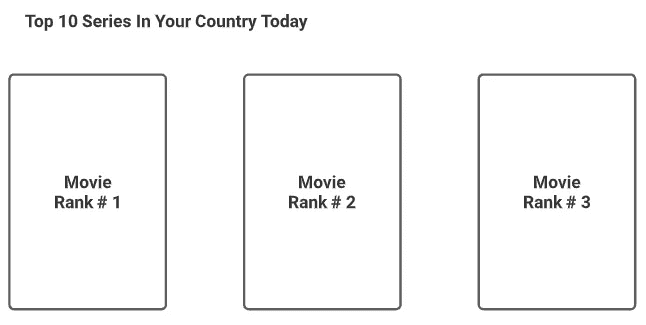

国家排名前 10 的系列，图片由作者提供

2.**基于内容—** 如果您想改进基于流行度的方法，我们可以结合每个项目的细节，推荐更符合用户需求的内容。例如，您可能会在**网飞**上看到下图。它为你提供了一个项目列表，因为你喜欢某部特定的电影。该电影在诸如流派、子流派、频道、国家等方面与用户喜欢的内容相关或相似。推荐的质量取决于您的特性集有多丰富。

❗限制:推荐将限于用户以前喜欢、观看和互动的内容。它没有给用户一个探索他们从未去过的新领域的机会。此外，所有喜欢项目 X 的用户都将收到相同的推荐集。

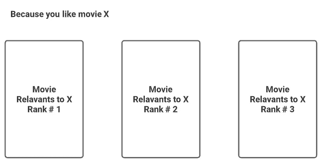

基于内容的推荐，按作者排序的图片

3.**协同过滤** —现在，如果你有关于用户和用户之前交互的项目的先验信息，会怎么样？你如何能想出一个更复杂的推荐引擎？这就是协同过滤发挥作用的地方。协同过滤基于所谓的**用户-项目交互矩阵**推荐项目集。这是用户-项目交互矩阵的样子。

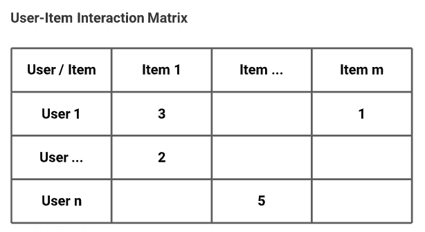

用户-项目交互矩阵，按作者排序的图像

每个单元格中的数字代表用户给予特定项目的**显性或隐性**评分。

详细说明显性和隐性评级。

*   显式评分是我们直接要求用户对特定项目的满意度评分。例如，如果我们假设数字是用户对特定项目的满意度，范围从 1 到 5。这意味着用户 1 喜欢满意度得分为 3 的项目#1。
*   另一方面，隐性评分是我们**从用户行为中间接得出**的评分。例如，他们的用户观看电影的分钟数或用户浏览产品页面的点击次数。

如何构建用户-项目交互矩阵的选择取决于你的业务目标。鉴于上述矩阵，现在我们想为每个用户创建一个个性化的建议。

在协同过滤方法中有两种主要的方式来实现它。

**3.1。基于用户的协同过滤** —这种技术将基于我们从上述用户-项目交互矩阵中得出的相似用户组来个性化我们的推荐**。下图向您展示了我们是如何为用户#1 提出建议的。您可以看到，对于每个用户，推荐集将根据相似用户组而变化，并且相似用户组将根据用户#1 与每个项目的交互方式而变化。**

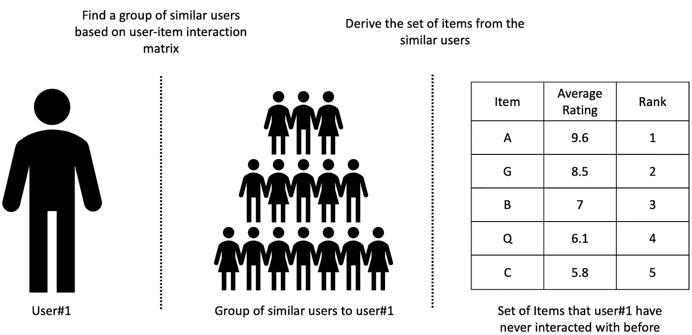

基于用户的协同过滤，按作者分类的图像

⭐️通知: ***这是为每个用户个性化的推荐集。*** 每个用户都将根据他们过去互动过的项目获得他们的推荐，这将导致每个用户的不同推荐集，除非他们喜欢所有相同的产品集。

❗限制:在我们能够导出用户#1 和其他人的相似性之前，我们需要关于用户的先验信息。如果你没有关于用户#1 的任何信息，你就不能得出预测，因为你不能计算用户之间的相似性。这个问题被称为**冷启动**问题。我们可以通过首先向新用户提供基于**流行的**推荐列表来解决这个问题，让他们先给他们喜欢每部著名电影的程度打分，直到我们有足够的信息。

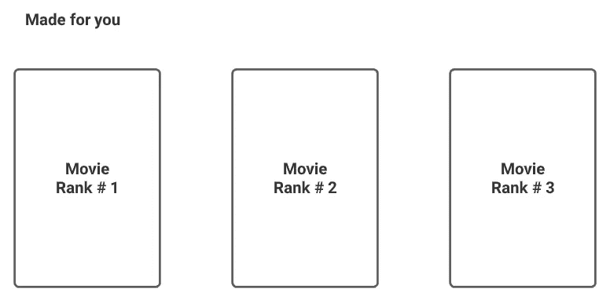

基于个性化的推荐，按作者分类的图片

**3.2。基于项目的协同过滤** —我们将**找到与用户#1 刚刚喜欢的项目**相似的项目组，并将其推荐给用户#1，而不是找到一组相似的用户。这种方法将类似于基于流行或基于内容的推荐。但是，区别在于如何想出一套类似的物品。这里我们使用用户-项目交互矩阵，而不是像上面提到的方法那样的评级或流派。

❗限制:你需要关于新项目和其他项目的先验信息，以及基于用户的协同过滤。否则，您无法衍生出相似的项目组来推荐。我们可以通过首先为新项目提供基于内容的推荐来解决这个问题，直到他们有足够的信息。


基于内容的推荐，按作者排序的图片

4.**混合**——我们看到每种方法都有它的长处。如果我们能够结合所有这些优势，提供更好的推荐，那将是最好的。这个想法引导我们对推荐的另一个改进，那就是混合方法。例如，我们可以将基于内容和基于项目的协同过滤推荐结合在一起，以利用这两种领域特征(流派和用户-项目交互)。

# 履行


莱尼·屈尼在 Unsplash 上的照片

现在，我们已经完成了对推荐系统的简单介绍。我们将讨论的下一个主题是上述所有方法的变体。

*   怎么才能把那些高层次的概念映射到实际的算法上呢？
*   我们可以使用多少种推荐算法来导出最佳推荐集？
*   我们如何评估每种方法的性能？我们如何在相同的基础上进行比较？

我们开始吧。

## 基于大众的


图片由[埃德温·安德拉德](https://unsplash.com/@theunsteady5?utm_source=medium&utm_medium=referral)在 [Unsplash](https://unsplash.com?utm_source=medium&utm_medium=referral) 拍摄

基于流行的实现可以很快完成。您可以从所有用户中平均评分最高的项目、投票数最高的项目或被观看的成员数开始。

为了使它更复杂，我们向您介绍基于 IMDB 加权评级的流行方法。

关于 IMDB 系统，有一种叫做**加权评分系统**的指标用于对每部电影的评分。

下面是加权评分的公式。

```
WR = (v ÷ (v+m)) × R + (m ÷ (v+m)) × C
```

在哪里

*   `R`是该项目的平均评分。
*   `v`是该项目的投票数。
*   `m`是列入热门项目所需的最低票数(由>总票数的百分之 80 定义)
*   `C`是整个数据集的平均评分。

对于每个项目的平均评分，我们会根据收到的投票数调整分数。我们还根据投票数筛选项目组，以确保在合适的候选人中调整分数。

基于流行的推荐，按作者编码

## 预言；预测；预告

使用提供的代码片段，我们生成了流行商品的列表。让我们看看基于 IMDB 加权评分的 10 大热门商品。这里，我们使用合成数据作为我们计算的例子。

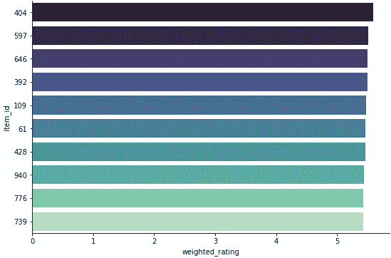

按加权评分排名的 10 大热门项目，按作者排序的图片

现在，我们可以把上面图表中的名字带到我们应用程序的 UI 中，如下图所示。


国家排名前 10 的系列，图片由作者提供

我们可以添加预定义的功能，如时间和位置，使其更符合用户的偏好。如上图所示，网飞还添加了时间(今天)和地点(你的国家)来区分前 10 个基于人口的推荐。

## 基于内容


[张家瑜](https://unsplash.com/@danielkcheung?utm_source=medium&utm_medium=referral)在 [Unsplash](https://unsplash.com?utm_source=medium&utm_medium=referral) 上拍照

对于基于内容的，我们将使用每个项目的流派功能向用户推荐相关或相似的项目。

基于我们的数据集，我们有动作、喜剧、戏剧等类型特征。我们将对流派列进行一次性编码，并找出每个条目之间的相似性。最后一步是从最高到最低排列相似性得分，并根据我们想要提供的推荐数量选择项目集。

下面是提供基于内容的推荐的代码片段。

相关项目数据框如下所示。

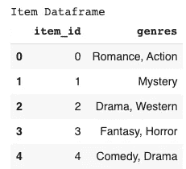

分级项目数据框，按作者分类的图像

基于内容的推荐，按作者编码

## 预言；预测；预告

让我们查一下编号为 99 的物品。你可以看到，最受推荐的剧集是爱情片和动作片，这与基于内容的推荐理念相一致。

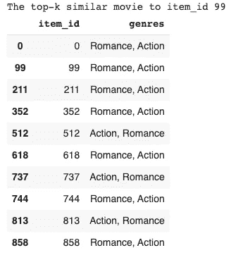

为了将您链接回基于内容的推荐界面，我们可以用我们的推荐列表填充下面的 UI 模板。


基于内容的项目推荐，按作者排序的图片

## [协同过滤](https://en.wikipedia.org/wiki/Collaborative_filtering)

协作过滤有两种主要方法。

*   基于记忆的
*   基于模型的

似乎我们没有太多的方法可以建立模型。然而，每种方法内部的变化是无限的。在阅读本文的过程中，您会看到更多的细节。开始吧！

## **基于记忆的方法**


照片由 [Soragrit Wongsa](https://unsplash.com/@invictar1997?utm_source=medium&utm_medium=referral) 在 [Unsplash](https://unsplash.com?utm_source=medium&utm_medium=referral) 上拍摄

基于记忆的方法非常简单，它直接从用户-项目矩阵计算相似性矩阵。

让我们看看用户-项目交互矩阵。对于协同过滤，我们需要做的第一件事是找到用户或项目之间的**相似性**。


用户-项目交互矩阵，按作者排序的图像

## 相似性度量

1.  [皮尔逊相关性](https://en.wikipedia.org/wiki/Pearson_correlation_coefficient) —线性关系最广为人知的相似性度量是人物相关性。它根据值的变化方向来衡量两个样本的相似程度。
2.  [余弦相似度](https://en.wikipedia.org/wiki/Cosine_similarity)——顾名思义，它度量的是多维空间中两个向量的余弦角度。两件事可以在方向上相似，而不是在大小上相似。
3.  其他相似性得分——我们还可以得出许多其他相似性得分。这里有一个例子[，一个混合的基于用户的协同过滤算法，主题模型](https://doi.org/10.1007/s10489-021-02207-7)【1】。它们提供了一种利用时间衰减的潜在狄利克雷分配来计算相似性度量的方法，这是一个很好的例子，说明了我们如何利用推荐系统的这一部分。

您可以选择您喜欢的任何相似性度量。使用您选择的相似性度量，我们可以计算用户或项目之间的相似性，然后根据以下步骤进行推荐。

**基于用户的实现**

1.  我们根据您的相似性度量选择找到相似用户的组(组大小是任意的)。
2.  我们根据相似用户群对每个项目的评分进行平均
3.  根据平均评分降序排列项目，并向目标用户推荐他们以前从未互动过的项目。

**基于项目的实施**

1.  我们根据您选择的相似性度量标准找到相似项目组。
2.  选择最多前 k 个最相似的项目进行推荐。

⭐️注意:你可以看到，我们可以在没有学习参数的情况下导出推荐集**，就像我们在其他机器学习模型**中所做的那样。这就是**基于内存的**名字的由来。我们创建的引擎会记住用户喜欢什么和不喜欢什么，然后我们根据这些交互的相似性检索结果——不需要任何推理。

❗限制:因为该方法的想法是记住用户和项目之间的每一次交互，这里将发生的问题是引擎的可伸缩性。在现实中，用户数量和项目数量的不平衡使得用户-项目矩阵非常稀疏，导致预测结果的泛化能力很差。

还有一点要考虑，假设你有了一个新的用户和物品，你需要为那些新用户做一个新的推荐。您必须通过添加这些新用户并计算每对用户之间的相似性来再次拟合模型。此外，真实应用程序中的用户和项目规模非常庞大，导致用户-项目交互度量更加稀疏。这个执行计划会导致短时间内无限的资源消耗。

## 更好的调整

现在，代替使用用户-项目交互矩阵的直接计算。**我们将把用户-物品交互矩阵分解成代表更有用的低维空间的潜在因素矩阵。**

让我简单地向你介绍一下这个想法背后的数学概念。分解的思想是我们相信**观察到的用户-项目评级**矩阵是从**潜在用户和项目潜在因素矩阵构建的。**

假设我们可以提取出使重构矩阵和原始矩阵之间的损失最小的最佳潜在因子矩阵。然后我们可以使用**用户和项目潜在因素矩阵**的内积来推断**未观察到的评级**。

我们把这个概念和方法叫做 [**矩阵分解**](https://en.wikipedia.org/wiki/Matrix_factorization_(recommender_systems)) **。**有几种矩阵分解技术，每一种都提供一组不同的结果，从而产生不同的建议。

这是经典方法如[奇异值分解](https://en.wikipedia.org/wiki/Singular_value_decomposition)、[主成分分析](https://en.wikipedia.org/wiki/Principal_component_analysis)或先进前沿技术如深度学习出现的地方。这一领域的研究仍在迅速发展。

## 基于模型的方法


维多利亚诺·伊斯基耶多在 [Unsplash](https://unsplash.com?utm_source=medium&utm_medium=referral) 上拍摄的照片

这是你可以有很大发挥空间的地方。顾名思义，我们将结合一些种类的**模型**作为预测的推荐引擎。

我们从基于记忆的方法中得知，直接计算用户和项目的相似性在可扩展性方面是不实际的。

⭐️注意:基于模型的方法和基于记忆的方法之间的关键区别在于**基于模型的方法包括基于评级数据集构建模型**。更准确地说，我们从用户-项目交互矩阵中提取数据，并将其用作提出建议的模型。这解决了基于内存的方法的可伸缩性问题，从而使现实世界的实现更容易。

## **技法**

这里我们将解释我们在实践指南笔记本中实现的三种矩阵分解。我们可以使用一个基本的技术来创建一个简单的推荐引擎。

然而，如果你想看看最先进的技术，我也会附上我感兴趣的资源供你进一步探索。

## [截尾 VD](https://scikit-learn.org/stable/modules/generated/sklearn.decomposition.TruncatedSVD.html) (Sklearn)

这里我们将带您了解的第一种方法是使用**truncated VD**和 **sklearn** 库进行矩阵分解。

TruncatedSVD 是奇异值分解的变体，它只计算 K 个最大奇异值(n_components)。此外，它还应用了 ***线性降维*** ，并能很好地处理稀疏矩阵，如用户项目矩阵。


用户-项目交互矩阵，按作者排序的图像

我们的目标是将用户项目矩阵分解成这些潜在因素。每个单元的值将是满足优化约束(SVD 假设)的估计值。另一个矩阵分解的例子是[非负矩阵分解](https://en.wikipedia.org/wiki/Non-negative_matrix_factorization) (NMF)。

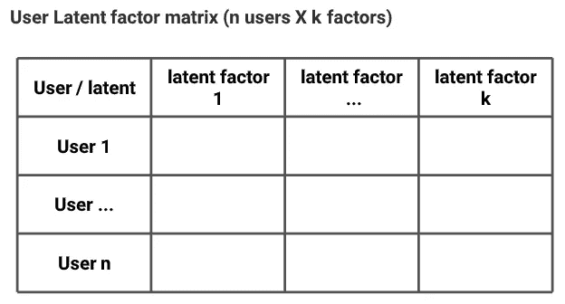

用户潜在因素矩阵，作者图片

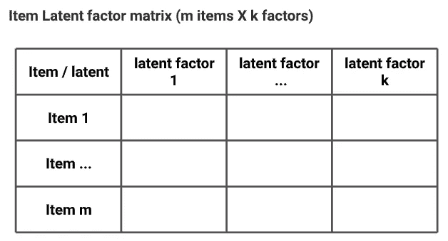

项目潜在因素矩阵，图片由作者提供

下面是如何在 python 中将 truncatedSVD 应用于用户项矩阵的示例代码片段

截断的 VD 实现

这似乎是这种方法的一个类似版本，但是我们考虑到了分解步骤。这将使推荐更加健壮，并减少大尺寸用户-项目交互矩阵的存储器消耗。然而，当我们有一个新的用户或项目时，我们仍然需要在进行预测之前重新调整用户-项目交互矩阵。

之后，我们可以像基于记忆的方法一样实现该步骤，以创建基于用户或基于项目的推荐。

⭐️注意:现在，推荐将基于一些潜在的因素，与基于记忆的方法的显式或隐式评级相比，我们不能直接解释这些因素。

❗限制:即使我们用分解方法减小矩阵的大小，可扩展性仍然是这个算法的一个问题。此外，可解释性也是一个问题。我们不知道如何用人类的解释来描述每个潜在的因素。

## [Funk 矩阵分解](https://en.wikipedia.org/wiki/Matrix_factorization_(recommender_systems)#Funk_MF) ( [惊喜](https://github.com/NicolasHug/Surprise))

该算法由 Funk，Simon [ [2](https://sifter.org/~simon/journal/20061211.html) ]发起。它持有矩阵分解的概念，将用户-项目交互降低到更低维的空间潜在矩阵中。然而，没有像奇异值分解或主成分分析那样的降维技术被应用。

⭐️注意:即使惊喜包中的方法名是 SVD，它也是一种不同的方法，与奇异值分解方法无关。Funk MF 只是一种类似 SVD 的算法。

FunkFM 的目标是估计潜在因子矩阵和偏差，偏差被称为最小化原始显式评级和重建预测评级之间的损失。因此，这就是为什么我们称这种方法为**基于模型的**。

## 预言；预测；预告

要进行预测评级，我们可以乘以估计的潜在因素矩阵，并添加用户或项目的偏差项，如下图所示。

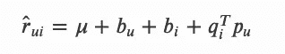

Funk MF 预测公式

在哪里

*   `u`表示用户索引，`i`表示物品索引。
*   `r(hat)ui`是用户`u`对商品`i`的预测评分
*   `mu`是所有评分的平均值
*   `b`是用户或项目的偏差术语(基线)
*   `qi`是项目潜在因素矩阵
*   `pu`是用户潜在因素矩阵

如果我们不知道关于用户的信息，那么项`bu`和`pu`将被假定为零。因此，新用户的预测评级将是所有评级的平均值加上`bi`项，这意味着如果我们不知道用户，我们将向他们推荐我们从数据中了解到的具有高基线项的产品。

这同样适用于项目术语`bi`和`qi`。如果是新用户和新项目，我们的预测评分将等于所有评分的平均值。

## 学问

为了让你更好的理解优化什么，这里是在**惊喜**库中实现的损失函数。

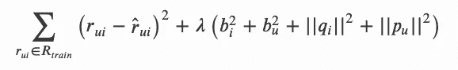

Funk MF 最小化的目标函数

在哪里

*   `lambda`是我们可以调整的正则化超参数。

我们还可以在估计的潜在因子和偏差项上添加正则化，并调整模型中潜在因子的数量。

使用随机梯度下降(SGD)方法，所有学习参数将被随机初始化和更新。拟合的模型将用于预测特定用户对特定项目的评级。

❗限制:在评分预测中你可以看到，这个模型只考虑了显性评分(用户给物品的一个真实评分)，并不关心隐性评分(点击次数、花费在物品上的时间等)。).这个限制也有所改善。例如，您可以查看一下 [SVD++](https://en.wikipedia.org/wiki/Matrix_factorization_(recommender_systems)#SVD++) 算法。

下面是如何在 python 中将 funk MF 应用于用户项矩阵的示例代码片段

Funk MF(类奇异值分解算法)实现

## 广义矩阵分解(GMF)

⭐️注意:这种方法的名称并不通用。它只在[神经协同过滤](https://doi.org/10.1145/3038912.3052569)【3】的上下文中有效。

对于这个实现，当我开始学习深度学习如何与推荐系统一起工作时，我在 [this Keras 示例](https://keras.io/examples/structured_data/collaborative_filtering_movielens/)上找到了这个教程。通过一个简短而精确的代码片段，它对我理解如何构建推荐引擎的神经网络架构有很大帮助。

我还发现实现是基于[神经协同过滤](https://doi.org/10.1145/3038912.3052569)【3】的部分后续研究。在第 3.2 节中，论文展示了如何将矩阵分解作为神经协同过滤(NCF)框架的特殊情况。

他们的出发点是，密集稀疏输入用户和项目向量(用户-项目交互矩阵)的嵌入层可以被视为正常矩阵分解过程中的潜在因子矩阵。

## 预言；预测；预告

记住上面提到的想法，这就是他们提供预测的方式。

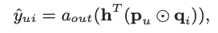

GMF 预测公式

在哪里

*   `y(hat)ui`是用户`u`对物品`i`的预测
*   `a(out)`是神经网络最后一层的激活函数
*   `h^T`是输出图层的边权重
*   `pu`和`qi`在这里可以看作是嵌入层产生的潜在向量。
*   `circle(.)`是逐元素的乘积运算

根据如何导出预测，如果我们使用相同函数作为激活函数`a(out)`并且使用一的均匀向量作为输出层的边缘权重`h^T`。我们可以证明矩阵分解是 NCF 框架的特例，它是由潜在因子矩阵的内积得到的预测。

然而，对于这里提到的 GMF，他们用 sigmoid 函数替换了`a(out)`，并从输入数据中学习`h^T`，以最小化对数损失。

总而言之，GMF 模型的架构是下图中的部分红线。这只是整个 NCF 模型的一部分，我们将在下一个主题中进一步讨论。

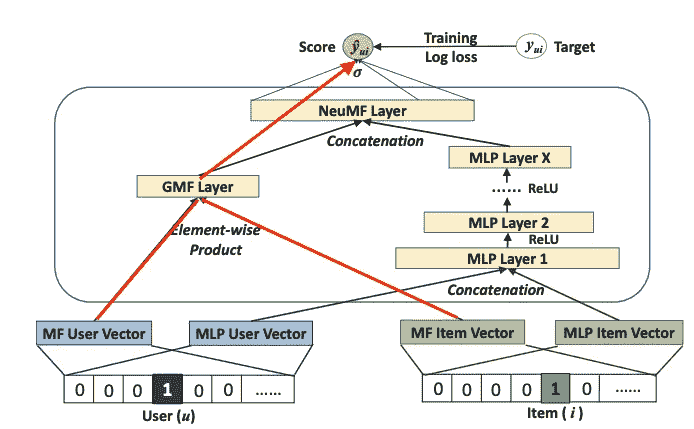

提出 NCF 架构的图，参考图 3 来自[神经协同过滤](https://doi.org/10.1145/3038912.3052569)【3】

也就是说，让我们看看如何在 Keras 中实现这个模型。这里，我们还增加了神经网络结构的变化，以预测评级，而不是参考文件中提出的 0 到 1 之间的值。

GMF 实现，作者代码

现在我们来看看如何用 Keras 库集成和构建推荐系统。这开启了利用深度学习架构为推荐引擎构建架构的可能性。这是另一种推荐引擎，相比于像 Surprise 这样的软件包，我们可以调整和使用它。

## 神经协同过滤(NCF)(推荐器)

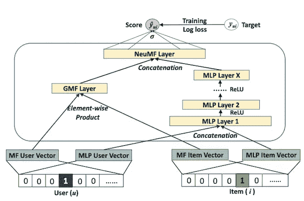

该图提出了 NCF 架构，参考图 3 来自[神经协同过滤](https://doi.org/10.1145/3038912.3052569)【3】

最后但同样重要的是，让我们看看我们前面提到的 NCF 算法的完整架构和强大功能。

你可以看到整个 NCF 建筑有一个多层感知(MLP)部分。这一提议的想法结合并激活了模型如何利用**非线性函数**来估计潜在因素矩阵。其思想是，由于用户-项目交互矩阵的复杂性，只有前面矩阵分解技术的线性乘积不足以检索有用的信息。因此，提出了添加 MLP 部分以帮助捕捉数据中的模式的想法。

基于推荐库中 movielens@100k 数据集的初步比较，NCF 算法优于传统的 Funk MF(Surprise package 中的类 SVD 算法)。这个证据表明了深度学习方法在推荐系统中的重要性。

让我们看看推荐库实践教程的最后一段代码。

NCF 实施

## 其他尖端技术

当我学习和研究推荐系统时，它把我带到了微软提供的[推荐器](https://github.com/microsoft/recommenders)库。这个库将我对推荐系统的观点和理解提升到了一个新的层次。

在推荐库的第一眼，我被许多看不见的方法淹没了。一些方法似乎是当今推荐引擎的最新技术。但是在我花了一些时间使用 Github、文档和提供的例子之后。我意识到所有的内容都非常丰富和有用。

如果您阅读了本文的这一部分，您将对推荐系统有足够的了解。然而，天空是无限的。你可以用推荐者库中的东西在这条路上走得更远。深入研究各种详细的算法需要一些时间，但是我们认为如果你需要在推荐系统领域出类拔萃的话，这是非常值得的。

在接下来的部分，我会为你提供一些有趣的阅读资源。

这里有一些有趣的资源，我想你应该看看

*   [双边变分自动编码器(BiVAE)](https://github.com/microsoft/recommenders/blob/main/examples/02_model_collaborative_filtering/cornac_bivae_deep_dive.ipynb)
*   [贝叶斯个性化排名](https://github.com/microsoft/recommenders/blob/main/examples/02_model_collaborative_filtering/cornac_bpr_deep_dive.ipynb)
*   [光图卷积网络](https://github.com/microsoft/recommenders/blob/main/examples/02_model_collaborative_filtering/lightgcn_deep_dive.ipynb)
*   [Nvidia-Merlin 提供的 Transformaer4Rec】](https://github.com/NVIDIA-Merlin/Transformers4Rec)
*   [推荐系统列表](http://List of Recommender Systems)

# 最后的想法

这里我们来结束这篇文章。我希望所有的材料和解释对于开始你在推荐系统领域的旅程足够有用。

没有正确的方向，我开始很难在互联网上收集信息。因此，我相信这个指南将帮助你从推荐系统的基础开始，并为你提供进一步的阅读和探索未来的努力。

这个领域正在发生很多事情。因此，您必须不断地跟上技术的步伐，以利用您的所有数据，并向您的所有用户提供最满意的建议集！

# 实践教程

您可以在这个 Colab 笔记本中找到以下所有代码。笔记本还在开发中，我会随着对推荐系统的了解不断更新。

[](https://colab.research.google.com/drive/1w92d6_BjrF5nVLoFhD1Oa6dV3DgKra8G?usp=sharing) [## 谷歌联合实验室

### 编辑描述

colab.research.google.com](https://colab.research.google.com/drive/1w92d6_BjrF5nVLoFhD1Oa6dV3DgKra8G?usp=sharing) 

# 参考

[1] Na，l，Ming-xia，l .，Hai-yang，Q. *等* [一种基于主题模型的混合用户协同过滤算法](https://doi.org/10.1007/s10489-021-02207-7)。*应用智能* **51，**7946–7959(2021)。

[2]放克，西蒙。[《网飞更新:在家里试试这个】](http://sifter.org/~simon/journal/20061211.html) (2006)

[3]何湘南，廖，汉王张，，聂，，蔡达生.[神经协同过滤](https://doi.org/10.1145/3038912.3052569) (2017)，第 26 届万维网国际会议论文集(WWW '17)。