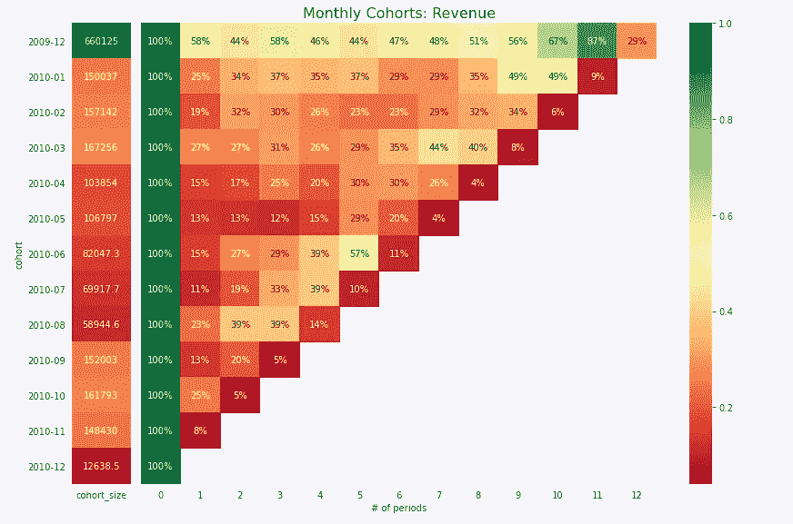
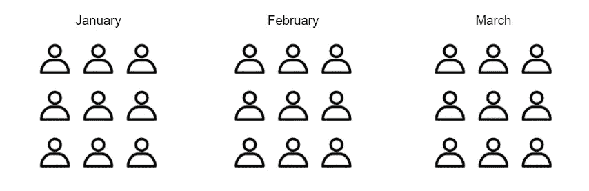
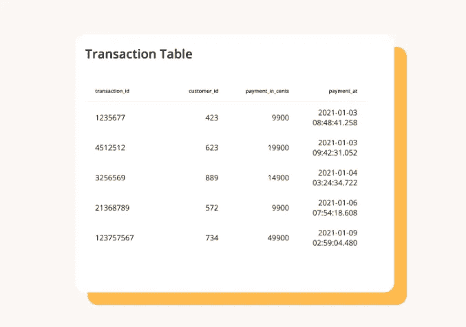
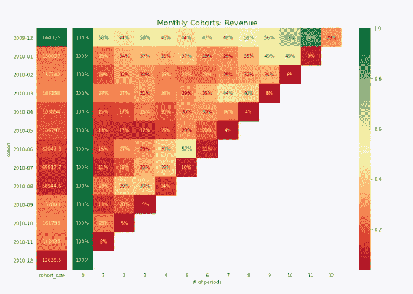

# SQL 和 Python 收入群组分析完全指南

> 原文：<https://towardsdatascience.com/a-complete-guide-to-revenue-cohort-analysis-in-sql-and-python-9eeecd4c731a?source=collection_archive---------1----------------------->

## 了解客户行为的重要数据分析工具

# 介绍

理解你的客户和他们的行为是任何成功创业的顶峰，这正是群组分析的目的。**群组分析**是一个非常有用的工具，可以让你收集关于客户流失、终身价值、产品参与度、粘性等方面的见解。

群组分析对于改进用户加入、产品开发和营销策略特别有用。群组分析之所以如此强大，是因为它们本质上是一种三维可视化，您可以随时比较不同细分市场的价值/指标。

在本文结束时，您将学习如何创建这样的东西:



作者创建的图像

**如果你不确定你在看什么，或者为什么这会有用，请继续关注并阅读。**

# 什么是队列分析？

为了理解什么是队列分析，你首先需要理解什么是队列。一个**群体**仅仅是一群有共同之处的人。因此，**群组分析**只是对几个不同群组(即客户群)的分析，以更好地了解行为、模式和趋势。如果这还没有完全理解，继续读下去，我向你保证会的！

# 群组类型



基于时间的群组

最常见的群组分析类型之一是查看**基于时间的群组**，该群组通过特定的时间框架对用户/客户进行分组。例如，一家公司可能希望了解一月份开始使用该产品或开始付款的客户与二月份的客户相比情况如何。

**基于细分市场的群体**代表使用或购买特定产品或服务的客户群体。例如，你可以根据用户每周登录你的应用的时间来划分用户。

另一种类型的群组是基于规模的群组，即根据客户的货币价值对其进行细分。这是游戏行业(免费用户对鲸鱼)或 SaaS 世界的常见做法，通过客户的 LTV 或计划对客户进行细分。

**在本文的剩余部分，我们将只关注实施基于时间的收入群组分析。**

# 队列分析所需的数据

在开始队列分析之前，需要以下数据:

1.  **收入数据**链接到采购数据
2.  用户的唯一标识符，如客户 ID 或账户 ID
3.  一个**初始开始日期**为每个用户，无论是注册日期或首次付款。

例如，您可能有一个如下所示的表:



[经许可从普查中获取的图像](https://blog.getcensus.com/a-complete-guide-to-revenue-cohort-analysis/)

# SQL 中的群组分析

在 SQL 中进行群组分析时，目标通常是以特定格式处理数据，然后将结果导入 BI 工具，如 Sisense、Mode、Looker 等。

假设我们正在处理上表，我们可以使用 SQL 以下列方式操作数据:

首先，我们希望将用户划分到不同的群组中——在本例中，我们希望根据他们的`Order Date`来划分。

```
with user_cohorts as (
    SELECT  customerId
            , MIN(DATE_TRUNC('MONTH', orderDate)) as cohortMonth
    FROM orders
    GROUP BY 1
)
```

接下来我们想要创建一个`order_month`变量。例如，客户在初次付款后一个月进行的付款的`order_month`为 2。

```
with order_month as (
    SELECT  customerId
            , DATE_DIFF(
                MONTH,
                cohortMonth,
                DATE_TRUNC('MONTH', orderDate)
            ) as month_number
            , SUM(revenue) as revenue
    FROM orders
    LEFT JOIN user_cohorts USING(customerId)
    GROUP BY 1, 2
)
```

后退一步，我们现在可以通过第一步中创建的`cohortMonth`来合计收入。这将允许我们创建我们的`rentention_table`。

```
with cohort_size as (
    SELECT  sum(revenue) as revenue
            , cohortMonth
    FROM orders
    LEFT JOIN user_cohorts USING (customer_id)
    GROUP BY 1
    ORDER BY 1
)with retention_table as (
    SELECT  c.cohortMonth
            , o.month_number
            , sum(revenue) as revenue
    FROM order_month o
    LEFT JOIN user_cohorts c USING (customerId) 
)SELECT  r.cohortMonth
        , s.revenue as totalRevenue
        , r.month_number
        , r.revenue / s.revenue as percentage
FROM retention_table r
LEFT JOIN cohort_size s USING (cohortMonth)
WHERE r.cohortMonth IS NOT NULL
ORDER BY 1, 3
```

现在，您应该有一种支持群组分析的商业智能工具能够消化的数据格式(或者总是有 Excel🤣)



以下是一些帮助你实现这种可视化的技巧:

*   每行代表一个组群。在这种情况下，一个群组代表一个给定的月-年。
*   群组规模(左边的条形)显示了每个群组的基线收入，也就是从第 0 个月开始的总收入。
*   百分比是相对于每个群组在第 0 个月的收入而言的。

# Python 中的群组分析

Python 中的数据操作过程非常相似，唯一的区别是您可以使用 Seaborn 等工具直接可视化群组分析。

如果你想看群组分析的例子，请查看我的 GitHub。这仅仅是艾里克·莱温森 [*的延伸，所以所有的荣誉都归于他！*](/a-step-by-step-introduction-to-cohort-analysis-in-python-a2cbbd8460ea)

# 进行队列分析的价值

> “一幅画等于千言万语”

群组分析不仅有助于衡量和评估与收入相关的趋势，如[净 MRR 留存](https://help.chartmogul.com/hc/en-us/articles/203359411-Metric-MRR-Retention-Rate)、[客户流失](https://baremetrics.com/blog/cohort-analysis)、终身收入等，还可以帮助实现以下目标:

*   **用户行为**:群组分析可以让你了解群组的生命周期，因此，它可以让你更好地了解客户在他们的生命周期中是如何参与业务的。在上面的例子中，我们可以立即注意到销售是重复销售通常在圣诞节前后更高。
*   **比较群组**:无论你是按时间段、产品还是其他方式划分群组，群组分析都能让你比较不同的群组。请注意，在上面的例子中，第一组的重复销售比例比其他组高得多。通过识别这一点，你就可以研究第一批人购买更多的可能原因。
*   **客户流失&终身价值**:最后，群组分析可以让你计算有用的指标，比如流失和终身价值。通过了解不同群组之间的流失率和终身价值的差异，您可以从流失率低的群组和终身价值高的群组中学习。

# 感谢阅读！

如果你读到这篇文章的结尾，你应该知道什么是队列分析，为什么它如此有用，以及如何进行队列分析！我保证，拥有这个工具在你的职业生涯中会派上用场，因为每个公司都可以从中受益。

一如既往，我祝你学习一切顺利——下次再见！

***这篇博客最初发布在 Census 的博客上，你可以在这里查看***<https://blog.getcensus.com/a-complete-guide-to-revenue-cohort-analysis/>****。人口普查局和 TDS 允许我转贴这篇博客。****

*不确定接下来要读什么？我为你选了另一篇文章:*

*</simulating-the-pandemic-in-python-2aa8f7383b55>  

**又一个！**

</a-complete-52-week-curriculum-to-become-a-data-scientist-in-2021-2b5fc77bd160>  

## 特伦斯·申

*   ***如果你喜欢这个，*** [***跟我上媒***](https://medium.com/@terenceshin) ***了解更多***
*   ***有兴趣合作吗？让我们连线上***[***LinkedIn***](https://www.linkedin.com/in/terenceshin/)
*   ***报名我的邮箱列表*** [***这里***](https://forms.gle/tprRyQxDC5UjhXpN6) ***！****