# Python 中用于图像分类的完全逻辑回归算法

> 原文：<https://towardsdatascience.com/a-complete-logistic-regression-algorithm-for-image-classification-in-python-from-scratch-c1d0266409b8?source=collection_archive---------9----------------------->


照片由[雷德查理](https://unsplash.com/@redcharlie?utm_source=medium&utm_medium=referral)在 [Unsplash](https://unsplash.com?utm_source=medium&utm_medium=referral) 上拍摄

## 带有项目的逻辑回归算法的详细布局

逻辑回归在机器学习和统计学中非常流行。它可以很好地处理二元和多元分类。我以前写过用逻辑回归进行二元和多类分类的教程。本文将集中讨论用逻辑回归进行图像分类。

如果你对逻辑回归完全陌生，请先阅读这篇文章。本文详细解释了简单的逻辑回归算法是如何工作的。

</a-complete-logistic-regression-algorithm-from-scratch-in-python-step-by-step-ce33eae7d703>  

如果你已经熟悉了逻辑回归，这将会很有帮助。如果没有，我希望你仍然理解这里的概念。我试着解释清楚。

> 如果你读这个是为了学习，唯一的办法就是自己运行所有的代码。

## 问题陈述

这个项目的想法是开发和训练一个模型，能够采取一个数字的像素值，并确定它是否是一个数字 1 的图像。

将在本教程中使用的数据集在机器学习教程中非常常用。著名的数字数据集。数据集的每一行表示一个数字的展平像素值。后面我会详细给你看。

## 数据准备

该数据集包含从 0 到 9 的数字的像素值。但是因为本教程是关于二进制分类的，所以这个模型的目标是如果数字是 1 就返回 1，否则返回 0。请随时从下面的链接下载数据集，以便跟进:

<https://github.com/rashida048/Machine-Learning-With-Python/blob/master/ex3d1.xlsx>  

我在这里导入数据集:

```
import pandas as pd
import numpy as npdf= pd.read_excel('ex3d1.xlsx', 'X', header=None)
df.head()
```

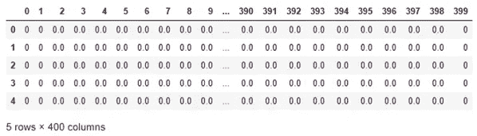

您可以看到数据集有 400 列。这意味着每行有 400 个像素值，每行代表一个数字。让我们使用 matplotlib 库的“imshow”函数来检查一些数字。请注意，图像的像素值最初不是一维的。这就是为什么它在传递给“imshow”函数之前被整形为一个 20 x 20 的二维数组。

```
import matplotlib.pyplot as plt
plt.imshow(np.array(df.iloc[500, :]).reshape(20,20))
```

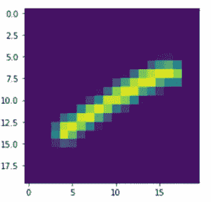

是一个！这里我使用了数据集的第 500 行。

下面是另一个使用数据集第 1750 行的例子:

```
plt.imshow(np.array(X.iloc[1750, :]).reshape(20,20))
```

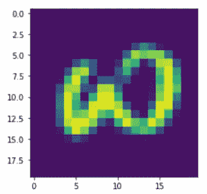

现在是三点。

让我们检查一下这个数据集中有多少行:

```
len(df)
```

输出:

```
5000
```

标签存储在此 excel 文件的不同工作表中。以下是标签:

```
df_y= pd.read_excel('ex3d1.xlsx', 'y', header=None)
df_y.head()
```

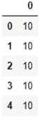

我只显示了产生前 5 行的数据集的头部。因为这个模型将只识别数字 1，如果数字是 1，它将返回 1，否则返回 0。所以，在标签中，我将只保留 1，其余的数字将变成 0。让我们将其余的数字转换为零。

为此

```
y = df_y[0]
for i in range(len(y)):
    if y[i] != 1:
        y[i] = 0y = pd.DataFrame(y)
y
```

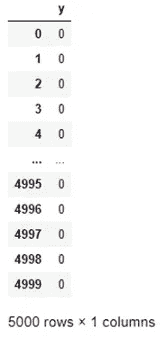

在这 5000 行数据中，4000 行将用于训练模型，其余 1000 行将用于测试模型。对于任何机器学习或深度学习模型来说，通过模型看不见的数据进行测试是很重要的。

```
x_train = X.iloc[0:4000].T
y_train = y.iloc[0:4000].Tx_test = X.iloc[4000:].T
y_test = y.iloc[4000:].T
```

使用。t，我们取每个数据集的转置。这些训练和测试数据集是数据帧形式的。为了便于计算，它们需要是数组格式。

```
x_train = np.array(x_train)
y_train = np.array(y_train)
x_test = np.array(x_test)
y_test = np.array(y_test)
```

训练和测试数据集已准备好用于模型中。这是开发模型的时候了。

第一步:

逻辑回归使用我们在高中都学过的基本线性回归公式:

Y = AX + B

其中 Y 是输出，X 是输入或独立变量，A 是斜率，B 是截距。

在逻辑回归中，变量是这样表示的:

**公式 1**

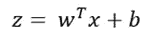

这里 z 是输出变量，x 是输入变量。w 和 b 将首先被初始化为零，并且它们将在训练模型时通过迭代次数来修改。

这个输出 z 通过一个非线性函数。常用的非线性函数是 sigmoid 函数，其返回值介于 0 和 1 之间。

**公式二**

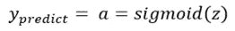

提醒一下，sigmoid 函数的公式是:

**公式 3**

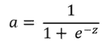

这个“a”将是最终输出，即“y_train”或“y_test”中的值。

下面是定义 sigmoid 函数的函数，供以后使用:

```
def sigmoid(z):
    s = 1/(1 + np.exp(-z))
    return s
```

正如我们之前提到的，w 和 b 将被初始化为零。将为每个像素值初始化一个 w 值。让我们定义一个函数来初始化 w 和 b 的零值:

```
def initialize_with_zeros(dim):
    w = np.zeros(shape=(dim, 1))
    b = 0
    return w, b
```

> ***成本函数***

成本函数是对模型的一种度量，它反映了预测输出与原始输出的差异程度。下面是一个训练示例或一行数据的成本函数的公式:

**公式 4**

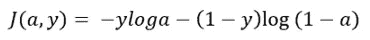

所有行的平均成本函数为:

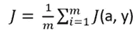

> 该模型的目的是降低成本函数值。
> 
> **梯度下降**

我们需要更新公式 1 中的变量 w 和 b。它将被初始化为零，但是它们需要在以后用更合适的值来更新。梯度下降将有助于这一点。让我们看看怎么做。

在公式 4 中，我们将成本函数表示为“a”和“y”的函数。但是它也可以表示为“w”和“b”的函数。因为‘a’是用‘w’和‘b’派生出来的。

“w”和“b”的微分公式将通过对“w”和“b”的成本函数进行偏导数来推导。

**公式 5 和公式 6**

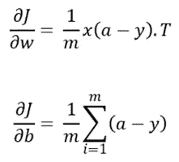

现在我们有了所有的公式，让我们把它们放在一个名为“propagate”的函数中:

```
def propagate(w, b, X, Y):
    #Find the number of training data
    m = X.shape[1]

    #Calculate the predicted output
    A = sigmoid(np.dot(w.T, X) + b)

    #Calculate the cost function 
    cost = -1/m * np.sum(Y*np.log(A) + (1-Y) * np.log(1-A))

    #Calculate the gradients
    dw = 1/m * np.dot(X, (A-Y).T)
    db = 1/m * np.sum(A-Y)

    grads = {"dw": dw,
            "db": db}
    return grads, cost
```

传播函数计算预测输出“A”、成本函数“cost”以及梯度“dw”和“db”。使用该函数，我们现在可以更新公式 1 中的“w”和“b”。这是下一步。

> ***优化参数以最佳拟合训练数据***

在这一步中，我们将更新这个模型的核心参数。“传播”功能将通过多次迭代运行。在每次迭代中，“w”和“b”将被更新。下面是一个完整的“优化”功能。**我解释了代码片段中的每一步。请仔细阅读。**

在这个函数中引入了一个新的术语学习率。那不是计算出来的值。对于不同的机器学习算法是不同的。尝试几种不同的学习速度，看看哪种效果最好。

```
def optimize(w, b, X, Y, num_iterations, learning_rate, print_cost = False):
    costs = []

    #propagate function will run for a number of iterations    
    for i in range(num_iterations):
        grads, cost = propagate(w, b, X, Y)    
        dw = grads["dw"]
        db = grads["db"]

        #Updating w and b by deducting the dw 
        #and db times learning rate from the previous 
        #w and b

        w = w - learning_rate * dw
        b = b - learning_rate * db

        #Record the cost function value for each 100 iterations        
        if i % 100 == 0:
            costs.append(cost)

    #The final updated parameters     
    params = {"w": w,
              "b": b}

    #The final updated gradients    
    grads = {"dw": dw,
             "db": db}

    return params, grads, costs
```

我们有优化参数的功能。这是预测输出的时间:

**每行代码的解释都嵌入在代码片段之间。请仔细阅读，以便更好地理解它。**

```
def predict(w, b, X):
    m = X.shape[1]

    #Initializing an aray of zeros which has a size of the input
    #These zeros will be replaced by the predicted output 
    Y_prediction = np.zeros((1, m))

    w = w.reshape(X.shape[0], 1)

    #Calculating the predicted output using the Formula 1 
    #This will return the values from 0 to 1
    A = sigmoid(np.dot(w.T, X) + b)

    #Iterating through A and predict an 1 if the value of A
    #is greater than 0.5 and zero otherwise
    for i in range(A.shape[1]):
        Y_prediction[:, i] = (A[:, i] > 0.5) * 1

    return Y_prediction
```

> ***最终型号***

将所有功能放在一起，最终的模型将如下所示:

```
def model(X_train, Y_train, X_test, Y_test, num_iterations = 2000, learning_rate = 0.5):

    #Initializing the w and b as zeros
    w, b = initialize_with_zeros(X_train.shape[0])    parameters, grads, costs = optimize(w, b, X_train, Y_train, num_iterations, learning_rate, print_cost)
    w = parameters["w"]
    b = parameters["b"]

    # Predicting the output for both test and training set 
    Y_prediction_test = predict(w, b, X_test)
    Y_prediction_train = predict(w, b, X_train)

    #Calculating the training and test set accuracy by comparing
    #the predicted output and the original output
    print("train accuracy: {} %".format(100 - np.mean(np.abs(Y_prediction_train - Y_train)) * 100))
    print("test accuracy: {} %".format(100 - np.mean(np.abs(Y_prediction_test - Y_test)) * 100))

    d = {"costs": costs,
         "Y_prediction_test": Y_prediction_test, 
         "Y_prediction_train" : Y_prediction_train, 
         "w" : w, 
         "b" : b,
         "learning_rate" : learning_rate,
         "num_iterations": num_iterations}

    return d
```

完整的逻辑回归模型准备好了！

> ***使用模型***

这是使用模型来看看它的效果如何的时候了。让我们将开始时准备的数据传递给模型:

```
d = model(train_x, train_y, test_x, test_y, num_iterations = 2000, learning_rate = 0.005)
```

输出:

```
train accuracy: 99.75 %
test accuracy: 99.5 %
```

精度不就是优秀吗！

从“model”函数中可以看出，我们的最终模型返回一个字典，其中包含成本、最终参数、预测输出、学习率和使用的迭代次数。让我们看看成本函数如何随着每个更新的“w”和“b”而变化:

```
plt.figure(figsize=(7,5))
plt.scatter(x = range(len(d['costs'])), y = d['costs'], color='black')
plt.title('Scatter Plot of Cost Functions', fontsize=18)
plt.ylabel('Costs', fontsize=12)
plt.show()
```

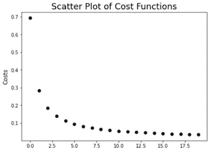

看，随着每一次迭代，成本函数都会下降。这意味着在每次迭代中，参数‘w’和‘b’都在不断完善。

## 结论

如果你能运行所有的代码并能理解其中的大部分，你就学会了逻辑回归是如何工作的！恭喜你！如果你还不能完全理解这个模型，我建议分解函数，单独运行每一行代码。那会让你有更好的想法。如果你有任何问题，欢迎在评论区提问。

欢迎在推特上关注我，喜欢我的脸书页面。

## 更多阅读

</a-full-length-machine-learning-course-in-python-for-free-f2732954f35f>  </a-complete-guide-to-confidence-interval-and-examples-in-python-ff417c5cb593>  </a-collection-of-advanced-data-visualization-in-matplotlib-and-seaborn-f08136172e14>  </all-the-datasets-you-need-to-practice-data-science-skills-and-make-a-great-portfolio-857a348883b5>  </how-i-switched-to-data-science-f070d2b5954c> 