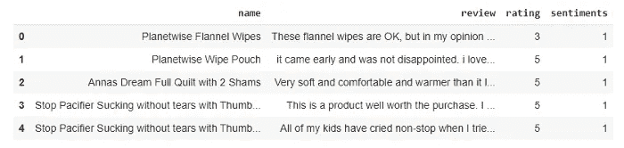
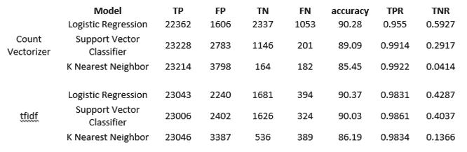

# 使用 Python 的 Scikit-Learn 的完整情感分析项目

> 原文：<https://towardsdatascience.com/a-complete-sentiment-analysis-project-using-pythons-scikit-learn-b9ccbb0405c2?source=collection_archive---------8----------------------->


[腾雅特](https://unsplash.com/@tengyart?utm_source=medium&utm_medium=referral)在 [Unsplash](https://unsplash.com?utm_source=medium&utm_medium=referral) 上拍摄的照片

## 比较 Python 中情感分析项目的两种不同矢量器和三种机器学习模型

情感分析是自然语言处理的重要组成部分之一。它不同于使用数字数据的机器学习，因为算法不能直接处理文本数据。它需要被转换成数字形式。因此，文本数据在输入机器学习模型之前会进行矢量化处理。矢量化有不同的方法。本文将使用两种类型的矢量器和三种机器学习模型来演示情感分析。

## 数据预处理

我正在为这个项目使用来自 Kaggle 的亚马逊婴儿产品数据集。如果你想继续，请随意从这个链接下载[数据集。](https://www.kaggle.com/sameersmahajan/reviews-of-amazon-baby-products)

原始数据集有三个特征:名称(产品名称)、评论(客户对产品的评论)和评级(客户对产品的评级，范围从 1 到 5)。评论栏将是输入栏，评级栏将用于了解评论的观点。以下是一些重要的数据预处理步骤:

1.  该数据集大约有 183，500 行数据。有 1147 个空值。我只需要去掉那些空值。
2.  由于数据集相当大，运行一些机器学习算法需要花费大量时间。因此，我在这个项目中使用了 30%的数据，仍然是 54，000 个数据。样本具有代表性。
3.  如果评分为 1 和 2，将被视为差评或负面评价。而如果评论是 3、4、5，那么该评论将被认为是好的评论或积极的评论。因此，我在数据集中添加了一个名为“情感”的新列，用 1 表示正面评价，用 0 表示负面评价。

> 也许我在一个块中放了很多代码。如果数量很多，请将其分解成小块，以便更好地理解。

下面是代码块，它导入数据集，抽取 30%的代表性样本，并添加新列“情感”:

```
import pandas as pd
df = pd.read_csv('amazon_baby.csv')#getting rid of null values
df = df.dropna()#Taking a 30% representative sample
import numpy as np
np.random.seed(34)
df1 = df.sample(frac = 0.3)#Adding the sentiments column
df1['sentiments'] = df1.rating.apply(lambda x: 0 if x in [1, 2] else 1)
```

这是数据集现在的样子。这是前 5 行数据:



## 情感分析

在开始情感分析之前，有必要定义输入特征和标签。这里只有一个特征，那就是‘回顾’。标签将是“情绪”。这个项目的目标是训练一个模型，如果一个评论是积极的或消极的，可以输出。

```
X = df1['review']
y = df1['sentiments']
```

首先，我将使用计数矢量化工具作为矢量化方法。本文将关注如何应用矢量器。所以，我不想谈细节。但是，如果您对矢量器完全陌生，请随意查看本文以了解更多关于计数矢量器的信息。

## 计数矢量器

我将使用一个计数矢量化工具对 review 列中的文本数据进行矢量化处理(本项目的训练特性)，然后使用 scikit-learn 模型中的三个不同的分类模型。之后，评估这个数据集上的模型，找出准确性、混淆矩阵、真阳性率和真阴性率。以下是步骤。

1.  第一步是将数据集分成训练集和测试集。
2.  向量化检查列之外的输入要素(训练和测试数据)
3.  从 scikit 学习库中导入模型。
4.  找到准确度分数
5.  找出真正的正利率和负利率。

现在，我将对三个不同的分类器重复相同的过程。这里使用的分类器是逻辑回归、支持向量机和 K 最近邻分类器。我将在本文结尾总结结果。

> **逻辑回归**

这是逻辑回归的代码块。我在代码之间使用了注释。

```
from sklearn.model_selection import train_test_split
X_train, X_test, y_train, y_test = train_test_split(X, y, 
                                        test_size = 0.5, random_state=24)from sklearn.feature_extraction.text import CountVectorizer
cv = CountVectorizer()#Vectorizing the text data
ctmTr = cv.fit_transform(X_train)
X_test_dtm = cv.transform(X_test)from sklearn.linear_model import LogisticRegression#Training the model
lr = LogisticRegression()
lr.fit(ctmTr, y_train)#Accuracy score
lr_score = lr.score(X_test_dtm, y_test)
print("Results for Logistic Regression with CountVectorizer")
print(lr_score)#Predicting the labels for test data
y_pred_lr = lr.predict(X_test_dtm)
from sklearn.metrics import confusion_matrix#Confusion matrix
cm_lr = confusion_matrix(y_test, y_pred_lr)tn, fp, fn, tp = confusion_matrix(y_test, y_pred_lr).ravel()
print(tn, fp, fn, tp)#True positive and true negative rates
tpr_lr = round(tp/(tp + fn), 4)
tnr_lr = round(tn/(tn+fp), 4)print(tpr_lr, tnr_lr)
```

如您所见，我有打印准确性、真阳性、假阳性、真阴性、假阴性、真阴性率和假阴性率的打印语句。

> **支持向量机**

我将重复与之前完全相同的过程来使用支持向量机。

```
from sklearn.model_selection import train_test_split
X_train, X_test, y_train, y_test = train_test_split(X, y, 
                                        test_size = 0.5, random_state=123)#Vectorizing the text data
cv = CountVectorizer()
ctmTr = cv.fit_transform(X_train)
X_test_dtm = cv.transform(X_test)from sklearn import svm#Training the model
svcl = svm.SVC()
svcl.fit(ctmTr, y_train)svcl_score = svcl.score(X_test_dtm, y_test)
print("Results for Support Vector Machine with CountVectorizer")
print(svcl_score)y_pred_sv = svcl.predict(X_test_dtm)#Confusion matrix
cm_sv = confusion_matrix(y_test, y_pred_sv)tn, fp, fn, tp = confusion_matrix(y_test, y_pred_sv).ravel()
print(tn, fp, fn, tp)tpr_sv = round(tp/(tp + fn), 4)
tnr_sv = round(tn/(tn+fp), 4)print(tpr_sv, tnr_sv)
```

我应该提醒你，支持向量机比逻辑回归需要更多的时间。

> **K 最近邻**

我将运行一个 KNN 分类器，得到和以前一样的评估矩阵。代码几乎是一样的。

```
from sklearn.model_selection import train_test_split
X_train, X_test, y_train, y_test = train_test_split(X, y, 
                                        test_size = 0.5, random_state=143)from sklearn.feature_extraction.text import CountVectorizer
cv = CountVectorizer()
ctmTr = cv.fit_transform(X_train)
X_test_dtm = cv.transform(X_test)from sklearn.neighbors import KNeighborsClassifier
knn = KNeighborsClassifier(n_neighbors=5)
knn.fit(ctmTr, y_train)knn_score = knn.score(X_test_dtm, y_test)
print("Results for KNN Classifier with CountVectorizer")
print(knn_score)y_pred_knn = knn.predict(X_test_dtm)#Confusion matrix
cm_knn = confusion_matrix(y_test, y_pred_knn)tn, fp, fn, tp = confusion_matrix(y_test, y_pred_knn).ravel()
print(tn, fp, fn, tp)tpr_knn = round(tp/(tp + fn), 4)
tnr_knn = round(tn/(tn+fp), 4)print(tpr_knn, tnr_knn)
```

KNN 分类器比支持向量机分类器耗时少。

至此，计数向量机方法的三个分类器就完成了。

## TFIDF 矢量器

接下来，我将使用 TF-IDF 矢量器。众所周知，这个矢量器是一个更受欢迎的矢量器，因为它使用了词的频率这一术语。请随意[查看本文](https://medium.com/@cmukesh8688/tf-idf-vectorizer-scikit-learn-dbc0244a911a)以了解关于 TF-IDF 矢量器的详细信息。

我将遵循与计数矢量器完全相同的过程。只有矢量器是不同的。但这不是问题。超级酷的 sklearn 库会照常打理计算部分。

> **逻辑回归**

使用 TF-IDF 矢量器进行逻辑回归的完整代码块:

```
from sklearn.model_selection import train_test_split
X_train, X_test, y_train, y_test = train_test_split(X, y, 
                                        test_size = 0.5, random_state=45)from sklearn.feature_extraction.text import TfidfVectorizer#tfidf vectorizervectorizer = TfidfVectorizer()X_train_vec = vectorizer.fit_transform(X_train)X_test_vec = vectorizer.transform(X_test)from sklearn.linear_model import LogisticRegressionlr = LogisticRegression()lr.fit(X_train_vec, y_train)lr_score = lr.score(X_test_vec, y_test)
print("Results for Logistic Regression with tfidf")
print(lr_score)y_pred_lr = lr.predict(X_test_vec)#Confusion matrix
from sklearn.metrics import confusion_matrix
cm_knn = confusion_matrix(y_test, y_pred_lr)tn, fp, fn, tp = confusion_matrix(y_test, y_pred_lr).ravel()
print(tn, fp, fn, tp)tpr_knn = round(tp/(tp + fn), 4)
tnr_knn = round(tn/(tn+fp), 4)print(tpr_knn, tnr_knn)
```

如你所见，除了矢量器部分，你可以重用之前的代码。

> **支持向量机**

除了矢量器之外，这也将是与前面的支持向量机相同的过程。

```
from sklearn.model_selection import train_test_split
X_train, X_test, y_train, y_test = train_test_split(X, y, 
                                        test_size = 0.5, random_state=55)vectorizer = TfidfVectorizer()
X_train_vec = vectorizer.fit_transform(X_train)
X_test_vec = vectorizer.transform(X_test)from sklearn import svm
#params = {'kernel':('linear', 'rbf'), 'C':[1, 10, 100]}
svcl = svm.SVC(kernel = 'rbf')
#clf_sv = GridSearchCV(svcl, params)
svcl.fit(X_train_vec, y_train)
svcl_score = svcl.score(X_test_vec, y_test)
print("Results for Support Vector Machine with tfidf")
print(svcl_score)y_pred_sv = svcl.predict(X_test_vec)#Confusion matrix
from sklearn.metrics import confusion_matrix
cm_sv = confusion_matrix(y_test, y_pred_sv)tn, fp, fn, tp = confusion_matrix(y_test, y_pred_sv).ravel()
print(tn, fp, fn, tp)tpr_sv = round(tp/(tp + fn), 4)
tnr_sv = round(tn/(tn+fp), 4)print(tpr_sv, tnr_sv)
```

和以前一样，这将比逻辑回归花费更多的时间。所以，这可能需要一些耐心。

> **K 个最近邻居**

这是最后一个。

```
from sklearn.model_selection import train_test_split
X_train, X_test, y_train, y_test = train_test_split(X, y, 
                                        test_size = 0.5, random_state=65)vectorizer = TfidfVectorizer()
X_train_vec = vectorizer.fit_transform(X_train)
X_test_vec = vectorizer.transform(X_test)from sklearn.neighbors import KNeighborsClassifier
knn = KNeighborsClassifier(n_neighbors=5)
knn.fit(X_train_vec, y_train)knn_score = knn.score(X_test_vec, y_test)
print("Results for KNN Classifier with tfidf")
print(knn_score)y_pred_knn = knn.predict(X_test_vec)#Confusion matrix
cm_knn = confusion_matrix(y_test, y_pred_knn)tn, fp, fn, tp = confusion_matrix(y_test, y_pred_knn).ravel()
print(tn, fp, fn, tp)tpr_knn = round(tp/(tp + fn), 4)
tnr_knn = round(tn/(tn+fp), 4)print(tpr_knn, tnr_knn)
```

## 结果

这里我总结了上面所有六个代码块的结果。



以下是一些重要的发现:

1.  总的来说，TF-IDF 矢量器给出的结果比 count 矢量器部分稍好。对于矢量器。
2.  考虑到整体准确性、真阳性率和真阴性率，逻辑回归是本项目使用的所有三个分类器中最好的。
3.  KNN 分类器似乎不适合这个项目。尽管真正的正利率看起来非常好，但真正的负利率看起来非常差。

## 结论

我已经做了这个项目作为我的课程的一部分，并决定分享它。您可能会奇怪，为什么每次我训练一个模型时，我都要将数据集分成训练和测试两部分。这是这门课的要求。这个想法是某个训练测试分割可能偏向某个分类器。因此，我必须在每个模型之前分割数据集。

欢迎在[推特](https://twitter.com/rashida048)上关注我，并喜欢我的[脸书](https://www.facebook.com/rashida.smith.161)页面。

## 更多阅读

[](/all-the-datasets-you-need-to-practice-data-science-skills-and-make-a-great-portfolio-74f2eb53b38a) [## 练习数据科学技能和制作优秀投资组合所需的所有数据集

### 大量不同种类的数据集

towardsdatascience.com](/all-the-datasets-you-need-to-practice-data-science-skills-and-make-a-great-portfolio-74f2eb53b38a) [](/pair-plot-and-pairgrid-in-details-f782975032ea) [## 详细的 Pair plot 和 PairGrid

### 用真实数据演示 Pandas 和 Seaborn 库中的配对图

towardsdatascience.com](/pair-plot-and-pairgrid-in-details-f782975032ea) [](/an-overview-of-performance-evaluation-metrics-of-machine-learning-classification-algorithms-7a95783a762f) [## 机器学习(分类)算法性能评价指标综述

### 开发一个分类模型和计算所有流行的性能评估指标使用…

towardsdatascience.com](/an-overview-of-performance-evaluation-metrics-of-machine-learning-classification-algorithms-7a95783a762f) [](/four-popular-feature-selection-methods-for-efficient-machine-learning-in-python-fdd34762efdb) [## Python 中高效机器学习的四种流行特征选择方法

### 使用真实数据集执行特征选择方法，并在每个方法后检索所选特征

towardsdatascience.com](/four-popular-feature-selection-methods-for-efficient-machine-learning-in-python-fdd34762efdb) [](https://pub.towardsai.net/a-complete-guide-to-confidence-interval-t-test-and-z-test-in-r-for-data-scientists-cd16dd2d0eec) [## 数据科学家置信区间、t 检验和 z 检验完全指南

### 大量的实践练习

pub.towardsai.net](https://pub.towardsai.net/a-complete-guide-to-confidence-interval-t-test-and-z-test-in-r-for-data-scientists-cd16dd2d0eec)