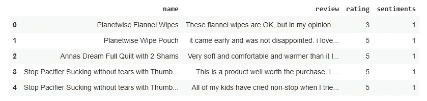
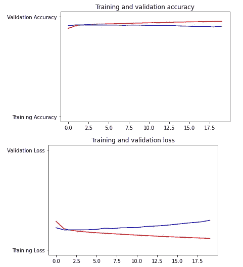

# 关于 Keras 和 Tensorflow 中情感分析的一步一步的完整教程

> 原文：<https://towardsdatascience.com/a-complete-step-by-step-tutorial-on-sentiment-analysis-in-keras-and-tensorflow-ea420cc8913f?source=collection_archive---------5----------------------->


马克·戴恩斯在 [Unsplash](https://unsplash.com?utm_source=medium&utm_medium=referral) 上的照片

## 用于数据准备、深度学习模型开发和训练网络的完整工作代码

情感分析是非常常见的自然语言处理任务之一。企业使用情感分析来有效地理解社交媒体评论、产品评论和其他文本数据。Tensorflow 和 Keras 是解决这个问题的绝佳工具。

Tensorflow 可以说是最受欢迎的深度学习库。它在幕后使用一个神经网络。它如此受欢迎的原因是，它真的很容易使用和工作相当快。甚至不知道神经网络如何工作，你就可以运行神经网络。尽管这很有帮助，如果你知道一些关于神经网络的基础知识。

Tensorflow 也有非常好的文档。所以，也很好学。如今，我们中的许多人都希望从事机器学习和深度学习，但害怕这可能需要非常高水平的编程解决问题技能。

是的，肯定需要有编程知识。但是因为有了 Tensorflow 这种很酷的库，如果你有中级的编程技能，就有可能致力于机器学习和深度学习问题。大多数专业数据科学家不会从头开始开发他们的算法。在行业层面上，使用这些库非常普遍。

本文结合一个项目重点介绍 TensorFlow 中一个简单的情感分析项目。请随意从以下链接下载数据集:

[](https://www.kaggle.com/sameersmahajan/reviews-of-amazon-baby-products) [## 亚马逊婴儿产品评论

### Kaggle 是世界上最大的数据科学社区，拥有强大的工具和资源来帮助您实现您的数据…

www.kaggle.com](https://www.kaggle.com/sameersmahajan/reviews-of-amazon-baby-products) 

这个数据集有三列。产品名称、评论和评级。review 列是包含客户评论的文本列，rating 列具有从 1 到 5 的数字评级。1 表示最差，5 表示最好。

## 从这篇文章中可以期待什么？

本文将提供:

1.  如何使用 TensorFlow 和 Keras 进行情感分析的分步说明
2.  完整的工作代码将在一些现实生活中的项目工作。
3.  参数说明
4.  一些资源来更好地理解参数

## 数据准备

在自然语言处理项目中，数据预处理是工作的一半。因为算法不理解文本。所以，我们需要将文本转换成算法可以理解的数字。

在处理文本之前，定义积极情绪和消极情绪也很重要。在这个数据集中，我们可以使用评级列来了解情绪。我们有从 1 到 5 的等级。因此，当评级为 1 或 2 时，该评论可被视为负面评论，而当评级为 3、4 或 5 时，则该评论可被视为正面评论。我们可以为负面情绪设置 0，为正面情绪设置 1。

```
df['sentiments'] = df.rating.apply(lambda x: 0 if x in [1, 2] else 1)
```

使用数据集上方的代码行添加“情绪”列后，如下所示:



下一步是像我们之前提到的那样对文本进行标记。为此将使用记号赋予器函数。默认情况下，它会删除所有标点符号，并将文本设置为以空格分隔的有序形式。每个单词通过 tokenizer 函数变成一个整数。让我们设置记号赋予器函数:

```
from tensorflow.keras.preprocessing.text import Tokenizerfrom tensorflow.keras.preprocessing.sequence import pad_sequencestokenizer = Tokenizer(oov_token="<OOV>")
```

这里，oov_token 的值被设置为“oov”。这意味着任何未知单词都将被 oov_token 替换。这是一个更好的选择，而不是抛出未知的单词。我们稍后将讨论“填充序列”。

> 分割数据集

我们将保留 80%的数据用于培训，20%用于测试目的。

```
split = round(len(df)*0.8)train_reviews = df['review'][:split]train_label = df['sentiments'][:split]test_reviews = df['review'][split:]test_label = df['sentiments'][split:]
```

我会格外小心地做一步。也就是把每个评论转换成一个字符串。因为万一有不是字符串格式的数据，我们稍后会得到一个错误。所以，我想多走一步。

```
import numpy as nptraining_sentences = []training_labels = []testing_sentences = []testing_labels = []for row in train_reviews:
    training_sentences.append(str(row))for row in train_label:
    training_labels.append(row)for row in test_reviews:
    testing_sentences.append(str(row))for row in test_label:
    testing_labels.append(row)
```

训练和测试集已经准备好了。一些重要的术语需要修正。我将在这段代码之后解释它们:

```
vocab_size = 40000embedding_dim = 16max_length = 120trunc_type = 'post'oov_tok = '<OOV>'padding_type = 'post'
```

在这里，vocab_size 40，000 意味着我们将采用 40，000 个唯一的单词来训练网络。嵌入维数 16 意味着每个单词将由 16 维向量表示。Max_length 120 表示每个评论的长度。我们将保留每个评论的 120 个单词。如果最初的评论超过 120 个单词，它将被截断。术语 trunc_type 设置为‘post’。因此，当评论超过 120 个单词时，评论将在最后被截断。另一方面，如果评论少于 120 个单词，它将被填充为 120 个单词。最后，padding_type 'post '意味着填充将应用于结尾，而不是开头。

现在，让我们从词汇化开始:

```
tokenizer = Tokenizer(num_words=vocab_size, oov_token=oov_tok)tokenizer.fit_on_texts(training_sentences)word_index = tokenizer.word_index
```

以下是 word_index 值的一部分:

```
{'<OOV>': 1,  
'the': 2,  
'it': 3,  
'i': 4,  
'and': 5,  
'to': 6,  
'a': 7,  
'is': 8,  
'this': 9,  
'for': 10,
```

看，每个单词都有一个整数值。现在，复习句子可以表示为一系列单词。下一个代码块将句子转换成单词序列，然后根据需要进行填充:

```
sequences = tokenizer.texts_to_sequences(training_sentences)padded = pad_sequences(sequences, maxlen=max_length, truncating=trunc_type)testing_sentences = tokenizer.texts_to_sequences(testing_sentences)testing_padded = pad_sequences(testing_sentences, maxlen=max_length)
```

数据处理在这里完成。现在，模型开发可以非常容易地完成。

## 模型开发

对于这个项目，' [keras。将使用顺序](https://keras.io/guides/sequential_model/)模式。请查看附加链接，了解有关“keras”的详细信息。连续的。我将解释如何在这类项目中使用它。模型如下:

```
model = tf.keras.Sequential([
    tf.keras.layers.Embedding(vocab_size, embedding_dim,       input_length=max_length), tf.keras.layers.GlobalAveragePooling1D(), tf.keras.layers.Dense(6, activation='relu'), tf.keras.layers.Dense(1, activation='sigmoid')])
```

第一层是嵌入层，其中所有的参数都已经在前面定义和解释过了。第二层是' GlobalAveragePooling1D()'展平矢量。最初，数据是三维的(批量大小 x 步骤 x 特征)。GlobalAveragePooling1D 制作(batch_size x features)。

第三层是密集层，其中使用了“relu”激活功能。您可以尝试“tanh”或您选择的任何其他激活功能。这一层称为隐藏层。我只用了一个隐藏层。随意尝试多个隐藏层。更复杂的问题可能需要更多的隐藏层。此外，我在隐藏层中使用了 6 个神经元。你可能想知道如何选择神经元的数量。

有很多关于这方面的文章。[这里有一篇简短的文章，简要地提供了一些见解](https://www.linkedin.com/pulse/choosing-number-hidden-layers-neurons-neural-networks-sachdev/)。

最后一层使用 sigmoid 激活函数或逻辑函数。

> 在隐藏层中，您可以使用“relu”或“tanh”激活函数，但分类问题中的最后一层总是 sigmoid 或 softmax 激活函数。

现在，编译模型:

```
model.compile(loss='binary_crossentropy', optimizer='adam', metrics=['accuracy'])
```

我选择二元交叉熵作为损失函数，因为这是一个概率损失。这里还描述了其他的[损失函数](https://keras.io/api/losses/)。我用优化器作为“亚当”。还有其他几个优化器函数，如 RMSProp、adadelta、adagrad、adamax 等等。以下是模型总结:

```
model.summary()
```

输出:

```
Model: "sequential"
_________________________________________________________________
Layer (type)                 Output Shape              Param #   
=================================================================
embedding (Embedding)        (None, 120, 16)           640000    
_________________________________________________________________
global_average_pooling1d (Gl (None, 16)                0         
_________________________________________________________________
dense (Dense)                (None, 6)                 102       
_________________________________________________________________
dense_1 (Dense)              (None, 1)                 7         
=================================================================
Total params: 640,109
Trainable params: 640,109
Non-trainable params: 0
_________________________________________________________________
```

如果您查看模型摘要，我们之前讨论的许多术语现在都有意义了。

让我解释一下。嵌入层显示三维。我们没有提到任何批量大小。这里，我们使用每个时期的整个数据集进行训练。每个评论中的 120 个单词，每个单词都表示为一个 16(我们之前选择的是这个 16)的元素向量。这意味着我们有 16 个特征。在全局平均池化之后，它变平了，我们只有批量大小(没有)和特性的数量。

## 训练模型

在训练模型之前，我们只需要将标签转换为数组。如果你注意到，它们是列表形式的:

```
training_labels_final = np.array(training_labels)testing_labels_final = np.array(testing_labels)
```

让我们开始训练“模型”。我将训练 20 个纪元的模型。

```
num_epochs = 20history = model.fit(padded, training_labels_final, epochs=num_epochs, validation_data=(testing_padded, testing_labels_final))
```

输出:

```
Epoch 1/20 
4589/4589 [==============================] - 40s 8ms/step - loss: 0.2849 - accuracy: 0.8831 - val_loss: 0.2209 - val_accuracy: 0.9094 Epoch 2/20 
4589/4589 [==============================] - 35s 8ms/step - loss: 0.2098 - accuracy: 0.9127 - val_loss: 0.1990 - val_accuracy: 0.9186 Epoch 3/20 
4589/4589 [==============================] - 36s 8ms/step - loss: 0.1931 - accuracy: 0.9195 - val_loss: 0.2000 - val_accuracy: 0.9177 Epoch 4/20 
4589/4589 [==============================] - 35s 8ms/step - loss: 0.1837 - accuracy: 0.9234 - val_loss: 0.1993 - val_accuracy: 0.9168 Epoch 5/20 
4589/4589 [==============================] - 35s 8ms/step - loss: 0.1766 - accuracy: 0.9264 - val_loss: 0.2013 - val_accuracy: 0.9163 Epoch 6/20 
4589/4589 [==============================] - 35s 8ms/step - loss: 0.1708 - accuracy: 0.9287 - val_loss: 0.2044 - val_accuracy: 0.9174 Epoch 7/20 
4589/4589 [==============================] - 36s 8ms/step - loss: 0.1656 - accuracy: 0.9309 - val_loss: 0.2164 - val_accuracy: 0.9166 Epoch 8/20 
4589/4589 [==============================] - 35s 8ms/step - loss: 0.1606 - accuracy: 0.9332 - val_loss: 0.2122 - val_accuracy: 0.9155 Epoch 9/20 4589/4589 [==============================] - 35s 8ms/step - loss: 0.1560 - accuracy: 0.9354 - val_loss: 0.2203 - val_accuracy: 0.9170 
Epoch 10/20 
4589/4589 [==============================] - 36s 8ms/step - loss: 0.1515 - accuracy: 0.9373 - val_loss: 0.2222 - val_accuracy: 0.9161 Epoch 11/20 
4589/4589 [==============================] - 35s 8ms/step - loss: 0.1468 - accuracy: 0.9396 - val_loss: 0.2225 - val_accuracy: 0.9143 Epoch 12/20 
4589/4589 [==============================] - 37s 8ms/step - loss: 0.1427 - accuracy: 0.9413 - val_loss: 0.2330 - val_accuracy: 0.9120 Epoch 13/20 
4589/4589 [==============================] - 36s 8ms/step - loss: 0.1386 - accuracy: 0.9432 - val_loss: 0.2369 - val_accuracy: 0.9131 Epoch 14/20 
4589/4589 [==============================] - 34s 7ms/step - loss: 0.1344 - accuracy: 0.9455 - val_loss: 0.2418 - val_accuracy: 0.9102 Epoch 15/20 
4589/4589 [==============================] - 36s 8ms/step - loss: 0.1307 - accuracy: 0.9470 - val_loss: 0.2487 - val_accuracy: 0.9073 Epoch 16/20 
4589/4589 [==============================] - 37s 8ms/step - loss: 0.1272 - accuracy: 0.9490 - val_loss: 0.2574 - val_accuracy: 0.9058 Epoch 17/20 
4589/4589 [==============================] - 36s 8ms/step - loss: 0.1237 - accuracy: 0.9502 - val_loss: 0.2663 - val_accuracy: 0.9009 Epoch 18/20 
4589/4589 [==============================] - 36s 8ms/step - loss: 0.1202 - accuracy: 0.9519 - val_loss: 0.2734 - val_accuracy: 0.9028 Epoch 19/20 
4589/4589 [==============================] - 36s 8ms/step - loss: 0.1173 - accuracy: 0.9536 - val_loss: 0.2810 - val_accuracy: 0.8978 Epoch 20/20 
4589/4589 [==============================] - 36s 8ms/step - loss: 0.1144 - accuracy: 0.9550 - val_loss: 0.2959 - val_accuracy: 0.9058
```

从上一个历元的结果可以看出，训练准确率为 95.5%，验证准确率为 90.58%。看起来有点太合身了。您可能想尝试更多的历元，看看精度是否会进一步提高。

我们可以绘制训练和验证的精确度，以及训练和验证的损失:

```
%matplotlib inlineimport matplotlib.pyplot as pltimport matplotlib.image as mpimgacc = history.history['accuracy']val_acc = history.history['val_accuracy']loss = history.history['loss']val_loss = history.history['val_loss']epochs=range(len(acc))plt.plot(epochs, acc, 'r', 'Training Accuracy')plt.plot(epochs, val_acc, 'b', 'Validation Accuracy')plt.title('Training and validation accuracy')plt.figure()plt.plot(epochs, loss, 'r', 'Training Loss')plt.plot(epochs, val_loss, 'b', 'Validation Loss')plt.title('Training and validation loss')plt.figure()
```



模型做好了。主要部分完成了。现在，如果您愿意，可以使用不同的其他绩效评估指标。

## 结论

这几乎是一个基本但有用的模型。你可以使用这个具有不同隐藏层和神经元的相同模型来解决自然语言处理中的相当多的问题。我还在文章中提供了更多的资源，可以用来改进或更改模型，并尝试不同的模型。随意用不同数量的隐藏层、神经元、激活函数、度量或优化器来改变模型，并进行尝试。那会给你很多学习经验。

请随时在 Twitter 上关注我。

## 更多阅读

[](/exploratory-data-analysis-of-text-data-including-visualization-and-sentiment-analysis-e46dda3dd260) [## 文本数据的探索性数据分析，包括可视化和情感分析

towardsdatascience.com](/exploratory-data-analysis-of-text-data-including-visualization-and-sentiment-analysis-e46dda3dd260) [](/four-popular-feature-selection-methods-for-efficient-machine-learning-in-python-fdd34762efdb) [## Python 中高效机器学习的四种流行特征选择方法

### 使用真实数据集执行特征选择方法，并在每个方法后检索所选特征

towardsdatascience.com](/four-popular-feature-selection-methods-for-efficient-machine-learning-in-python-fdd34762efdb) [](/an-overview-of-performance-evaluation-metrics-of-machine-learning-classification-algorithms-7a95783a762f) [## 机器学习(分类)算法性能评价指标综述

### 开发一个分类模型和计算所有流行的性能评估指标使用…

towardsdatascience.com](/an-overview-of-performance-evaluation-metrics-of-machine-learning-classification-algorithms-7a95783a762f) [](/exploratory-data-analysis-visualization-and-prediction-model-in-python-241b954e1731) [## Python 中的探索性数据分析、可视化和预测模型

### 在 Python 中使用 Pandas、Matplotlib、Seaborn 和 Scikit_learn 库

towardsdatascience.com](/exploratory-data-analysis-visualization-and-prediction-model-in-python-241b954e1731) [](/stochastic-gradient-descent-explanation-and-complete-implementation-from-scratch-a2c6a02f28bd) [## 随机梯度下降:从头开始的解释和完整实现

### 使用单个感知器

towardsdatascience.com](/stochastic-gradient-descent-explanation-and-complete-implementation-from-scratch-a2c6a02f28bd) [](/an-ultimate-cheatsheet-of-data-visualization-in-seaborn-be8ed13a3697) [## 用 Python 的 Seaborn 库实现数据可视化的终极指南

### 对学习者来说也是一个很好的资源

towardsdatascience.com](/an-ultimate-cheatsheet-of-data-visualization-in-seaborn-be8ed13a3697)