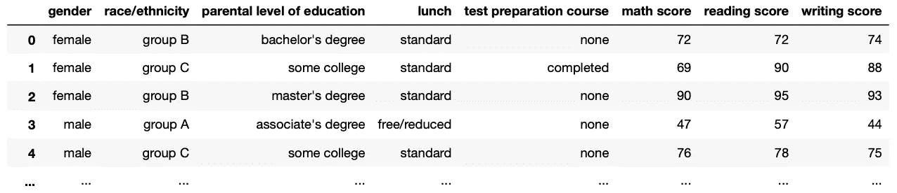
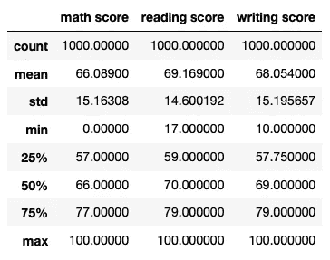
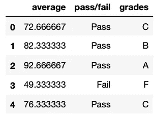
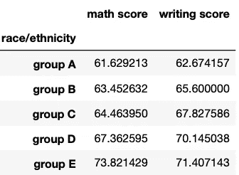
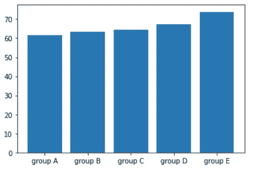

# 从 Excel 迁移到 Python 的完整而简单的指南

> 原文：<https://towardsdatascience.com/a-complete-yet-simple-guide-to-move-from-excel-to-python-d664e5683039?source=collection_archive---------0----------------------->

## 用熊猫和 Numpy 代替 Excel。


作者图片(Canva 上制作)

作为一个使用 Excel 多年的人，我知道在像 Python 这样的全新环境中学习 Excel/VBA 中已经可以做的事情听起来并不令人兴奋。然而，Python 环境提供的所有好处都使它物有所值。出于这个原因，我想出了一个有用而简单的指南，我希望当我从 Excel 转换到 Python 时就有了。

在本文中，我们将使用 Python 的 Pandas 和 Numpy 库来替换您过去可能使用的许多 Excel 函数。

```
**Table of Contents** 1\. [The Dataset](#4dc0)
2\. [Sum, Average, Max, Min, Count](#00e3)
 - [Columns (e.g. sum a column)](#0d49)
 - [Rows (e.g. sum a row)](#c754)
3\. [IF](#312b)
 - [Replace IF with np.where](#75c6)
 - [Replace nested IF with np.select](#f528)
4\. [SumIf, CountIf, AverageIf](#0a91)
 - [One condition (select a column with square brackets [ ] )](#7c86)
 - [Two or more conditions (select columns and use & or |)](#69f4)
5\. [Basic Data Cleaning](#0cbd)
 - [Change the case of text with .str.lower, .str.upper or .str.title](#b662)
 - [Extract text in a column with .str.extract](#64d6)
 - [Identify whether a cell is empty with the .isnull method](#e0a3)
6\. [Vlookup](#b306)
 - [Find an element with .loc[ ]](#071c)
 - [Merge two tables with pd.merge or pd.concat](#e97b)
7\. [Pivot Table](#09cd)
 - [Use the .pivot_table method](#ac65)
8\. [Replace Excel Graphs with Python’s Matplotlib or Seaborn](#d450)
```

# 数据集

在本指南中，我们将使用. csv 格式的 Excel 文件，这是处理数据集时通常使用的格式。该数据集由学生在各种科目中获得的分数组成，将帮助我们轻松地从 Excel 电子表格切换到 Python 的数据框架。你可以在 [Kaggle](https://www.kaggle.com/spscientist/students-performance-in-exams) 或者 my [Github](https://github.com/ifrankandrade/data_preprocessing.git) 上下载这些数据(查看数据集文件夹)。

从本指南开始，让我们导入 Pandas 和 Numpy 库。

```
import pandas as pd
import numpy as np
```

*注意:如果你没有在 Python 中安装那些库，你可以通过在你的终端或者命令提示符上写* `pip install pandas`和`pip install numpy` *来轻松安装。*

有了这个，我们就可以先看看数据了。为此，我们使用`pd.read_csv()`。确保 CSV 和 Python 脚本位于相同的位置(相同的路径)。

```
df_excel = pd.read_csv('StudentsPerformance.csv')
df_excel
```

一旦我们读取这个 CSV 文件，我们给它一个名字。在这种情况下，我将其命名为`df_excel`。df 代表 dataframe，它是读取 CSV 文件后给出的典型名称。运行下面的代码后，我们获得了下面的输出。



作者图片

这看起来类似于 Excel 电子表格，但在这种格式下，更容易争论数据。现在我将向你展示如何用 Python 来做一些你可能在 Excel 中用过的常用函数。

# 总和、平均值、最大值、最小值、计数

Excel 的常用函数可以很容易地替换为 Pandas 方法。让我们来看看。

## 列(例如，对一列求和)

如果我们想得到上面列出的大多数函数，我们使用`.describe()`方法。

```
df_excel.describe()
```



作者图片

如您所见，这样我们就可以得到所有数字列的计数、平均值、最大值和最小值。

但是，如果我们想要选择一个特定的行，我们首先用方括号`[ ]` 选择，然后使用我们需要的方法(`.sum()`、`.mean()`等)。).比如，我们来计算数学成绩的平均值。

```
In [1]: df_excel['math score'].mean()
Out [1]: 66.089
```

这些是你可以使用的一些其他方法。

```
df_excel['math score'].mean()
df_excel['math score'].max()
df_excel['math score'].min()
df_excel['math score'].count()
```

## 行(例如，对一行求和)

现在，假设我们要计算 3 个分数(数学、阅读和写作)的平均值。这些值在不同的列中，所以我们有两个选项。我们可以对每列求和

```
df_excel['average'] = (df_excel['math score'] + df_excel['reading score'] + df_excel['writing score'])/3
```

或者使用我们之前使用的方法对一列中的值求和，但是在这种情况下，我们添加了`axis=1`

```
df_excel['average'] = df_excel.mean(axis=1)
```

在计算平均值时，我们还添加了一个新列`[‘average’]`。我们将在下一节使用这个新专栏(`IF`)。

请记住，在这个示例中，我们可以使用第二个选项，因为只有数字值在所需的列中(数学、阅读和写作分数)。如果有一个额外的列我们不想在总和中考虑，我们应该只使用第一个选项。

如果我们想计算一列中特定数据的数量，我们可以使用`.value_counts()`方法

```
In [2]: df_excel['gender'].value_counts()
Out [2]: 
female    518
male      482
```

# 如果

我们可以通过使用 Numpy 轻松替换 Excel 的 IF 函数。

## 将 IF 替换为 np.where

假设我们想知道一个学生是否通过了考试，并用这些信息创建一个新的列。我们可以通过下面的代码轻松做到这一点。

```
df_excel['pass/fail'] = np.where(df_excel['average'] > 70, 'Pass', 'Fail')
```

如你所见,`np.where()`需要 3 个参数——条件，条件为真时的值，条件为假时的值。

## 用 np.select 替换嵌套 IF

假设我们希望根据获得的分数给出从 A 到 F 的分数。在这种情况下，我们有 2 个以上的值，所以我们使用`np.select()`

`np.select()` needs to arguments——一个条件列表和一个值列表。Python 中的列表由方括号`[ ]`表示

```
conditions = [
    (df_excel['average']>=90),
    (df_excel['average']>=80) & (df_excel['average']<90),
    (df_excel['average']>=70) & (df_excel['average']<80),
    (df_excel['average']>=60) & (df_excel['average']<70),
    (df_excel['average']>=50) & (df_excel['average']<60),
    (df_excel['average']<50),
]values = ['A', 'B', 'C', 'D', 'E', 'F']
```

**请记住，每个条件都应该在括号内。**现在我们使用`.select()`方法，并将其分配给一个新的`[‘grades’]`列。

```
df_excel['grades'] = np.select(conditions, values)
```

现在输出的前 5 行应该是这样的。



作者图片

我们挑选了这 3 列，用双方括号`df_excel[[`‘平均’，‘通过/失败’，‘等级’`]]` ，前 5 行可以用`.head()` 方法显示。

<https://medium.datadriveninvestor.com/how-to-start-making-money-coding-even-if-you-have-no-experience-3b114cf7c649>  

# SumIf，CountIf，AverageIf

在 Python 中，为了基于条件求和、计数或计算平均值，我们首先过滤掉值，然后进行计算。

## 一个条件(用方括号[ ]选择一列)

假设我们只想对女性的分数求和。为此，首先，我们编写条件`df_excel[‘gender’] == ‘female’` ,然后。我们使用方括号`[ ]`来选择`df_excel`框架中的条件

```
df_female = df_excel[df_excel['gender'] == 'female']
```

我们只选择了女性，并将其放入一个名为`df_female`的数据框中。现在，我们可以执行我们在“总和、平均值、最大值、最小值、计数”一节中看到的任何计算。

## 两个或更多条件(选择列并使用&或|)

如果我们有两个或更多的条件，代码看起来将与上面的类似，但有一些变化。假设我们想要计算 B 组`(‘race/ethnicity’)`中女性的分数

```
df_sumifs = df_excel[(df_excel['gender'] == 'female') & (df_excel['race/ethnicity'] == 'group B')]
```

因为我们可以使用两个条件&分别代表和/或。**请记住，每个条件都应该在括号**内。

现在让我们把分数加起来。

```
df_sumifs = df_sumifs.assign(sumifs = df_sumifs['math score'] + df_sumifs['reading score'] + df_sumifs['writing score'])
```

在这种情况下，我使用了`.assign()` 方法向您展示了在进行计算时创建新列的另一种方法。

# 基本数据清理

我们将检查一些用于数据清理的方法。如果您想了解所有用于清理数据的方法，请查看我写的关于如何在 Python 中清理和准备数据的完整指南。

</a-straightforward-guide-to-cleaning-and-preparing-data-in-python-8c82f209ae33>  

我们将继续使用我们之前定义的`df_excel`框架。

## 更改带有. str.lower、. str.upper 或. str.title 的文本的大小写

要访问包含在列中的字符串，我们使用`.str`，然后我们可以用下面的代码改变文本的大小写

```
df_excel['gender'].str.title()
df_excel['gender'].str.upper()
df_excel['gender'].str.title()
```

为了保存这些值，我们可以覆盖一个列，如下面的代码所示。

```
df_excel['gender'] = df_excel['gender'].str.title()
```

但是在这种情况下，我们将保持值不变。

## 用. str.extract 提取列中的文本

我们可以很容易地用`.str.extract`从一个列中提取文本。除此之外，如果我们想提取文本的特定模式，我们可以使用正则表达式。

假设我们只想提取列`‘race/ethnicity’`中的大写单词(例如，“B 组”中的“B”)。为此，我们编写以下代码。

```
df_excel['race/ethnicity'].str.extract(r'([A-Z])')
```

在这种情况下，我们使用正则表达式`r'([A-Z])’` ，其中`[A-Z]`表示大写的单词，而括号`()` 是选择所需模式所必需的。正则表达式可能看起来吓人，但它们比你想象的要简单。在下面的链接中，你会发现我为轻松学习正则表达式而制作的简单指南。

</a-simple-and-intuitive-guide-to-regular-expressions-404b057b1081>  

## 属性标识单元格是否为空。isnull 方法

为了替换 Excel 的 COUNTA，在 Python 中我们可以使用`.isnull()`来查找空值。

```
df_excel[df_excel['gender'].isnull()]
```

在这种情况下，没有空值，因此结果将是一个空数据帧。

# 纵向查找函数

为了像 Vlookup 在 Excel 中那样查找元素，我们将根据我们想要解决的问题使用`.loc[]`、`.merge()`或`.concat()`。

仅对于这些示例，我们将使用 2 个 Excel 电子表格。第一个是我们到目前为止一直在处理的“学生表现”，而第二个是我用随机的`id`和`language score` 值创建的名为“LanguageScore”的 CSV 文件(你可以在我的 [Github](https://github.com/ifrankandrade/data_preprocessing.git) 上找到这个文件)。让我们像以前一样用`pd.read_csv()` 读取两个文件。

```
excel_1 = 'StudentsPerformance.csv'
excel_2 = 'LanguageScore.csv'df_excel_1 = pd.read_csv(excel_1)
df_excel_2 = pd.read_csv(excel_2)
```

现在我们将在`df_excel_1` 上创建一个`id`列，这样它就有了一个与`df_excel_2`相同的列。为此，我们运行以下代码。

```
df_excel_1 = df_excel_1.reset_index()
df_excel_1 = df_excel_1.rename(columns={'index':'id'})
```

如您所见，我基于索引创建了一个`id`列。`reset_index()` 通过将索引添加为列来删除索引。您可以删除索引做`.reset_index(drop=True)` ，但是在这种情况下，我将使用`.rename()`方法重命名这个新的`index`列。这样，我们就有了一个新的`id`列。

## 用查找一个元素。位置[ ]

使用 Pandas 查找元素就像在`[]` 中编写`.loc[] .`一样简单，我们必须包含行和列标签。Ler 找到与第 100 行相关的信息。

```
In [3]: df_excel_1.loc[100, ]
Out [3]:id                                      100
gender                                 male
race/ethnicity                      group B
parental level of education    some college
lunch                              standard
test preparation course                none
math score                               79
reading score                            67
writing score                            67
```

我们也可以设定条件。例如，我们想得到学生的数学成绩，其中`id`等于 100。

```
In [3]: df_excel_1.loc[df_excel_1['id']==100, 'math score']
Out [3]:
100    79
Name: math score, dtype: int64
```

这意味着得到 100 分的学生在数学上得到 20 分。

## 用 pd.merge 或 pd.concat 合并两个表

假设您想将所有参加考试的学生的语言成绩相加。在这种情况下，我们使用`pd.merge()`。这要求两个表有一个公共列。在这种情况下，该列是`id`列。

```
df_excel_3 = pd.merge(df_excel_1, df_excel_2, on='id', how='left')
df_excel_3['language score'].fillna('0', inplace=True)
```

上面你可以看到需要另一个参数`(how)`。这表明合并是如何执行的。左右会有`df_excel_1`和`df_excel_2`作为最终结果的参考，而`inner` 只会给出`id`栏内的常用数据。

您也可以使用`pd.concat()`达到同样的目的，但是您必须在连接帧之前将`id`设置为索引，并将帧作为列表包含在内(在括号`[]`内)

```
df_excel_3 = pd.concat(
 [df_excel_1.set_index('id'), df_excel_2.set_index('id')], axis=1
)
df_excel_3['language score'].fillna('0', inplace=True)
df_excel_3
```

所有不匹配的值都会收到一个 NaN，但是我们可以通过使用`.fillna()`方法用任何值替换它。

# 数据透视表

## 使用。数据透视表方法

Pandas 的 pivot_table 方法与 Excel 中的方法类似。

假设我们想要获得`race/ethnicity` 列中所有组的数学和写作分数。

```
df_excel = pd.read_csv('StudentsPerformance.csv')df_pivot = df_excel.pivot_table(index='race/ethnicity', values=['math score', 'writing score'], aggfunc='mean')
df_pivot
```

`index`参数将对`‘race/ethnicity’` 列进行分组，而`values`参数将显示数值。最后，由`aggfunc`进行计算。在这种情况下，我们选择平均值。结果，我们得到下面的数据透视表。



作者图片

# 用 Python 的 Matplotlib 或 Seaborn 替换 Excel 图表

Python 包含不同的库，使得可视化效果和 Excel 提供的一样好。

让我们根据上面创建的`df_pivot` 的结果制作一个简单的柱状图。首先，我们导入`matplotlib` ，然后我们使用`plt.bar()`

```
import matplotlib.pyplot as pltdf_plot = df_pivot.reset_index()
plt.bar(df_plot['race/ethnicity'], df_plot['math score'])
plt.show()
```

`plt.bar()` 的第一个参数是标签，第二个是数值。然后我们用`plt.show()`显示结果



作者图片

在 Python plot 中可以做很多事情，比如给图形添加标签、标题、定制图形的大小和颜色，但这是一个全新的主题。我已经用 Python 制作了一个漂亮的可视化指南，包括线图、条形图、饼状图、直方图、箱线图等。请点击下面的链接查看。

</a-simple-guide-to-beautiful-visualizations-in-python-f564e6b9d392>  

*就是这样！现在您已经准备好利用 Python 和 Pandas 提供的所有好处了！本文使用的所有代码在我的* [*Github*](https://github.com/ifrankandrade/data_preprocessing.git) *上都有。*

<https://frankandrade.ck.page/bd063ff2d3>****】与 3k+人一起加入我的电子邮件列表，获取我在所有教程中使用的 Python for Data Science 备忘单。****

**下面是我看的学习 Python 的书单。**

**<https://betterprogramming.pub/4-python-books-i-read-as-a-self-taught-programmer-5a5453840cdb>  

一旦你掌握了熊猫，这里有一些你可以开始的项目。

<https://medium.datadriveninvestor.com/i-used-to-pay-180-yr-for-a-profitable-betting-tool-this-year-i-built-one-in-python-dda1a9b9581f>  <https://medium.datadriveninvestor.com/make-money-with-python-the-sports-arbitrage-project-3b09d81a0098>  </a-simple-guide-to-automate-your-excel-reporting-with-python-9d35f143ef7>  

我还做了一个指南，帮助你建立你的第一个机器学习模型。

</a-beginners-guide-to-text-classification-with-scikit-learn-632357e16f3a> **