# 细胞神经网络维度的可理解解释

> 原文：<https://towardsdatascience.com/a-comprehensible-explanation-of-the-dimensions-in-cnns-841dba49df5e?source=collection_archive---------2----------------------->

## [实践教程](https://towardsdatascience.com/tagged/hands-on-tutorials)

## 解释卷积核/滤波器与其输入和输出数组之间的关系

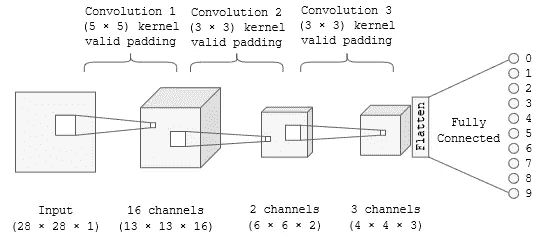

图 1:卷积神经网络的典型架构(自己的创造，灵感来自[1])

如果已经有很多文章涉及这个主题，为什么还要写一篇关于卷积神经网络(CNN)的解释呢？-因为在许多解释中，关于计算卷积层输出深度的关键信息缺失。这种信息的缺乏是一个巨大的障碍，特别是对于初学者来说。
当我了解 CNN 时，我开发了一个分步程序，帮助可视化卷积层，并可靠地计算它们的输出形状。本文介绍了这种方法。在这里，我假设 CNN 对你来说并不完全陌生，而是你正在学习它们。因此，我将额外回答几个在学习 CNN 时经常出现的问题。

**准备:问题的定义。**
图 1 显示了一个典型的 CNN 架构的可视化方案。关于这一点，这里有一个简短的任务:请精确定义图 1 中的哪些图形元素属于卷积层，哪些不属于卷积层。

正如您可能已经注意到的，CNN 的架构不是通过卷积层来可视化的，而是通过卷积层生成的输入和输出数组来可视化的。为了澄清这一点，图 1 中 CNN 的最后一个卷积层及其输入和输出数组在图 2 中用彩色显示。在这里，所有属于卷积层的图形元素都突出显示为蓝色，而属于卷积层的输入和输出的图形元素都突出显示为橙色。

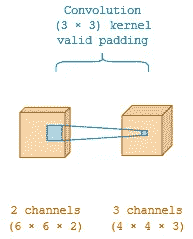

图 2:CNN 架构的图层(蓝色)和特征地图(橙色)的彩色化[图片由作者创建，如下图所示]

在图 2 中，两个橙色“模块”之间的蓝色连接是卷积层的示意图。这意味着卷积层本身的形状是不可见的。只有输入和输出数组的形状(=维数)用图形表示。(橙色)输入和输出阵列的这种块状表示可能会误导人们认为它们代表卷积层——但这是**而不是**的情况！
相反，在蓝色连接的“位置”上，多个卷积核(或“过滤器”，只是“核”的不同单词)被应用于输入数组。每个内核生成一个特征映射数组(如何完成，在下面的步骤 3 中解释)。卷积层是应用于输入和输出阵列之间的所有内核的串联。
因此，卷积层是一个多维数组，提供了输入数组到输出数组的变换。因此，将内核表示为一个类似块的对象，即输入和输出形状，会更加直观(图 3):

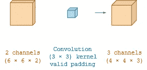

图 3:卷积层(蓝色)及其输入和输出数组(橙色)的图形“块状”表示(请与图 2 进行比较)

因为内核是一个数组，所以输入数组、输出数组和内核数组的形状可以相互推断。如果两个数组的形状以及参数“padding”和“stride”已知，则可以计算第三个数组的形状。为了进行这种计算，必须理解所有三个阵列的形状和影响它们的参数之间的关系。

**第一步:了解不同参数对输出数组形状的影响。**

为了更好地理解卷积核和它们的输入输出数组之间的关系，画出它们是非常有帮助的。除了图 3 之外，我建议将空间维度写在它们所属的图形元素旁边(图 4)。

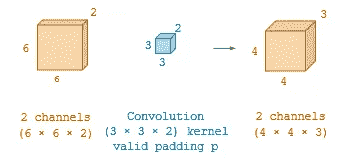

图 4:与图 3 所示相同的卷积层(蓝色),包括其输入和输出数组(橙色),在图形中的相应位置添加了空间参数。

所有数组都由宽度(wᵢ=6 表示输入数组，wₖ=3 表示内核数组，wₒ=4 表示输出数组)、高度(hᵢ=6、hₖ=3 和 hₒ=4)和深度(dᵢ=2、dₖ=2 和 d = 3)来描述。可以使用术语“通道”或“特征图”来代替术语“深度”。为了更好地理解，在图 5 中显示了一个通用的表示。

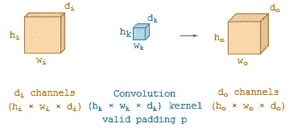

图 5:可视化卷积层(蓝色)及其输入和输出数组(橙色)的替代方法

但是有两个额外的参数会影响输出形状:

1.零填充 p:这是在应用内核时，在输入数组的边界上添加包含值 0 的额外像素。在图 4 的例子中，没有从图 1 中的信息“有效填充”导出的零填充，意味着填充值为 0。因为零填充在图像周围添加了一个人工的“零边界”，所以我建议将其表示为内核数组周围的虚线边界(图 6)。

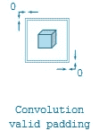

图 6:内核数组块周围的虚线边框的零填充示意图

2.内核沿着输入数组的步数。在这个例子中，内核的步幅是 2。图 1 中没有明确提到这个值。但是该值可以从所有先前描述的形状中推断出来。该过程的细节在下面的步骤 2 中描述。为了将 s=2 时的步幅包含在表示中，我建议将其添加为内核数组旁边的向右和向下的箭头(图 7)。在这种情况下，假设沿两个轴的步幅(意味着“向右”和“向下”)相等。

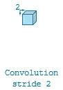

图 7:内核步幅的示意图，用向右下方的箭头表示

这两个参数都是卷积层的属性。它们都可以很容易地包含在其图形表示中(图 8)。

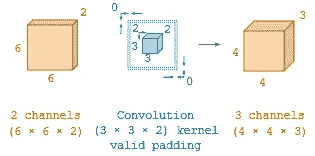

图 8:卷积层(蓝色)及其相应的输入和输出数组(橙色)的图示

这种可视化的一般表示如图 9 所示。

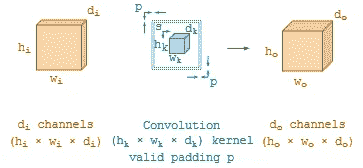

图 9:卷积层(蓝色)的广义表示，包括计算输入和输出所需的所有维度，以及输入和输出的广义维度。

如果您想要计算卷积层的输出形状，您需要输入数组和内核数组的所有参数，如图 9 所示。为了便于理解，让我们介绍一个输入数组(图 10)和内核数组(图 11)的数值示例，我们随后将为其计算输出形状。

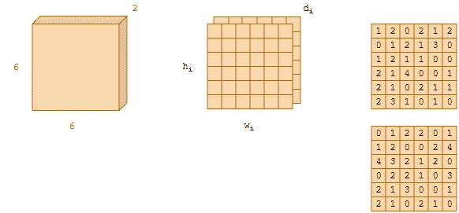

图 10:表示输入数组的不同可能性(包括一个数字示例)

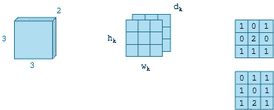

图 11:表示内核数组的不同可能性(包括一个数字示例)

正如您在图 10 中看到的，深度(=所有通道)描述了一个数组中特征图的数量。

**第二步:计算输出数组的宽度和高度。**

图 11 的上卷积核在图 10 的上输入阵列上的应用如下图 12 所示。如此图所示，输出图像的宽度和高度是 2 个像素。因此，原因是卷积核使用四个步骤来覆盖输入数组。当覆盖输入阵列的一个扇区时，执行输入阵列和内核阵列之间的逐元素乘法，并将结果加到一个值。

提示:对于后面的图，提供了更长的解释。为了避免烦人的滚动，我建议你再次打开这个网站，将图 12(或随后的图，分别)放在你正在阅读的文本旁边。

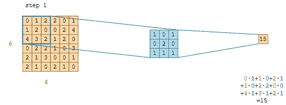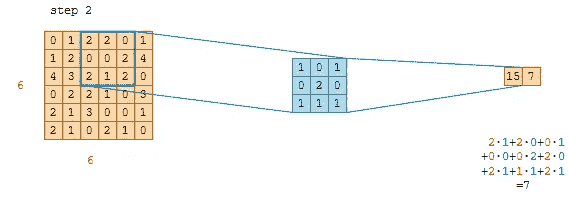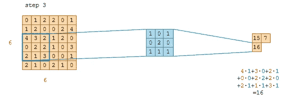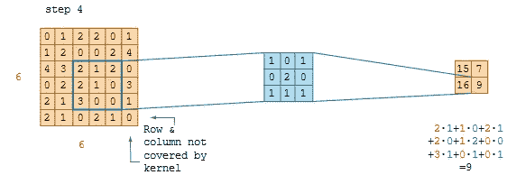

图 12:一个输入阵列上的一个卷积阵列的步骤

此外，在输入数组的边界没有使用零填充。因此，最低行和最后一列没有被卷积阵列覆盖。包含在这一行和这一列中的信息不会被传送到随后的输出数组中。这个过程也在等式 1 中进行数学描述，通过等式 1 计算输出宽度 wₒ和输出高度 hₒ。[2]

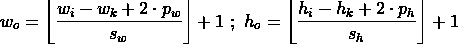

等式 1:卷积层的宽度和高度的计算。“向下”步幅和“向下”填充由 pₕ和 sₕ描述，而填充和步幅“向右”由 pᵥᵥ和 sᵥᵥ.描述[2]

在等式 1 中，假设输入阵列(hᵢwᵢ)、核心阵列(hₖwₖ)和输出阵列(hₒwₒ)的宽度和高度的不同空间维度。另外，沿着宽度和高度的不同尺寸的步幅(sᵥᵥ和 sₕ)和不同尺寸的填充(pᵥᵥ和 pₕ)也被假定。通常，使用所有二次阵列，因此，计算被连接成一个等式 2:

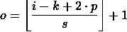

等式 2:如果输入阵列和核心阵列是二次的，则计算输出形状。o 是输出数组的宽度或高度，I 是输入数组的宽度或高度，k 是内核的宽度或高度，s 是内核向右或向下的步幅，p 是沿“水平”输入数组边界或“垂直”输入数组边界的填充。[2]

等式 2 的商的结果总是四舍五入。这在数学上用底函数来表示。提示:这些“左括号”很容易被误认为是方括号。不要犯这个错误！

*—如果内核不“适合”输入数组—*
通过对结果进行四舍五入，以数学方式描述了边界上多余行和列的“丢弃”。这意味着，如果具有特定步幅的内核不适合输入数组，结果会生成一个浮点值。因为输入数组的剩余像素不影响输出数组，所以结果被四舍五入。
对于图 12 所示的示例，等式 2 显示了插入了数值的等式 1:

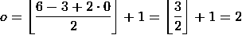

等式 3:计算图 12 所示卷积层的宽度和高度。

丢弃剩余像素的行为可以通过应用填充来省略。如果在顶部、底部、左边界和右边界应用一个像素的填充，内核将覆盖输入数组的所有值(图 13)。

图 13:输入数组的所有边界上的零填充。

但是根据等式 3，在这个过程中仍然有一行和一列像素丢失。与之前的丢弃相比(图 12)，只丢弃了补零的值，这不会导致信息丢失。

*—非对称填充—*
像素的添加，结果是被丢弃，看起来没什么用。对于这些情况，可以在输入阵列的边界仅添加一行和一列像素(图 14)。因此，等式 1 必须改变(等式 4):在等式 1 中，通过将填充值乘以 2 来悄悄地假定填充的对称性。如果使用非对称填充，则必须分别在图像的顶部和底部以及右侧和左侧插入:

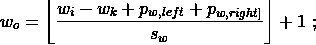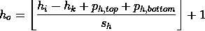

等式 4:用于不对称填充的修改的等式 1

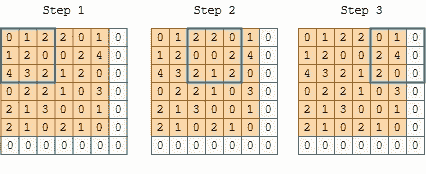

图 14:在输入数组的右边和底部边界填充零。

*—输入数组像素的覆盖范围—*如图 12 所示，输入贴图的像素经常被内核不同地覆盖，这取决于内核的大小及其步长。图 15 示出了图 12 的上部输入阵列的内核覆盖的数量。绿色标记的像素被卷积核覆盖 4 次。因此，与仅被覆盖一次或两次的像素相比，它对随后的输出阵列具有更大的影响。因此，被更频繁覆盖的像素对输出阵列的影响比被较不频繁覆盖的像素更大。

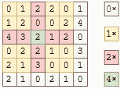

图 15:图 12 的上部输入阵列的内核覆盖的图形表示，具有(3×3)-内核和沿宽度和高度的步长 2。灰色像素被卷积核覆盖零次并被丢弃。卷积核覆盖黄色像素一次，覆盖红色像素两次，覆盖绿色像素四次。

**第三步:计算输出数组的深度**

要计算卷积层的深度及其输入数组，你得知道一个简单的规则:**输入数组的深度和内核数组的深度必须永远相等**。内核通道(=内核数组中的单个二维数组)必须与输入数组中的通道(特征映射)一样多。原因如图 16 所示:

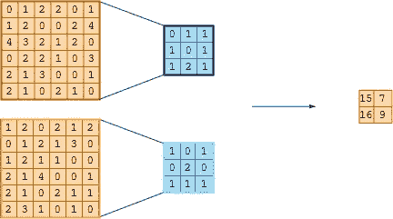

图 16:将内核通道分配给相应的输入通道。两个内核通道形成内核数组，两个输入通道形成输入数组。

我们希望为每个输入通道使用特定的内核通道，因为对输入阵列的第一个二维通道有用的内核可能对输入阵列的其他通道完全无用。**因此，每个输入通道使用其“自己的”二维内核通道**。因此，对于每个输入通道，内核恰好包含一个二维内核通道。所有内核通道相互堆叠，形成完整的“卷积层”。
提示:输入通道和内核通道的所有对都会影响输出数组结果的每个像素。在图 16 中，上面的输入内核对生成了输出数组的上面的像素。但这是**而不是**的情况！输出阵列的每个像素都受到所有输入通道和所有内核通道的影响。
为了理解输入数组和内核数组对输出数组的影响，让我们在图 17 中扩展图 8 和图 9 的“绘图方法”:

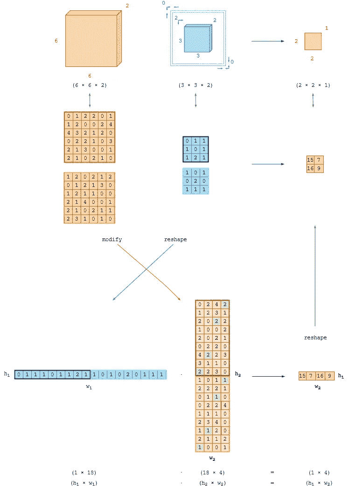

图 17:单内核卷积运算。根据特定值在该矩阵中出现的频率，修改后的输出矩阵的值被着色。黄色值出现一次，红色值出现两次，绿色值出现四次。

图 17 显示了卷积层在输入阵列上的应用可以表示为两个阵列之间的矩阵乘法。为了执行这个矩阵乘法，输入数组和内核数组的维数必须减少到二维。在这一点上，理解阵列的形状不是固定的是很重要的。每当需要执行计算时，可以对数组进行整形。唯一的限制是不能丢失计算所需的信息。

想象两个矩阵 1 和 2。在这些矩阵之间，应该执行乘法。矩阵由它们的行数和列数来描述。为了连接到数组块的示例，矩阵列的数量是与数组的宽度 w 相同的参数。矩阵的行数与数组的高度 h 相同。因此，矩阵 1 的形状是(h₁ x w₁)，矩阵 2 的形状是(h₂ x w₂).)要执行矩阵乘法(等式 W)，第一个矩阵的宽度必须等于第二个矩阵的高度。

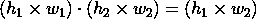

等式 5:如果 w₁ = h₂，则矩阵乘法

因为参数 w₁和 h₂必须相等，所以它们提供了内核数组和输出数组之间的连接。两个数组都必须转换成这个大小。
应用于输入映射时，每一步都包含完整的卷积核。因此，将矩阵乘法定位在核上是有帮助的。参数 w₁的数值由内核的大小提供。首先，内核通道变平，如图 17 所示。因此，内核的宽度 wₖ、高度 hₖ和深度 dₖ被连接成一个向量(等式 6):

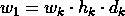

等式 6:计算“扁平”内核的宽度

对于所呈现的示例,“展平的”内核的宽度是 18，这导致 18 维向量(6A 方程):

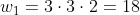

方程 6A:本例中“展平”内核的宽度

如果内核的宽度 w₁是 18，第二矩阵的高度 h₂也是 18。结果，这些值被插入到等式 5A 中:

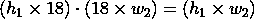

等式 5A:带有插入参数的等式 5w₁=h₂= 18

因为我们使用了一个内核通道，所以第一个矩阵的高度 h₁是 1(下一个例子中给出了使用多个内核数组时会发生什么)。因此，等式 5B 示出了将 h₁ = 1 插入等式 5A:

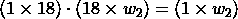

等式 5B:插入参数 h₁ = 1 的等式 5A

通过等式 5B，我们知道我们的输出阵列将具有
1 像素的高度。
最后一个参数 w₂是输出矩阵的宽度。该值由输出数组的宽度 wₒ和高度 hₒ获得。幸运的是，我们已经在第 2 步中计算了这些值。因为高度 h₁将数组的高度限制为 1，所以 wₒ和 hₒ这两个值通过相乘连接在一起，得到维度 w₂(等式 6B)。

等式 6B:矩阵乘法的输出形状的计算

这个结果被插入到等式 5B 中，得到等式 5C。我们看到输出矩阵的高度为 1 像素，宽度为 4 像素。

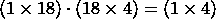

等式 5C:插入参数 w₂ = 4 的等式 5B

内核数组可以简单地展平成(1 x 18)的形状。相反，输入图像阵列到形状(18×4)的变换不可能通过整形来实现。还记得图 15 吗，它显示了内核覆盖的像素的频率。这个覆盖率必须在
(18×4)数组中表示。被内核覆盖一次的每个值在(18 x 4)-数组中只出现一次。同样，被覆盖两次的每个值在数组中出现两次，被覆盖四次的每个值在数组中出现四次。因此，修改后的输入数组的值根据该值在该矩阵中出现的频率而被着色。黄色值出现一次，红色值出现两次，绿色值出现四次。请注意，数组中不再有“灰色”值。这意味着这个“修改的”输入数组只包括卷积核覆盖的值。
总之，**为了实现矩阵乘法所需的矩阵维数，输入图像阵列不是被整形而是被修改。** 如果两个数组都是正确的形状，则执行矩阵乘法并产生一个(1 x 4)向量。我们已经知道，输出数组的高度 hₒ和宽度 wₒ都是 2。因此，我们将输出数组从维度(1 x 4)调整为维度(2 x 2 x 1)。

**—如果内核数组的深度等于输入数组的深度，如何应用多个内核？—**

因为输入数组的深度和内核的深度总是相等的，所以在一个输入数组上应用多个内核需要第四维。这个维度称为“实例数”。因此，从现在开始，阵列的形状由四维来定义(等式 7):

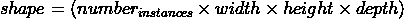

等式 7:描述输入数组、输出数组或卷积核的维数。

实例的数量没有以图形方式显示，但在图 18 中显示为每个“块状”数组下方的紫色数字。

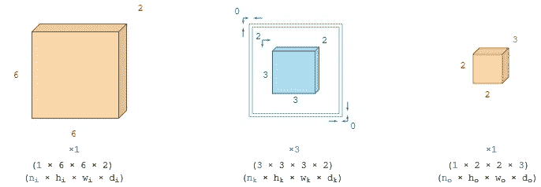

图 18:新维度 n 的图形解释，它是相应数组的实例数。在这个图中，对于输入数组和内核数组，参数 n 是紫色的。注意，内核的 nₖ实例数等于输出数组的深度 dₒ。

在图 18 中，存在一个输入数组和一个输出数组。一般来说，这是一个定义问题，即必须总是恰好有一个输入数组和一个输出数组。这意味着 nᵢ = nₒ = 1。唯一可以自由选择的数字是应用到单个输入数组的内核实例 nₖ的数量。如果应用一个以上的内核，不是深度 dₖ，而是 nₖ的实例数量增加。这似乎很合理，因为对于每个输入通道，一个内核包含一个内核通道。如果一个输入通道应该覆盖不同的内核，这些内核也必须包含每个输入通道一个内核通道。在图 19 中，显示了一个内核的三个实例在一个输入数组上的应用。

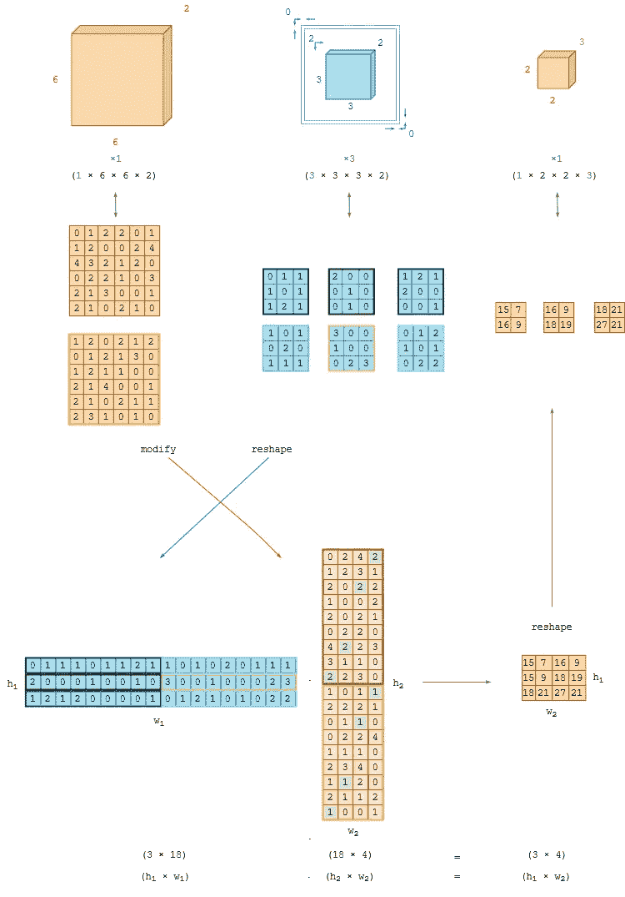

图 19:三个内核的卷积运算。根据特定值在该矩阵中出现的频率，修改后的输出矩阵的值被着色。黄色值出现一次，红色值出现两次，绿色值出现四次。

和前面的例子(图 17)一样，在图 19 中，内核的所有实例都被放到一个数组中。与前面的示例不同，所有三个实例都堆叠在彼此的“顶部”。这会产生一个(3 x 18)-数组，其中的每一行都是一个串联的内核实例。在这种情况下，矩阵乘法是(方程式 5D):

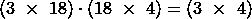

方程 5D:图 12 所示例子的矩阵乘法。

最后，(3×4)的输出数组的形状被整形为一个形状
(1×2×2×3)。输出数组必须总是 nₒ = 1，因为根据定义，只允许一个输出数组。与图 17 相同，宽度 wₒ和高度 hₒ为 2 个像素。这导致输出数组的深度为 dₒ = 3，与用于内核实例的数字相同。
从这个例子中，现在可以理解输入阵列的深度 dᵢ、输出阵列的深度 dₒ和内核阵列的深度 dₖ:之间的关系
**输入阵列的深度 dᵢ和内核阵列的深度 dₖ必须相等**，因为对于输入阵列中的每个特征图，需要单个二维内核阵列(等式 8)。

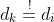

等式 8:内核的深度 dₖ必须等于输入阵列的深度 dᵢ

与之相比，输出数组的深度 dₒ与内核数组的深度 dₖ无关:相反，**输出数组的深度 dₒ，但它等于内核实例的数量 nₖ**(等式 9)。

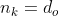

等式 9:输出阵列的深度 dₒ由内核 nₖ的数量产生

因此，通过将输入数组和内核数组深度上的所有值相加，将每个内核步骤的结果连接起来。这通过图 17 和图 19 中输出矩阵下方的计算来表示。添加每个内核步骤的结果。因此，从两个输入数组和两个内核数组的卷积中，每个内核步骤只创建一个结果值。

最后，以下是最重要的信息:

1.  卷积层只包含相互堆叠的卷积核，但既不是输入阵列也不是输出阵列。CNN 通常由其输入和输出阵列形状来表示，而不是由其卷积层形状来表示。
2.  如果等式 1 的结果是浮点数，则该值被四舍五入。这意味着，剩余的像素被丢弃，它们对生成的要素地图没有影响。
3.  输出数组的深度与输入数组和内核数组的深度无关。它等于输入数组上应用的内核实例的数量。

最后，我还有另一个任务:试着画出图 1 的卷积层，如图 17 和图 19 所示，看看你是否能够理解卷积层、输入和输出阵列的形状。解决方案如图 20 所示。

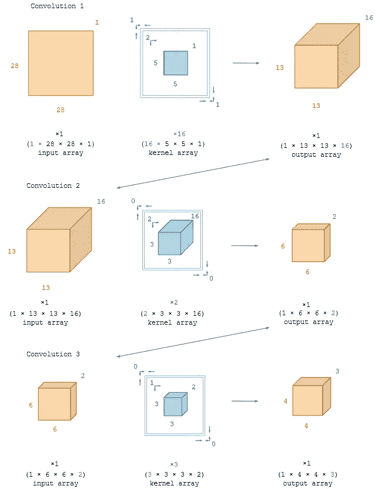

图 20:可视化图 1 所示架构的另一种方法。

我希望你喜欢阅读这篇文章，我希望它有助于你了解 CNN。

**参考文献** 【1】s .萨哈，[卷积神经网络综合指南 ELI5 方式](/a-comprehensive-guide-to-convolutional-neural-networks-the-eli5-way-3bd2b1164a53) (2018)，towardsdatascience.com

[2] V. Dumoulin 等人，[深度学习卷积算法指南](https://arxiv.org/abs/1603.07285) (2018)，arXiv: 1603.07285