# 使用 PyTorchGeometric 库和 Open-Graph-Benchmark 的 Amazon 产品推荐数据集对 GraphSage 进行全面的案例研究，并提供实际操作经验

> 原文：<https://towardsdatascience.com/a-comprehensive-case-study-of-graphsage-algorithm-with-hands-on-experience-using-pytorchgeometric-6fc631ab1067?source=collection_archive---------6----------------------->

## [思想和理论](https://towardsdatascience.com/tagged/thoughts-and-theory)

# **概述**

这篇博客文章提供了对[**graph sage**](https://arxiv.org/abs/1706.02216)**的理论和实践理解的全面研究，这是一种归纳的图形表示学习算法。对于实际应用，我们将使用流行的 PyTorch 几何库和[**Open-Graph-Benchmark**](https://ogb.stanford.edu/)数据集。我们使用[**ogbn-products**](https://ogb.stanford.edu/docs/nodeprop/#ogbn-products)**数据集，这是一个无向图和未加权图，代表一个**亚马逊产品共同购买网络，来预测购物偏好**。节点表示亚马逊上销售的产品，两个产品之间的边表示这两个产品是一起购买的。目标是在多类别分类设置中预测产品的类别，其中 47 个顶级类别用于目标标签，使其成为**节点分类任务**。****

****简单来说，这是博客的轮廓:****

*   ****什么是 GraphSage****
*   ****邻近抽样的重要性****
*   ****获得使用 GraphSage 和 PyTorch 几何库的实践经验****
*   ****Open-Graph-Benchmark 的亚马逊产品推荐数据集****
*   ****创建和保存模型****
*   ****生成图形嵌入、可视化和观察****

> ****启动电源！！****
> 
> ****我和 PyTorch Geometric，NVIDIA Triton，ArangoDB 一起做过一个专题为“ [**关于图的机器学习:超越欧氏空间的思考**](https://www.youtube.com/watch?v=HVGRpuLD5zM&t=2608s)**”**的工作坊。本次研讨会深入探讨了图形数据结构的重要性、Graph ML 的应用、图形表示学习背后的动机、如何通过 Nvidia Triton 推理服务器在生产中使用 Graph ML 以及使用真实应用程序的 ArangoDB。****

# ****什么是图形表征学习？****

****一旦在合并了图的所有实体(节点)之间有意义的关系(边)之后创建了图。想到的下一个问题是找到一种方法来将关于图结构的信息(例如，关于图中节点的全局位置或其局部邻域结构的信息)集成到机器学习模型中。从图中提取结构信息的一种方式是使用节点度、聚类系数、核函数或手工设计的特征来计算其图统计，以估计局部邻域结构。然而，使用这些方法，我们不能执行端到端的学习，即在训练过程中不能借助损失函数来学习特征。
为了解决上述问题，已经采用表示学习方法将关于图的结构信息编码到欧几里德空间(向量/嵌入空间)。****

****图形表示学习背后的关键思想是学习一个映射函数，它将节点或整个(子)图(来自非欧几里德)作为低维向量空间中的点嵌入(到嵌入空间)。目的是优化这种映射，使得在原始网络中邻近的节点在嵌入空间(向量空间)中也应该保持彼此靠近，同时将未连接的节点推开。因此，通过这样做，我们可以通过学习映射函数来保持嵌入空间内的原始网络的几何关系。下图描述了映射过程，编码器 enc 将节点 *u* 和 *v* 映射到低维向量 *zu* 和 *zv* :****

********

****图形表示学习中的映射过程(src: [stanford-cs224w](https://snap-stanford.github.io/cs224w-notes/machine-learning-with-networks/node-representation-learning)****

****让我们用 Zachary 空手道俱乐部社交网络的图结构中的一个有趣的例子来更直观地理解这一点。在该图中，节点表示人，并且如果两个人是朋友，则在他们之间存在边。图表中的颜色代表不同的社区。图 A)表示扎卡里空手道俱乐部社交网络，图 B)示出了使用 [**DeepWalk**](https://arxiv.org/abs/1403.6652) 方法从空手道图创建的节点嵌入的 2D 可视化。如果你分析这两个图，你会发现从一个图结构(非欧几里德或不规则域)到一个嵌入空间(图 B)的节点映射是以这样一种方式完成的，即嵌入空间中的节点之间的距离反映了原始图中的接近度(保留了节点的邻域结构)。例如，在空手道图中，标记为紫色和绿色的人的群体与彼此远离的紫色和海绿色的群体相比，共享很近的距离。当在空手道图上应用深度行走方法时(为了学习节点嵌入)，当学习的节点嵌入在 2D 空间中可视化时，我们可以观察到相同的邻近行为。****

****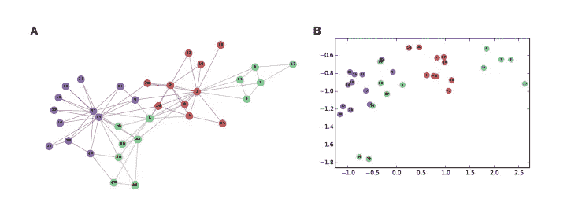****

****图像学分:[图形表示学习](https://arxiv.org/pdf/1709.05584.pdf)****

## ****我们可以将这些学习到的节点嵌入用于各种机器学习下游任务:****

****1)它可以用作下游 ML 任务的特征输入(例如，经由节点分类或链接预测的社区检测)****

****2)我们可以从嵌入中构造一个 KNN/余弦相似图。该图表可用于推荐(如产品推荐)****

****3)通过使用 U-Map、t-SNE 算法(例如执行聚类)将数据减少到 2 或 3 维，对数据进行可视化探索。****

****4)数据集比较****

****5)迁移学习****

# ****GraphSage 动机！！****

****在这篇博客文章/笔记本中，我们将介绍一种 [GraphSage](https://arxiv.org/pdf/1706.02216.pdf) (样本和聚合)算法，这是一种**归纳**(它可以推广到看不见的节点)深度学习方法，由 Hamilton，Ying 和 Leskovec (2017)开发，用于为节点生成低维向量表示的图形。这与以前的图形机器学习方法形成对比，如[图形卷积网络](https://arxiv.org/abs/1609.02907)或 DeepWalk，它们是固有的**直推式**，即它们只能在训练期间为固定图形中出现的节点生成嵌入。
这意味着，如果将来图形发展并且新节点(在训练期间不可见)进入图形，那么我们需要重新训练整个图形，以便计算新节点的嵌入。这一限制使得直推式方法无法有效地应用于不断进化的图形(如社交网络、蛋白质-蛋白质网络等)，因为它们无法在看不见的节点上进行推广。直推式方法(主要是 DeepWalk 或 Node2Vec)的另一个主要限制是，它们不能利用节点特征，例如文本属性、节点概要信息、节点度等。
另一方面，GraphSage 算法同时利用丰富的节点特征和每个节点邻域的拓扑结构来有效地生成新节点的表示，而无需重新训练。****

# ****一些流行的 GraphSage 用例:****

****1)动态图表:这些图表随着时间的推移而演变，就像来自脸书、Linkedin 或 Twitter 的社交网络图表，或者 Reddit 上的帖子，Youtube 上的用户和视频。****

****2)通过无监督损失函数生成的节点嵌入可用于各种下游机器学习任务，如节点分类、聚类和链接预测。****

****3)需要为其子图计算嵌入的真实世界应用****

****4)蛋白质-蛋白质相互作用图:在这里，经过训练的嵌入生成器可以预测在新物种/有机体上收集的数据的节点嵌入****

****5) UberEats:它利用 Graph ML 的力量向用户建议他们下一步可能喜欢的菜肴、餐馆和美食。为了提出这些建议，优步·艾特斯使用了 GraphSAGE 算法，因为它具有归纳的性质和扩展到十亿个节点的能力****

****6) Pinterest:它使用 pin sage(graph sage 的另一个版本)的功能进行视觉推荐(pin 是视觉书签，例如用于购买衣服或其他产品)。PinSage 是一种基于随机游走的 GraphSage 算法，它学习网络规模图中节点(以十亿计)的嵌入。****

# ****GraphSage 的工作原理****

****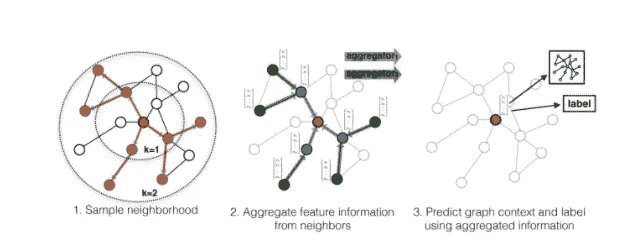****

****来源:[大型图上的归纳表示学习](https://arxiv.org/pdf/1706.02216.pdf)****

****GraphSage 的工作过程主要分为两步，第一步是对输入图进行**邻域采样**，第二步是**在每个搜索深度学习聚合函数**。我们将详细讨论这些步骤中的每一个步骤，从执行节点邻域采样的需求开始。之后，我们将讨论学习聚合器函数的重要性，这些函数基本上帮助 GraphSage 算法实现了其属性**归纳性**。****

# ****邻域抽样的重要性是什么？****

****让我们从下面描述的图形卷积网络图(GCNs)的角度来理解这一点。GCNs 是一种算法，它可以利用图形拓扑信息(即节点的邻域)和节点特征，然后提取这些信息以生成节点表示或密集矢量嵌入。下图直观地展示了 GCNs 的工作过程。在左侧，我们有一个样本输入图，其中的节点由它们相应的特征向量(例如，节点度或文本嵌入等)表示。我们首先定义一个搜索深度(K ),它通知算法从目标节点的邻域收集信息应该达到什么深度。这里，K 是一个超参数，它也描述了 GCNs 中使用的层数。****

****在 K=0 时，GCNs 将所有节点嵌入初始化为它们的原始特征向量。现在，假设我们想要计算目标节点 *0* 在层 K=1 处的嵌入，然后我们**聚集**(它是其邻居的置换不变函数)与节点 *0* 相距 1 跳距离的所有节点(包括其自身)的特征向量(在该时间步或层，我们正在聚集 K=0 处的节点的原始特征表示)。对于目标节点 *0* ，GCNs 使用均值聚合器来计算相邻节点特征及其自身特征的均值(自循环)。在 K=1 之后，目标节点 *0* 现在知道了关于其紧邻的信息；这一过程如下图所示。我们对图中的所有节点重复这一过程(即，对于每个节点，我们在 1 跳邻域上聚合),以便在每一层找到每个节点的新表示。****

******注意:**随着搜索深度的增加，目标节点从其局部邻域聚集特征的范围也增加。例如，在 K=1 时，目标节点知道关于其 1 跳距离的本地邻居的信息，在 K=2 时，目标节点知道关于其 1 跳距离的本地邻居的信息，以及 1 跳距离即高达 2 跳距离的节点的邻居的信息。****

****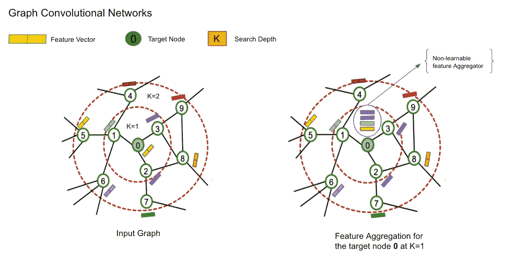****

# ****GCN 方法的问题****

****如上所述，GCNs 使用邻域聚合来计算节点表示。出于训练目的，我们可以将目标节点的 k 跳邻域表示为计算图，并且以小批量方式发送这些计算图，以便学习网络的权重(即，应用随机梯度下降)。下图说明了目标节点 0 到 2 跳邻域的计算图。现在，这个问题是:****

****1) **计算量大**:因为对于每个节点，我们需要生成完整的 K 跳邻域计算图，然后需要从其周围聚集大量信息。随着我们深入到邻域(大 K ),计算图变得指数级大。这可能会导致在 GPU 内存中拟合这些大型计算图形时出现问题。****

****2) **枢纽节点或名人节点的诅咒**:枢纽节点是那些在图中度数非常高的节点，例如一个非常受欢迎的名人拥有数百万个连接。如果是这种情况，那么我们需要聚集来自数百万个节点的信息，以便计算中枢节点的嵌入。因此，为中枢节点生成的计算图非常庞大。这个问题图示如下(r.h.s)。****

****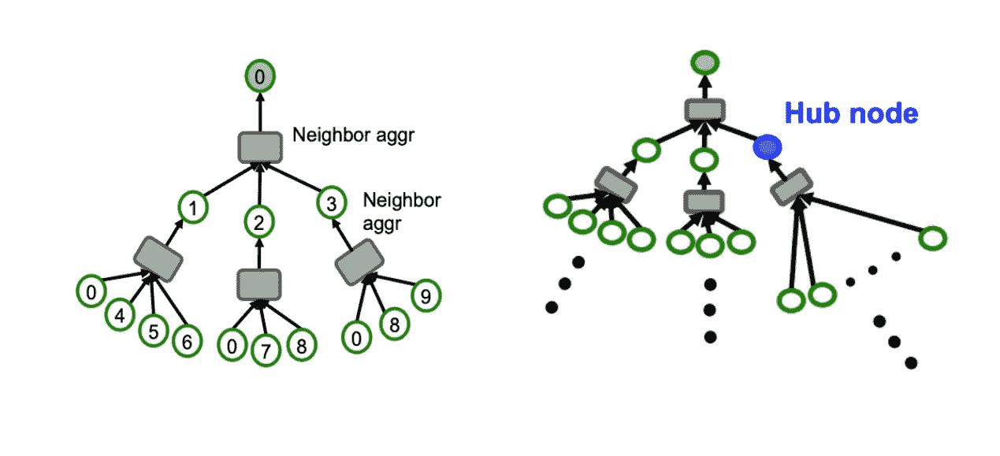****

****[图像信用](http://web.stanford.edu/class/cs224w/slides/17-scalable.pdf)****

****因此，想法不是获取目标节点的整个 K 跳邻域，而是从 K 跳邻域中随机选择几个节点，以便生成计算图。这一过程被称为邻域采样，它为 GraphSage 算法提供了独特的能力，可以将图中的节点**扩展到十亿个**。因此，使用这种方法，如果我们遇到任何中枢节点，那么我们不会采用它的整个 K 跳邻域，而是从每层或搜索深度 K 中随机选择几个节点。现在，生成的计算图由 GPU 处理更有效。下图显示了在每一跳最多采样 2 个邻居的过程。****

****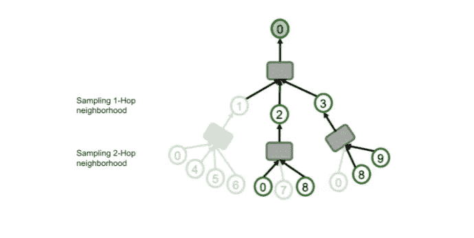****

****[图像信用](http://web.stanford.edu/class/cs224w/slides/17-scalable.pdf)****

# ****为什么 GraphSage 被称为归纳表示学习算法？****

****GraphSage 是 GCNs 的归纳版本，这意味着它在学习期间不需要整个图结构，并且它可以很好地推广到看不见的节点。它是图形神经网络的一个分支，通过从多个搜索深度或跳跃中采样和聚集邻居来学习节点表示。其归纳属性基于这样的前提，即我们不需要学习每个节点的嵌入，而是学习一个聚集函数(可以是任何可微分函数，如均值、池或 lstm ),当给定来自节点的局部邻域的信息(或特征)时，它知道如何聚集这些特征(通过随机梯度下降进行学习),使得节点 **v** 的聚集特征表示现在包括关于其局部环境或邻域的信息。****

****GraphSage 在两个方面不同于 GCNs:即 1)graph sage 不是获取目标节点的整个 K 跳邻域，而是首先采样或修剪 K 跳邻域计算图，然后在这个采样图上执行特征聚集操作，以便为目标节点生成嵌入。2)在学习过程中，为了生成节点嵌入；GraphSage 学习聚合器函数，而 gcn 利用对称归一化图拉普拉斯算子。****

****下图说明了 GraphSage 节点 **0** 如何在搜索深度 K=1 处从其采样的本地邻居聚集信息。如果我们观察 r.h.s 图，我们将发现在 K=1 时，目标节点 **0** 现在具有关于其周围直到 1 跳的信息。****

****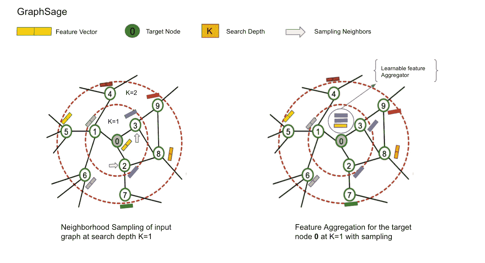****

# ****GraphSage 的形式解释****

****如上所述，GraphSage 的关键概念是学习如何从节点的本地邻域聚集特征信息。现在，让我们更正式地理解 GraphSage 如何使用前向传播在每一层(K)生成节点嵌入。我们借助视觉来理解这一点，然后将这种理解映射到 [GraphSage 论文](https://arxiv.org/pdf/1706.02216.pdf)中提到的伪代码。但在此之前，让我们定义一些本文中使用的符号。****

******定义符号:******

****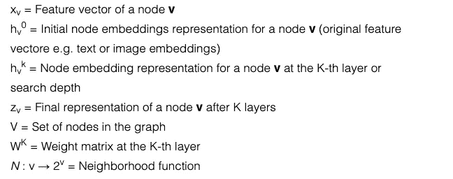****

****如上图所示，在 K=1 时，目标节点 **0** 聚合来自其本地邻居的信息(特征),最多 1 跳。类似地，在 k=2 时，目标节点 **0** 聚集来自其本地邻居的信息直到 2 跳，即现在它知道在它的邻居中有什么直到 2 跳。因此，我们可以重复这个过程，其中目标节点 **0** 从图的更远的范围递增地获得越来越多的信息。我们为原始图(∀v ∈ V)中的每个节点收集信息。让我们添加一些视觉效果来更直观地理解这个迭代过程:****

****下图描绘了层 K=0 处的目标节点 **0** 的计算图，此时图中的所有节点都被初始化为其原始特征向量。我们的目标是通过迭代的局部邻域信息收集过程，在层 K=2 找到节点 **0** (即 z0)的最终表示。这个迭代过程有时也被称为**消息传递方法**。****

****因此，我们可以将此步骤正式表示为:****

****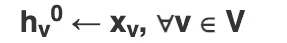********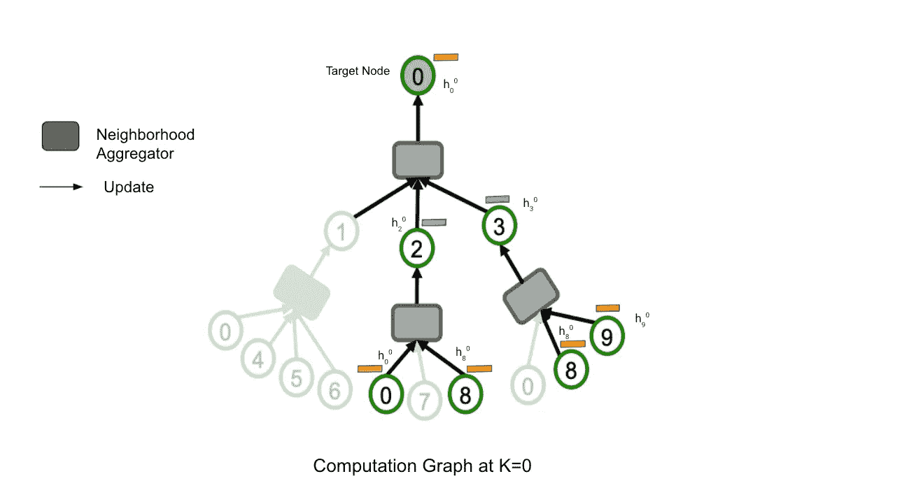****

******注:**由于 medium 不支持下标，我就把隐藏层(h)表示写成(上标)h(下标)。****

****上标表示-> *第 k*层****

****下标表示->节点 id****

## ****邻域聚合(K=1)****

****由于节点是从图的更深处逐渐收集信息的，所以我们从搜索深度 1…K 开始迭代过程。在 K=1 时，我们将目标节点 **0** (1h0)的相邻节点表示聚合到单个向量中，即位于前一层(K-1h2 和 K-1h3)的节点 2 和 3 表示。这里 1h0 是聚合表示。在同一时间步，节点 2、3 和 9 也将聚集来自它们各自的局部邻域的特征向量，直到 1 跳的距离。现在，在这个时间点上，计算图中的每个节点都知道它们的周围环境中有什么样的信息。****

****因此，我们可以将此步骤正式表示为:****

****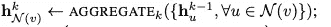****

# ******更新******

****一旦我们实现了聚合表示，即 1h0，下一步将是将该聚合表示与其先前的层表示(0h0)连接或组合。然后通过将它乘以一个权重矩阵 **WK** 将变换应用于这个连接的输出，你可以认为这个过程类似于将卷积核(可学习的权重矩阵)应用于图像，以便从中提取特征。最后，我们对这个转换后的输出应用非线性激活函数，使其能够学习和执行更复杂的任务。****

******重要提示**:graph sage 算法在每个搜索深度 K 单独学习权重矩阵，或者你也可以说它学习如何在每个搜索深度从节点的邻域聚集信息。****

****因此，我们可以将此步骤正式表示为:****

****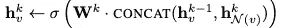********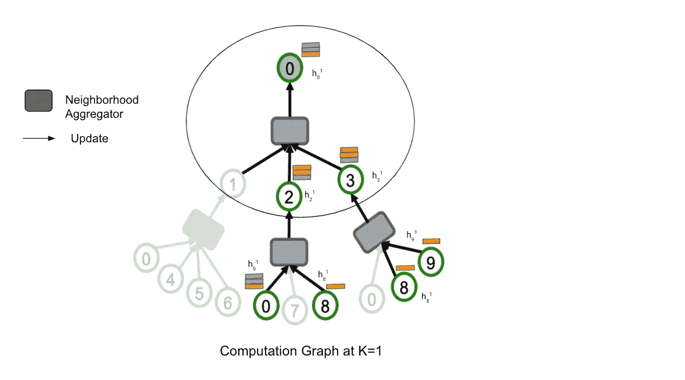****

# ****规范化节点嵌入****

****随后，对节点表示 khv(或此时的步骤 1h0)应用归一化，这有助于算法保持节点嵌入的一般分布。该步骤计算如下:****

****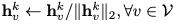****

# ****K=2 时的节点嵌入****

****完成了从 K=1 的节点的局部邻域收集信息。在 K=2 时，节点探索图的更远的范围，即超出它们的直接邻居，并且查看跳距离 2。我们再次执行节点的本地邻居聚合，但是这一次目标节点 **0** 现在将具有其在 1 跳和 2 跳距离的邻居的信息。然后，我们再次重复搜索深度 K=2 的更新和归一化过程。由于为了理解 GraphSage 算法的流程，我们已经设置了 K=2 的值，因此，我们将在此停止。在 K=2 之后，计算图中的每个节点由它们各自的最终节点嵌入表示，即 **zv** 。****

****此工作流程如下图所示:****

****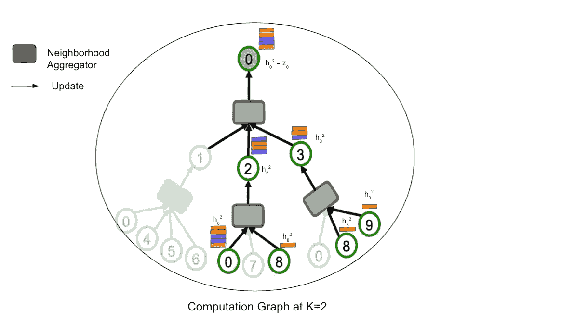****

# ******现在，我们可以很容易地将我们的理解映射到论文中的以下 GraphSage 算法:******

****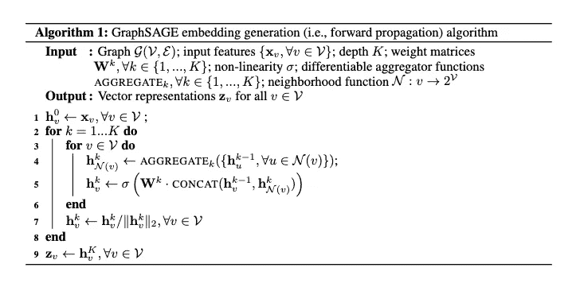****

****[算法信用](https://arxiv.org/pdf/1706.02216.pdf)****

# ****损失函数:学习参数****

****作者在论文中使用两种不同类型的损失函数记录了结果，如下所示:****

******无监督情况**:如图形表示学习部分所述，目标是优化映射，使得原始网络中邻近的节点在嵌入空间(向量空间)中也应该保持彼此靠近，同时将未连接的节点推开。****

******监督案例**:作者使用常规交叉熵损失来执行节点分类任务。****

****下面是本文中使用的无监督损失函数:****

****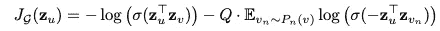****

# ****使用 PyTorch 几何库和 OGB 基准数据集对 GraphSage 进行实际操作！****

****我们将借助来自[**Open Graph Benchmark**](https://ogb.stanford.edu/)(OGB)数据集的真实数据集，更详细地理解 GraphSage 的工作过程。OGB 是由斯坦福大学开发的一个现实的、大规模的、多样化的图表机器学习基准数据集的集合。****

# ****注意了。！！****

> ****前面有很多代码，如果你有兴趣接触这些代码，我真的鼓励你这样做，那么我已经准备了一个 [**google colab 笔记本**](https://colab.research.google.com/github/sachinsharma9780/interactive_tutorials/blob/master/notebooks/example_output/Comprehensive_GraphSage_Guide_with_PyTorchGeometric_Output.ipynb) 供你使用…****

# ****资料组****

****我们使用 [obgn-products](https://ogb.stanford.edu/docs/nodeprop/#ogbn-products) 数据集，这是一个无向图，表示亚马逊产品联合购买网络。节点表示亚马逊上销售的产品，两个产品之间的边表示这两个产品是一起购买的。节点特征表示取自产品描述的词汇特征。目标是在多类别分类设置中预测产品的类别，其中 47 个顶级类别用于目标标签，使其成为**节点分类任务**。****

# ****让我们从下载必要的库开始****

```
***# Installing Pytorch Geometric* 
%%capture
!pip install -q torch-scatter -f https://pytorch-geometric.com/whl/torch-1.9.0+cu102.html
!pip install -q torch-sparse -f https://pytorch-geometric.com/whl/torch-1.9.0+cu102.html
!pip install -q torch-cluster -f https://pytorch-geometric.com/whl/torch-1.9.0+cu102.html
!pip install -q torch-geometric
!pip install ogb
!pip install umap-learn**
```

****导入必要的库****

```
****import** **torch**
**import** **torch.nn.functional** **as** **F**
**from** **tqdm** **import** tqdm
**from** **torch_geometric.data** **import** NeighborSampler
**from** **torch_geometric.nn** **import** SAGEConv
**import** **os.path** **as** **osp**
**import** **pandas** **as** **pd**
**import** **numpy** **as** **np**
**import** **collections**
**from** **pandas.core.common** **import** flatten
*# importing obg datatset*
**from** **ogb.nodeproppred** **import** PygNodePropPredDataset, Evaluator
**from** **pandas.core.common** **import** flatten
**import** **seaborn** **as** **sns**
**import** **matplotlib.pyplot** **as** **plt**
sns.set(rc={'figure.figsize':(16.7,8.27)})
sns.set_theme(style="ticks")
**import** **collections**
**from** **scipy.special** **import** softmax
**import** **umap****
```

****下载并加载数据集****

```
 **root = osp.join(osp.dirname(osp.realpath('./')), 'data', 'products')
dataset = PygNodePropPredDataset('ogbn-products', root)**
```

****获取训练、验证和测试索引****

```
***# split_idx contains a dictionary of train, validation and test node indices*
split_idx = dataset.get_idx_split()
*# predefined ogb evaluator method used for validation of predictions*
evaluator = Evaluator(name='ogbn-products')**
```

****让我们检查一下训练、验证和测试节点的划分。****

```
***# lets check the node ids distribution of train, test and val*
print('Number of training nodes:', split_idx['train'].size(0))
print('Number of validation nodes:', split_idx['valid'].size(0))
print('Number of test nodes:', split_idx['test'].size(0))Number of training nodes: 196615
Number of validation nodes: 39323
Number of test nodes: 2213091**
```

****加载数据集****

```
**data = dataset[0]**
```

****图表统计****

```
***# lets check some graph statistics of ogb-product graph*
print("Number of nodes in the graph:", data.num_nodes)
print("Number of edges in the graph:", data.num_edges)
print("Node feature matrix with shape:", data.x.shape) *# [num_nodes, num_node_features]*
print("Graph connectivity in COO format with shape:", data.edge_index.shape) *# [2, num_edges]*
print("Target to train against :", data.y.shape) 
print("Node feature length", dataset.num_features)Number of nodes in the graph: 2449029
Number of edges in the graph: 123718280
Node feature matrix with shape: torch.Size([2449029, 100])
Graph connectivity in COO format with shape: torch.Size([2, 123718280])
Target to train against : torch.Size([2449029, 1])
Node feature length 100**
```

*****检查唯一标签的数量*****

```
***# there are 47 unique categories of product*
data.y.unique()**
```

*****从数据集内提供的标签映射将整数加载到真实产品类别*****

```
**df = pd.read_csv('/data/products/ogbn_products/mapping/labelidx2productcategory.csv.gz')**
```

****让我们看看一些产品类别****

```
**df[:10]**
```

****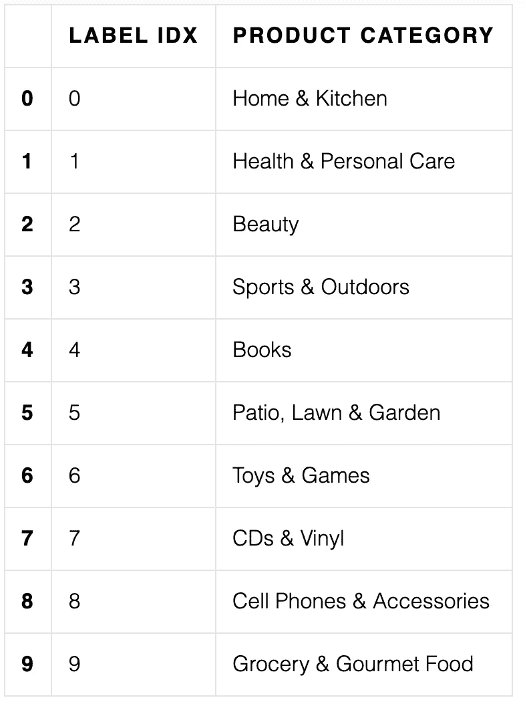****

*****创建产品类别和相应整数标签的字典*****

```
**label_idx, prod_cat = df.iloc[: ,0].values, df.iloc[: ,1].values
label_mapping = dict(zip(label_idx, prod_cat))*# counting the numbers of samples for each category*
y = data.y.tolist()
y = list(flatten(y))
count_y = collections.Counter(y)
print(count_y)**
```

## ****邻近抽样****

****该模块迭代地采样邻居(在每层)并构建模拟 GNNs 实际计算流程的二分图。****

****sizes:表示我们希望对每层中的每个节点采样多少个邻居。****

****`NeighborSampler`保存当前:obj: `batch_size`，参与计算的所有节点的 id:obj:`n_id`，通过元组保存二分图对象列表:obj: `(edge_index, e_id, size)`，其中:obj: `edge_index`表示源节点和目标节点之间的二分边，obj: `e_id`表示完整图中原始边的 id，obj: `size`保存二分图的形状。****

****然后，实际的计算图以相反的方式返回，这意味着我们将消息从一个较大的节点集传递到一个较小的节点集，直到到达我们最初想要计算嵌入的节点。****

```
**train_idx = split_idx['train']
train_loader = NeighborSampler(data.edge_index, node_idx=train_idx,
                               sizes=[15, 10, 5], batch_size=1024,
                               shuffle=**True**)**
```

## ****GraphSage 算法****

```
****class** **SAGE**(torch.nn.Module):
    **def** __init__(self, in_channels, hidden_channels, out_channels, num_layers=3):
        super(SAGE, self).__init__()

        self.num_layers = num_layers

        self.convs = torch.nn.ModuleList()
        self.convs.append(SAGEConv(in_channels, hidden_channels))
        **for** _ **in** range(num_layers - 2):
            self.convs.append(SAGEConv(hidden_channels, hidden_channels))
        self.convs.append(SAGEConv(hidden_channels, out_channels))

    **def** reset_parameters(self):
        **for** conv **in** self.convs:
            conv.reset_parameters()

    **def** forward(self, x, adjs):
        *# `train_loader` computes the k-hop neighborhood of a batch of nodes,*
        *# and returns, for each layer, a bipartite graph object, holding the*
        *# bipartite edges `edge_index`, the index `e_id` of the original edges,*
        *# and the size/shape `size` of the bipartite graph.*
        *# Target nodes are also included in the source nodes so that one can*
        *# easily apply skip-connections or add self-loops.*
        **for** i, (edge_index, _, size) **in** enumerate(adjs):
            xs = []
            x_target = x[:size[1]]  *# Target nodes are always placed first.*
            x = self.convs[i]((x, x_target), edge_index)
            **if** i != self.num_layers - 1:
                x = F.relu(x)
                x = F.dropout(x, p=0.5, training=self.training)
            xs.append(x)
            **if** i == 0: 
                x_all = torch.cat(xs, dim=0)
                layer_1_embeddings = x_all
            **elif** i == 1:
                x_all = torch.cat(xs, dim=0)
                layer_2_embeddings = x_all
            **elif** i == 2:
                x_all = torch.cat(xs, dim=0)
                layer_3_embeddings = x_all    
        *#return x.log_softmax(dim=-1)*
        **return** layer_1_embeddings, layer_2_embeddings, layer_3_embeddings

    **def** inference(self, x_all):
        pbar = tqdm(total=x_all.size(0) * self.num_layers)
        pbar.set_description('Evaluating')

        *# Compute representations of nodes layer by layer, using *all**
        *# available edges. This leads to faster computation in contrast to*
        *# immediately computing the final representations of each batch.*
        total_edges = 0
        **for** i **in** range(self.num_layers):
            xs = []
            **for** batch_size, n_id, adj **in** subgraph_loader:
                edge_index, _, size = adj.to(device)
                total_edges += edge_index.size(1)
                x = x_all[n_id].to(device)
                x_target = x[:size[1]]
                x = self.convs[i]((x, x_target), edge_index)
                **if** i != self.num_layers - 1:
                    x = F.relu(x)
                xs.append(x)

                pbar.update(batch_size)

            **if** i == 0: 
                x_all = torch.cat(xs, dim=0)
                layer_1_embeddings = x_all
            **elif** i == 1:
                x_all = torch.cat(xs, dim=0)
                layer_2_embeddings = x_all
            **elif** i == 2:
                x_all = torch.cat(xs, dim=0)
                layer_3_embeddings = x_all

        pbar.close()

        **return** layer_1_embeddings, layer_2_embeddings, layer_3_embeddings**
```

****实例化模型****

```
**device = torch.device('cuda' **if** torch.cuda.is_available() **else** 'cpu')
model = SAGE(dataset.num_features, 256, dataset.num_classes, num_layers=3)
model = model.to(device)**
```

****加载节点特征矩阵和节点标签****

```
**x = data.x.to(device)
y = data.y.squeeze().to(device)**
```

****培养****

```
****def** train(epoch):
    model.train()

    *#pbar = tqdm(total=train_idx.size(0))*
    *#pbar.set_description(f'Epoch {epoch:02d}')*

    total_loss = total_correct = 0
    **for** batch_size, n_id, adjs **in** train_loader:
        *# `adjs` holds a list of `(edge_index, e_id, size)` tuples.*
        adjs = [adj.to(device) **for** adj **in** adjs]
        optimizer.zero_grad()    
        l1_emb, l2_emb, l3_emb = model(x[n_id], adjs)
        *#print("Layer 1 embeddings", l1_emb.shape)*
        *#print("Layer 2 embeddings", l1_emb.shape)*
        out = l3_emb.log_softmax(dim=-1)
        loss = F.nll_loss(out, y[n_id[:batch_size]])
        loss.backward()
        optimizer.step()

        total_loss += float(loss)
        total_correct += int(out.argmax(dim=-1).eq(y[n_id[:batch_size]]).sum())
        *#pbar.update(batch_size)*

    *#pbar.close()*

    loss = total_loss / len(train_loader)
    approx_acc = total_correct / train_idx.size(0)

    **return** loss, approx_acc**
```

****划时代！！****

```
**optimizer = torch.optim.Adam(model.parameters(), lr=0.003)

**for** epoch **in** range(1, 21):
    loss, acc = train(epoch)
    *print(f'Epoch {epoch:02d}, Loss: {loss:.4f}, Approx. Train: {acc:.4f}')***
```

## ****为推理部分保存模型****

****我们需要保存推理部分的模型，因为由于 RAM 大小的限制，google colab 不能同时创建两个图形加载器。因此，我们首先使用 train_loader 进行训练，然后使用这个保存的模型对测试数据进行推理。****

****在这里，您可以将模型保存在 google MyDrive 或本地计算机上。****

```
***#torch.save(model, '/content/drive/MyDrive/model_weights/graph_embeddings/model.pt')*

*# saving model in mydrive*
**from** **google.colab** **import** drive
drive.mount('/content/drive')
fp = '/content/drive/MyDrive/model.pt'

torch.save(model, './model.pt')
torch.save(model, fp)**
```

# ****推论:让我们检查 GraphSage 感应功率！！****

****这一部分包括利用经过训练的 GraphSage 模型来计算节点嵌入并对测试数据执行节点类别预测。之后，我们比较了 GraphSage 的 3 个不同层的节点嵌入的 U-Map 可视化，得出了一些有趣的观察结果。****

> ****如果读者在我准备的 [**谷歌实验室笔记本**](https://colab.research.google.com/github/sachinsharma9780/interactive_tutorials/blob/master/notebooks/example_output/Comprehensive_GraphSage_Guide_with_PyTorchGeometric_Output.ipynb) 中运行 GraphSage 的推理部分，会对他/她更有用，以便更好地直观了解 GraphSage 每一层的可视化是如何计算的。****

# ****GraphSage 第 1 层节点嵌入可视化****

****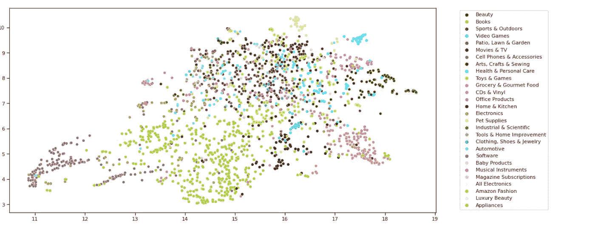****

## ****观察****

****第 1 层的节点嵌入可视化表明，该模型无法很好地区分产品类别(因为不同产品类别的嵌入非常接近)，因此我们无法以很高的概率预测/估计未来哪两种产品可以一起购买，或者如果某人购买了一种产品，那么他/她可能也会对另一种产品感兴趣。****

# ****GraphSage 第 2 层节点嵌入可视化****

****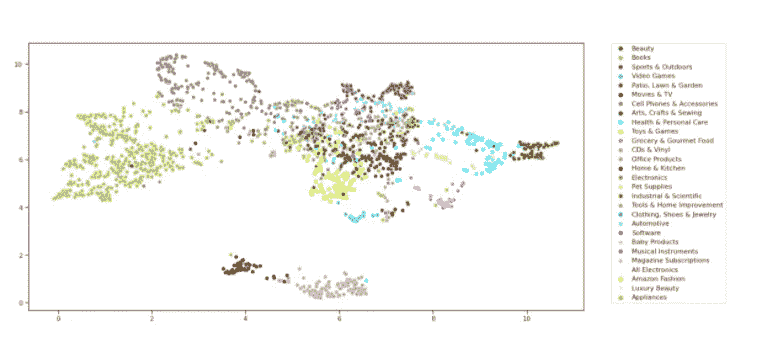****

## ****观察****

****在第 2 层，我们可以看到一些独立的产品类别集群正在形成，我们可以从中获得一些有价值的见解，例如电影和电视与 CD 和黑胶唱片、美容与健康和个人护理、视频游戏与玩具和游戏。然而，书和美簇相距甚远。****

# ****GraphSage 第三层节点嵌入可视化****

****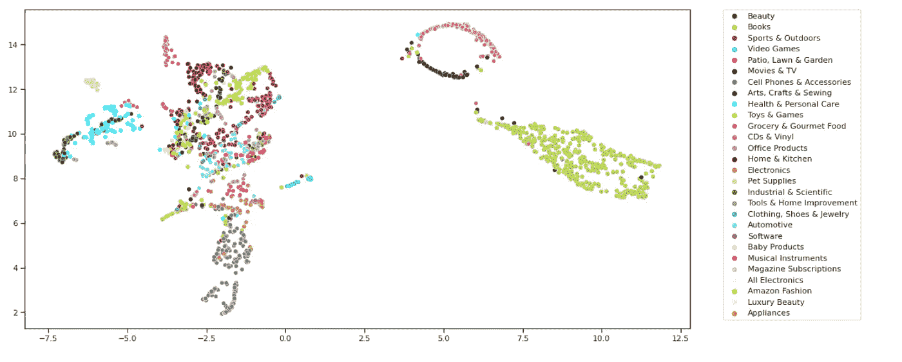****

## ****观察****

****在第 3 层，节点表示比第 2 层稍微精细一些，因为我们可以看到一些更远的集群，例如手机和配件与电子产品。****

# ****承认****

****我要感谢 [**ArangoDB**](https://www.arangodb.com/) 的整个 ML 团队为我提供了关于博客的宝贵反馈。****

****想联系我: [**Linkedin**](https://www.linkedin.com/in/sachin-sharma-4198061a9/?originalSubdomain=de)****

# ****参考资料(更多学习材料)****

1.  ****fastgraphml:一个加速 graphml 模型开发过程的低代码框架****
2.  ****[https://www . arango db . com/2021/08/a-comprehensive-case-study-of-graphsage-using-pytorchgeometric/？UTM _ content = 176620548&UTM _ medium = social&UTM _ source = LinkedIn&HSS _ channel = LCP-5289249](https://www.arangodb.com/2021/08/a-comprehensive-case-study-of-graphsage-using-pytorchgeometric/?utm_content=176620548&utm_medium=social&utm_source=linkedin&hss_channel=lcp-5289249)(**原博文**)****
3.  ****[大型图上的归纳表示学习](https://arxiv.org/pdf/1706.02216.pdf)****
4.  ****[http://web.stanford.edu/class/cs224w/slides/17-scalable.pdf](http://web.stanford.edu/class/cs224w/slides/17-scalable.pdf)****
5.  ****[图形机器学习宇宙之旅:动机、应用、数据集、图形 ML 库、图形数据库](https://medium.com/arangodb/a-voyage-through-graph-machine-learning-universe-motivation-applications-datasets-graph-ml-e573a898b346)****
6.  ****[https://medium . com/Pinterest-engineering/pin sage-a-new-graph-convolutionary-neural-network-for-web-scale-recommender-systems-88795 a107f 48](https://medium.com/pinterest-engineering/pinsage-a-new-graph-convolutional-neural-network-for-web-scale-recommender-systems-88795a107f48)****
7.  ****[https://eng.uber.com/uber-eats-graph-learning/](https://eng.uber.com/uber-eats-graph-learning/)****
8.  ****更多与[图 ML](https://github.com/arangodb/interactive_tutorials) 相关的东西****