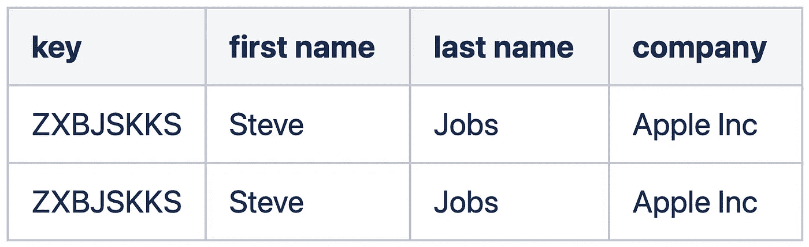

# 数据质量管理的综合框架

> 原文：<https://towardsdatascience.com/a-comprehensive-framework-for-data-quality-management-b110a0465e83?source=collection_archive---------3----------------------->

## 如何监控和维护数据质量，以确保数据符合特定业务用例的特定标准

斯蒂芬·道森在 [Unsplash](https://unsplash.com/s/photos/data?utm_source=unsplash&utm_medium=referral&utm_content=creditCopyText) 上拍摄的照片

# 介绍

大数据正变得越来越流行，它被认为是每个行业的新石油**。事实上，人们认为大数据和石油在开采、存储、运输和消费的方式上有一些相似之处。**

照片由 [Zbynek Burival](https://unsplash.com/@zburival?utm_source=unsplash&utm_medium=referral&utm_content=creditCopyText) 在 [Unsplash](https://unsplash.com/s/photos/oil?utm_source=unsplash&utm_medium=referral&utm_content=creditCopyText) 上拍摄

作为一名车主，当你每周路过加油站时，你可能会明白汽油纯度的重要性。低纯度的汽油可能会随着时间的推移严重损坏您的汽车，尽管它仍然可以让您的汽车行驶。然而，卡车上装有柴油发动机的人可能没有你这么担心，因为柴油的纯度比汽油低。总的来说，不同的发动机或应用需要不同水平的燃油质量。

同样，质量差的数据会对你的组织产生负面影响，尽管你仍然可以从中获得一些见解。然而，不同的用例可能对数据质量有不同的期望，因为追求最高质量的数据总是代价高昂的。这也体现在数据质量的定义中:*“数据质量表明数据满足用户的优秀标准或* ***期望****【3】*

*当人们考虑数据质量时，他们经常提到准确性这个术语。例如，“马克·扎克伯格”是脸书首席执行官的正确名字，但在数据库中，我们可能会看到类似“马克·扎克伯格”、“马克·扎克伯格”或“马克·扎克伯格”这样的名字，这是对原始名字的不准确表示。然而，就数据质量而言，光靠准确性不足以评价数据质量，因为人们还期望数据的完整性、及时性、一致性和独特性。这是衡量数据质量的五个不同维度。*

*本文的其余部分组织如下。在第一节中，我们介绍了五个数据质量维度的定义和例子，包括准确性、完整性、及时性、一致性和唯一性。第 2 节将提供指标计算的公式，而第 3 节概述了带有数据验证规则的指标的实现。第 4 节描述了管理数据质量的流程，第 5 节概述了该流程中涉及的所有各方的责任。*

# *1.数据质量维度*

## *1.1 准确性*

*准确性被定义为一个值与其真实生活现象的正确表示之间的接近程度。有两种类型的准确性可以确定:语义准确性和句法准确性[1]。*

*准确性通常在语义准确性的概念中已知，语义准确性是值 *v* 与真实值*v’*的接近程度。比如一个开发者在观察数据库中的记录时，发现了这个*{****OS****:Windows，****Creator****:Linus Torvalds }，{****OS****:Linux，****Creator****:Bill Gates }。他立刻意识到这些记录存在语义问题，因为 Linux 的创建者应该是 Linus Torvalds，Windows 的创建者应该是 Bill Gates。**

*另一种形式的准确性是语法准确性，即值 *v* 与特定域中可接受值的语法接近程度。与其将 *v* 与真实值*v’*进行比较，我们更感兴趣的是知道该值在语法上是否正确。例如，一个信用卡号码应该有 16 位数字 *XXXX XXXX XXXX XXXX* ，如果类似*1234 1234 1234 1234 1234 0*的东西出现在数据库中，我们就会遇到语法准确性问题。*

*一般来说，语义准确性更严格，但是测量这种准确性的挑战是必须事先知道真实值*v’*。在上面的例子中，每个人都知道脸书 CEO 的正确姓名，因此在这个场景中可以很容易地评估语义准确性。然而，对于像交易价值这样的东西，例如，客户购买了 300 美元的手表，我们必须知道交易的真实价值，并有一个基础事实来进行比较。情况可能并非如此，因为有时我们只有一个数据源，即使我们有另一个数据源进行比较，我们也必须有一种机制将两个数据源中的对象链接在一起(对象标识)。*

*另一方面，语法准确性计算起来不太复杂，并且不需要预先的真值。因此，与语义准确性相比，它实际上更适用。然而，还有一些其他的用例可以应用语义准确性。在澳大利亚，澳大利亚统计局的数据可被视为国家信息的基本事实，因此可用于验证人口、经济和收入等许多不同领域的其他数据来源的语义准确性。*

## *1.2 完整性*

**

*三种类型的完整性(由我创建的图形)*

*数据质量的另一个方面是完整性，在这一点上“数据的广度、深度和范围对于手头的任务来说是足够的”[1]被评估。完整性通常与记录(元组完整性)、列(列完整性)或表(关系完整性)中缺失值的数量有关。*

## *1.3 及时性*

*及时性表示特定应用程序的数据的新鲜程度。有两个因素促成了这一指标:货币和波动性。*货币*反映数据的新鲜程度。例如，如果客户最近更改了地址，记录将如何更新。如果记录在客户的更改请求后立即更新，则货币被认为是高的，反之亦然。及时性还取决于显示数据随时间变化水平的*波动性*。与每月更新的数据相比，每天更新的数据具有更高的波动性。例如，出生日期可能具有零波动性，而股票价格将具有极高的波动性。*波动性*也可以表示为数据保持有效的时间长度。*

*货币和波动性在对及时性贡献方面可以相互影响。高波动性数据应该是最新的，而低波动性数据不需要高汇率。五天的延迟对于每日更新的数据来说是一个问题，而对于每月或每年更新的数据来说可能不是这样。*

## *1.4 一致性*

*一致性表示来自相同或不同表的两个或多个列之间的完整性约束的符合性级别。例如，如果国家代码是 AU，则 state 列应该具有下列值之一:VIC、NSW、WA、QLD、TAS、NT、ACT、SA。*

## *1.5 独特性*

*该维度捕获重复记录的数量。然而，有许多不同层次的重复，每一个都需要不同的方法来衡量。*

**

*第一种复制形式(我创造的图形)*

*最基本的重复形式是当我们有两个记录为每个单元格存储完全相同的值时。如果键列用作主键，这种情况就不太可能发生。然而，有时数据库系统可以选择使用生成的键，而不是数据中现有的有意义的列。在这种情况下，检测重复会稍微复杂一些，因为我们不能仅仅依赖于密钥。简单的方法是逐个单元格地比较这些值，这种方法很容易实现。*

**

*第二种复制形式(我创造的图形)*

*下一种形式的重复是当我们有两个记录存储不完全相同的值，但指的是现实生活中相同的对象或实体。这种差异可能只是由于数据输入过程中的打字错误造成的，也可能是由于来自不同源系统的不同数据格式造成的。对于这种重复，上述幼稚的方法是不适用的。更高级的通用方法是使用文本距离度量，如 TF-IDF(术语频率-逆文档频率)或余弦相似性来度量两个记录之间的相似性。这种方法需要更多的计算，尽管它更智能，并且适用于各种场景。*

# *2.度量计算*

*给定关系 *R* 与 *K* 属性和 *N* 记录，度量计算如下:*

**

*度量计算公式(由我创建的图形)*

*   *指标可以从 0 到 1 不等 *(0 表示差，1 表示好)*。*
*   **B* 是一个布尔函数，如果满足条件，则返回 1*
*   **vij* 是第 j 列第 I 行的值*
*   *对于及时性指标， *T* 是数据的年龄， *F* 是数据的频率。*

# *3.度量实施*

*数据质量框架将建立在现有数据验证框架之上，所有数据有效性规则都将在该框架中实施。数据验证框架是一套方法和软件库，包含实现有效性规则的工具。例如，数据验证框架可以提供方法或函数来检查列中的数字是否在特定范围内。这方面的一个用例是确保年龄列不包含负值。据我所知，目前还没有广泛使用的或行业标准的数据验证框架，这些框架一般都是为各种业务用例而构建的。然而，欧盟委员会的数据验证方法[5]是关于多层次数据验证的最简明的文件之一。我将感兴趣的读者推迟到[5]以获得关于数据验证的更详细的信息，我们将在另一篇文章中讨论这个主题。*

**

*数据验证、数据质量和业务(图由我创建)*

*在高层次上，数据质量框架将作为治理层，将数据质量方面与业务用例的关键程度联系起来。将会有一个迭代过程来持续维护和提高数据质量，以满足用户的期望，我们将在下一节中讨论这一点。*

**

*数据质量仪表板(由我创建的图形)*

*在实施层面，指标将由数据验证框架进行计算，并存储到中央存储中以供审计和报告。对于特定数据集，将提供一个仪表板来监控数据质量。如果违反有效性规则，也会发送警报。*

# *4.数据质量管理流程*

*数据质量管理过程必须是一个迭代循环，因为数据质量需要不断维护和改进，以满足用户的期望。该过程分为两个阶段，包括以下五个阶段:*

**

*数据质量管理流程(由我创建的图)*

*第一阶段主要关注数据集的发现部分，以了解低质量数据对业务的影响。它包括自上而下和自下而上的方法。自顶向下的方法收集用户需求、用例信息和使用数据时的难点，而自底向上的方法更接近数据内容，并采用统计分析来识别潜在的数据质量问题。*

*在第二阶段，来自自上而下和自下而上方法的信息被组合，以定义五个度量中的每一个的阈值。还应该为数据确定与业务相关的规则。*

*之后，这些规则将在第三阶段被映射为有效性规则，以便稍后在第四阶段使用数据验证框架来实现。同样在第三阶段，将提供第一阶段检测到的任何数据质量问题的解决方案。最后，所有的设计都需要与接口协议保持一致，这样任何违反接口协议中声明的数据标准的行为都应该被检测出来。*

*第四阶段将是使用数据验证框架实际实施设计，而第五阶段涉及数据输入启用时的操作方面。将持续监控数据质量，并且必须建立事故报告流程，以启动数据质量管理流程的下一个周期。*

*如上所述，这是一个迭代过程，一般来说，有两种可能的方法来触发新的周期。第一种方法(预防性方法)是定期检查性能，并在一段固定时间后重复该循环。第二种方法(反应式方法)是在出现数据质量问题或事故时开始新的周期。根据使用案例和应用，这两种方法也可以同时应用。*

# *5.职责和工具*

*本节概述了数据工程团队和数据消费者(流)在数据质量问题上的合作。在整个文档中，可以看到特定用例的数据质量的*预期*是监控和提高数据质量过程的起点。因此，数据质量管理是一个以业务为中心(或以用户为中心)的过程，业务的需求和期望是操作模型的核心。该模型可以说明如下:*

**

*操作模型(由我创建的图形)*

*在这个模型中，流将处于与客户端交互的最前沿，以收集需求并围绕数据设计用例。流负责数据质量管理过程中的第一阶段和第二阶段，因为它们了解如何使用数据，并且知道数据应该“看起来”是什么样子。*

*在第三、第四和第五阶段，这些职责在某种程度上由数据工程团队(DE Squad)和 Streams 分担。DE Squad 通过数据验证框架提供实施有效性规则所需的工具，并维护和改进该框架以满足流的要求。DE Squad 还负责仪表板和警报解决方案，Streams 可以轻松地为其特定数据源设置这些解决方案。另一方面，Streams 使用 DE Squad 提供的工具来应用指标和验证规则，并在 DE Squad 的支持下配置警报和仪表板。*

*数据质量审查可以由 Streams 执行，他们可以请求 DE Squad 向框架中添加新特性，以满足业务用例需求。由 Streams 提出的框架相关事件将由 DE Squad 在可接受的 SLA 范围内处理。*

# *6.摘要*

*在本文中，我们讨论了数据质量的定义，数据质量的五个维度包括准确性、完整性、及时性、一致性和唯一性。我们已经走过了指标的计算、高级实施、管理数据质量的流程以及该流程中涉及的所有各方的责任。该框架不仅为公司提供了发展和增强以满足其业务需求的基础，还提供了通过预防性和反应性方法维护和提高数据质量的迭代过程。*

*我鼓励积极的读者分享您组织中当前与数据质量相关的挑战，您如何设法解决这些问题，以及关于此框架可以帮助以不同方式解决您的数据质量管理问题的潜在用例的头脑风暴。*

# *参考*

**本框架摘自以下文件，稍作修改以满足当前的实际要求。**

*[1] C. Batini 和 M. Scannapieco,《数据质量概念、方法和技术》, Springer，2006 年。*

*[2] D. Loshin，《数据质量改进实践指南》，摩根·考夫曼，2010 年。*

*[3]《数据质量管理:角色、流程、工具》，2019。【在线】。[altexsoft.com](http://altexsoft.com/)*

*[4] I. Mikhailouskaya，《你的数据质量管理指南》，2018 年。【在线】。scnsoft.com*

*[5] Essnet Validat 基金会，2016 年。数据验证方法 1.0。[欧盟委员会](https://ec.europa.eu/eurostat/cros/system/files/methodology_for_data_validation_v1.0_rev-2016-06_final.pdf)。*