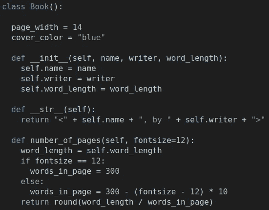
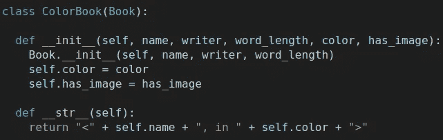

# Python 中的类的综合指南

> 原文：<https://towardsdatascience.com/a-comprehensive-guide-for-classes-in-python-e6bb72a25a5e?source=collection_archive---------5----------------------->

## 如何定义一个类并与之交互


Alexander Schimmeck 在 [Unsplash](https://unsplash.com/s/photos/clocks?utm_source=unsplash&utm_medium=referral&utm_content=creditCopyText) 上的照片

我们在这张照片中看到一堆不同的钟。它们有不同的形状、颜色和大小。然而，它们都是一种时钟。我们可以用类似的方式思考 Python 中的类。一个类代表一种类型(时钟)，我们可以创建该类型的许多实例(上图中的时钟)。

面向对象编程(OOP)范式是围绕拥有属于特定类型的对象的思想而构建的。在某种意义上，类型是向我们解释对象的东西。

对象的解释对于面向对象的程序设计至关重要。我们需要全面了解:

*   一个物体代表什么
*   对象存储哪种类型的数据
*   我们如何与物体互动
*   我们如何在代码中实现对象

构成对象解释的所有这些点都是用类定义的。Python 中的一切都是整数、列表、字典、函数等类型的对象。我们使用类来定义对象的类型。

在这篇文章中，我们将回顾类的含义，如何在 Python 中创建和使用类，以及使用类会给我们带来什么样的好处。大纲如下:

*   Python 中的类是什么？
*   创建一个类
*   定义类方法
*   类与实例变量
*   创建子类

## Python 中的类是什么？

类拥有以下信息:

*   数据属性:创建一个类的实例需要什么
*   方法(即过程属性):我们如何与类的实例交互。

使用类有很多好处。我将在整篇文章中提到它们，而不是一次全部列出。

我们一直在使用 Python 中的类。例如，当我们创建一个列表时，我们创建一个 list 类型的实例。

```
words = ['data', 'science', 'machine', 'learning']
```

我们实际上对 list 类是如何创建的并不感兴趣。我们只需要知道如何与列表交互，并在代码中有效地使用它们。这就是**抽象**的理念。

例如，我们可以使用 remove 方法从列表中删除一个条目。

```
words.remove('data')print(words)
['science', 'machine', 'learning']
```

## 创建一个类

下面的代码创建了一个名为 Book 的类。

```
class Book(): def __init__(self, name, writer, word_length):
    self.name = name
    self.writer = writer
    self.word_length = word_length
```

__init__ 是一个特殊的函数，在创建类的实例时自动执行。它也被称为类构造函数。

init 函数的参数表示一个类的数据属性。因此，如果我们需要指定 name、writer 和 length 参数来创建 Book 的实例。

> **注** : Self 是指实例本身。你可以用任何词来代替“自我”，但使用“自我”是一种非常普遍的做法。

让我们创建一个实例。

```
b1 = Book("Pandas", "John Doe", 100000)print(type(b1))
<class '__main__.Book'>
```

b1 是属于 Book 类的对象。我们可以通过使用返回对象类型的类型函数来确认它。

我们可以使用下面的方法来访问或修改类的属性。

```
print(b1.name)
Pandasb1.name = 'NumPy' #updates the name attributeprint(b1.name)
NumPy
```

## 定义类方法

Book 类只有数据属性。我们应该添加方法(即过程属性)来使它变得有用和实用。

例如，我们可以实现一个方法，返回给定 fontsize 的页数。我们用字数来规定这本书的长度。该方法将根据长度和字体大小计算页数。

```
def number_of_pages(self, fontsize=12):
  word_length = self.word_length
  if fontsize == 12:
    words_in_page = 300
  else:
    words_in_page = 300 - (fontsize - 12) * 10
  return round(word_length / words_in_page)
```

我们在类定义中添加了页数。它根据字数和字体大小计算一本书的页数。

如果我们在类定义中声明的函数需要访问实例的数据属性，我们需要告诉函数如何访问它们。这就是我们在 number_of_pages 函数的第一行中所做的。

我们可以从类或实例中访问方法。这里有一个简单的例子演示了这两种方法。

```
b1 = Book("Pandas", "John Doe", 100000)b1.number_of_pages()
333Book.number_of_pages(b1)
333
```

number_of_pages 函数有一个附加的 fontsize 参数。因为指定了默认值(12)，所以我们不必显式地写它。但是，我们可以为 fontsize 参数使用不同的值。

```
b1.number_of_pages(14)
357b1.number_of_pages(fontsize=16)
385
```

随着字体大小的增加，页数也会增加，这是有意义的。

为了使用 Python 的一些内置函数，我们需要为我们的类定义某些方法。考虑打印功能。

```
print(b1)
<__main__.Book object at 0x7fa4cf9f7588>
```

默认情况下，print 函数返回对象的类型和内存位置。但是，我们可以通过在我们的类中实现 __str__ 方法来自定义它的行为。

```
def __str__(self):
  return "<" + self.name + ", by " + self.writer + ">"
```

我们在上面的类定义中添加了 __str__ 方法。下面是打印函数在我们的类中的工作方式:

```
print(b1)<Pandas, by John Doe>
```

## 类与实例变量

类变量是在类内部而不是在任何函数外部声明的。实例变量是在构造函数 __init__ 方法中声明的。

类变量更加通用，可能适用于一个类的所有实例。另一方面，实例变量更加具体，并且为每个实例单独定义。区分类变量和实例变量非常有用。

考虑我们之前定义的 Book 类。我们经营一家出版公司，对我们出版的书籍有一些标准，如页面宽度和封面颜色。如果我们将它们定义为类变量，我们不必为每个创建的实例显式声明。

```
class Book(): page_width = 14
  cover_color = "blue" def __init__(self, name, writer, word_length):
    self.name = name
    self.writer = writer
    self.word_length = word_length
```

我们将 page_width 和 cover_color 实现为类变量，因为它们在类定义内，但在任何函数定义外。

让我们创建一个 Book 类的实例。

```
b2 = Book("Machine Learning", "Jane Doe", 120000)
```

创建此实例时，我们没有指定类变量。然而，b2 拥有这些变量，我们可以访问它们。

```
b2.page_width
14b2.cover_color
'blue'
```

我们可以选择更改特定实例的类变量。

```
b2.cover_color = 'red'b2.cover_color
'red'
```

特定实例上的更改对类变量没有任何影响。

```
Book.cover_color
'blue'
```

## 创建子类

我们可以基于不同的类创建一个类。让我们基于“Book”类创建一个名为“ColorBook”的类。

```
class ColorBook(Book):
```

ColorBook 是 Book 类的子类。当我们以这种方式创建一个类时，子类从父类复制属性(包括数据和过程属性)。这个概念叫做**继承**，继承使得 OOP 更加高效和强大。

类似于现实生活中的传承。我们的大部分基因组来自我们的父母或祖先。我们继承了他们。因此，我们和父母有相似之处。

除了从父类继承的属性之外，子类还可以有新的属性。此外，我们可以选择修改或覆盖继承的属性。

让我们定义 ColorBook 类的 __init__ 函数。它将有两个附加参数，即“颜色”指示页面的颜色和“has_image”指示书中是否有图像。

```
class ColorBook(Book): def __init__(self, name, writer, word_length, color, has_image):
    Book.__init__(self, name, writer, word_length
    self.color = color
    self.has_image = has_image
```

因为已经在 Book 类中定义了 name、writer 和 word_length，所以我们可以从它那里复制 __init__ 方法。我们只需要定义额外的属性。

**注**:我们可以自由手工为子类定义每个数据属性。使用 parent 的 __init__ 是可选的。

让我们创建一个 ColorBook 类的实例。

```
c1 = ColorBook("Seaborn", "John Doe", 90000, "green", True)c1.name
"Seaborn"c1.color
"green"
```

子类也继承了类变量。

```
c1.cover_color
"blue"c1.page_width
14
```

这些方法也是从父类中复制的。对于 Book 类，我们定义了两个方法，它们也可以用在 ColorBook 类的实例上。

```
c1.number_of_pages()
300print(c1)
<Seaborn, by John Doe>
```

我们可以选择覆盖从父类继承的数据和过程属性(即方法)。这使得继承更加强大，因为我们必须使用父类中的所有东西。

例如，我们可以修改 ColorBook 类的 __str__ 方法。

```
def __str__(self):
  return "<" + self.name + ", in " + self.color + ">"
```

print 函数将返回书籍的名称及其颜色。

```
c1 = ColorBook("Seaborn", "John Doe", 90000, "green", True)print(c1)
<Seaborn, in green>
```

以下是 Book 和 ColorBook 类的定义。



(图片由作者提供)



(图片由作者提供)

## 结论

我们在本文中讨论的内容可以被认为是对 Python 类的全面介绍。我们已经提到了类对于面向对象编程的重要性，以及类是如何展示抽象和继承等关键概念的。

对于实践方面，我们已经定义了两个类，并且看到了在创建子类时继承是如何工作的。

关于 Python 类还有很多内容要介绍。一旦你熟悉了基础知识，就可以随意进入更高级的话题了。

感谢您的阅读。如果您有任何反馈，请告诉我。