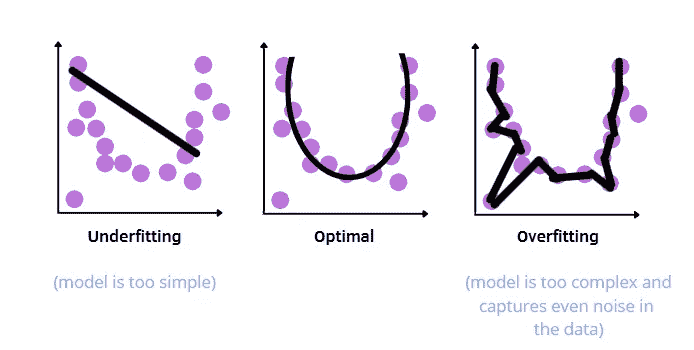
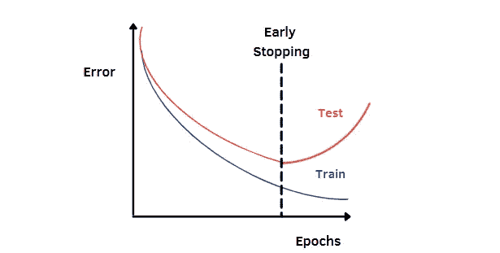
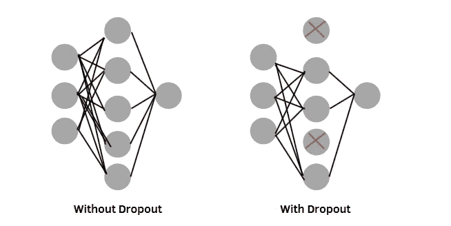
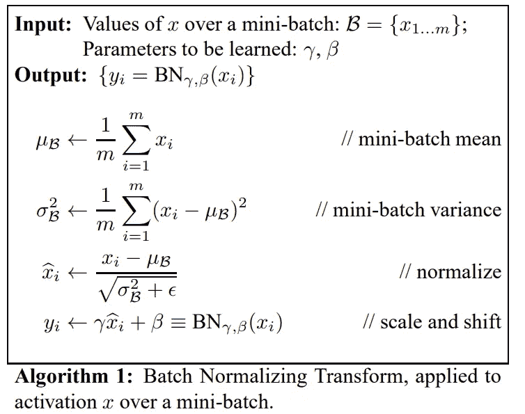

# 深度学习中正则化技术的综合指南

> 原文：<https://towardsdatascience.com/a-comprehensive-guide-of-regularization-techniques-in-deep-learning-c671bb1b2c67?source=collection_archive---------12----------------------->

## 了解正则化如何有助于提高模型的性能

欠拟合与过拟合。作者插图。

当我开始我的数据科学道路时，我在处理我的第一个项目时遇到了很多困难。有一系列的步骤来解决这个问题，但我仍然没有一个清晰的概述，我需要大量的耐心和时间来理解关键概念。我学到的第一件事是，在应用任何模型之前，我必须将数据集分成两个独立的集，称为训练集和测试集。起初，我无法理解这一重要程序的真正原因，但在经历了不同的解决问题后，我开始理解这一步的意义。当我们建立一个模型时，我们应该验证这个要求:

> 一个模型必须能够很好地概括看不见的数据。

这意味着模型不仅要在训练集上做出好的预测，还要在测试集上做出好的预测。我们可能会遇到两种情况:

*   **欠拟合**:如果模型在训练集上没有做出很好的预测，因此获得很低的训练误差，我们就有欠拟合的问题。例如，我们用线性回归模型来拟合数据，但是该模型过于简单，并且无法捕捉数据中的复杂模式，因为存在违反的潜在假设。因此，如果模型过于简单，不能很好地从训练数据中学习模式，我们就会遇到这个问题。如果训练集太小，也会发生这种情况。
*   **过度拟合:**它与欠拟合相反，因为模型过于复杂，甚至会捕捉数据中的噪声。在这种情况下，我们会观察到培训和测试评估措施之间有很大的差距。

目标是达到最佳模型，这是欠拟合和过拟合之间平衡的结果。在这篇文章中，我将重点讨论过拟合问题，这个问题可以用几种正则化技术来解决。这些技术具有相关的作用，因为它们限制了模型的复杂性。下面我展示了帮助避免(或至少减少)过度拟合的最常用技术。

**正则化技术:**

1.  **提前停止**
2.  **L1 正规化**
3.  **L2 正规化**
4.  **稀疏编码**
5.  **脱落层**
6.  **批次图层**

# 1.提前停止

提前停车。作者插图。

早期停止是一种正则化形式，以避免在训练神经网络时过度拟合。在第一个时期，训练和测试误差都减少了。但是到了某个时候，培训损失会不断减少，而测试损失开始增加。在这一点上，我们需要使用早期停止来避免这种行为，这种行为会导致训练和测试评估之间的巨大差距。换句话说，*当测试误差开始增加*时，它停止模型的训练。

# 2.L1 正则化

L1 正则化、L2 正则化和稀疏编码都属于正则化范畴，称为**模型正则化**。在所有这些策略中，损失函数中增加了一项，对大型网络的权重施加惩罚，以减少过度拟合。取决于技术，一些权重参数可以被估计为等于零。

在 L1 正则化中，我们将权重参数的 L1 范数的缩放版本添加到损失函数中:

作者插图。

L1 范数只是参数绝对值的总和，而λ是正则化参数，它表示我们希望对权重参数进行多少惩罚。其范围在 0 和 1 之间。

# 3.L2 正则化

L2 正则化也称为权重衰减，其工作方式与 L1 正则化类似。它不是添加 L1 范数项，而是将权重的平方范数添加到损失函数中:

作者插图。

L2 范数是权重参数平方值的平方根。

# 4.稀疏编码

稀疏编码允许限制一次可以激活的单元总数。

作者插图。

乍一看，它似乎类似于 L1 正则化，因为其思想是计算绝对值的总和。与 L1 策略不同，我们感兴趣的是可以激活的单位的**数量，而不是重量参数！**

# 5.脱落层

辍学层。作者插图。

Dropout 的想法是在每个图形的处理过程中移除**输入**和**隐藏单元**。知道一层中的每个节点都完全连接到上面的层，我们在神经网络的训练期间随机地去除一些这样的连接。

*值得注意的是，如果它与其他技术一起使用，比如批处理规范化，它可能会产生干扰。为此，最好使用这两种策略中的一种*。

# 6.批量标准化

批次标准化的目标是防止批次获得不同的均值和不同的标准差[1]。诀窍在于在训练期间使用批次平均值和批次标准偏差来标准化每个激活值。一旦训练完成，在训练过程中计算的运行统计数据将用于测试。

[来源](https://arxiv.org/pdf/1502.03167.pdf)

正如您从算法 1 中可以注意到的，使层的激活正常化的主要步骤是:

1.  计算每个激活 xᵢ的**批次均值**和**批次方差**，其中 m 为批次大小
2.  **使每个激活** xᵢ的平均值为 0，方差为 1，从而使其标准化。为了数值的稳定性，将ε加到批次方差中。
3.  **分别使用在训练期间学习到的参数γ和β来缩放和移动每个标准化激活**。
4.  将每个缩放和移位激活 yᵢ传递到下一层

使用这种正则化方法有两个主要优点。首先，成本函数将看起来更加平滑和平衡。因此，神经网络的训练将会更快。

# 最终想法:

在这篇文章中，我概述了防止过度拟合的最流行的方法。我希望你发现这篇文章有助于更完整地理解正则化在机器学习和深度学习模型中的作用。就个人而言，我发现它们在我的数据科学项目中非常有用。感谢阅读。祝您愉快！

**更多相关文章:**

 [## 机器学习模型的 k 重交叉验证

### 使用 sklearn 的交叉验证技术概述

pub.towardsai.net](https://pub.towardsai.net/k-fold-cross-validation-for-machine-learning-models-918f6ccfd6d)  [## 用简单的语言解释优化算法的基础

### 理解如何最小化机器学习算法中的成本函数的指南

pub.towardsai.net](https://pub.towardsai.net/understanding-optimization-algorithms-309d8065599d) 

## **参考文献:**

[1] [生成对抗网络，Coursera，深度学习。艾](https://www.coursera.org/specializations/generative-adversarial-networks-gans)

你喜欢我的文章吗？ [*成为会员*](https://eugenia-anello.medium.com/membership) *每天无限获取数据科学新帖！这是一种间接的支持我的方式，不会给你带来任何额外的费用。如果您已经是会员，* [*订阅*](https://eugenia-anello.medium.com/subscribe) *每当我发布新的数据科学和 python 指南时，您都可以收到电子邮件！*