# 分类项目综合指南

> 原文：<https://towardsdatascience.com/a-comprehensive-guide-to-a-classification-project-data-cleaning-and-exploration-88edd5617ce2?source=collection_archive---------18----------------------->

## 刚接触数据科学，想从事您的第一个项目？这里有一个关于你的第一个分类问题的全面的项目演练。

# **第一部分:数据清理和探索**


由[斯蒂芬·克拉克莫](https://unsplash.com/@srkraakmo?utm_source=unsplash&utm_medium=referral&utm_content=creditCopyText)在 [Unsplash](https://unsplash.com/s/photos/magnifying-glass?utm_source=unsplash&utm_medium=referral&utm_content=creditCopyText) 上拍摄的照片

**简介**

当我开始我的数据科学之旅时，我记得获得一个资源是多么困难，这个资源提供了一个全面的数据探索指南，将它与所使用的特性工程技术联系起来。总感觉两者之间有脱节。经过一番努力，我决定写一本指南来帮助初学者更好地理解数据探索，以及如何使用从他们的分析中获得的见解来改进他们的特征工程。

在这个项目中，我们将关注 [Kaggle](https://www.kaggle.com/rajyellow46/wine-quality) 上的葡萄酒质量数据集。该数据集包含两种葡萄酒变体，红葡萄酒和白葡萄酒，它们的物理化学特性(输入)和一个感官输出变量(质量)。我们将应用分类技术对数据进行建模。以下是我们将在本指南中涵盖的内容:

1.  数据清理和探索
2.  特征工程
3.  数据建模和超参数调整

为了让这个指南更容易阅读，并且不会让你被太多的信息淹没，我会把它分成三个部分，如上所述。

我们开始吧！

**数据清理**

与所有的机器学习项目一样，我们将首先将所有相关的依赖项导入到项目中，并加载数据。

```
**# import necessary dependencies**
import pandas as pd
import numpy as np
import matplotlib.pyplot as plt
import seaborn as sns
sns.set()%matplotlib inline
```

读入数据。

```
**# read in the data**
wine = pd.read_csv("./datasets/winequalityN.csv")**# check if data has been loaded correctly**
wine.head(5)
```

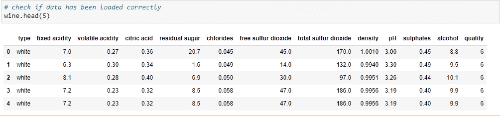

作者图片

看一眼数据，你就会意识到它可能有重复的观察。我们将不得不删除重复，因为这将增加我们的模型过度拟合的可能性。

保持这种想法！我们稍后再处理这个问题。

让我们检查一下数据的形状。这可让您了解数据中存在多少观测值和要素。

```
**# check the shape of the data**
wine.shape
```

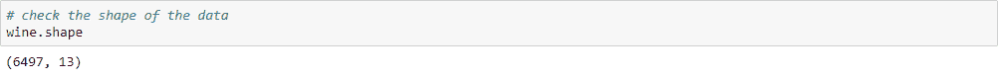

作者图片

看我们的特征，只看到一堆对我们没有意义的数字。我们不知道这些特征意味着什么，它们之间有什么联系，或者它们对葡萄酒有什么影响。这就是领域知识的重要性。大多数时候，作为一名数据科学家，你要解决的问题是你不知道这个行业是如何运作的。没关系。这就是为什么数据科学家从不单独工作，而是让具有不同专业知识的人参与进来。领域知识，简单地说就是关于某个主题的知识，非常重要，因为它可以让你理解你正在处理的数据。

以下是对这些功能的简短描述:

1.  固定酸度

这是葡萄酒中固定酸的含量。葡萄酒中主要的固定酸有酒石酸、苹果酸、柠檬酸和琥珀酸。固定酸被添加到葡萄酒中以稳定葡萄酒(防止微生物生长)并增加一些风味。

2.挥发性酸度

这些是葡萄酒中可蒸馏的酸。主要的挥发性酸是乙酸。挥发性酸度通常被用作葡萄酒腐败(葡萄酒中存在微生物)的指标。

3.柠檬酸

这是葡萄酒中的一种固定酸。它被用作葡萄酒的添加剂来增加酸味和防止铁雾。

4.残糖

这是发酵后剩下的糖，它已经将大部分糖转化为酒精。

5.氯化物

氯化物是葡萄酒咸味的主要来源。由于它们的加工过程，红葡萄酒通常比白葡萄酒具有更高的氯化物浓度。

6.游离二氧化硫

这是葡萄酒中不与其他分子结合的二氧化硫含量。向葡萄酒中添加二氧化硫有助于稳定葡萄酒，并延长葡萄酒的保质期。高浓度的二氧化硫可能会影响葡萄酒的味道。

7.二氧化硫总量

这是葡萄酒中二氧化硫的总量，游离二氧化硫加上任何与葡萄酒中其他分子结合的二氧化硫。

8.密度

这是酒的密度。

9.pH 值

这是葡萄酒的酸度或碱度水平。

10.硫酸盐

增加葡萄酒含硫量的葡萄酒添加剂。

11.酒精

这是葡萄酒中的酒精含量(以百分比表示)。

对这些特性有了一些了解后，让我们开始清理和探索。

我们要做的第一件事是检查任何空值(NaN ),并通过丢弃观察值或特征或输入数据来处理它们。

```
**# Check for null values**
total_nulls = wine.isnull().sum()
total_observations = wine.shape[0]null_percentages = total_nulls[total_nulls > 0] / total_observations * 100
total_nulls = total_nulls[total_nulls > 0]pd.concat([total_nulls, null_percentages], axis=1, keys=["Total", "Percentage"]).sort_values(by="Total", ascending=False)
```

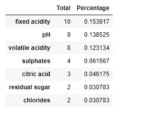

作者图片

我们注意到数据中有一些空值，但是，它们只占总观测值的很小一部分(最大值约为 0.2%)。在这种情况下，输入缺失值是安全的。由于它们都是数值，我们将使用要素的中值进行插补，因为与平均值相比，中值受异常值的影响较小。

```
**# Define columns with null values (NaN)** 
null_cols = ["fixed acidity", "pH", "volatile acidity", "sulphates", "citric acid", "residual sugar", "chlorides"]from sklearn.impute import SimpleImputer**# Fill nulls with the median of the column**
median_imputer = SimpleImputer(strategy="median")for col in null_cols:
    wine[col] = median_imputer.fit_transform(wine[col].values.reshape(-1,1))
```

让我们检查并确认所有的空值都已被替换，并且数据中确实没有空值。

```
**# Check to ensure nulls were imputed**
wine.isnull().sum()
```

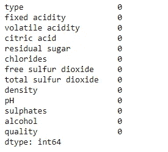

作者图片

记住我们一直保留的关于重复值的想法，现在是探索它的时候了。让我们检查数据中是否有重复的值。如果这样做，我们将保留第一个实例并删除任何其他实例。

```
**# Check for duplicates and keep the first instance**
duplicates_index = wine[wine.duplicated(keep="first")].index
duplicates_index
```

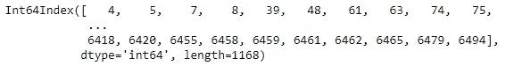

作者图片

```
**# Drop the duplicated indexes**
wine.drop(duplicates_index, axis=0, inplace=True)**# Check to confirm no duplicates**
wine[wine.duplicated(keep="first")]
```


作者图片

让我们看看数据的新形状。

```
**# Check the new shape of the data**
wine.shape
```

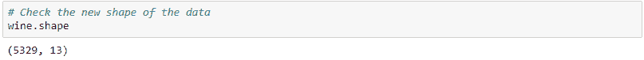

作者图片

似乎我们已经丢失了几个观察数据。没关系。这比复制数据要好，因为这会影响我们模型的性能和我们对数据的分析。

这就是我们的数据清理。

**数据探索**

我们的数据现已准备就绪，可供我们探索和获得见解。探索数据集时的一个关键点是要有一组您希望数据集回答的问题。你获得这些答案的方法将会影响你提取洞察力的技术选择和你所做的任何假设。

对于这个数据集，我们想要找出:

*   红葡萄酒和白葡萄酒的物理化学性质的平均组成是什么？
*   理化性质是如何相互联系的，它们最终是如何影响葡萄酒质量的？
*   考虑到高氯化物含量(咸味)和亚硫酸盐的负面影响，这些如何影响葡萄酒的质量？
*   游离二氧化硫占总二氧化硫的比例是多少，它如何影响其他物理化学性质，尤其是 pH 值、酸度和质量？
*   什么理化特性或它们的组合最能定义优质葡萄酒？

我们将从查看数据中要素的分布开始。

```
**# Look at the distribution of the data**
fig, ax = plt.subplots(figsize=(11, 11))
wine.hist(bins=50, ax=ax)
```

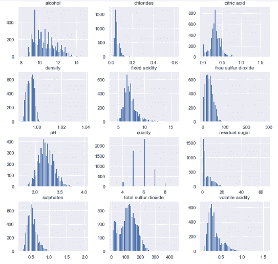

作者图片

一些特征，如固定酸度、挥发性酸度和残糖似乎有一个正确的偏差。这表明在特征的上限上存在异常值。由于一些值可能太小，很难在直方图上看到，我们将使用一些统计方法来帮助我们确定一些特征的偏斜度。

```
**# Look at the skewness of the data**
skew = wine.skew()
pd.DataFrame(data=skew, columns=["Skew"])
```

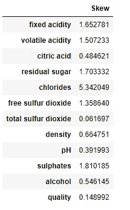

作者图片

正偏斜(> 0)表示要素中的右偏斜，负偏斜(< 0)表示左偏斜，偏斜为 0 表示无偏斜(即偏斜类似于高斯分布(正态分布))。从结果中，我们可以确认我们上面确定为偏斜的特征确实是右偏斜的。

当我们将数据传递到 ML 模型中时，我们将需要注意这一点。一些模型假设数据具有正态分布。转换数据以满足这一假设将提高模型的性能。把这个记下来。

知道了我们的特性是如何分布的，让我们看看这些特性是如何相互关联的。相关矩阵将允许我们理解不同特征之间的关系。我们将相关矩阵表示为热图，以减少显示过多数字带来的信息过载。热图让我们一眼就能发现任何有趣的关系。

```
**# Visualize the matrix on a heatmap**
mask = np.triu(wine.corr())
fig, ax = plt.subplots(figsize=(7,7))
sns.heatmap(data=wine.corr(), annot=True, fmt=".2f", ax=ax, mask=mask)
```

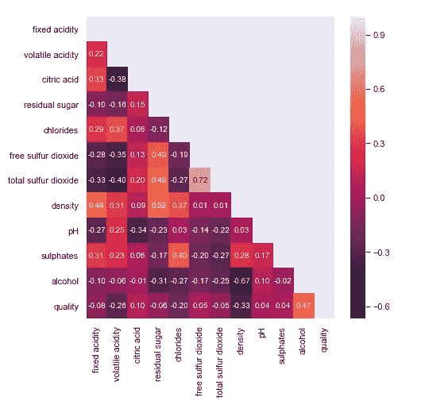

作者图片

热图的上部三角形被屏蔽，因为这将显示底部三角形的重复信息。最好专注于单一半，以便于分析。从一开始，我们就注意到一些有趣的关系，它们的颜色比其他的更亮。下面是一些关系和为什么会这样的描述。同样，领域知识对于帮助我们理解这些关系是必不可少的。

*   **游离二氧化硫和总二氧化硫含量的增加导致挥发性和固定酸度的降低**。

酸度越低，葡萄酒越不稳定。亚硫酸盐被添加到酸度较低的葡萄酒中，以帮助稳定它们，防止细菌生长，并延长保质期。没有添加亚硫酸盐的葡萄酒保质期较短，因此需要更高的酸度(更低的 pH 值)作为天然防腐剂。

*   **游离二氧化硫和总二氧化硫量的增加导致残糖量的增加。**

残余糖是发酵后剩下的东西。为了防止葡萄酒装瓶后糖的进一步发酵，添加亚硫酸盐以稳定葡萄酒并防止二次发酵，二次发酵可能导致瓶子爆炸。

*   **固定酸度和挥发酸度越高，葡萄酒密度越高**。

葡萄酒中最常见的固定酸是酒石酸、苹果酸和柠檬酸。乙酸是最普遍的挥发性酸。观察它们各自的密度，它们都比水的密度大，酒石酸的密度为 1.79 克/厘米，柠檬酸为 1.67 克/厘米，苹果酸为 1.61 克/厘米，乙酸为 1.05 克/厘米。酸的这种特性对葡萄酒的密度有积极的影响。

*   **固定酸度和柠檬酸的增加导致 pH 值降低，而挥发性酸度的增加导致 pH 值升高**。

向葡萄酒中添加固定酸(酒石酸、苹果酸和柠檬酸)以增加其酸度，即降低葡萄酒的 pH 值，这不仅有助于增加葡萄酒的风味，还有助于保存葡萄酒，因为大多数细菌无法在高酸性环境中存活。挥发性酸度是葡萄酒腐败的一个指标，这意味着葡萄酒中有细菌将一些固定酸(酒石酸和柠檬酸)和残余糖转化为乙酸。这些细菌在酸性较低(高于 3.6 的高 pH 值)的环境中生存，因此葡萄酒的 pH 值会增加。

*   **酒精增加导致残糖减少。**

残余的糖是发酵过程的副产品。这些是大多数糖被酵母转化成酒精(乙醇)后的残留物。在这个过程中转化的糖越多，酒的酒精含量就越高，因此很少有糖没有被转化。

*   酒精含量越高，葡萄酒的密度越低。

酒精(乙醇)的密度为 0.789 克/厘米。这使得酒精的密度小于密度为 1 克/厘米的水。葡萄酒中的酒精含量越高，那么葡萄酒就会越淡(密度越小)。

现在，我们已经了解了特性中存在的一些关系，让我们深入了解理化性质和感官输出(质量)之间的关系，这是我们的目标变量。我们将绘制一个条形图来显示与目标相关性最强的特征。

```
**# Bar plot to visualize what physicochemical properties correlate more with the quality**
fig, ax = plt.subplots(figsize=(9,5))
wine.corr()["quality"].sort_values(ascending=False).plot(kind="bar", ax=ax)
```

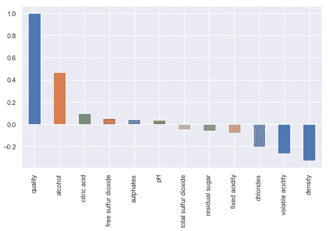

作者图片

忽略质量，因为它是特性与自身的相关性，酒精与葡萄酒质量的相关性最强。葡萄酒的酒精含量越高，就越有可能被评为优质葡萄酒。密度是第二个与质量相关性最强的因素。然而，密度是负相关的。酒的密度越小，它在质量上的排名就越高。

最后，我们来看看葡萄酒质量等级的分布。根据数据集的描述，数据集中的类是不平衡的。我们需要证实这一点，这样我们就可以找出如何处理不平衡，如果它存在。

```
**# Look at the distribution of classes i.e. quality in wine data** wine.groupby("quality")["quality"].count().plot(kind="bar")
```

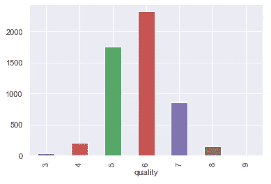

作者图片

正如所描述的，等级严重失衡，一小部分葡萄酒质量极低或高。大多数葡萄酒质量一般。这种不平衡将显著影响分类模型的性能，因为从极端情况中可供模型学习的数据较少。大多数情况下，模型可能会预测大多数类别。仅预测多数类而完全忽略少数类的简单模型将获得更高的准确性，但它在预测少数类方面表现很差。这种不平衡的含义是，当选择我们的分类度量以及如何通过欠采样、过采样或宁滨类来减少类不平衡时，我们需要非常注意。

至此，我们的数据探索到此结束。需要注意的一点是，数据探索不是只做一次就忘了的。这是一个重复的过程，你应该将它整合到你的工作流程中。随着您转向特征工程和数据建模，您将始终了解关于您的数据的新见解，并且您应该深入了解当前的关系以及这对您的机器学习工作流意味着什么。

接下来，我们将看看你如何利用从探索中获得的洞察力来进行特征工程。请继续关注本系列的第 2 部分。

*如果你喜欢这个帖子，并且想了解更多关于数据科学和机器学习的知识，* ***在 Medium 上关注我*** *。*